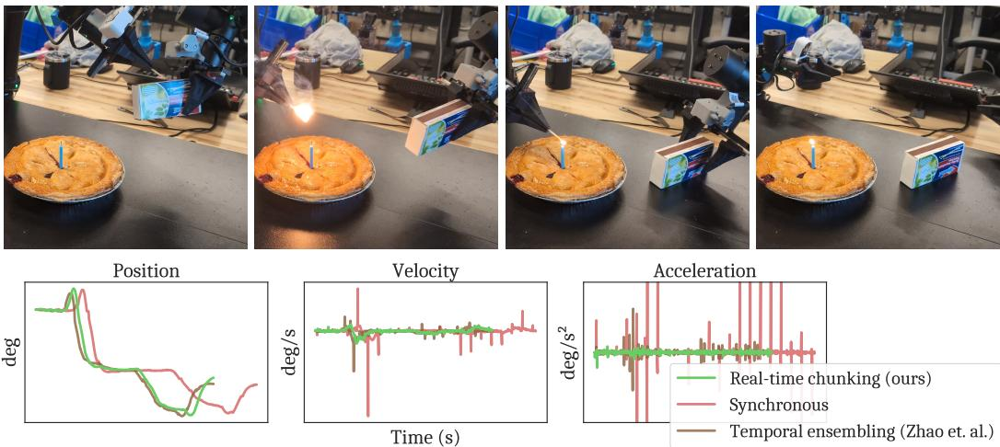

[← 返回 README](../README.md)

# Abstract

## 📌 预览
本文提出 Real-Time Chunking (RTC)，一种推理时算法，让 action chunking 的 diffusion/flow VLA 策略能平滑异步执行。核心思想：在执行当前 chunk 的同时生成下一个 chunk，通过 inpainting 保证 chunk 之间的连续性。无需重新训练，即插即用。

---

Modern AI systems, especially those interacting with the physical world, increasingly require real-time performance. However, the high latency of state-of-the-art generalist models, including recent vision-language-action models (VLAs), poses a significant challenge. While action chunking has enabled temporal consistency in high-frequency control tasks, it does not fully address the latency problem, leading to pauses or out-of-distribution jerky movements at chunk boundaries. This paper presents a novel inference-time algorithm that enables smooth asynchronous execution of action chunking policies. Our method, real-time chunking (RTC), is applicable to any diffusion- or flow-based VLA out of the box with no re-training. It generates the next action chunk while executing the current one, "freezing" actions guaranteed to execute and "inpainting" the rest. To test RTC, we introduce a new benchmark of 12 highly dynamic tasks in the Kinetix simulator, as well as evaluate 6 challenging real-world bimanual manipulation tasks. Results demonstrate that RTC is fast, performant, and uniquely robust to inference delay, significantly improving task throughput and enabling high success rates in precise tasks—such as lighting a match—even in the presence of significant latency. See https://pi.website/research/real_time_chunking for videos.

> 💡 **Abstract 批读**:
> - **问题**: VLA 模型太大（数十亿参数），推理延迟高，但机器人需要实时控制。Action chunking 只是部分解决方案——它在 chunk 边界处仍然会出现 **停顿**（同步推理等待）或 **抖动**（chunk 之间不连续）。
> - **方法**: RTC = 异步推理 + inpainting。核心操作两步：
>   1. **Freeze**: 把一定会被执行的 action（因为推理还没完成时它们已经在执行了）冻住
>   2. **Inpaint**: 基于冻住的前缀，用 flow matching 的 guidance 机制"填充"剩余 action，保证连续性
> - **关键卖点**: 纯推理时方法，**不需要重新训练**任何模型。适用于任何 diffusion 或 flow-based VLA。
> - **实验**: Kinetix 仿真（12 个高动态任务）+ 真实双臂操作（6 个任务，用 π₀.₅ 作为 base policy）
> - **结果**: 即使在 300ms+ 推理延迟下，仍能完成点火柴这种高精度任务。速度比同步推理快 20%，平滑性优于所有竞争方法。

*Figure 1: Top: RTC 使机器人能在超过 300ms 的推理延迟下完成高灵巧、高动态任务（如点火柴）。Bottom: RTC 比同步推理快 20%，比 temporal ensembling 更平滑。展示的是一只手臂肩关节在真实自主点火柴过程前 10 秒的位置、速度和加速度。*

> 💡 **Figure 1 批读**:
> - 上半部分的点火柴任务非常能说明问题：这需要精确的力控和时序配合，300ms 延迟意味着模型"看到"的世界已经是 0.3 秒前的了。
> - 下半部分的 joint 轨迹对比很直观：
>   - **Synchronous**（黑色）: 有明显的阶梯状停顿（chunk 边界处等待推理）
>   - **TE (Temporal Ensembling)**（绿色）: 虽然连续但抖动严重（加速度曲线波动大）
>   - **RTC**（蓝色）: 平滑且连续，加速度曲线最稳定
> - 这是 Physical Intelligence (π) 的工作，用的是 π₀.₅ 模型，3B 参数级别的 VLA。

---

## 🔖 Section 总结

### 核心洞察
1. **VLA 延迟问题不可回避**: 模型越大越强，延迟也越高。即使硬件进步，模型也会跟着变大。
2. **Action chunking 不够**: 它只解决了时序一致性，没解决延迟带来的 chunk 边界不连续。
3. **RTC 的定位很聪明**: 不改训练、不改模型，只在推理时做文章。这意味着可以直接给现有 VLA "加装"。
