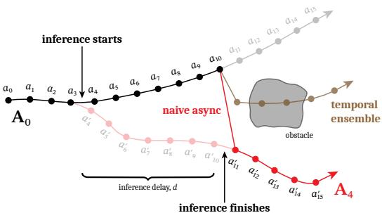
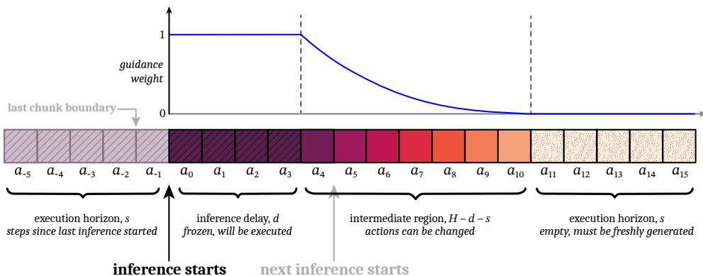

[← 返回 README](../README.md)

# 2 Preliminaries and Motivation

## 📌 预览
这个 Section 定义了 action chunking 的数学符号，解释了 flow matching 的基本机制，然后通过具体的延迟数据（π₀ 的 KV cache prefill 就需要 46ms）说明为什么实时性是个硬问题。最后分析了 naive 异步推理的缺陷。

---

We begin with an action chunking policy denoted by $\pi(\mathbf{A}_t | \mathbf{o}_t)$, where $\mathbf{A}_t = [\mathbf{a}_t, \mathbf{a}_{t+1}, ..., \mathbf{a}_{t+H-1}]$ is a chunk of future actions, $\mathbf{o}_t$ is an observation, and $t$ indicates a controller timestep. We call $H$ the prediction horizon. When action chunking policies are rolled out, only the first $s \leq H$ actions from each chunk are executed. We call $s$ the execution horizon; often it is shorter than the prediction horizon, but still much greater than 1 (e.g., $s \approx H/2$ [11, 5, 24]). Chunked execution ensures temporal consistency at the expense of reactivity. A long execution horizon reduces a policy's responsiveness to new information, while a short one increases the likelihood of mode-jumping, jerky behavior resulting from discontinuities between chunks.

> 💡 **关键符号定义**:
> | 符号 | 含义 | 典型值 |
> |------|------|--------|
> | $H$ | **Prediction horizon** — 每个 chunk 预测的 action 总数 | 8 (仿真), 50 (真实) |
> | $s$ | **Execution horizon** — 实际执行的 action 数 | $\approx H/2$ |
> | $\mathbf{A}_t$ | 从 $t$ 时刻开始的 action chunk | $H$ 维向量 |
> | $\mathbf{o}_t$ | $t$ 时刻的 observation | 图像 + 状态 |
> 
> **核心 trade-off**: $s$ 大 → 稳定但不灵活；$s$ 小 → 灵活但可能 mode-jump。

---

In this paper, we consider policies trained with conditional flow matching [36], though our method can also be used with diffusion policies by converting them to flow policies at inference time [48, 18]. To generate an action chunk from a flow policy, random noise $\mathbf{A}_t^0$ is first sampled from a standard Gaussian, and then the flow's velocity field, $\mathbf{v}_\pi$ (a learned neural network) is integrated from $\tau = 0$ to 1 using the update rule

$$\mathbf{A}_t^{\tau+\frac{1}{n}} = \mathbf{A}_t^{\tau} + \frac{1}{n}\mathbf{v}_\pi(\mathbf{A}_t^{\tau}, \mathbf{o}_t, \tau)$$

where $\tau \in [0, 1)$ denotes a flow matching timestep, and $n$ determines the number of denoising steps.

> 💡 **Flow Matching 101**:
> - 从高斯噪声 $\mathbf{A}^0 \sim \mathcal{N}(0, I)$ 出发
> - 学一个速度场 $\mathbf{v}_\pi$，沿着速度场从 $\tau=0$ 积分到 $\tau=1$
> - 每步更新: $\mathbf{A}^{\tau+1/n} = \mathbf{A}^\tau + \frac{1}{n}\mathbf{v}_\pi(\mathbf{A}^\tau, \mathbf{o}, \tau)$
> - 积分完成后 $\mathbf{A}^1$ 就是最终的 action chunk
> 
> 跟 diffusion 的关系：flow matching 是 diffusion 的一个更 clean 的 formulation（直线路径 vs 随机路径）。而且 diffusion policy 可以在推理时转换为 flow policy [48, 18]，所以 RTC 实际上对两者都适用。

---

Now, let $\Delta t$ be sampling period of the controller, i.e., the duration of a controller timestep, and let $\delta$ be the time it takes for the policy to generate an action chunk. We say that a system is real-time if it is guaranteed to produce a response (in our case: $\mathbf{a}_t$) to an event (receiving $\mathbf{o}_t$) within a fixed time constraint ($\Delta t$). If $\delta \leq \Delta t$, then meeting the real-time constraint is trivial, since an entire chunk can be generated between two controller timesteps. However, this is near impossible to achieve with modern VLAs. For example, with an RTX 4090 GPU, the 3 billion parameter π₀ VLA spends 46ms on the KV cache prefill alone, before any denoising steps [5], and targets a 50Hz control frequency ($\Delta t = 20\text{ms}$). Run in remote inference for mobile manipulation, π₀ lists 13ms of network latency, in perfect conditions with a wired connection. In a more realistic setting, the network overhead alone could easily exceed 20ms. Kim et al. [31], who optimize the 7B OpenVLA model [30] specifically for inference speed, achieve no better than 321ms of latency on a server-grade A100 GPU.

> 💡 **延迟数据——为什么实时性是硬问题**:
> | 模型/组件 | 延迟 | 说明 |
> |-----------|------|------|
> | π₀ KV cache prefill | **46ms** | 还没开始 denoise 就花了 46ms |
> | 控制周期 Δt (50Hz) | **20ms** | 目标：每 20ms 一个 action |
> | π₀ 网络延迟 (有线 LAN) | **13ms** | 理想条件 |
> | OpenVLA 7B (A100) | **321ms** | 专门优化过的最佳数字 |
> 
> **结论**: 即使只看 prefill (46ms) vs Δt (20ms)，就已经不可能实时了。加上 denoising steps + 网络延迟，总延迟是控制周期的好几倍。

---

*Figure 2: 连续 chunk 之间典型的分叉示意。推理在 timestep 3 和 4 之间开始。原始 chunk（黑色）计划从障碍物上方绕过，而新生成的 chunk（红色）从下方绕过。但新 chunk 要 d=7 步后才可用。Naive 异步算法会从 a₁₀ 跳到 a'₁₁，产生非常高的 OOD 加速度。Temporal ensembling 减小了加速度但产生了糟糕的 action。*

> 💡 **Figure 2 批读**:
> - 这张图是理解 RTC 动机的关键。它展示了 action chunking 的核心难题——**mode bifurcation**（模式分叉）。
> - 场景：障碍物前面有两种绕行策略（上方/下方）。连续两个 chunk 选了不同策略，中间就出现断裂。
> - **Naive async**: 直接拼接 → OOD 加速度（从"往上走"突然跳到"往下走"）
> - **Temporal Ensembling**: 两个方向取平均 → 撞障碍物（上+下的平均 = 直走）
> - **这就是为什么需要 inpainting**: 新 chunk 必须"兼容"已执行的前缀，不能自己另起炉灶。

---

Naive synchronous inference, the default in many prior works [5, 30, 8, 24, 31, 59], simply starts inference at the end of the execution horizon and waits while the policy generates the next chunk. When $\delta > \Delta t$, this introduces visible pauses between chunks that not only slow down execution but also change the dynamics of the robot, introducing distribution shift between training and evaluation. To develop a real-time strategy, we must first introduce asynchronous inference, where inference is started early and happens concurrently with execution.

> 💡 **同步推理的问题**:
> - 执行完 $s$ 个 action → **停下来等待**新 chunk 生成 → 继续
> - 等待期间机器人**静止不动**，但训练数据里没有这种停顿
> - 这就产生了 **train-eval distribution shift**: 训练时动作连续，部署时有停顿

---

We define $d := \lfloor\delta/\Delta t\rfloor$ and call this quantity the inference delay, corresponding to number of controller timesteps between when $\mathbf{o}_t$ is received and when $\mathbf{A}_t$ is available. Let $\mathbf{a}_{t'|t}$ denote the $(t'-t)$-th action of chunk $\mathbf{A}_t$, generated from observing $\mathbf{o}_t$. If $\mathbf{A}_0$ is currently executing, and we desire an execution horizon of $s$, then an asynchronous algorithm must start inference at $s - d$. So long as $d \leq H - s$, then this strategy will satisfy the real-time constraint and guarantee that an action is always available when it is needed. However, since the policy cannot know what will happen between steps $s - d$ and $s$ while generating $\mathbf{A}_{s-d}$, the transition point between $\mathbf{a}_{s-1|0}$ and $\mathbf{a}_{s|s-d}$ may be arbitrarily discontinuous and out-of-distribution. Similar to a too-short execution horizon, this strategy leads to jerky behavior that is worsened dramatically with higher delays; see Figure 2.

> 💡 **Inference delay 的形式化**:
> - $d = \lfloor\delta/\Delta t\rfloor$: 推理延迟（以控制步为单位）
> - $\mathbf{a}_{t'|t}$: 基于 $\mathbf{o}_t$ 生成的 chunk 中，对应 $t'$ 时刻的 action
> - **异步策略**: 在 $s-d$ 时刻就开始推理（提前 $d$ 步），这样到 $s$ 时刻新 chunk 刚好可用
> - **约束**: $d \leq H - s$，否则即使提前开始也来不及
> - **问题**: 从 $s-d$ 开始推理，但 $s-d$ 到 $s$ 之间会发生什么，模型不知道 → 新旧 chunk 在 $s$ 处可能不连续

---

*Figure 3: RTC 中 action 生成如何关注前一个 action chunk 的示意图。如果推理在 a₋₁ 执行后开始，inference delay d=4，则新 chunk 在 a₃ 被消费后才可用。因此 a₀:₃ 被"冻住"，guidance weight 为 1。中间区域 a₄:₁₀ 的前一个 chunk action 可用但可以更新，指导权重指数衰减。最后 s=5 个 action 超出了前一个 chunk 的范围，需要全新生成。*

> 💡 **Figure 3 批读——RTC 的核心设计图**:
> 这张图是整篇论文最重要的插图。它把 RTC 的三个区域讲得很清楚：
> 
> | 区域 | Action 范围 | 含义 | Guidance weight |
> |------|------------|------|-----------------|
> | 🔴 **Frozen** | $a_0$ ~ $a_{d-1}$ | 推理完成前已经执行了，必须跟前一个 chunk 完全一致 | **W = 1** |
> | 🟡 **Soft guidance** | $a_d$ ~ $a_{H-s-1}$ | 前一个 chunk 有预测值，但可以更新。越远的越不确定 | **指数衰减** |
> | 🟢 **Free generation** | $a_{H-s}$ ~ $a_{H-1}$ | 前一个 chunk 没有覆盖到，完全新生成 | **W = 0** |
> 
> 关键 insight: **$d$ 决定了 frozen 区域的大小**。$d$ 越大，frozen 区域越大，新 chunk 的自由度越小。但同时 soft guidance 区域保证了即使 $d$ 小，新 chunk 也不会跟前一个分叉。

---

## 🔖 Section 总结

### 关键数字速查
| 指标 | 数值 |
|------|------|
| π₀ KV cache prefill | 46ms (RTX 4090) |
| 控制频率 | 50Hz (Δt = 20ms) |
| OpenVLA 7B 推理延迟 | 321ms (A100) |
| π₀ 网络延迟 | 13ms (有线 LAN) |

### 核心洞察
1. **实时性的数学定义**: $\delta \leq \Delta t$，但现代 VLA 根本做不到
2. **异步推理是必须的**: 在执行当前 chunk 的同时计算下一个
3. **Naive 异步的问题**: chunk 边界不连续 → mode-jumping + OOD dynamics
4. **Temporal Ensembling 更糟**: 多模态分布的均值不是有效 action
