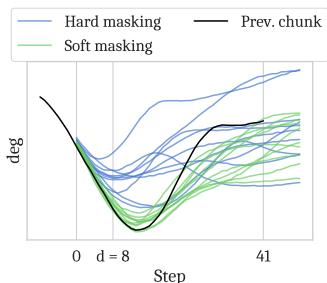

[← 返回 README](../README.md)

# 3 Real-Time Chunking via Inpainting

## 📌 预览

方法的核心章节。三部分递进：3.1 基于 flow matching 的推理时 inpainting（ΠGDM）→ 3.2 soft masking 提升跨 chunk 连续性 → 3.3 完整的 RTC 系统（Algorithm 1）。

---

The key challenge in real-time execution is to maintain continuity between chunks. By the time a new chunk is available, the previous one has already been executed partway, and therefore the new chunk must be "compatible" with the previous one. At the same time, the new chunk should still incorporate new observations, so that the policy does not lose the ability to react and make corrections.

> 💡 **双重目标**：
> 1. 新 chunk 必须与旧 chunk **兼容**（连续性）
> 2. 新 chunk 必须融入**最新观测**（反应性）
> 
> 这两个目标看似矛盾：要兼容旧的就不能完全自由，要融入新的就不能完全受限。Inpainting 是优雅的折中。

---

Our key insight is to pose real-time chunking as an inpainting problem. To make the new chunk "compatible", we must use the overlapping timesteps where we have access to the remaining actions of the previous chunk. The first $d$ actions from the new chunk cannot be used, since those timesteps will have already passed by the time the new chunk becomes available. Thus, it makes sense to "freeze" those actions to the values that we know will be executed; our goal is then to fill in the remainder of the new chunk in a way that is consistent with this frozen prefix (see Figure 3), much like inpainting a section of an image that has been removed. We describe this basic inpainting principle in Sec. 3.1. In Sec. 3.2, we introduce a soft masking extension that is critical for full cross-chunk continuity; finally, we describe our full real-time chunking system in Sec. 3.3.

> 💡 **Inpainting 类比**：
> - 图像 inpainting：给定图像的一部分（mask 外），生成 mask 内的内容使之自然
> - RTC inpainting：给定已冻结的动作前缀，生成剩余动作使之与前缀连续
> - 前 $d$ 个动作 = 已知区域（冻结）
> - 后 $H - d$ 个动作 = 待 inpaint 区域

---

## 3.1 Inference-Time Inpainting with Flow Matching

> 💡 **3.1 要点预览**: 如何在不重新训练的情况下做 inpainting？借用图像 inpainting 的 ΠGDM（pseudoinverse guidance）方法，给 flow matching 的每一步加一个引导梯度。

Inpainting is a known strength of iterative denoising frameworks such as diffusion and flow matching. We build on the training-free image inpainting algorithm from Pokle et al. [48], which is itself based on pseudoinverse guidance (ΠGDM; [55]). The algorithm operates by adding a gradient-based guidance term to the learned velocity field $\mathbf{v}$ at each denoising step (Equation 1) that encourages the final generation to match some target value, $\mathbf{Y}$, which is a corrupted version of the desired result. In the case of image inpainting, the corruption operator is masking, $\mathbf{Y}$ is the masked image, and the desired result is a full image consistent with $\mathbf{Y}$ in the non-masked areas. The ΠGDM gradient correction, specialized to our setting, is given by

$$\mathbf{v}_{\text{ΠGDM}}(\mathbf{A}_t^\tau, \mathbf{o}_t, \tau) = \mathbf{v}(\mathbf{A}_t^\tau, \mathbf{o}_t, \tau) + \min\left(\beta, \frac{1-\tau}{\tau \cdot r_\tau^2}\right) \left(\mathbf{Y} - \widehat{\mathbf{A}_t^1}\right)^\top \text{diag}(\mathbf{W}) \frac{\partial \widehat{\mathbf{A}_t^1}}{\partial \mathbf{A}_t^\tau}$$

where $\widehat{\mathbf{A}_t^1} = \mathbf{A}_t^\tau + (1 - \tau) \mathbf{v}(\mathbf{A}_t^\tau, \mathbf{o}_t, \tau)$, and $r_\tau^2 = \frac{(1-\tau)^2}{\tau^2 + (1-\tau)^2}$.

> 💡 **ΠGDM 公式解读**:
> - 核心思想：在每一步去噪时，**额外加一个梯度项**，把生成的 action chunk 拉向目标值 $\mathbf{Y}$（即冻结的前缀动作）
> - $\widehat{\mathbf{A}_t^1}$：当前步的"一步预测"——如果从当前状态直接跳到最终结果会是什么
> - $\mathbf{W}$：mask 权重（哪些位置需要匹配目标）
> - $\frac{\partial \widehat{\mathbf{A}_t^1}}{\partial \mathbf{A}_t^\tau}$：**Jacobian**！这就是为什么 RTC 比 vanilla 推理慢——需要对每步去噪做反向传播
> - $\beta$：梯度权重裁剪，防止去噪步数少时（如 $n=5$）梯度爆炸

---

$\widehat{\mathbf{A}_t^1}$ is an estimate of the final, fully denoised action chunk and $\mathbf{W}$ is the mask. We are abusing notation by treating $\mathbf{Y}$, $\mathbf{A}_t$, and $\mathbf{W}$ as vectors of dimension $HM$ where $M$ is the dimension of each action. Thus, the guidance term is a vector-Jacobian product and can be computed using backpropagation. The guidance weight clipping, $\beta$, is our addition; we found that without it, the algorithm became unstable with the small number of denoising steps commonly used in control problems (see A.2 for an ablation).

> 💡 **实现细节**:
> - 所有量被展平为 $HM$ 维向量（$H$ 个动作 × $M$ 维每个动作）
> - Guidance = **vector-Jacobian product** → 用反向传播算
> - **$\beta$ 是作者的关键改进**：图像 inpainting 通常 100 步去噪，权重自然不会太大；但控制任务只用 5 步，权重在 $\tau \to 0$ 时趋于无穷 → 必须裁剪
> - 实验中 $\beta = 5$ 效果最好（见 A.2 ablation）

---

## 3.2 Soft Masking for Improved Cross-Chunk Continuity

> 💡 **3.2 要点预览**: 只用前 $d$ 个动作做 hard inpainting 不够（$d$ 小的时候引导信号太弱）→ 用 **soft mask**：前 $d$ 个权重为 1，后面指数衰减到 0。

In practice, naively inpainting using only the first $d$ timesteps of the previous action chunk is often insufficient to ensure that the new chunk takes a consistent strategy, particularly when $d$ is small (e.g., see Figure 4). The ΠGDM correction is not perfect, and a small $d$ leads to a weak guidance signal, which can allow for the new chunk to still switch strategies and cause discontinuities. Our solution, illustrated in Figure 3, is to give our policy more cross-chunk continuity by considering not just the first $d$ overlapping actions, but all $H - s$ overlapping actions. We do this via soft masking, setting $\mathbf{W}$ to real-valued weights rather than 1s and 0s. The first $d$ actions get a weight of 1; the last $s$ actions of the new chunk do not overlap with the previous chunk, so they get a weight of 0; the actions in between get weights that exponentially decay from 1 to 0, accounting for the fact that actions further in the future should be treated with more uncertainty. The resulting expression for W is given by

$$\mathbf{W}_i = \begin{cases} 1 & \text{if } i < d \\ c_i \frac{e^{c_i} - 1}{e - 1} & \text{if } d \leq i < H - s \\ 0 & \text{if } i \geq H - s \end{cases} \text{where } c_i = \frac{H - s - i}{H - s - d + 1}, \quad i \in \{0, \ldots, H-1\}.$$

Intuitively, W modulates the "attention" paid to each corresponding action from the previous chunk. See Appendix A.4 for a comparison between different decay schedules.

> 💡 **Soft masking 公式解读**:
> - 三个区域（对应 Figure 3 的颜色）：
>   1. $i < d$：**冻结区**，$W = 1$（这些动作已经执行了，必须完全匹配）
>   2. $d \leq i < H-s$：**过渡区**，$W$ 从 1 指数衰减到 0（越远的旧动作越不确定）
>   3. $i \geq H-s$：**自由区**，$W = 0$（超出旧 chunk 范围，完全由新观测决定）
> - 为什么用指数衰减而非线性？Appendix A.4 做了对比，指数略优于线性，但差距不大

---

*Figure 4: A comparison of naive inpainting (hard masking) and our proposed soft masking method: note that hard masking does not match the frozen region very well and produces faster changes in direction.*

> 💡 **Figure 4 批读**:
> - 左：Hard masking（只冻结前 $d$ 步）→ 过渡不够平滑，方向变化突兀
> - 右：Soft masking → 旧 chunk 的影响渐进消失，过渡更自然
> - 直观理解：soft masking 相当于给新 chunk 一个"惯性"，让它不要一下子就偏离旧 chunk 的轨迹

---

## 3.3 Real-Time Chunking

> 💡 **3.3 要点预览**: 把 inpainting + soft masking 包装成完整的实时系统。两个线程：控制器线程（每 $\Delta t$ 取一个动作）和推理线程（后台循环生成新 chunk）。

We present our full real-time chunking system in Algorithm 1 (complemented by Figure 3). The controller interfaces with our algorithm via GETACTION, which is called every $\Delta t$ to consume an action $\mathbf{a}_{t-1}$ and provide the next observation $\mathbf{o}_t$. The INFERENCELOOP runs in a background thread so that an action is always available. It forecasts the next delay, $d$, by keeping a buffer of past delays. The execution horizon, $s$, can change from chunk to chunk; the user provides a minimum desired horizon, $s_\text{min}$, and the actual horizon for a given chunk is $\max(d, s_\text{min})$ where $d$ is the delay encountered when computing the next chunk. Finally, the algorithm describes the inpainting with soft masking procedure in GUIDEDINFERENCE, which explicitly defines a denoising function (Eq. 3) and computes a vector-Jacobian product, which can be done with reverse-mode autodifferentiation [2].

> 💡 **Algorithm 1 解读**:
> 
> **系统架构**：双线程
> - **GETACTION**（控制线程）：每 $\Delta t$ 被调用，返回当前动作 $\mathbf{a}_t$，更新观测
> - **INFERENCELOOP**（推理线程）：后台循环运行，等 $s_\text{min}$ 步执行后开始推理下一个 chunk
> 
> **关键机制**：
> 1. 保存旧 chunk 的剩余动作 $\mathbf{A}_\text{prev}$
> 2. 用过去延迟的 **最大值** 估算下一次延迟（保守策略，避免新 chunk 来不及）
> 3. 调用 GUIDEDINFERENCE：对每个去噪步，计算引导梯度（VJP），拉向旧 chunk
> 4. 新 chunk 一生成就立刻切换（原子操作）
> 
> **计算开销**：
> - 比 vanilla 多出的成本 = 每步去噪的反向传播
> - π₀.₅ 上：vanilla 76ms → RTC 97ms（增加约 28%）
> - 相比之下 BID 需要采样 64 个 chunk → 延迟 2-3 倍

---

## 🔖 Section 总结

### 方法一句话
RTC = **flow matching inpainting + soft masking + 异步双线程执行**

### 关键数字速查

| 组件 | 开销 |
|------|------|
| RTC vs vanilla | +28% 延迟 (97ms vs 76ms) |
| RTC vs BID (N=16, full) | 2.3x 更快 |
| Guidance weight clip $\beta$ | 5 |
| 去噪步数 $n$ | 5 |

### 核心洞察
1. **ΠGDM 引导**：在去噪过程中加梯度项，拉向目标前缀，无需重训
2. **Soft masking**：指数衰减权重解决 hard masking 信号不足的问题
3. **双线程系统**：控制和推理解耦，推理延迟通过保守估计来处理
4. **$\beta$ 裁剪**是关键改进——没有它，少步数去噪会发散
