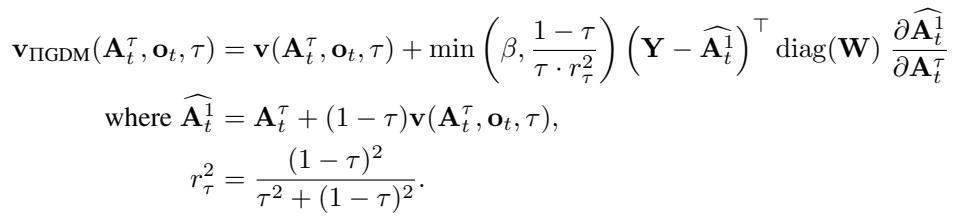

[← 返回 README](../README.md)

# 3 Real-Time Chunking via Inpainting

## 📌 预览
这是全文的核心方法章节。RTC 把异步 action chunking 建模为 inpainting 问题：冻住必须执行的 action，用 ΠGDM guidance 填充剩余部分。关键创新是 **soft masking**——不只冻住前 $d$ 个 action，而是对所有重叠区域用指数衰减的权重进行引导，确保跨 chunk 连续性。

---

The key challenge in real-time execution is to maintain continuity between chunks. By the time a new chunk is available, the previous one has already been executed partway, and therefore the new chunk must be "compatible" with the previous one. At the same time, the new chunk should still incorporate new observations, so that the policy does not lose the ability to react and make corrections.

> 💡 **核心挑战**: 两个目标之间的平衡：
> 1. **兼容性**: 新 chunk 必须跟已执行的 action 衔接
> 2. **反应性**: 新 chunk 要能利用最新 observation 做修正
> 
> 这两个目标是矛盾的——越兼容旧 chunk，就越像 open-loop；越响应新 observation，就越可能跟旧 chunk 分叉。

---

Our key insight is to pose real-time chunking as an inpainting problem. To make the new chunk "compatible", we must use the overlapping timesteps where we have access to the remaining actions of the previous chunk. The first $d$ actions from the new chunk cannot be used, since those timesteps will have already passed by the time the new chunk becomes available. Thus, it makes sense to "freeze" those actions to the values that we know will be executed; our goal is then to fill in the remainder of the new chunk in a way that is consistent with this frozen prefix (see Figure 3), much like inpainting a section of an image that has been removed. We describe this basic inpainting principle in Sec. 3.1. In Sec. 3.2, we introduce a soft masking extension that is critical for full cross-chunk continuity; finally, we describe our full real-time chunking system in Sec. 3.3.

> 💡 **Inpainting 类比**:
> - 图像 inpainting: 已知部分像素，生成完整图像
> - RTC inpainting: 已知前 $d$ 个 action（必须执行的），生成完整 chunk
> - 关键区别：RTC 还有一个 **soft guidance 区域**（前一个 chunk 的剩余 action），这些不是硬约束，而是参考

---

## 3.1 Inference-Time Inpainting with Flow Matching

Inpainting is a known strength of iterative denoising frameworks such as diffusion and flow matching. We build on the training-free image inpainting algorithm from Pokle et al. [48], which is itself based on pseudoinverse guidance (ΠGDM; [55]). The algorithm operates by adding a gradient-based guidance term to the learned velocity field $\mathbf{v}$ at each denoising step (Equation 1) that encourages the final generation to match some target value, $\mathbf{Y}$, which is a corrupted version of the desired result. In the case of image inpainting, the corruption operator is masking, $\mathbf{Y}$ is the masked image, and the desired result is a full image consistent with $\mathbf{Y}$ in the non-masked areas. The ΠGDM gradient correction, specialized to our setting, is given by



> 💡 **ΠGDM Guidance 公式解读**:
> 这个公式是 RTC 的数学核心。让我分步解释：
> 
> **整体结构**: 在标准 flow matching 的速度场 $\mathbf{v}$ 上加一个 gradient correction 项
> 
> **各部分含义**:
> - $\widehat{\mathbf{A}_t^1} = \mathbf{A}_t^\tau + (1-\tau)\mathbf{v}(\mathbf{A}_t^\tau, \mathbf{o}_t, \tau)$: 从当前 denoising 状态估计最终 action chunk（one-step 估计）
> - $\mathbf{Y} - \widehat{\mathbf{A}_t^1}$: 目标值和当前估计的**误差**
> - $\text{diag}(\mathbf{W})$: **mask 权重**，控制哪些 action 需要匹配，哪些可以自由生成
> - $\frac{\partial \widehat{\mathbf{A}_t^1}}{\partial \mathbf{A}_t^\tau}$: Jacobian，通过反向传播计算
> - $\min(\beta, \frac{1-\tau}{\tau \cdot r_\tau^2})$: guidance 权重，$\beta$ 是截断值（作者的新增）
> 
> **直觉**: 每一步 denoising 时，计算"当前生成的 action 离目标 $\mathbf{Y}$ 有多远"，然后把梯度加到速度场上，把生成结果**拉向目标**。
> 
> **$\beta$ 截断的必要性**: 在 $\tau \to 0$ 时 guidance 权重会趋向无穷大。图像 inpainting 用 100 步问题不大，但 VLA 只用 5 步 denoising，不截断会导致 action chunk 发散（见 Appendix A.2）。

$\widehat{\mathbf{A}_t^1}$ is an estimate of the final, fully denoised action chunk and $\mathbf{W}$ is the mask. We are abusing notation by treating $\mathbf{Y}$, $\mathbf{A}_t$, and $\mathbf{W}$ as vectors of dimension $HM$ where $M$ is the dimension of each action. Thus, the guidance term is a vector-Jacobian product and can be computed using backpropagation. The guidance weight clipping, $\beta$, is our addition; we found that without it, the algorithm became unstable with the small number of denoising steps commonly used in control problems (see A.2 for an ablation).

> 💡 **实现细节**:
> - VJP (vector-Jacobian product) 可以用反向传播高效计算，无需显式构造 Jacobian 矩阵
> - $\beta = 5$ 是作者通过消融实验确定的保守值
> - 计算代价：每个 denoising step 需要一次额外的反向传播 → RTC 延迟 97ms vs 标准 76ms（增加 ~28%）

---

## 3.2 Soft Masking for Improved Cross-Chunk Continuity

In practice, naively inpainting using only the first $d$ timesteps of the previous action chunk is often insufficient to ensure that the new chunk takes a consistent strategy, particularly when $d$ is small (e.g., see Figure 4). The ΠGDM correction is not perfect, and a small $d$ leads to a weak guidance signal, which can allow for the new chunk to still switch strategies and cause discontinuities. Our solution, illustrated in Figure 3, is to give our policy more cross-chunk continuity by considering not just the first $d$ overlapping actions, but all $H - s$ overlapping actions. We do this via soft masking, setting $\mathbf{W}$ to real-valued weights rather than 1s and 0s. The first $d$ actions get a weight of 1; the last $s$ actions of the new chunk do not overlap with the previous chunk, so they get a weight of 0; the actions in between get weights that exponentially decay from 1 to 0, accounting for the fact that actions further in the future should be treated with more uncertainty. The resulting expression for W is given by

$$\mathbf{W}_i = \begin{cases} 1 & \text{if } i < d \\ c_i \frac{e^{c_i} - 1}{e - 1} & \text{if } d \leq i < H - s \\ 0 & \text{if } i \geq H - s \end{cases} \text{ where } c_i = \frac{H - s - i}{H - s - d + 1}$$

> 💡 **Soft Masking 设计——RTC 的关键创新**:
> 
> **为什么 hard masking 不够？**
> - 如果 $d$ 很小（比如 $d=1$），只冻住 1 个 action 的 guidance 信号太弱
> - ΠGDM 不是完美的，弱信号可能不足以阻止新 chunk 切换策略
> 
> **Soft masking 的三个区域**:
> ```
> Weight
> 1.0 |████████|
>     |        |▓▓▓▓
>     |        |    ▓▓▓
>     |        |       ▓▓
>     |        |         ▓
> 0.0 |        |           |░░░░░░|
>     |--d-----|--H-s-d----|--s---|
>     frozen    soft decay   free
> ```
> 
> - **Frozen** ($i < d$): 权重=1，hard constraint
> - **Soft decay** ($d \leq i < H-s$): 指数衰减，越远越不确定
> - **Free** ($i \geq H-s$): 权重=0，完全自由生成
> 
> **直觉**: 前一个 chunk 对近期 action 的预测比远期更可靠，所以近期给更高权重。

Intuitively, W modulates the "attention" paid to each corresponding action from the previous chunk. See Appendix A.4 for a comparison between different decay schedules.

---


*Figure 4: Hard masking 和 soft masking 的对比。Hard masking 不能很好地匹配 frozen 区域，方向变化更剧烈。*

> 💡 **Figure 4 批读**:
> - **Hard masking**（左）: 新 chunk 在 frozen 区域结束后立刻偏离，方向变化突然
> - **Soft masking**（右）: 新 chunk 平滑地从前一个 chunk 过渡到新策略
> - 这说明 soft masking 的 "渐进放手" 策略确实有效——不是在 $d$ 处突然放开控制，而是逐渐放开

---

## 3.3 Real-Time Chunking

We present our full real-time chunking system in Algorithm 1 (complemented by Figure 3). The controller interfaces with our algorithm via GETACTION, which is called every $\Delta t$ to consume an action $\mathbf{a}_{t-1}$ and provide the next observation $\mathbf{o}_t$. The INFERENCELOOP runs in a background thread so that an action is always available. It forecasts the next delay, $d$, by keeping a buffer of past delays. The execution horizon, $s$, can change from chunk to chunk; the user provides a minimum desired horizon, $s_\text{min}$, and the actual horizon for a given chunk is $\max(d, s_\text{min})$ where $d$ is the delay encountered when computing the next chunk. Finally, the algorithm describes the inpainting with soft masking procedure in GUIDEDINFERENCE, which explicitly defines a denoising function (Eq. 3) and computes a vector-Jacobian product, which can be done with reverse-mode autodifferentiation [2].

> 💡 **Algorithm 1 解读——系统架构**:
> 
> RTC 是一个 **双线程系统**:
> 
> **线程 1: Controller (GETACTION)**
> - 每 $\Delta t$ 调用一次
> - 从当前 chunk 中取出下一个 action 返回给控制器
> - 同时提供最新 observation
> 
> **线程 2: Inference (INFERENCELOOP)**
> - 后台持续运行
> - 等到执行了 $s_\text{min}$ 个 action 后开始新的推理
> - 用过去的延迟历史估计下一次延迟 $d$（取 max，保守估计）
> - 调用 GUIDEDINFERENCE 生成新 chunk
> - 新 chunk 就绪后立刻替换旧 chunk
> 
> **GUIDEDINFERENCE 流程**:
> 1. 计算 soft mask $\mathbf{W}$
> 2. 初始化噪声 $\mathbf{A}^0 \sim \mathcal{N}(0, I)$
> 3. 每个 denoising step:
>    - 估计最终 action $\widehat{\mathbf{A}^1}$
>    - 计算加权误差
>    - 反向传播得到 gradient correction
>    - 更新 $\mathbf{A}^\tau$
> 4. 返回 $\mathbf{A}^1$
> 
> **自适应 execution horizon**: $s = \max(d, s_\text{min})$。如果延迟大（$d$ 大），就多执行一些 action 再切换。这让 RTC 自动适应不同的推理条件。

---

## 🔖 Section 总结

### 关键数字速查
| 指标 | 数值 |
|------|------|
| β (guidance clipping) | 5 |
| RTC 额外延迟 | ~21ms (97ms vs 76ms) |
| Denoising steps | 5 |

### 核心洞察
1. **Inpainting = 兼容性 + 反应性的统一框架**: 用 guidance 把新 chunk 拉向旧 chunk 的已执行部分，同时允许远期 action 自由响应新 observation
2. **Soft masking 是关键**: Hard masking 的 guidance 信号太弱，特别是 $d$ 小的时候。指数衰减的 soft mask 让过渡平滑
3. **双线程架构**: Controller 不等推理，推理后台持续运行。Action 总是可用的
4. **计算代价可控**: 每步多一次反向传播，总延迟增加 ~28%（76ms → 97ms）。但因为是异步的，这个增量不影响控制频率
