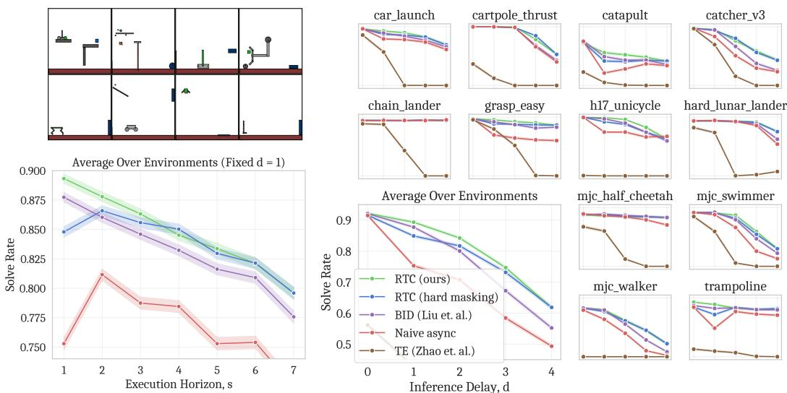
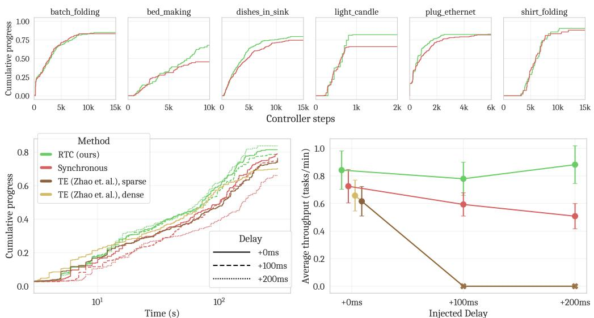

[← 返回 README](../README.md)

# 4 Experiments

## 📌 预览
实验分两部分：Kinetix 仿真（12 个高动态任务，系统性地测试不同延迟）+ 真实世界（π₀.₅ + 6 个双臂操作任务，480 episodes，28 小时）。RTC 在所有延迟条件下表现最优，且对延迟增加几乎免疫。

---

In our experiments, we aim to answer the following questions. First, how does RTC compare to existing methods in highly dynamic and stochastic environments, and under increasing inference delays? Second, how important is soft masking (Sec. 3.2) to RTC? Third, how does RTC affect the performance and speed of real-world dexterous robots?

We first evaluate RTC using a benchmark of 12 highly dynamic and stochastic environments in the Kinetix [43] simulator. We use this benchmark to compare the performance of RTC to other methods under simulated inference delays, as well as investigate the effect of soft masking. Then, using the π₀.₅ VLA [24] as the base model, we evaluate the performance and speed of RTC on 6 challenging bimanual dexterous manipulation tasks, including 2 mobile manipulation tasks.

> 💡 **实验要回答的三个问题**:
> 1. RTC vs 其他方法在不同延迟下的表现？
> 2. Soft masking 有多重要？
> 3. RTC 在真实世界的速度和性能如何？

---

## 4.1 Simulated Benchmark

Most simulated imitation learning benchmarks are quasi-static, and standard chunked execution with a long enough execution horizon can achieve near-perfect success rates [11]. We instead create a benchmark of 12 dynamic tasks in Kinetix [43], which uses force-based control, so inference delay necessitates asynchronous execution (there is no concept of "holding position"). We select 10 existing environments and create 2 new ones such that all environments involve dynamic motions like throwing, catching, and balancing. To simulate imperfect actuation, we add Gaussian noise to the actions, making closed-loop corrections crucial for success.

> 💡 **为什么需要新 benchmark?**
> - 现有仿真 benchmark（如 Diffusion Policy 用的那些）太 quasi-static，open-loop 就能搞定
> - Kinetix 用的是 **force-based control**（力控/力矩控），不是位置控制
> - 力控意味着：推理延迟时**机器人不会停在原地**，它会继续被力推着走 → 异步执行是必须的
> - 加了 action noise 确保 closed-loop 修正是必要的

**Setup.** To generate data for imitation learning, we first train expert policies using RPO [50] and a binary success reward. For each environment, we train 6 expert policies with different seeds and then generate a 1M transition dataset with a different policy selected each episode. We then train action chunking flow policies with a prediction horizon of $H = 8$ and a 4-layer MLP-Mixer [61] architecture for 32 epochs. We report binary success rates with 2048 rollouts per data point, and simulate delays between 0 (fully closed-loop) and 4 (the maximum supported when $H = 8$).

> 💡 **仿真实验设置**:
> | 配置 | 值 |
> |------|-----|
> | Expert 训练 | RPO, 6 seeds × 12 envs |
> | 数据量 | 1M transitions per env |
> | Policy 架构 | MLP-Mixer, 4 layers |
> | Prediction horizon $H$ | 8 |
> | 训练 epochs | 32 |
> | 评估 rollouts | 2048 per data point |
> | 延迟范围 | $d = 0$ ~ $4$ |
> 
> 多 seed expert + 混合数据 → **多模态策略**（多种策略风格混在数据里），这对测试 mode-jumping 问题很重要。

---

**Baselines.** We compare against the following baselines:

- **Naive async.** This strategy does not pay attention to the previous action chunk at all when generating a new one, naively switching chunks as soon as the new one is ready.
- **Bidirectional decoding (BID; [39]).** This strategy uses rejection sampling to keep continuity across chunks. We use a batch size of $N = 32$, mode size of $K = 3$, and a checkpoint trained for 8 epochs as the weak policy.
- **Temporal ensembling (TE; [68]).** This strategy involves keeping a buffer of predicted action chunks and executing an average of all actions predicted for a particular timestep.

> 💡 **Baseline 对比**:
> | 方法 | 策略 | 计算量 | 需要重训? |
> |------|------|--------|----------|
> | Naive async | 直接切换，不管连续性 | 低 | 否 |
> | BID | Rejection sampling，采样 64 个 chunk 选最好的 | **很高** (64× forward) | 需要 weak policy |
> | TE | 多个 chunk 取平均 | 低 | 否 |
> | **RTC** | Inpainting + soft masking | 中 (1× backward per step) | 否 |

---

*Figure 5: Top left: Kinetix 环境（绿色物体碰蓝色物体）。Bottom left: 固定 d=1 时，execution horizon vs solve rate。Right: 固定 s=max(d,1) 时，inference delay vs solve rate。每个数据点 2048 trials，95% Wilson score 置信区间。*

> 💡 **Figure 5 批读——仿真核心结果**:
> 
> **Delay plots (右图，最重要)**:
> - **TE 全面拉胯**: 即使 $d=0$ 也表现最差。这证实了 multi-modal benchmark 下取平均是灾难性的
> - **RTC 对延迟最鲁棒**: 随着 $d$ 增加，RTC 下降最缓慢。与 BID 的差距随 $d$ 增加而扩大
> - **BID 计算量大但不如 RTC**: BID 采样 64 个 chunk（32 strong + 32 weak），计算量远超 RTC
> - **Soft masking > Hard masking**: 特别在 $d$ 小的时候差距明显，验证了 Section 3.2 的论述
> 
> **Execution horizon plot (左图)**:
> - RTC 和 BID 是唯二能从更短 $s$ 中获益的方法（曲线单调递增）
> - 其他方法在 $s$ 减小时反而变差（mode-jumping 加剧）
> - 这说明 RTC 真正解决了 chunk 边界连续性问题，让 closed-loop 修正更有效

---

## 4.2 Real-World Results

Next, we deploy our full real-time chunking system to the real world. We use the π₀.₅ VLA [24] as our base policy, and evaluate RTC on a bimanual system with two 6-DoF arms and parallel jaw grippers. Unlike our simulated benchmark, the robots use position control, and so synchronous inference— stopping between chunks—is a reasonable default strategy, used in many prior works [5, 24, 31, 47]. Our goal is to improve upon synchronous inference in a combination of both performance and speed.

> 💡 **真实世界 vs 仿真的关键区别**:
> - 仿真用力控（停不下来），真实用**位置控制**（可以停在原地等）
> - 所以 synchronous inference 在真实世界是一个 reasonable baseline（不会像仿真那样因为等待而失控）
> - RTC 的目标：不仅要比同步推理**更快**，还要**更好**

**Setup.** We use π₀.₅ ($H = 50$, $\Delta t = 20\text{ms}$) with $n = 5$ denoising steps, giving a model latency of 76ms for the baselines and 97ms for RTC. We use remote inference over LAN, which adds 10-20ms of latency, giving a starting inference delay around $d \approx 6$ for RTC. However, we would like to understand how the system behaves with higher inference latencies, simulating, e.g., scaling up the model size or running inference on a distant cloud server. Thus, we also evaluate all methods with +100ms and +200ms of injected latency, corresponding to $d \approx 11$ and $d \approx 16$, respectively.

> 💡 **真实世界实验配置**:
> | 配置 | 值 |
> |------|-----|
> | Base policy | π₀.₅ |
> | Prediction horizon $H$ | 50 |
> | Control period $\Delta t$ | 20ms (50Hz) |
> | Denoising steps $n$ | 5 |
> | Model latency (baseline) | 76ms |
> | Model latency (RTC) | 97ms |
> | Network latency | 10-20ms (LAN) |
> | Starting delay $d$ | ~6 (≈120ms) |
> | Injected latency | 0 / +100ms / +200ms |
> 
> 注入额外延迟是为了模拟更大模型或远程云推理的场景，非常有前瞻性。

---

**Tasks and scoring.** Each episode gets an integer score corresponding to how many substeps of the task it completed successfully. We evaluate the following tasks:

- **Light candle** (5 steps, 40s cutoff). Pick up a match and matchbox, strike the match, use it to light a candle, and drop it in a bowl.
- **Plug ethernet** (6 steps, 120s cutoff). Pick up the end of an ethernet cable, reorient it, plug it into a server rack, and repeat the process for the other end.
- **Make bed, mobile** (3 steps, 200s cutoff). Move the corner of a blanket and 2 pillows from the foot to the head of a bed.
- **Shirt folding** (1 step, 300s cutoff). Fold a shirt from a flattened position.
- **Batch folding** (4 steps, 300s cutoff). Take a varied, crumpled clothing item out of a bin, flatten it, fold it, then place it neatly on a pile.
- **Dishes in sink, mobile** (8 steps, 300s cutoff). Move 4 varied items from a counter into a sink.

> 💡 **任务设计**:
> - 6 个任务覆盖了不同的难度和特点：
>   - **精度敏感**: Light candle（点火柴！手指级精度）
>   - **多步骤**: Plug ethernet (6步), Dishes (8步)
>   - **移动操作**: Make bed, Dishes（需要移动底座）
>   - **变形物体**: Shirt folding, Batch folding
> - **评分标准**: 离散子步骤完成数（不是 binary success），能更细粒度地衡量进度
> - **10 trials per task per method × 4 methods × 3 delay settings = 480 episodes, 28 小时机器人时间**

---

**Baselines.**

- **Synchronous.** Default strategy, executes $s = 25$ actions then pauses while generating the next chunk.
- **TE, sparse.** Executes $s = 25$ actions while computing next chunk in parallel. Applies TE on overlapping actions.
- **TE, dense.** Runs inference as often as possible ($s = d$), always having 2+ overlapping chunks to ensemble.

We do not compare to BID [39] in the real world, as we found in simulation that it underperforms RTC while using significantly more compute—when applied to π₀.₅ with a batch size of 16, BID has 2.3 times the latency of our method (see A.3 for latency measurements).

> 💡 **为什么不比 BID?**
> - BID + π₀.₅ (batch=16): **2.3× 延迟**
> - 仿真里已经证明 BID < RTC + 计算量大得多
> - 在 3B 参数 VLA 上跑 BID 的 rejection sampling 实在太贵了

---

*Figure 6: Top: 各任务的 controller steps vs 累积进度。Left: 时间(含推理暂停) vs 累积进度（X 轴对数尺度）。Right: inference delay vs average throughput。两个 TE 变体在 +100ms 和 +200ms 注入延迟下因抖动过大触发了机器人保护性停机。*

> 💡 **Figure 6 批读——真实世界核心结果**:
> 
> **Average throughput (右图，最关键)**:
> - **RTC 在所有延迟下最优**: +0ms, +100ms, +200ms 都是最高
> - **RTC 对延迟免疫**: 三个延迟条件下几乎没有下降！
> - **Synchronous 线性退化**: 延迟越大，throughput 越低（因为暂停越长）
> - **TE 两个变体在高延迟下直接崩溃**: 抖动太大触发机器人安全停机（protective stop）！
> 
> **Per-task results (上图)**:
> - **Light candle**: RTC 优势最大。这是唯一不能重试的任务，所以 final score 直接反映成功率
> - **Make bed**: RTC 同样优势明显，尽管这个任务允许重试。说明 RTC 减少了操作失误
> - **其他任务**: Synchronous 通过重试最终也能达到类似分数，但 RTC **更早达到**（错误更少，重试更少）
> 
> **去除推理暂停的对比 (上图)**:
> - 即使把同步推理的暂停时间扣掉，RTC 仍然**更快完成任务**
> - 这说明 RTC 不只是消除了暂停时间，它**本质上让策略执行得更好**（更少错误，更连贯的动作）

---

## 🔖 Section 总结

### 关键数字速查
| 指标 | 数值 |
|------|------|
| 仿真: 环境数 | 12 (Kinetix) |
| 仿真: Rollouts per data point | 2048 |
| 真实: 任务数 | 6 |
| 真实: 总 episodes | 480 |
| 真实: 机器人执行时间 | 28 小时 |
| RTC 延迟 (π₀.₅) | 97ms model + 10-20ms network |
| TE 高延迟下 | **触发安全停机** |

### 核心洞察
1. **TE 在多模态环境中是灾难性的**: 仿真中即使 $d=0$ 也最差，真实中高延迟直接崩溃
2. **RTC 对延迟几乎免疫**: 这是最强卖点。+200ms 注入延迟也不明显退化
3. **RTC 不只是更快，而是更好**: 去除暂停时间后仍然完成更快，说明连续性本身就提升了策略质量
4. **BID 计算成本太高**: 在 3B VLA 上不实用（2.3× 延迟）
