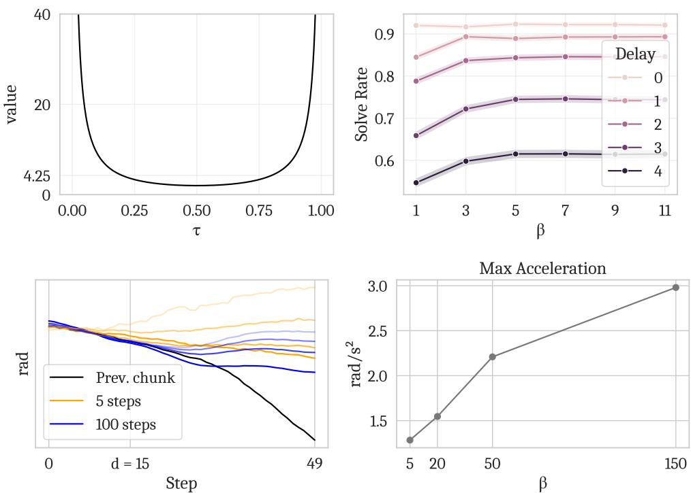
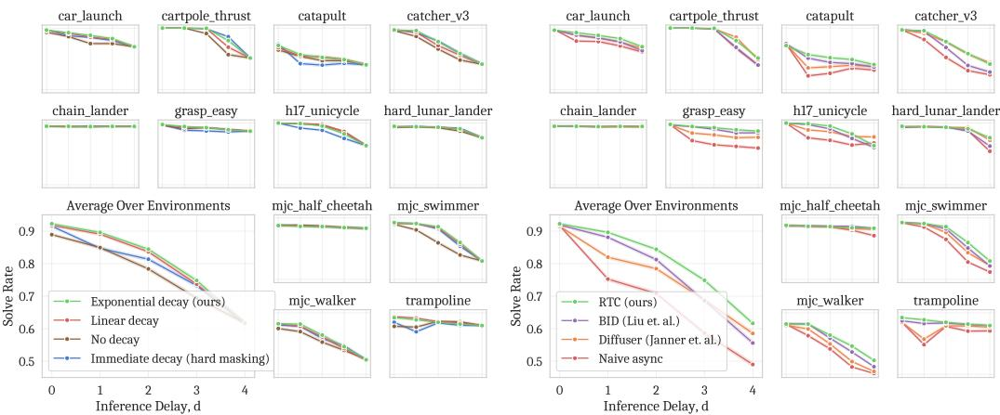

[← 返回 README](../README.md)

# Appendix

## 📌 预览
附录包含 broader impacts、β 截断分析、延迟测量、soft masking 消融、超参数表和计算资源。

---

## A.1 Broader Impacts

The goal of our work is to improve the speed and performance of learned policies for control tasks, and our experiments primarily deal with household robots. This technology has great potential to improve lives, e.g., by automating dangerous and difficult jobs, or assisting the disabled and elderly. Like any technology, it also has the potential for harm—e.g., in military applications, or by displacing physical labor.

---

## A.2 The Necessity of Guidance Weight Clipping (β)

*Figure 7: Top left: guidance 权重 $\frac{1-\tau}{\tau \cdot r_\tau^2}$ 随 τ 的变化。Top right: β 消融。Bottom left: 不同 β 下 n=5 和 n=100 的 action chunk 对比。Bottom right: β vs 最大加速度。*

> 💡 **Figure 7 批读——β 为什么重要**:
> - **Top left**: 在 τ→0 时 guidance 权重趋向无穷大，必须截断
> - **Top right**: β≥5 后没有边际提升 → β=5 是最优保守值
> - **Bottom left**: n=5（实际使用）时高 β 导致 action chunk 发散（不同 β 的曲线差异大）；n=100 时差异小
> - **Bottom right**: β 越高 → 最大加速度越大 → 越抖动 → 越 OOD
> 
> **结论**: 少 denoising steps（现实需求）+ 高 guidance weight = 灾难。β=5 是甜点。

---

## A.3 Latency Measurements

| Method | Latency |
|--------|---------|
| **RTC (ours)** | **97ms** |
| BID N=16 (no forward model) | 115ms |
| BID N=16 (shared backbone) | 169ms |
| BID N=16 (full) | 223ms |
| Vanilla π₀.₅ | 76ms |

> 💡 **延迟对比**:
> - RTC 比 vanilla 多 21ms（+28%），但比任何版本的 BID 都快
> - BID full 是 RTC 的 **2.3x**
> - RTC 的额外开销全部来自反向传播（Jacobian 计算）

**RTC 延迟分解（真实部署）**:

| Component | Mobile | Non-mobile |
|-----------|--------|------------|
| Model | 96.89ms | 97.43ms |
| Network | 21.20ms | 6.89ms |
| Image resize | 11.22ms | 1.44ms |
| Other | 9.67ms | 3.00ms |
| **Total** | **138.98ms** | **108.76ms** |

> 💡 **真实部署瓶颈**:
> - Model 推理是绝对主导（~70%）
> - Mobile 场景的瓶颈是 network（21ms）和 image resize（11ms，NUC CPU 弱）
> - Non-mobile 用台式机 CPU + 有线 LAN，总延迟只有 109ms

**Model 内部分解**:

| Component | No RTC | With RTC |
|-----------|--------|----------|
| Image encoders (SigLIP) | 18ms | 18ms |
| LLM prefill (Gemma 2B) | 44ms | 44ms |
| Denoising step (×5) | 14ms | 35ms |
| **Total** | **76ms** | **97ms** |

> 💡 **RTC 开销来源**:
> - Image encoder 和 LLM prefill 不变（18ms + 44ms）
> - 每个 denoising step: 14ms → 35ms（2.5x，因为反向传播）
> - 5 步总开销: 14ms → 35ms 的差 = 21ms
> - 占比: 21/97 ≈ 22%

---

## A.4 Soft Masking Ablation

*Figure 8: Left: 不同 soft masking decay schedule 对比。Right: Diffuser inpainting 方法 vs RTC guidance-based inpainting 对比。*

> 💡 **Figure 8 批读**:
> - **左图**: Exponential decay（论文选择）最好，但 linear decay 非常接近。Step function（hard masking）最差
> - **右图**: Diffuser 的简单 inpainting（每步替换）vs ΠGDM guidance → guidance-based 明显更好
> - **结论**: decay schedule 的选择不太敏感（exponential ≈ linear >> step），但 inpainting 方法的选择很关键（guidance >> replace）

---

## A.5 Hyperparameters

| Hyperparameter | Description | Simulation | Real-world |
|----------------|-------------|------------|------------|
| $n$ | Denoising steps | 5 | 5 |
| $H$ | Prediction horizon | 8 | 50 |
| $s_\text{min}$ | Min execution horizon | - | 25 |
| $\beta$ | Guidance weight clipping | 5 | 5 |
| $b$ | Delay buffer size | - | 10 |

---

## A.6 Compute Resources

All experiments use no more than 8 NVIDIA H100 GPUs (one DGX server). Real-world inference on a single RTX 4090.

| Stage | Compute |
|-------|---------|
| Expert training (RPO) | 4h on 4×H100 |
| Data generation | 20min on 6×H100 |
| IL training per env | 1.5h on 2×H100 |
| Evaluation (2048 trials/env) | 5min on 6×H100 |
| π₀.₅ fine-tuning | 24h on 8×H100 |
| Real-world inference | 1× RTX 4090 |

---

## 🔖 Section 总结

### 核心洞察
1. **β=5 是必要的**: 少 denoising steps + 无截断 = 发散。这是从图像 inpainting 迁移到控制时必须做的适配
2. **RTC 延迟开销可控**: +21ms (+28%)，全部来自 denoising 的反向传播
3. **Soft masking decay 不敏感**: exponential ≈ linear，但 guidance 方法很关键（ΠGDM >> Diffuser replace）
4. **真实部署瓶颈是 model inference**: 占 70%+ 延迟，network 和 preprocessing 是次要的
