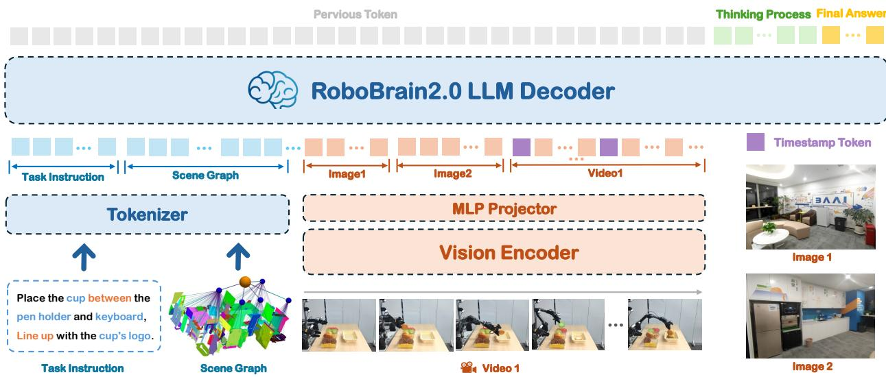

[← 返回 README](../README.md)

# 2. Architecture

> 来源: RoboBrain 2.0 Technical Report (Arxiv 2507.02029)

---

## 📄 原文

> 💡 **Section 概览**: 架构部分介绍 RoboBrain 2.0 的模块化编码器-解码器架构。四个核心组件：tokenizer、vision encoder、MLP projector、LLM backbone（Qwen2.5-VL）。重点是支持多视角、高分辨率、视频输入，以及多样化输出（文本、坐标、推理链）。

RoboBrain 2.0 employs a modular encoder-decoder architecture that unifies perception, reasoning, and planning for complex embodied tasks. As shown in Figure 3, it processes multi-view visual observations and natural language instructions through four core components: (1) a tokenizer for textual/structured inputs, (2) a vision encoder, (3) an MLP projector mapping visual features to the language model's token space, and (4) a language model backbone initialized from Qwen2.5-VL [5]. Unlike conventional VLMs [2, 22] focused on general static VQA, RoboBrain 2.0 maintains strong general VQA capabilities while specializing in embodied reasoning tasks like spatial perception, temporal modeling, and long-chain causal reasoning. The architecture encodes high-resolution images, multi-view inputs, video frames, language instructions, and scene graphs into a unified multimodal token sequence for comprehensive processing.

> 💡 **架构核心**: 
> ```
> 四大组件:
> ├── 1. Tokenizer: 处理文本和结构化输入（如 scene graph JSON）
> ├── 2. Vision Encoder: 处理图像/视频
> ├── 3. MLP Projector: 视觉特征 → LLM token 空间
> └── 4. LLM Backbone: Qwen2.5-VL 初始化，decoder-only
> ```
> 关键设计：从 Qwen2.5-VL 初始化意味着继承了其强大的通用 VQA 能力，然后在此基础上增强具身推理。


*Figure 3: The Architecture of RoboBrain 2.0. The model supports multi-image, long video, and high-resolution visual inputs, along with complex task instructions and structured scene graphs on the language side. Visual inputs are processed via a vision encoder and an MLP projector, while textual inputs are tokenized into a unified token stream. All inputs are fed into an LLM decoder that performs long-chain-of-thought reasoning and generates a variety of outputs depending on the task, including structured plans, spatial relations, or relative and absolute coordinates.*

> 💡 **Figure 3 批读**: 架构图展示了完整的数据流：
> ```
> 输入侧:
> ├── 视觉输入: 多图、长视频、高分辨率 → Vision Encoder → MLP Projector → tokens
> └── 文本输入: 指令 + scene graph JSON → Tokenizer → tokens
>     ↓
> 统一 token 序列 → LLM Decoder (Qwen2.5-VL)
>     ↓
> 输出侧:
> ├── 结构化计划（structured plans）
> ├── 空间关系（spatial relations）
> ├── 坐标（absolute/relative coordinates）
> └── 推理链（chain-of-thought traces）
> ```
> 本质上是标准的 VLM 架构（ViT + Projector + LLM），但输入输出都为具身任务做了定制化。

---

### 2.1 Input Modalities and Tokenization

> 💡 **2.1 要点预览**: 支持四种输入模态——语言指令（多层级）、场景图（JSON）、多视角静态图像、视频帧。

RoboBrain 2.0 supports a diverse set of input modalities tailored for embodied AI tasks:

• Language instructions: Natural language commands describing high-level goals or low-level actions. RoboBrain 2.0 processes natural language commands spanning different abstraction levels: from high-level, spatially grounded instructions (e.g., "Carry the apple to the nearest table, aligned with the leftmost cup") to low-level motor commands (e.g., "Navigate to the nearest table", "Grasp the apple", "Detect position aligned with the leftmost cup", "Place the apple into the box").
• Scene graph: A structured JSON representation of the explored environment, containing information about discovered objects, their categories, spatial locations, and embodiment configuration (e.g., name: KitchenTable1, type: table, object: [basket, knife], robot: RealMan-single-arm).
• Multi-view static images: Images captured from multiple viewpoints, such as head-mounted cameras, wrist-mounted cameras, or multi-view projections from a 3D environment. These are processed independently by the vision encoder and concatenated into a unified token sequence.
• Video frames: Video sequences (e.g., egocentric views from the agent), optionally annotated with timestamp tokens [5] to facilitate temporal grounding and reasoning.

> 💡 **输入设计亮点**:
> - **多层级指令**: 从 "把苹果搬到桌子上" 到 "导航到桌子" → "抓取苹果" → "放置"，覆盖高级规划到低级控制
> - **场景图输入**: 用 JSON 结构描述环境，这是 RoboOS [61] 多机器人协作的基础
> - **时间戳 tokens**: 继承自 Qwen2.5-VL，用于视频中的时间定位

Language instructions and scene graphs are tokenized using the language tokenizer. Visual inputs—including multi-view images and video frames—are processed by the vision encoder into dense visual embeddings, which are then projected into the LLM's token space through an MLP projector, enabling unified multi-modal reasoning within the decoder.

> 💡 **2.1 小结**:
> - 文本侧：指令 + scene graph → 标准 tokenizer
> - 视觉侧：图像/视频 → vision encoder → MLP projector → token 空间
> - 所有模态统一到一个 token 序列中处理

---

### 2.2 Vision Encoder and Projection

> 💡 **2.2 要点预览**: 动态分辨率 + RoPE 位置编码 + 窗口注意力，继承自 Qwen2.5-VL。

RoboBrain 2.0 vision encoder supports dynamic-resolution image and video inputs through adaptive positional encoding and windowed attention mechanisms [5]. This design choice enables efficient processing of high-resolution and multi-view visual observations common in embodied tasks.

To accommodate the long-horizon and temporally grounded nature of such tasks, we adopt frame-wise visual tokenization with multi-dimensional RoPE [5] for spatiotemporal encoding. Each visual embedding is projected via a lightweight MLP into the token space of the language model. For multi-view scenarios, visual tokens from different camera perspectives are serialized and augmented with view-specific positional identifiers before being fused with other input modalities.

> 💡 **2.2 小结**:
> - 视觉编码器 ~689M 参数，支持动态分辨率
> - 多维 RoPE: 同时编码空间位置和时间位置
> - 多视角处理: 不同视角的 visual tokens 串行化 + 视角标识符
> - 本质上复用了 Qwen2.5-VL 的视觉编码方案

---

### 2.3 LLM Decoder and Output Representations

> 💡 **2.3 要点预览**: Decoder-only LLM 支持三种输出格式——自由文本、空间坐标、推理链。

RoboBrain 2.0 employs a decoder-only language model designed to unify high-level reasoning and spatially grounded output generation. Unlike conventional VLMs that primarily return short-form answers to static prompts, RoboBrain 2.0 flexibly supports both concise responses and multi-step chain-of-thought reasoning. This capability enables deeper understanding of complex instructions and physical scenes.

To enable the decoder to handle embodied tasks, the decoder is trained to produce a diverse range of outputs, including semantically grounded expressions (e.g., referring to objects or actions), spatial coordinates (e.g., absolute positions or bounding boxes), and intermediate reasoning traces. Rotary positional encodings and temporally conditioned tokens allow the model to maintain coherence across multi-round perception-action loops, which are essential for long-horizon planning in dynamic environments. Output formats supported by RoboBrain 2.0 include: (1) Free-form text: Used for task decomposition, scene graph updates, agent invocation, and human-agent dialogue. (2) Spatial coordinates: Used to represent point locations, bounding boxes, or trajectories in the image space for downstream controllers. (3) Reasoning traces (Optional): Long-chain-of-thought explanations to support deep problem solving and decision transparency.

> 💡 **三种输出格式**:
> ```
> 输出类型 1: 自由文本
> ├── 任务分解、场景图更新
> ├── 智能体调用（agent invocation）
> └── 人-机对话
>
> 输出类型 2: 空间坐标
> ├── 点位置 (x, y)
> ├── 边界框 (x1, y1, x2, y2)
> └── 轨迹序列
>
> 输出类型 3: 推理链（可选）
> └── 长 CoT 解释，支持决策透明
> ```
> RoPE + 时间条件 tokens 保证多轮感知-动作循环的一致性。

This unified decoding formulation allows RoboBrain 2.0 to effectively handle a wide range of embodied tasks, from spatial grounding and visual understanding to long-horizon multi-agent planning and causal reasoning.

> 💡 **2.3 小结**:
> - 统一解码 = 一个模型处理所有具身任务
> - 关键：坐标输出使得模型可以直接驱动下游控制器
> - CoT 推理是 Stage 3 训练引入的（见 Section 4.3）

---

## 💡 Section 总结

### 关键数字速查
| 组件 | 参数/规格 |
|------|----------|
| Vision Encoder | ~689M 参数 |
| MLP Projector | 轻量级 |
| LLM Backbone | 7B / 32B (Qwen2.5-VL) |
| 输入模态 | 4 种（指令、场景图、多视角图、视频）|
| 输出格式 | 3 种（文本、坐标、推理链）|

### 核心洞察
1. **架构并不新颖**: 本质是 Qwen2.5-VL + 具身任务定制，创新在数据和训练而非架构
2. **场景图输入是亮点**: 允许模型理解环境结构，支持多机器人协作
3. **坐标输出是关键**: 使模型可以直接用于机器人控制（pointing、placement、trajectory）
4. **多视角处理**: 对具身场景很重要（头部相机 + 手腕相机 + 第三方视角）
