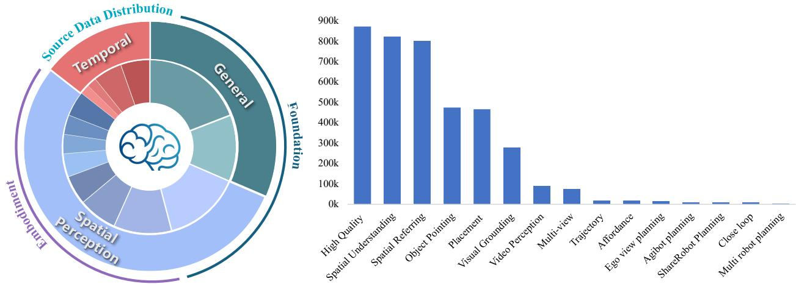

[← 返回 README](../README.md)

# 3. Training Data

> 来源: RoboBrain 2.0 Technical Report (Arxiv 2507.02029)

---

## 📄 原文

> 💡 **Section 概览**: 数据部分是本文最重要的贡献之一。训练数据分三大类：① 通用 MLLM VQA（873K 高质量样本）；② 空间数据（pointing、affordance、spatial understanding、spatial referring）；③ 时间数据（ego-view、ShareRobot、AgiBot、multi-robot、close-loop）。每类都有详细的数据构建 pipeline。

As shown in Figure 4, RoboBrain 2.0 is trained on a diverse and extensive dataset designed to enhance its capabilities in spatial understanding, temporal modeling and long-chain causal reasoning in embodied settings. The training data encompasses a wide range of modalities, including high-resolution images, multi-view inputs, video sequences, scene graph and natural language instructions. This comprehensive dataset is meticulously categorized into three primary types: general multimodal understanding, spatial perception, and temporal modeling, ensuring the model can effectively perceive, reason, and plan in complex physical environments.


*Figure 4: Training Data Distribution for RoboBrain 2.0. This figure illustrates the distribution of training data supporting RoboBrain 2.0's capabilities, including interactive reasoning with long-horizon planning and closed-loop feedback, spatial perception for precise point and bounding box prediction from complex instructions, and multi-agent collaboration tasks, which is meticulously categorized into three primary types: general multimodal understanding, spatial perception, and temporal modeling.*

> 💡 **Figure 4 批读**: 数据分布饼图，展示三大类数据的组成：
> ```
> 通用多模态理解:
> ├── LLaVA-665K → 531K 高质量样本
> └── LRV-400K → 342K 样本
>
> 空间感知:
> ├── Visual Grounding (152K 图, 86K 对话)
> ├── Object Pointing (190K + 347K QA)
> ├── Affordance (561K + 320K QA)
> ├── Spatial Understanding (826K 样本)
> └── Spatial Referring (802K 样本)
>
> 时间建模:
> ├── Ego-View Planning (50K)
> ├── ShareRobot Planning (1M QA)
> ├── AgiBot Planning (9,148 QA)
> ├── Multi-Robot Planning (44,142 样本)
> └── Close-Loop Interaction
> ```

---

### 3.1 General MLLM VQA

> 💡 **3.1 要点预览**: 873K 高质量通用 VQA 样本，来自 LLaVA-665K 和 LRV-400K 两个数据源。重点是数据清洗和格式化。

High Quality Data. The general training dataset for RoboBrain 2.0 includes 873K high-quality samples, primarily derived from LLaVA-665K [33] and LRV-400K [32], spanning standard Visual Question Answering(VQA), region-level queries, OCR-based VQA, and visual dialogues. (1) LLaVA-665K serves as the primary source and contains diverse VQA-style data, including standard VQA datasets, OCR-based questions, region-level queries, visual conversations, and language-only dialogues. To improve training efficiency, multiple question-answer(QA) pairs from the same image merge into single conversations; invalid ShareGPT [10] entries are filtered out, and overly long conversations (> 2048 tokens) are truncated (resulting in 40K valid samples). Specifically, A-OKVQA [54] samples are augmented by duplicating choices to balance multiple-choice formats, OCR-VQA [41] contributes 80K sampled conversations focused on scene text understanding, Visual Genome(VG) [27] provides dense object-level annotations limited to 10 entries per image with additional captions, and RefCOCO [76] dialogues are split into short multi-turn segments (< 10 exchanges). Language-only conversations, which are generally longer than visual ones, are sampled in single-modality batches to improve throughput by 25% without performance degradation. After removing bounding-box-dependent QA pairs, 531K high-quality samples are retained from this source. (2) LRV-400K is synthetically generated using GPT-4 [44] under a few-shot instruction-following setting. It produces 400K image-conditioned instructions across 16 vision-language tasks with textual answers. Unlike prior works that rely on sparse image captions, this dataset leverages the dense annotations in VG (e.g., bounding boxes, dimensions, and ~21 object regions per image). GPT-4 generates both declarative and interrogative prompts for each image, with 10 tasks randomly sampled per instance. After filtering out bounding-box-related QA pairs, 342K samples are selected for training.

> 💡 **3.1 小结**:
> ```
> 数据来源          过滤后样本数    关键处理
> LLaVA-665K  →    531K          合并同图QA、截断长对话、去除bbox QA
> LRV-400K    →    342K          GPT-4 合成、去除bbox QA
> 总计              873K
> ```
> - 技巧：单模态（纯语言）数据用独立批次训练，吞吐量提升 25%
> - 数据清洗很细致：去重、截断、格式化、过滤无效样本

---

### 3.2 Spatial Data

> 💡 **3.2 要点预览**: 空间数据是本文最大的数据贡献，包含五个子任务：visual grounding、object pointing、affordance、spatial understanding、spatial referring。

**Visual Grounding.** The visual grounding dataset is constructed to enhance multimodal understanding through precise object-level localization, leveraging the extensive annotations from LVIS [19]. We carefully curate 152K high-resolution images from LVIS, ensuring broad coverage of diverse object categories and complex visual scenes. Each object annotation is converted into standardized bounding box coordinates (x1, y1, x2, y2) representing the top-left and bottom-right corners, enabling consistent spatial referencing. To facilitate rich visual dialogue, we generated 86K conversational sequences, each containing multiple rounds of QA pairs that progressively explore visual relationships, attribute reasoning, and contextual understanding. The dataset maintains a balanced distribution across object categories while preserving challenging cases of occlusion, viewpoint variation, and rare instances to support robust visual grounding.

> 💡 **Visual Grounding 批注**: 152K 图来自 LVIS，86K 对话序列。核心是标准化 bbox 坐标 + 多轮渐进式 QA。

**Object Pointing.** The object pointing dataset is constructed to enable RoboBrain 2.0 to identify the locations of specified objects through pointing within an image. We leverage the Pixmo-Points [13] dataset, which includes 2.3M point annotations across 223K images as our data source. However, direct utilization of Pixmo-Points data for RoboBrain 2.0 training presents challenges due to densely repeated object instances (e.g., books on a shelf). To address this, we implement a two-step filtering process: (1) we discard annotations with more than ten labeled points to simplify training, and (2) we use GPT-4o [22] as a scene analyzer to select only indoor-relevant objects, such as kitchenware, furniture, and decorations, excluding irrelevant or outdoor scenes. This process yields 190K QA pairs for 64K images with reduced clutter, making the data more suitable for embodied contexts. To construct QA pairs for pointing tasks, we construct 28 human-designed templates, such as "Point out all instances of {label} in the image." or "Help me find {label} in the image by pointing to them." Here, {label} refers to object categories from the annotations. Templates are randomly selected to ensure linguistic diversity and improve the model's generalization ability in referencing tasks. For object reference pointing, we incorporate object reference data sourced from RoboPoint [77], which includes 347K QA annotations across 288K images. To address the potential issue of excessive points hindering training convergence, we randomly sample up to ten points per question. Additionally, the normalized coordinates are converted into absolute values to better support RoboBrain 2.0 training.

> 💡 **Object Pointing 批注**:
> ```
> 数据来源:
> ├── Pixmo-Points: 2.3M 点标注 / 223K 图 → 过滤后 190K QA / 64K 图
> └── RoboPoint: 347K QA / 288K 图
>
> 关键处理:
> ├── 过滤 >10 个点的标注（避免密集重复）
> ├── GPT-4o 过滤非室内场景
> ├── 28 个人工设计的 prompt 模板
> └── 坐标从归一化转换为绝对值
> ```

**Affordance.** The affordance dataset focuses on understanding object functionality and spatial vacant areas for placement. For object affordance recognition, we utilize part-level annotations from PACO-LVIS [51], covering 75 object categories and 200 part categories across 46K images. Bounding boxes and segmentation masks are extracted for both whole objects and their functional parts. These annotations are transformed into bounding box coordinates (x1, y1, x2, y2), serving as ground truth labels for affordance prediction tasks. Questions are constructed using GPT-4o [22] to query object functionality and part usage, e.g., "Which part of a handbag can be grasped to carry it?" for the handle of a handbag. For whole-object affordances, questions avoid naming the object directly, such as "What device can be moved to control the cursor on a screen?" for a mouse (computer equipment). This automatic process results in 561K QA pairs. For spatial affordance learning, we include region reference data from RoboPoint [77]. This dataset consists of 270K images with 320K QA pairs and 14 spatial relationship labels. Each annotation is converted into a set of absolute coordinates [(x1, y1), (x2, y2), ...], and ground truth points are resampled to a maximum of ten points per answer for optimization. This dataset enables RoboBrain 2.0 to reason about spatial affordances for object placement in real-world settings.

> 💡 **Affordance 批注**:
> ```
> 两个方向:
> ├── Object Affordance（物体功能识别）
> │   ├── PACO-LVIS: 75 物体类 × 200 部件类 / 46K 图
> │   ├── GPT-4o 生成功能性提问
> │   └── 561K QA pairs
> │
> └── Spatial Affordance（空间可放置区域）
>     ├── RoboPoint: 270K 图 / 320K QA / 14 种空间关系
>     └── 点重采样到最多 10 个/答案
> ```
> 设计巧妙：问题不直接说物体名，而是描述功能，迫使模型理解物体的使用方式。

**Spatial Understanding.** To enhance RoboBrain 2.0's 3D spatial reasoning, we present the Spatial Understanding Dataset, comprising 826K samples. This dataset emphasizes object-centric spatial attributes (e.g., position, orientation) and inter-object relations (e.g., distance, direction), covering both qualitative and quantitative aspects. It covers 31 distinct spatial concepts, substantially surpassing the ~15 typically found in previous datasets. We partially adopt the RefSpatial [81] pipeline to construct 2D web image and 3D video datasets via automated template- and LLM-based generation: (1) 2D web images aim to provide core spatial concepts and depth perception across diverse indoor and outdoor scenes. To bridge scale and category gaps between these domains, we utilize the large-scale OpenImage [28] dataset. Since direct 3D reasoning from 2D images is challenging, we convert them into pseudo-3D scene graphs. Specifically, after filtering 1.7M images to 466K, we first use RAM [79] for object category prediction and GroundingDINO [34] for 2D boxes Detection. Then we enhance using Qwen2.5-VL [50] and a heuristic method to generate hierarchical captions given the 2D bounding box, ranging from coarse (e.g., "cup") to fine-grained (e.g., "the third cup from the left"). This enables unambiguous spatial referring in cluttered environments and captures both coarse and fine-grained spatial references. Next, we use UniDepth V2 [48] and WildeCamera [84] for depth and camera intrinsics to enable 3D point cloud reconstruction. Finally, combining this with object boxes from GroundingDINO [34] and masks from SAM 2.1 [52], each scene graph includes object labels, 2D boxes, instance masks, and object-level point clouds, yielding axis-aligned 3D boxes. Object captions serve as nodes, and spatial relations form the edges. QA pairs are generated via templates and LLMs (e.g., QwQ [66]), including object-location questions derived from the hierarchical captions. (2) 3D scene-based videos integrates multimodal 3D scene understanding data from five original datasets: MMScan [38], 3RScan [69], ScanQA [3], SQA3D [39], and SpaceR [46]. We conduct template-based question filtering through rigorous data processing to ensure task relevance, perform multi-stage quality screening (e.g., consistency checks, outlier removal), and standardize all formats into a unified representation. This curation enables fine-grained environmental perception with enhanced reliability, supporting tasks ranging from object localization to complex spatial reasoning in 3D scenes. (3) 3D embodied videos focus on fine-grained spatial understanding in indoor environments. We leverage the CA-1M [29] dataset, filtering 2M frames to 100K high-quality ones. Compared to 2D, the availability of accurate 3D bounding boxes allows us to construct richer scene graphs with more diverse spatial relations, thereby generating more quantitative QA pairs (e.g., size, distances).

> 💡 **Spatial Understanding 批注** — 826K 样本，三条数据线:
> ```
> 线 1: 2D Web Images（伪3D场景图）
> ├── OpenImage: 1.7M → 466K 过滤
> ├── Pipeline: RAM → GroundingDINO → Qwen2.5-VL(层次化caption)
> ├── 深度: UniDepth V2 + WildeCamera → 3D 点云重建
> ├── 分割: SAM 2.1 → instance masks
> └── 输出: 伪3D场景图 + QA pairs（模板+LLM生成）
>
> 线 2: 3D Scene Videos
> ├── 5 个数据集整合: MMScan, 3RScan, ScanQA, SQA3D, SpaceR
> └── 模板过滤 + 多阶段质量筛选 + 格式统一
>
> 线 3: 3D Embodied Videos
> ├── CA-1M: 2M frames → 100K 高质量
> └── 准确的3D bbox → 更丰富的空间关系
> ```
> **核心创新**: 从2D图像构建伪3D场景图的pipeline——用深度估计+相机内参+分割来从单目2D图恢复3D结构。31个空间概念远超之前数据集的~15个。

**Spatial Referring.** After enhancing foundational 3D spatial understanding, we extend these capabilities to physical-world interactions by introducing the Spatial Referring Dataset [81], consisting of 802K samples. Unlike prior datasets in visual grounding or object pointing, which often deal with ambiguous or multiple referents, this dataset targets a single unambiguous target, aligning with robotic applications such as precise pick-and-place that demand accurate object identification and localization. Following the RefSpatial [81] construction pipeline, for location data, we sample caption-point pairs from scene graphs built on 2D web images (OpenImage [28]) and 3D embodied videos (CA-1M [29]), using hierarchical captions. For placement data, we leverage fully annotated 3D datasets to generate top-down occupancy maps encoding object positions, orientations, and metric spatial relations (e.g., "10cm right of the chair"), facilitating accurate spatial referring.

> 💡 **Spatial Referring 批注**: 802K 样本，来自 RefSpatial [81]。
> - 与 visual grounding 的区别：单一明确目标（不是多个候选）
> - 包含 location 和 placement 两种任务
> - placement 用 top-down occupancy map + 精确度量关系（如 "椅子右边10cm"）

> 💡 **3.2 小结**:
> | 子任务 | 数据量 | 核心来源 |
> |--------|--------|----------|
> | Visual Grounding | 152K图, 86K对话 | LVIS |
> | Object Pointing | 190K + 347K QA | Pixmo-Points, RoboPoint |
> | Affordance | 561K + 320K QA | PACO-LVIS, RoboPoint |
> | Spatial Understanding | 826K | OpenImage, MMScan, CA-1M 等 |
> | Spatial Referring | 802K | RefSpatial, OpenImage, CA-1M |
> 
> 空间数据总量约 **2.5M+ 样本**，是论文最大的数据贡献。

---

### 3.3 Temporal Data

> 💡 **3.3 要点预览**: 时间数据包含五个子集，覆盖第一人称规划、机器人操作规划、多机器人协作、闭环交互等场景。

**Ego-View Planning.** We construct Ego-View Planning dataset by partially processing the EgoPlan-IT [9] dataset, which contains 50K automatically generated samples. For each selected task instance, we extract multiple frames from prior actions to represent task progress, and one frame to capture the current viewpoint. To enhance linguistic variety, we use multiple prompt templates that describe the task goal, video context, and current observation. Each question includes the correct next action along with up to three distractor actions randomly sampled from negative examples. This setup supports multimodal instruction tuning with diverse visual and textual input, aimed at improving egocentric task planning performance.

> 💡 **Ego-View Planning 批注**: 50K 样本来自 EgoPlan-IT。多帧（历史+当前）+ 多选题格式（1正确+3干扰项）。

**ShareRobot Planning.** The ShareRobot dataset [23] is a large-scale, fine-grained resource for robotic manipulation, offering multi-dimensional annotations tailored for task planning. Its planning component provides detailed low-level instructions aligned with individual video frames, effectively transforming high-level task descriptions into structured and executable sub-tasks. Each data instance includes precise planning annotations to support accurate and consistent task execution. The dataset comprises 1M QA pairs from 51K instances, spanning 102 diverse scenes across 12 robot embodiments and 107 atomic tasks filtered according to the Open-X-Embodiment taxonomy [47]. All planning data were meticulously annotated by human experts following the RoboVQA [55] format, enabling models to learn robust multi-step planning strategies grounded in diverse real-world scenarios. The scale, quality, and diversity of ShareRobot help improve the model's ability to perform fine-grained reasoning and task decomposition in complex embodied environments.

> 💡 **ShareRobot Planning 批注**:
> ```
> 规模: 1M QA / 51K 实例 / 102 场景 / 12 种机器人 / 107 原子任务
> 特点: 人工标注、帧级对齐、高低级指令转换
> ```
> 这是 RoboBrain 1.0 [23] 团队自己的数据集，是时间数据中最大的。

**Agitbot Planning.** The AgiBot Planning dataset is a large-scale robotics task planning dataset built upon the AgiBot-World [6] dataset, comprising 9,148 QA pairs across 19 manipulation tasks with 109,378 first-person perspective images. Each sample contains 4-17 consecutive frames documenting task progression with multimodal conversational format. AgiBot-Planning provides step-by-step planning instructions that transform high-level goals into executable sub-tasks. Each data point includes current objectives, historical steps, and required subsequent actions. The dataset covers diverse scenarios from household refrigerator operations to supermarket shopping tasks across different environments. The meticulously crafted annotations use standardized conversational formats, enabling models to learn from varied real-world contexts. Through continuous visual sequences and fine-grained action plans, AgiBot-Planning enhances RoboBrain 2.0's ability to perform long-horizon task planning and spatial reasoning in complex embodied scenarios.

> 💡 **AgiBot Planning 批注**: 9,148 QA / 19 任务 / 109K 第一人称图像。每个样本4-17帧连续序列，覆盖家庭和超市场景。规模较小但场景丰富。

**Multi-Robot Planning.** The Multi-Robot Planning dataset is constructed by simulating collaborative task scenarios across three environments—household, supermarket, and restaurant—based on RoboOS [61]. Each sample is generated using structured templates that specify a detailed scene graph, robot specifications, and associated tool lists. For every scenario, we design high-level, long-horizon collaborative task goals that require coordination among multiple robots present in the scene, and generate corresponding workflow graphs that decompose the tasks into subtasks with detailed reasoning explanations. Based on these decompositions, we further generate agent-specific robotic tool plans that translate high-level task goals into precise low-level Observation-Action pairs for each subtask. Specifically, we define 1,659 types of multi-robot collaboration tasks across the three environments and produce 44,142 samples using DeepSeek-V3 [31].

> 💡 **Multi-Robot Planning 批注**:
> ```
> 三个环境: 家庭、超市、餐厅
> 任务类型: 1,659 种多机器人协作任务
> 样本数: 44,142（DeepSeek-V3 生成）
> 结构: scene graph + robot specs + tool lists → workflow graph → OA pairs
> ```
> 基于 RoboOS [61] 框架，是多机器人协作的核心数据。

**Close-Loop Interaction.** The Close-Loop Interaction dataset is designed to facilitate advanced embodied reasoning [80], featuring a large-scale collection of synthesized Observation-Thought-Action (OTA) trajectories that combine first-person visual observations with structured thought tokens. It spans 120 diverse indoor environments—including kitchens, bathrooms, bedrooms, and living rooms—containing over 4,000 interactive objects and receptacles. The dataset is constructed within the AI2Thor [25] simulator through a rigorous multi-stage pipeline based on Embodied-Reasoner [78], which includes: (1) crafting task instructions from constrained templates to ensure scene-appropriate validity; (2) deriving key action sequences from an object-affiliation graph encoding functional relationships; and (3) strategically incorporating search actions to emulate realistic exploration. To enrich the depth of reasoning, GPT-4o generates detailed thought processes—covering situational analysis, spatial reasoning, self-reflection, task planning, and verification—which are seamlessly integrated between observations and actions, forming coherent reasoning chains that guide models through complex, long-horizon interactive tasks.

> 💡 **Close-Loop Interaction 批注**:
> ```
> 环境: AI2Thor 模拟器, 120 室内环境, 4000+ 交互物体
> 数据格式: Observation-Thought-Action (OTA) 轨迹
> 构建 pipeline (Embodied-Reasoner):
> ├── 1. 约束模板生成任务指令
> ├── 2. 物体关联图 → 关键动作序列
> ├── 3. 搜索动作模拟真实探索
> └── 4. GPT-4o 生成详细思维过程
> ```
> OTA 格式是 CoT 在具身场景的应用——观察→思考→行动的循环。

---

## 💡 Section 总结

### 关键数字速查
| 数据类型 | 子集 | 样本量 |
|----------|------|--------|
| 通用 VQA | LLaVA + LRV | 873K |
| 空间 | Visual Grounding | 86K 对话 |
| 空间 | Object Pointing | 537K QA |
| 空间 | Affordance | 881K QA |
| 空间 | Spatial Understanding | 826K |
| 空间 | Spatial Referring | 802K |
| 时间 | Ego-View Planning | 50K |
| 时间 | ShareRobot Planning | 1M QA |
| 时间 | AgiBot Planning | 9.1K QA |
| 时间 | Multi-Robot Planning | 44.1K |
| 时间 | Close-Loop Interaction | 大规模 OTA |

### 核心洞察
1. **数据是核心贡献**: 空间数据 pipeline（从2D图构建伪3D场景图）是最重要的技术创新
2. **规模巨大**: Stage 1 用 4.8M 基础数据，空间数据总量 ~2.5M+
3. **自动化为主**: GPT-4o 和 DeepSeek-V3 大量用于数据生成和标注
4. **多数据集整合**: 整合了 10+ 公开数据集并统一格式
5. **闭环数据独特**: OTA 格式（观察-思考-行动）是具身 CoT 的关键
