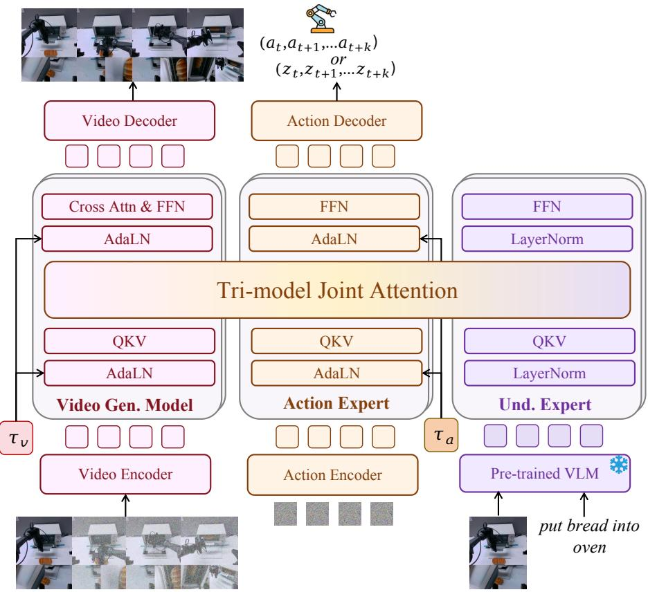
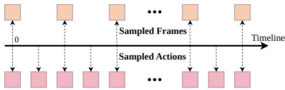
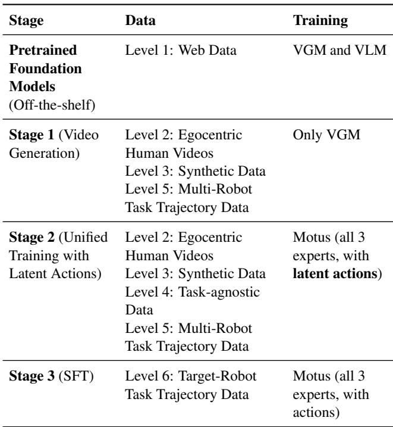
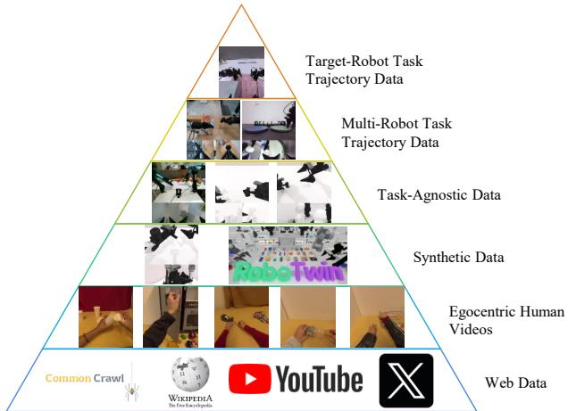

[← 返回 README](../README.md)

# 4. Methodology

## 📌 预览

Methodology 分三个子节：(1) **Motus 模型架构** —— 基于 MoT（Mixture-of-Transformers）融合预训练 VGM、VLM 和 Action Expert，通过 Tri-model Joint Attention 实现跨模态融合，用 UniDiffuser-like scheduler 统一 5 种模型模式；(2) **Latent Actions** —— 用光流作为万能运动表达，经 DC-AE 压缩到 14 维向量，混合自监督重建与弱监督 action 对齐；(3) **训练流程与数据** —— 三阶段渐进式训练 + 六层数据金字塔，从 web-scale 通用先验到 target-robot 专用微调。

---

## 4.1. Motus

### Model Architecture

To address the challenges of unifying multimodal generative capabilities outlined in Sec. 3, we propose Motus, a unified latent action world model. First, Motus is designed as a general generative model that jointly learns on heterogeneous multimodal data, thereby integrating the diverse capabilities (e.g., modeling 5 distributions) of a general-purpose system within a single network. Second, to circumvent the need for impractical amounts of aligned multimodal data, Motus leverages the rich, pretrained priors of existing foundation models. It integrates a pretrained VGM (generative expert), an understanding expert with pretrained VLM, and an action expert within a Mixture-of-Transformers (MoT) architecture (as shown in Fig. 1), effectively fusing their complementary strengths—encompassing scenes understanding, instructions interpreting, consequences prediction, future video imagination, and action planning—without requiring full end-to-end training from scratch.

> 💡 **Motus 的核心设计哲学**：不从头训练，而是"站在巨人肩膀上"。三个预训练专家各司其职：VGM（Wan 2.2 5B）负责生成视频，VLM（Qwen3-VL-2B）负责理解场景和指令，Action Expert 负责输出动作。MoT 架构把它们融合在一起，既保留各自的专业能力，又允许跨模态交流。

Unlike Unified World Models (UWMs) [64], which simply concatenate observation tokens and action tokens and process them through a single series of $`N`$ UWM blocks (containing self-attention and feed-forward network (FFN) layers), our approach leverages pretrained VLMs and VGMs by adopting a MoT structure. In our model, each expert maintains an individual Transformer module, while the multi-head self-attention layers are concatenated, i.e., Tri-model Joint Attention. This not only preserves distinct function roles across experts without causing task interference but also enables effective cross-modal feature fusion, encouraging diverse pretrained knowledge to complement one another.

> 💡 **MoT vs UWM 的关键区别**：UWM 把所有 token（observation + action）拼在一起过同一个 Transformer，所有模态共享同一套 FFN 和 self-attention。Motus 的做法不同：三个 expert 各自保留自己的 FFN（保持专业性），但 **multi-head self-attention 层是拼接/共享的**（Tri-model Joint Attention）。好处是：FFN 各干各的避免任务干扰，self-attention 共享实现跨模态信息融合。这就像三个专家各自做笔记（FFN），但在同一个会议室讨论（shared attention）。


*Figure 1. Motus Architecture. Here, $`a_t \ldots a_{t+k}`$ are actions, $`z_t \ldots z_{t+k}`$ are latent actions, and $`\tau_v`$ and $`\tau_a`$ are the rectified flow timesteps for the video generation model and the action expert, respectively.*

> 💡 **Figure 1 解读**：架构图展示了三个 Expert 如何通过 Tri-model Joint Attention 连接。注意 $`\tau_v`$ 和 $`\tau_a`$ 是两个独立的 timestep，这是 UniDiffuser scheduler 的关键——通过控制这两个值，同一个模型可以在不同模式之间切换。

### Rectified Flow Objectives

During training, Motus jointly predicts chunks of videos and actions with rectified flow-based objectives:

$$
l_{\mathrm{action}}^{\theta} = \mathbb{E}_{(o_{t:t+k}, a_{t+1:t+k}, \ell) \sim \mathcal{D}} \big\| v_a^{\theta} - (\epsilon_a - \pmb{a}_{t+1:t+k}) \big\|_2^2,
$$

$$
l_{\mathrm{obs}}^{\theta} = \mathbb{E}_{(o_{t:t+k}, a_{t+1:t+k}, \ell) \sim \mathcal{D}} \big\| v_o^{\theta} - (\epsilon_o - o_{t+1:t+k}) \big\|_2^2, \quad \tau_o \sim \mathcal{U}(0, T_\tau), \quad \epsilon_o \sim \mathcal{N}(\mathbf{0}, I)
$$

$$
l^{\theta} = l_{\mathrm{action}}^{\theta} + l_{\mathrm{obs}}^{\theta}.
$$

where $`o_t`$ is the condition frame, $`\pmb{O}_{t+1:t+k}, \pmb{a}_{t+1:t+k}`$ are the future observation and action chunks, $`\tau_a, \tau_o`$ are the rectified flow timesteps, $`\epsilon_a, \epsilon_o`$ are the sampled Gaussian noises, and $`v_a^{\theta}, v_o^{\theta}`$ are the velocities predicted by our model. $`l_{\mathrm{action}}^{\theta}`$ and $`l_{\mathrm{obs}}^{\theta}`$ are loss of observations and actions.

> 💡 **Rectified Flow 公式直觉解读**：
>
> - **输入**：当前帧 $`o_t`$、语言指令 $`\ell`$、被加噪的未来视频和动作
> - **计算**：模型预测"速度场" $`v_a^{\theta}, v_o^{\theta}`$，目标是匹配从噪声 $`\epsilon`$ 到真实数据 $`\pmb{a}, o`$ 的直线方向 $`(\epsilon - \text{data})`$
> - **输出**：video 和 action 两个 loss 的和
> - **直觉**：Rectified Flow 的核心思想是学习一个从噪声到数据的"直线路径"——模型需要预测沿这条直线走的速度。video 和 action 各自有自己的噪声和速度场，但在同一个模型里联合训练。

By allocating different timesteps and noise scales to videos and actions, respectively, Motus establishes a UniDiffuser-like scheduler to capture heterogeneous data distributions and adaptively switch between various embodied foundation models during inference (e.g., VLA, World Model, IDM, VGM, Joint Prediction). The resulting model understands scenes, follows instructions, predicts outcomes, imagines futures, and outputs actions—all within a unified multimodal architecture.

> 💡 **UniDiffuser Scheduler 的精妙之处**：通过控制 $`\tau_o`$ 和 $`\tau_a`$ 的取值，同一个模型可以变成 **5 种不同的模型**：
>
> | $`\tau_o`$ | $`\tau_a`$ | 等效模型 | 含义 |
> |:---:|:---:|----------|------|
> | 0 | 采样 | **VLA** | 给定真实视频，只预测 action |
> | 采样 | 0 | **IDM** | 给定真实 action，反推视频 |
> | 采样 | — | **VGM** | 只生成视频，不管 action |
> | — | 采样 | **World Model** | 给定 action 想象未来视频 |
> | 采样 | 采样 | **Joint** | 同时预测视频和 action |
>
> 这比 UWM 的做法更优雅：UWM 需要用 mask 来实现模式切换，而 Motus 直接通过 timestep 值来控制。$`\tau = 0`$ 意味着"这个模态不加噪 = 给定真实值"，$`\tau > 0`$ 意味着"这个模态需要从噪声中去噪 = 需要预测"。

### Action-Dense Video-Sparse Prediction


*Figure 2. Action-Dense Video-Sparse Prediction. The sampling rates for video frames and actions differ.*

Since our model builds upon the widely cited action-chunking technique, Motus needs to predict a chunk of future video and action sequences $`\pmb{O}_{t+1:t+k}, \pmb{a}_{t+1:t+k}`$. This leads to several issues: (1) low training and inference efficiency, (2) redundant video frame predictions, and (3) an imbalance in the Tri-modal Joint Attention mechanism—where the number of video tokens significantly exceeds that of action tokens. This imbalance causes the model to overfit to video prediction, thereby weakening its action prediction capability. To address these problems, we propose an Action-Dense Video-Sparse Prediction strategy, as shown in Fig. 2. During both training and inference, we downsample the video frames so that the number of video tokens and action tokens remains balanced—for example, by setting the video frame rate to one-sixth of the action frame rate.

> 💡 **Action-Dense Video-Sparse 的三重动机**：
>
> 1. **效率**：视频帧的 token 数量远大于 action token（一帧图像 = 几百个 patch token，一步 action = 十几维向量）。全帧率预测视频太昂贵。
> 2. **冗余**：相邻视频帧之间变化很小（5Hz 下每帧间隔 0.2 秒，场景变化微乎其微），但动作需要高频控制（30Hz）。
> 3. **注意力失衡**：如果 video token 远多于 action token，Tri-model Joint Attention 会被 video 主导，模型过拟合于视频预测而忽略 action。
>
> **解决方案**：视频帧率 = action 帧率的 1/6。例如 8 帧视频 @ 5Hz 对应 48 个 action @ 30Hz。这样 video token 和 action token 数量大致均衡，模型可以平等地关注两种模态。

### Experts Details

For the generative expert, we employ Wan 2.2 5B [42] as the video foundation model for its accessibility and ease of use. We extend its self-attention context to create a cross-modal Tri-model Joint Attention mechanism. For the action expert, we construct a Transformer block of the same depth as Wan. Each block comprises AdaLN for injecting rectified flow timesteps, a Feed-Forward Network (FFN), and the Tri-model Joint Attention for cross-expert interaction. We select Qwen3-VL-2B [2, 3, 44] for our understanding expert due to its inherent capabilities in 3D grounding, spatial understanding, and precise object localization, which are crucial for robotic manipulation. The input to this expert is taken from the last-layer corresponding tokens of the VLM. The understanding expert itself consists of several Transformer blocks, each containing Layer Normalization, an FFN, and the Tri-model Joint Attention.

> 💡 **三个 Expert 的选型逻辑**：
>
> | Expert | 选用模型 | 选择理由 | 核心组件 |
> |--------|---------|---------|---------|
> | Generative Expert | Wan 2.2 5B | 开源可用、视频生成质量好 | 原始 self-attention 扩展为 Tri-model Joint Attention |
> | Action Expert | 新建 Transformer（同深度） | 需要与 VGM 对齐的结构 | AdaLN（注入 timestep）+ FFN + Joint Attention |
> | Understanding Expert | Qwen3-VL-2B | 3D grounding + 空间理解 + 物体定位能力强 | LayerNorm + FFN + Joint Attention |
>
> **关键细节**：Action Expert 的深度与 Wan 相同（保证每层都能做 Joint Attention），但用 AdaLN 注入 rectified flow timestep（因为 action 是扩散过程的一部分）。Understanding Expert 的输入是 VLM 最后一层对应 token 的特征——这意味着 VLM 的"理解"先在自己的网络里完成，然后再送入 Joint Attention 与其他专家交流。

---

## 4.2. Latent Actions

We further address Challenge 2 to leverage large-scale heterogeneous data by learning generalizable action patterns directly from visual dynamics. Specifically, we introduce latent actions that encode the motion learned directly from pixels. These latent actions allow the model to absorb motion knowledge from various sources such as internet videos, egocentric human demonstrations, and multi-robot trajectories, thereby strengthening the pretraining of action expert even on data without explicit action labels.

> 💡 **Latent Action 的核心问题**：互联网上有海量视频数据，但没有 action 标注。如何利用这些数据训练 Action Expert？答案是：从视频的视觉动态中提取一个"隐式动作"表示，作为 action 的代理信号。

### Optical Flow Based Representation

We adopt optical flow as a natural representation of motion, which captures pixel-level displacements between consecutive frames. Specifically, optical flows are computed by DPFlow [33] and then converted into RGB images. To compress this high-dimensional representation into a control-level space, we employ a deep convolutional variational autoencoder (DC-AE [13]) that reconstructs the flow while encoding it into four 512-dimensional tokens. A lightweight encoder then projects these concatenated $`4 \times 512`$ features into a 14-dimensional vector, roughly matching the scale of typical robot action spaces. The overall architecture is shown in Figure 3.

> 💡 **Latent Action 的完整 pipeline**：
>
> ```
> 连续帧 → DPFlow 计算光流 → 光流转 RGB 图 → DC-AE 压缩 → 4×512 tokens → 轻量 encoder → 14 维向量
> ```
>
> **为什么选光流？** 光流是像素级的运动描述（"每个像素从哪到哪"），是最直接、最通用的运动表达。不管是机械臂、人手还是无人机，执行同一任务时物体的光流模式是相似的 —— 这天然支持跨 embodiment 的迁移。
>
> **为什么压缩到 14 维？** 典型机器人的 action space 是 6-14 维（3D 位移 + 旋转 + 夹爪等）。将 latent action 设计为 14 维，维度上与真实 action 自然对齐，后续映射更容易。这个"维度对应"的设计非常聪明。

This dimensional correspondence ensures that the latent representation can align naturally with real robotic controls and act as a bridge between perception and action.


*Figure 3. The Latent Action VAE.*

> 💡 **Figure 3 解读**：VAE 架构包含 encoder 和 decoder 两部分。Encoder 路径：光流 RGB 图 → DC-AE → 4×512 tokens → lightweight encoder → 14 维 latent action $`z`$。Decoder 路径：$`z`$ → 重建光流。同时，对于有 action 标注的数据，还有一个额外的 alignment loss 把 $`z`$ 拉向真实 action $`a`$。

### Training and Distribution Alignment

To help align the latent space to realistic action space, we incorporate task-agnostic data following AnyPos [39]. Specifically, task-agnostic data uses Curobo to collect image-action pairs by randomly sampling the target robot's action space in a task-agnostic manner. This data provides additional real action supervision, helping the VAE learn an embedding that reflects feasible motor behaviors and anchors the latent actions to the true control distribution.

> 💡 **AnyPos 数据的巧妙用法**：Task-agnostic 数据是让机器人随机运动采集的（不执行任何特定任务），因此收集成本极低。虽然这些数据没有任务意义，但它们提供了真实的 image-action 对，可以作为"锚点"把 latent action 空间拉向真实 action 分布。这就像给一个只看过视频的人提供一些真实的运动体验，帮助TA 建立视觉运动和实际控制之间的映射。

During training, we mix $`90\%`$ unlabeled data for self-supervised reconstruction with $`10\%`$ labeled trajectories for weak action supervision, where the labeled portion includes both task-agnostic data and standard robot demonstrations. Dimensional correspondence and weak action supervision jointly drive the latent-action distribution to align with the real action distribution, allowing motion priors learned from videos to naturally map to executable controls.

> 💡 **90/10 混合训练策略**：
>
> | 数据类型 | 比例 | 训练信号 | 数据来源 |
> |---------|------|---------|---------|
> | 无标签数据 | 90% | 自监督光流重建 | 互联网视频、人类演示等 |
> | 有标签数据 | 10% | 光流重建 + action 对齐 | Task-agnostic 数据 + 机器人演示 |
>
> 这个比例设计很实际：大量无标签数据学习通用运动模式，少量有标签数据负责"校准"。因为维度已经对齐（都是 14 维），只需少量监督就能让 latent action 与真实 action 对齐。

### Loss Function

The total loss combines reconstruction, alignment, and KL regularization:

$$
\mathcal{L} = \mathcal{L}_{\mathrm{recon}} + \lambda_a ||a_{\mathrm{real}} - a_{\mathrm{pred}}||^2 + \beta \mathcal{L}_{\mathrm{KL}},
$$

where $`\mathcal{L}_{\mathrm{recon}}`$ minimizes flow-reconstruction error, the second term aligns latent and real actions, $`\mathcal{L}_{\mathrm{KL}}`$ regularizes the latent space; $`\lambda_a`$ and $`\beta`$ are hyperparameters.

> 💡 **三项 loss 各自的作用**：
>
> | Loss 项 | 公式 | 作用 | 直觉 |
> |---------|------|------|------|
> | $`\mathcal{L}_{\mathrm{recon}}`$ | 重建光流 | 保证 latent action 编码了完整的运动信息 | "你能从 z 还原出原始运动吗？" |
> | $`\lambda_a \|\|a_{\mathrm{real}} - a_{\mathrm{pred}}\|\|^2`$ | latent 与真实 action 对齐 | 把 latent 空间拉向可执行的控制空间 | "你的 z 和真实 action 有多像？" |
> | $`\beta \mathcal{L}_{\mathrm{KL}}`$ | KL 正则化 | 防止 latent 空间退化、保证平滑性 | VAE 的标准正则项 |
>
> 注意：$`\lambda_a`$ 项只对有 action 标注的 10% 数据生效（无标签数据没有 $`a_{\mathrm{real}}`$）。

---

## 4.3. Model Training and Data

### Motus Training

Motus is trained in three structured stages (Tab. 1) to progressively integrate physical interaction priors from diverse datasets into a policy transferable to a target robot. Each stage addresses a key challenge:

**Stage 1: Learning Visual Dynamics.** To anchor the model in realistic physical interactions, we first adapt the Video Generation Model (VGM) using multi-robot trajectories and human videos. This enables the VGM to generate plausible future video sequences of tasks from a language instruction and an initial image.

> 💡 **Stage 1 的逻辑**：VGM（Wan 2.2）在互联网视频上预训练过，但它见的主要是"人类世界"的视频。Stage 1 用机器人轨迹和人类操作视频对它微调，让它学会"机器人操作场景"的视觉动态规律。这一阶段只训练 VGM，不涉及 action。

**Stage 2: Learning Action Representations.** To bridge visual forecasts with control, we pretrain the entire Motus model (VLM frozen) on videos, language, and latent actions. This stage initializes the action expert by embedding knowledge of motion and interaction into the latent action space.

> 💡 **Stage 2 的逻辑**：现在 VGM 已经会"想象未来"了，Stage 2 要教模型"想象的同时出动作"。这一阶段训练完整的 Motus（三个 Expert），但使用的是 latent action 而非真实 action —— 因为大部分训练数据没有 action 标注。VLM 冻结是因为它的理解能力已经很好，不需要改动，改了反而可能退化。

**Stage 3: Specializing for the Target Robot.** We finalize the model by fine-tuning it on target-robot data, ensuring that the acquired priors are fully adapted to the specific embodiment's dynamics and kinematics.

> 💡 **Stage 3 的逻辑**：前两个阶段学到的是"通用"先验（跨 embodiment 的视觉动态和运动模式），Stage 3 用目标机器人的真实数据做 SFT（Supervised Fine-Tuning），把 latent action 映射到该机器人的真实 action 空间。
>
> **三阶段训练的递进逻辑**：**先学看**（视频动态）→ **再学想象+动作**（latent action）→ **最后适配具体机器人**（真实 action）。每一阶段都建立在前一阶段的基础上，逐步从通用走向专用。


*Table 1. Motus Training.*

> 💡 **Table 1 解读——三阶段的数据和训练范围**：
>
> | 阶段 | 训练什么 | 数据层级 | 关键特点 |
> |------|---------|---------|---------|
> | 预训练（现成） | VGM + VLM | Level 1: Web Data | 直接用现成模型 |
> | Stage 1 | 只训 VGM | Level 2 + 3 + 5 | 人类视频 + 合成数据 + 多机器人轨迹 |
> | Stage 2 | 三个 Expert（VLM 冻结） | Level 2 + 3 + 4 + 5 | 加入 task-agnostic 数据，用 latent action |
> | Stage 3 | 三个 Expert | Level 6 | 只用目标机器人数据，用真实 action |
>
> 注意 Stage 2 新增了 Level 4（task-agnostic data）—— 这正是 latent action VAE 对齐所需的带 action 标注的数据。

### Data

To equip robots with generalizable manipulation skills, we leverage large-scale multimodal data that encapsulates rich prior knowledge—from semantic understanding and physical reasoning to spatiotemporal dynamics and decision-making. As outlined in Section 3, embodied data inherently spans multiple modalities: language $`\ell`$, image $`o`$ and action $`a`$. By considering the presence or absence of each modality, we systematically identify all meaningful data types:

- **Language + Image + Action**: robot trajectories (e.g., used in VLAs), $`\{\ell, o_1, a_1, \ldots, o_N, a_N\}`$.
- **Language + Image**: video sequences $`\{\ell, o_1, \ldots, o_N\}`$ or image-text pairs $`\{(o, \ell)\}`$.
- **Image + Action**: task-agnostic interaction data $`\{(o_1, a_1, \ldots, o_i, a_i)\}`$.
- **Language-only**: textual corpora $`\{\ell\}`$.

We exclude data lacking visual modality (e.g., language + action) as it is unsuitable for visuomotor policy learning. The remaining types form the complete spectrum of useful sources for embodied policy acquisition.

> 💡 **数据分类的完备性分析**：三种模态（language, image, action）的所有组合中，只排除了没有视觉模态的（因为 visuomotor policy 的核心是"看" → "做"）。这种从组合论角度穷举数据类型的做法很系统，确保没有遗漏。

To structure this diversity, we introduce the embodied data pyramid (Fig. 4), which organizes data types hierarchically by richness and policy relevance.


*Figure 4. The Embodied Data Pyramid categorizes data into six levels, from Level 1 at the base to Level 6 at the top. Data quantity decreases from bottom to top, while data quality increases. The order of Levels 3 and 4 may sometimes vary.*

> 💡 **六层数据金字塔详解**：
>
> | 层级 | 数据类型 | 模态 | 数量 | 质量 | 用于阶段 |
> |------|---------|------|------|------|---------|
> | Level 1（底层） | Web Data | Language + Image | 海量 | 最低（与机器人无关） | 预训练 VGM + VLM |
> | Level 2 | Egocentric Human Videos | Language + Image | 大量 | 较低（有操作但无 action） | Stage 1, 2 |
> | Level 3 | Synthetic Data | Language + Image (+ Action) | 中量 | 中等（仿真环境） | Stage 1, 2 |
> | Level 4 | Task-agnostic Data | Image + Action | 中量 | 中等（有 action 但无任务） | Stage 2 |
> | Level 5 | Multi-Robot Trajectory Data | Language + Image + Action | 少量 | 较高（多种机器人） | Stage 1, 2 |
> | Level 6（顶层） | Target-Robot Trajectory Data | Language + Image + Action | 最少 | 最高（目标机器人） | Stage 3 |
>
> **金字塔的核心思想**：从下到上数据量递减但质量递增。底层提供通用先验（语义理解、物理常识），顶层提供专用知识（特定机器人的动力学和运动学）。Motus 的训练流程正是沿着金字塔从下往上走：先用底层大数据建立通用能力，再用顶层精品数据适配具体机器人。

Our framework effectively integrates and aligns all six data levels—from large-scale but indirect web sources to targeted robot demonstrations—across tailored training stages (Tab. 1), unifying heterogeneous datasets within a single, cohesive model architecture.

> 💡 **数据金字塔与训练阶段的对应关系**：
>
> ```
> Level 1 (Web)          ──→ 预训练（现成模型直接用）
> Level 2 (Human Video)  ──→ Stage 1 + Stage 2（学视觉动态 + 学 latent action）
> Level 3 (Synthetic)    ──→ Stage 1 + Stage 2
> Level 4 (Task-agnostic)──→ Stage 2（对齐 latent action 与真实 action）
> Level 5 (Multi-Robot)  ──→ Stage 1 + Stage 2（跨机器人泛化）
> Level 6 (Target-Robot) ──→ Stage 3（最终微调）
> ```
>
> 每一层数据都在最合适的训练阶段被使用，没有浪费。

---

## 📊 Section 4 总结

### 4.1 Motus 架构要点

| 设计选择 | 具体方案 | 解决的问题 |
|---------|---------|-----------|
| MoT 架构 | 三个 Expert 各有 FFN，共享 self-attention | 保持专业性 + 跨模态融合 |
| 预训练初始化 | VGM=Wan 2.2 5B, VLM=Qwen3-VL-2B | 避免从头训练，利用已有先验 |
| Rectified Flow | 联合预测 video chunk + action chunk | 统一的生成框架 |
| UniDiffuser Scheduler | 不同 $`\tau_o, \tau_a`$ 控制模式切换 | 一个模型 = 5 种模型 |
| Action-Dense Video-Sparse | 视频帧率 = action 帧率 / 6 | 效率 + 平衡注意力 |

### 4.2 Latent Action 设计要点

| 设计选择 | 具体方案 | 解决的问题 |
|---------|---------|-----------|
| 运动表达 | 光流（DPFlow 计算） | 跨 embodiment 的通用运动语言 |
| 压缩方式 | DC-AE → 4×512 → 14 维 | 与真实 action 维度对齐 |
| 训练数据 | 90% 无标签 + 10% 有标签 | 利用海量无标签视频 |
| 分布对齐 | task-agnostic data + weak supervision | 锚定到真实 action 空间 |

### 4.3 训练流程要点

| 阶段 | 目标 | 训练模块 | 数据 |
|------|------|---------|------|
| Stage 1 | 学视觉动态 | VGM only | Level 2+3+5 |
| Stage 2 | 学动作表示 | Full Motus (VLM frozen) | Level 2+3+4+5 |
| Stage 3 | 适配目标机器人 | Full Motus | Level 6 |

> 💡 **一句话总结 Section 4**：Motus 通过 MoT 架构融合三个预训练专家（VGM + VLM + Action Expert），用光流 latent action 解决无标注数据利用问题，通过三阶段渐进式训练从 web-scale 通用先验逐步走向 target-robot 专用策略。关键创新在于：(1) Tri-model Joint Attention 实现"各司其职 + 协同融合"；(2) UniDiffuser Scheduler 实现"一个模型 = 五种模型"；(3) 光流 latent action 实现"跨 embodiment 的运动对齐"。
