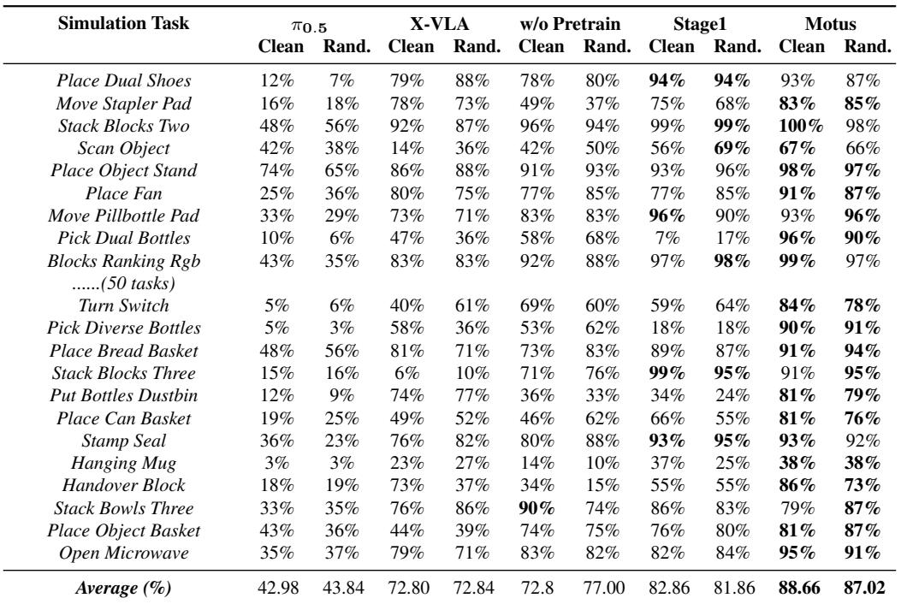
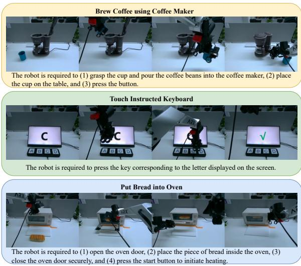
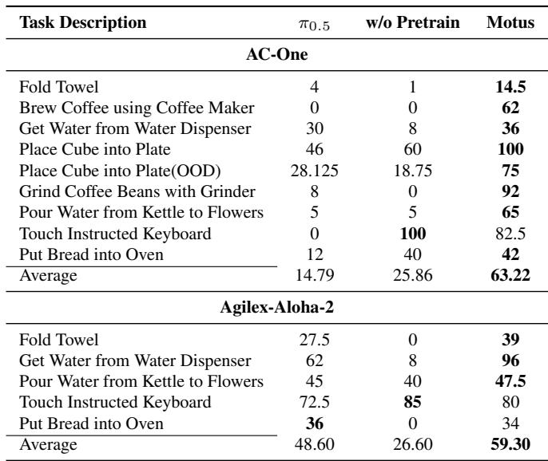
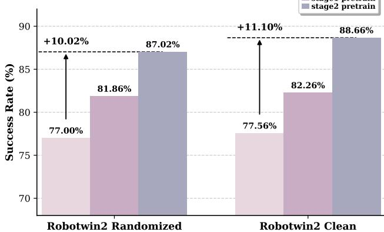

[← 返回 README](../README.md)

# 5. Experiments

## 📌 预览

实验覆盖仿真（RoboTwin 2.0, 50 tasks）和真实世界（AC-One + Agilex-Aloha-2 双平台），全部采用 multi-task joint training + 统一 40k finetune steps。核心结论：Motus 在仿真上超 $`\pi_{0.5}`$ +45%、超 X-VLA +15%；在真实世界超 $`\pi_{0.5}`$ +11~48%。消融实验证明 Stage 2（latent action 预训练）是性能飞跃的关键。

---

## 5.1 Baselines

对比的 baseline 包括四类：

| Baseline | 说明 |
|----------|------|
| **$`\pi_{0.5}`$** | 当前最强 VLA 之一，PaliGemma 2B + action expert，大规模预训练 |
| **X-VLA** | 统一具身模型，InternVL2-2B + DiT action head，支持跨具身泛化 |
| **From-scratch** | 与 Motus 同架构但从头训练，不加载任何预训练权重 |
| **Stage-1-only** | 只完成 Stage 1（VGM 预训练），跳过 Stage 2（latent action 预训练），直接进入 Stage 3 SFT |

> 💡 **Baseline 选择的深意**：
>
> - $`\pi_{0.5}`$ 和 X-VLA 代表当前 SOTA 具身模型的两条路线（VLA 路线 vs 统一路线）
> - From-scratch 是最关键的消融：**架构相同但没有预训练先验**，证明 Motus 的优势来自预训练而非架构
> - Stage-1-only 进一步分离 VGM 预训练和 latent action 预训练各自的贡献

---

## 5.2 Simulation: RoboTwin 2.0

**实验设置**：
- **环境**：RoboTwin 2.0 benchmark，包含 50 个任务
- **训练方式**：multi-task joint training（所有任务一起训练）
- **Finetune steps**：统一 40k steps —— 所有方法在相同训练量下对比
- **评估**：Clean（标准背景）和 Rand（随机背景）两种设置

> 💡 **实验设置的公平性**：所有模型只 finetune 40k steps，考验的不是谁训得久，而是**预训练质量**的差异。这正是 Motus 的优势所在——三阶段预训练赋予的初始化远优于其他方法。

### Table 2: RoboTwin 2.0 仿真结果

**关键数字对比**：

| 方法 | Clean (%) | Rand (%) |
|------|-----------|----------|
| $`\pi_{0.5}`$ | 42.98 | 43.84 |
| X-VLA | 72.80 | 72.84 |
| **Motus** | **88.66** | **87.02** |

- **vs $`\pi_{0.5}`$**：+45.68% (Clean), +43.18% (Rand)
- **vs X-VLA**：+15.86% (Clean), +14.18% (Rand)

> 💡 **为什么 Motus 优势如此巨大？**
>
> 看 Table 2 中具体任务的得分分布，Motus 在困难任务上优势最大：
> - **Pick Dual Bottles、Turn Switch、Put Bottles Dustbin** 等需要**精确操控 + 长时序规划**的任务，$`\pi_{0.5}`$ 几乎完全失败，而 Motus 成功率很高
> - 这说明 Motus 的 latent action 预训练赋予了更好的**运动先验**，在需要精细控制的任务中尤为明显
>
> 另一个观察：Clean 和 Rand 的性能差距很小（88.66% vs 87.02%），说明 Motus 对视觉干扰的鲁棒性很强——VGM 预训练带来的视觉先验起了作用。

---

## 5.3 Real-World Experiments

### 实验平台

| 平台 | 硬件 | 特点 |
|------|------|------|
| **AC-One** | 单臂机器人 | 7-DoF，精细操作 |
| **Agilex-Aloha-2** | 双臂机器人 | 双 7-DoF，双手协作 |

### 任务设计

任务覆盖 5 大能力维度：

| 能力维度 | 示例任务 | 挑战 |
|----------|---------|------|
| 空间理解 (Spatial Understanding) | Pick & Place | 理解物体位置和空间关系 |
| 可变形物体 (Deformable Objects) | Fold Towel | 处理柔性物体 |
| 精确流体 (Precision Fluid) | Brew Coffee | 液体操控 + 精确倒注 |
| 视觉理解 (Visual Understanding) | Sort by Color | 颜色/形状识别 + 决策 |
| 长时序 (Long-horizon) | Grind Coffee | 多步骤顺序执行 |

**训练数据**：每个任务 100 条轨迹，multi-task joint training

### Figure 5: 真实世界任务定义

### Table 3: 真实世界结果

**平台级对比**：

| 平台 | Motus (%) | $`\pi_{0.5}`$ (%) | 提升 |
|------|-----------|-------|------|
| AC-One | **63.22** | 14.79 | **+48.43%** |
| Agilex-Aloha-2 | **59.30** | 48.60 | **+10.70%** |

> 💡 **真实世界实验的关键发现**：
>
> **AC-One 上优势压倒性（+48%）的原因**：
> - Brew Coffee（$`\pi_{0.5}`$: 0% → Motus: 62%）和 Grind Coffee（$`\pi_{0.5}`$: 8% → Motus: 92%）这两个**长时序 + 精确操控**任务提升最大
> - $`\pi_{0.5}`$ 在这类需要多步规划的任务上几乎无法完成，而 Motus 的 world model + latent action 预训练赋予了长时序规划能力
>
> **Agilex-Aloha-2 上差距较小（+11%）的原因**：
> - 双臂任务的训练数据质量更高（Aloha 平台已有较多公开数据）
> - 但 Motus 在每个任务上仍然持平或领先，没有明显短板
>
> **跨平台一致性**：Motus 在两个截然不同的硬件平台上都取得最佳，证明了跨具身泛化能力

---

## 5.4 Ablation Study

消融实验对比三种配置：

| 配置 | 说明 | 预训练阶段 |
|------|------|-----------|
| **w/o Pretrain** (From-scratch) | 同架构从头训练 | 无 |
| **Stage 1 only** | 仅 VGM 预训练 | Stage 1 |
| **Motus (Full)** | 完整三阶段 | Stage 1 + Stage 2 |

### Figure 6: 消融实验结果

> 💡 **消融实验的关键发现**：
>
> **Stage 1 vs From-scratch**：Stage 1（VGM 预训练）已经带来显著提升
> - 说明视频生成的预训练先验（物理交互知识、场景理解）对具身任务有用
>
> **Motus vs Stage 1 only**：Stage 2（latent action 预训练）带来额外 +5~6% 的提升
> - 这是最关键的发现：**latent action 预训练是从"好"到"优"的关键飞跃**
> - Stage 1 给了模型"看"的能力，Stage 2 给了模型"动"的先验
> - 光流驱动的 latent action 成功将海量无标注视频中的运动知识迁移到了动作预测上
>
> **总结**：两个预训练阶段都不可或缺，但 Stage 2 的边际贡献更高——它解决的是**从视觉先验到运动先验**的鸿沟。

---

## 📊 实验总结表

| 维度 | 关键结论 |
|------|---------|
| **仿真 (RoboTwin 2.0)** | 88.66% (Clean)，超 $`\pi_{0.5}`$ +45%，超 X-VLA +15% |
| **真实世界 (AC-One)** | 63.22%，超 $`\pi_{0.5}`$ +48%，长时序任务提升最大 |
| **真实世界 (Aloha-2)** | 59.30%，超 $`\pi_{0.5}`$ +11%，双臂场景稳定领先 |
| **消融：预训练效果** | From-scratch → Stage 1 → Full，每阶段都有显著提升 |
| **消融：关键阶段** | Stage 2（latent action）是性能飞跃的关键，+5~6% |
| **鲁棒性** | Clean vs Rand 差距仅 1.6%，视觉干扰鲁棒 |
| **跨平台泛化** | 单臂 + 双臂两个不同平台均取得最佳 |
