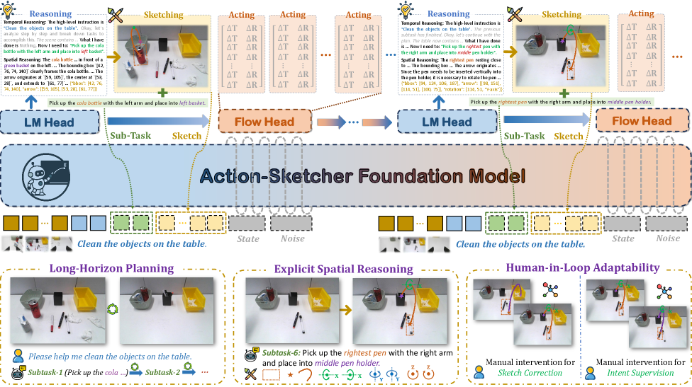

[← 返回 README](../README.md)

# I. Introduction

## 📌 预览
Introduction 揭示了长时域操作的两大核心瓶颈——空间侧的语言-动作 grounding 脆弱、时序侧的 human-in-loop 协调薄弱——并引出 Visual Sketch + Action-Sketcher 的动机。

---

*Figure 1: Overview of Action-Sketcher. 框架在 See-Think-Sketch-Act 循环中运行，基础模型先进行时序/空间推理，将高层指令分解为子任务并生成对应的 Visual Sketch。Sketch 由点、框、箭头组成，作为显式可读计划引导底层 policy 生成动作序列。实现三个能力：（左下）长时域规划任务分解，（中下）显式空间推理将语言 grounding 到场景几何，（右下）通过直接修改 Sketch 实现 human-in-loop 交互。*

> 💡 **Figure 1 批读**:
> - 这张图是整篇论文最核心的概览，清晰展示了 See-Think-Sketch-Act 工作流
> - 关键设计：Sketch 是"渲染在当前视图上的稀疏几何原语"，而非轨迹预测
> - 三个能力直接对应论文解决的三个问题：时序、空间、可交互性

---

Robotic manipulation is moving beyond short, single-step primitives toward long-horizon, open-world tasks in which goals, layouts, and human preferences evolve over time. In these settings, an agent must not only see and act but also maintain an interpretable decision chain that remains reliable under shifting spatial relations and temporal plans.

> 💡 **批注**: 论文的大背景——机器人任务正在从短时单步向长时开放世界演进，这要求系统具备可解释的决策链。

---

**两大核心瓶颈**：

**空间侧**：language-to-action grounding 脆弱 — 自然语言经常是模糊的（同一场景多个杯子时"把茶倒进杯子"指哪个？）或欠规格的（"把书放在杯子左边"，具体位置未定义）。必须通过显式视觉 Sketch（区域高亮、关键点、关系箭头）来消解引用歧义。

**时序侧**：human-in-loop 协调薄弱 — 实时交互受限，可解释的规划产物很少暴露出来，导致小错误无声传播。

> 💡 **批注**: 这两个瓶颈分析非常精准。
> - 空间问题：VLA 知道"往左放"但不知道具体坐标
> - 时序问题：计划在隐层，一旦出错人无法介入

---

Recent VLA models have made notable progress in mapping observations and language directly to actions. However, because plan intent is largely embedded in latent representations, these models struggle with task decomposition and causal explanation, both of which are critical for long-horizon operation in dynamic scenes.

Hierarchical VLAs attempt to address these challenges with planner-controller systems, yet their reasoning is often instantaneous and lacks persistent modeling of global intent (e.g. evolving human goals, emerging errors, and prior states).

> 💡 **批注**: 
> - 端到端 VLA：计划隐藏 → 无法分解任务
> - 层级 VLA：有 planner-controller 但推理是瞬时的，缺乏对全局意图的持久建模
> - think-before-act 变体（EO-1, OneTwoVLA）：中间表达是纯文本 → 空间引用消歧仍是隐式的

---

**论文贡献总结**：

1. **Visual Sketch 形式化**：共同 grounding 的显式空间意图界面，渲染点、框、箭头，消歧在哪/如何操作，作为高层推理与底层控制的可验证契约
2. **Action-Sketcher 框架**：See→Think→Sketch→Act 循环，由 token-gated 状态协调推理/Sketch 生成修正/动作合成之间的自适应切换，支持实时中断处理、错误检测和 sketch 层级纠正
3. **数据集 + 训练方案**：交错序列对齐 + 语言-to-Sketch 一致性 + 模仿学习 + sketch-to-action 强化，验证了长时域成功率、鲁棒性和可解释性的提升
