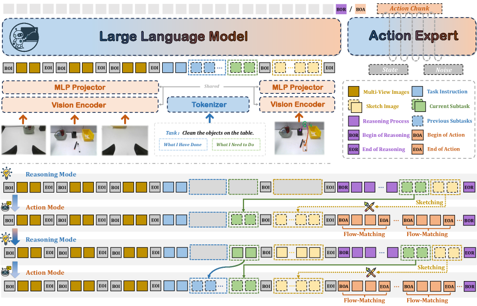
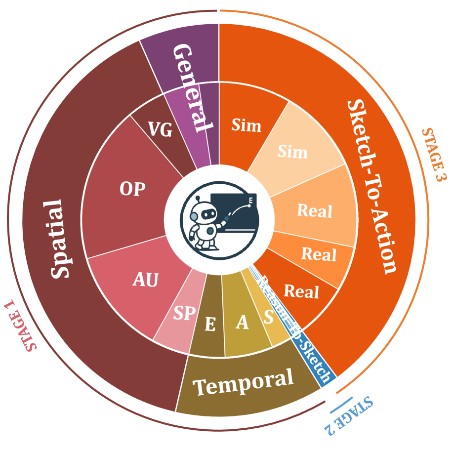

[← 返回 README](../README.md)

# III. Method

## 📌 预览
方法分两部分：(1) Visual Sketch 的形式化定义（点/框/箭头的数学表达）；(2) Action-Sketcher 完整框架（See-Think-Sketch-Act 流水线 + 模型结构 + 多阶段训练）。

---

## 3.1 Visual Sketch：显式空间意图

*Figure 2: Action-Sketcher 详细架构。模型运行事件驱动循环：(i) 总结下一个子任务，(ii) 生成紧凑的 Visual Sketch（点、框、箭头、关系），外显空间意图，(iii) 合成以 Sketch 和机器人状态为条件的 action chunk。显式中间表达支持精准监督、实时纠错和可靠的长时域执行。*

> 💡 **Figure 2 批读**:
> - 核心流程：观测 → Reasoning（生成 Sketch 文本描述） → 渲染 Sketch 图像 → Action（生成动作 chunk）
> - token-gate：`<BOR>` 和 `<BOA>` 是模式切换的关键信号
> - Sketch 渲染在当前参考视图（ego-view）上，再作为条件输入 Action Mode

---

Visual Sketch 在时刻 $t$ 的数学定义：

$$\mathcal{S}_t = (\mathcal{B}_t,\ \mathcal{P}_t,\ \mathcal{A}_t)$$

### Boxes（$\mathcal{B}_t$）：对象级 Affordance 提示

$$\mathcal{B}_t = \{b_i\}_{i=1}^{N_b}, \quad b_i = (x_{1,i}, y_{1,i}, x_{2,i}, y_{2,i})$$

- 划定机器人可操作的目标区域
- 在杂乱场景中消解对象引用（"pick up the item closest to the cup" → 框出目标苹果）

> 💡 **批注**: 核心作用是**消歧**——把语言中模糊的对象引用变成图像上明确的框。

---

### Points（$\mathcal{P}_t$）：精确交互关键点

$$\mathcal{P}_t = \{p_i\}_{i=1}^{N_p}, \quad p_i = (x_i, y_i)$$

以"倒茶"为例：
- $p_\text{handle}$：稳定的抓握锚点（part-level affordance）
- $p_\text{spout}$：出水口（起始 waypoint）
- $p_\text{cup}$：杯子中心（目标 waypoint）

> 💡 **批注**: 关键点使模型能够理解和执行精确的几何子任务，而非粗略的区域操作。

---

### Arrows（$\mathcal{A}_t$）：动态运动意图

箭头分两类：

**Translation Arrows**（平移箭头）：
$$a_i^\text{trans} = (p_i^\text{start}, p_i^\text{end})$$
- "把茶壶嘴移向杯子中心"：$(p_\text{spout} \rightarrow p_\text{cup})$
- 还可以生成修正箭头（发现偏移时重新对准）和回撤箭头（倒完后防滴漏）

**Rotation Arrows**（旋转箭头）：
$$a_i^\text{rot} = (p_i,\ \text{axis} \in \{x,y,z\},\ \text{dir} \in \{\circlearrowright, \circlearrowleft\})$$
- 在 $p_\text{handle}$ 附近绕 x 轴旋转 → 倾倒动作
- 绕 z 轴旋转 → 调整壶嘴的 yaw 方向

> 💡 **批注**: 旋转箭头的设计很精妙——把 3D SE(3) 操作投影为 2D 图像平面上的标注，既保持了几何表达力，又可以在人类视角下直接理解。

---

## 3.2 Action-Sketcher 框架

### See-Think-Sketch-Act 流水线

*Figure 5: Visual Sketch 原语的详细示例——点（关键交互位置）、框（目标区域）、平移箭头（运动方向）和旋转箭头（旋转意图），以倒茶任务为例展示。*

> 💡 **Figure 5 批读**:
> - 直观展示了 Sketch 在真实场景中的样子
> - 可以看到点标注在壶嘴/杯口/把手，箭头显示运动轨迹和旋转方向
> - 这种表达方式人类一眼就能理解并纠错——这是 Human-in-Loop 的基础

输入上下文：多视角图像（左腕/右腕/底座相机） + 任务指令 + 已完成子任务历史 + 当前子任务 + Visual Sketch 图像

**两种模式自适应切换**：

**Reasoning Mode**（`<BOR>` 触发）：
1. **时序推理**：分析当前场景 + 任务历史 → 推导下一个子任务
2. **空间推理**：基于子任务 → 生成 Sketch 的文本描述（点/框/箭头坐标）
3. `<EOR>` 结束推理 → 将文本 Sketch 渲染成图像 → 更新输入上下文

**触发时机**：完成子任务后、遇到错误时、收到人工干预时

**Action Mode**（`<BOA>` 触发）：
- 场景一致时（子任务正常执行中）
- 通过 flow matching 生成 action chunk

> 💡 **批注**: 初始时上下文为空，系统必须先进入 Reasoning Mode 填充内容。这个设计确保了第一步一定有完整的空间意图作为指引。

---

### 模型结构

框架模型无关，本文以 **π₀**（PaliGemma + Flow Matching Action Expert）为 backbone：
- 自回归生成：文字推理链 + 子任务计划 + Visual Sketch 结构化描述
- Flow Matching Loss：预测连续 action chunk

---

### 多阶段课程训练

**Stage 1：基础时空学习**
- 空间理解：3.4M 样本（Visual Grounding + Spatial Pointing + Scene Understanding + VQA）
- 时序学习：870k 序列（EgoPlan + ShareRobot + AgiBot-World）
- 20% 样本用 GPT-4o 标注详细推理 rationale

**Stage 2：Reasoning-to-Sketch 强化**
- 21k 推理-to-Sketch 样本（真机 2.6k episodes + LIBERO 1.7k + RoboTwin 2.0 标注）
- 任务种类：整理桌面、倒茶、通用 pick-and-place（2-16 个子任务，20+ 类对象）
- 目标：给定场景+指令+历史 → 生成下一个子任务 + 对应 Visual Sketch

**Stage 3：Sketch-to-Action + 模式自适应**
- 联合训练：action policy + 模式切换机制
- Sketch 扰动增强（模拟推理时的不精确）：
  - Box：随机扰动，保持 IoU ≥ 0.8
  - Point：小圆内随机采样
- 模式平衡采样解决数据不均衡（Action Mode 步骤远多于 Reasoning Mode）：

$$P(d) = \begin{cases} \frac{1}{2|D_R|} & \text{if } d \in D_R \\ \frac{1}{2|D_A|} & \text{if } d \in D_A \end{cases}$$

> 💡 **批注**: Stage 3 的两个设计都很关键：
> 1. Sketch 扰动增强 → 让 Action Expert 对不精确的 Sketch 保持鲁棒（毕竟推理时 Sketch 不会完美）
> 2. 模式平衡采样 → 防止模型偏向更频繁的 `<BOA>`（动作步骤远多于推理步骤）
