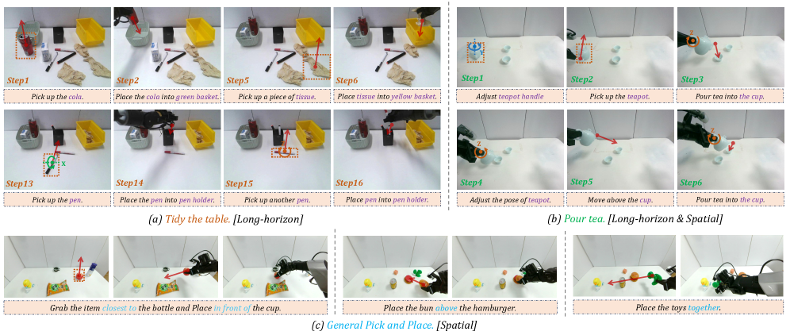
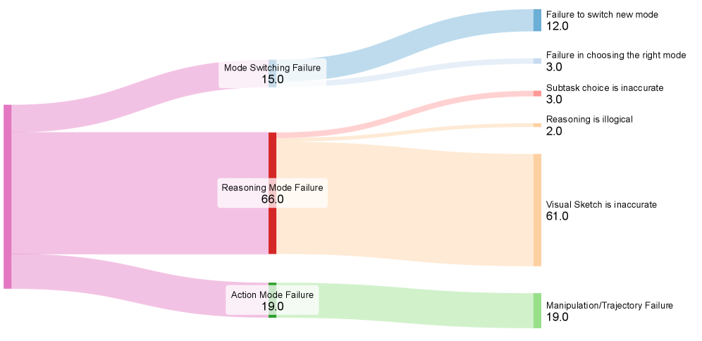

[← 返回 README](../README.md)

# IV. Experiments

## 📌 预览
三个研究问题：RQ1 整体性能对比、RQ2 错误分析 + Human-in-Loop 干预效果、RQ3 消融分析。评测在 LIBERO / RoboTwin 2.0（增强版）/ 真机（Agilex + Galaxea 双臂）三个环境下进行。

---

## 实验设置

**Benchmark**：
- LIBERO（持续技能基准，含 Long 子集专测长时域规划）
- RoboTwin 2.0 增强版（增加对象杂乱度和空间复杂度，含"堆叠三块积木"/"挂杯"/"放空杯"/"任意放置 A 到 B"）
- 真机：三个长时域任务（"整理杂乱桌面"/"倒茶"/"ambiguous 指令 pick-and-place"），Agilex + Galaxea 双臂平台

**Baseline 覆盖**：
- 端到端 VLA：Diffusion Policy, Octo, OpenVLA
- 专用架构 VLA：SpatialVLA, π₀, π₀.5, OpenVLA-OFT
- 含视觉 prompting/中间表达：TraceVLA, MolmoACT, PixelVLA

---

## RQ1：整体性能（Table 1 & 2）

*Figure 3: Action-Sketcher 在长时域和空间操作任务上的真机演示。框架生成叠加在画面上的显式 Visual Sketch（点/框/箭头），将高层推理落地为底层动作，在杂乱环境中成功完成整理桌面、倒茶等任务。*

> 💡 **Figure 3 批读**:
> - 可以看到 Sketch 渲染在真实摄像头画面上：绿框标出目标物体、红点标出关键接触点、箭头指示运动方向
>
> **🔍 三个子任务的能力对应**：
> - **(a) Tidy the table** → 标注 **Long-horizon**，考验**时序规划**——多步骤多子任务，需要持久追踪进度
> - **(b) Pour tea** → 标注 **Long-horizon & Spatial**，**两个能力都考**——多步骤 + 精确空间操作（旋转壶嘴/对准杯口）
> - **(c) Pick and place** → 标注 **Spatial**，考验**空间推理**——"closest to"/"in front of" 等相对位置关系理解
> - 场景真实杂乱，多个物体紧密排列
> - 连续多步骤：抓取 → 移动 → 放置，每步 Sketch 不同

**Table 1（LIBERO）结果**：Action-Sketcher 在所有子集上超越所有 baseline，在 **LIBERO-Long**（专测长时域规划）上优势最显著。

> 💡 **批注**: LIBERO-Long 的显著提升直接验证了核心假设——显式 See-Think-Sketch-Act 循环对长时域规划有根本性优势，隐层计划不够用。

**Table 2（困难任务 focused 对比）结果**：在 RoboTwin 2.0 四个任务 + 真机三个任务上，Action-Sketcher 对 π₀.5 / OpenVLA-OFT 等强 baseline 建立了显著一致的性能优势。

> 💡 **批注**: "substantial and consistent performance advantage across all tasks"——这个一致性很重要，说明方法不是在某个特定任务上偷鸡。

---

## RQ2：错误分析 + Human-in-Loop（Figure 4 & Table 3）

*Figure 4: Action-Sketcher 的失败分析。大多数错误发生在 Reasoning Mode，主要源于 Visual Sketch 生成不准确。*

> 💡 **Figure 4 批读**:
> - 错误分布：模式切换错误 12%、Reasoning Mode 错误 66%、Action Mode 错误 19%（数字之和 ~97%，合理）
> - Reasoning Mode 内部：Visual Sketch 生成错误占所有失败的 61%！
> - 这个分析说明当前最大瓶颈是**空间 grounding 精度**，而不是动作执行能力

**Human-in-Loop 干预实验**：

允许人工监督员在执行前对 Sketch 做微小编辑（移动一个点、调整一个框）→ **成功率推向近乎完美**。

> 💡 **批注**: 这是论文最有说服力的一个结果。
> - Sketch 是显式人可读的 → 人能看懂并快速纠正
> - 纠正代价极低（移动几个像素点）但效果显著
> - 这个设计让 Action-Sketcher 成为优秀的 human-robot collaboration 框架，不仅仅是自主操作系统

---

## RQ3：消融研究（Table 4）

**测试任务**：Stack Blocks（仿真）+ Tidy Table（真机）

### 框架组件消融

| 消融配置 | Sim 成功率 | 真机完成率 |
|----------|-----------|-----------|
| 完整模型 | **34.5%** | **~最高** |
| 去掉 Spatial Reasoning | 13.8% | 大幅下降 |
| 去掉 Visual Sketch | 9.8% | 15.0% |

> 💡 **批注**: Visual Sketch 不是辅助可视化，而是连接语言与动作的**根本桥梁**。去掉后性能近乎腰斩。

### Visual Primitive 消融

| 去掉的原语 | 成功率 |
|-----------|--------|
| 完整模型 | 34.5% |
| 去掉 Keypoints | 26.6%（最大下降）|
| 去掉 Arrows | 明显下降 |
| 去掉 Bounding Boxes | 明显下降 |

> 💡 **批注**: Keypoints 最关键——精确坐标 grounding 是核心。Arrows 和 Boxes 也不可或缺，三者协同才能发挥最大效果。

### 训练策略消融

| 消融配置 | 成功率 |
|---------|--------|
| 完整三阶段 | 34.5% |
| 跳过 Stage 1（预训练）| 29.2% |
| 跳过 Stage 2（推理精调）| 18.1% |
| 跳过 Stage 3（动作适配）| **0.0%** |

> 💡 **批注**: Stage 3 是不可缺少的——没有 Stage 3，policy 根本无法把 Sketch 转化为动作（直接崩溃）。Stage 2 影响最大（去掉后 Sketch 不连贯，成功率腰斩），Stage 1 提供基础但影响相对较小。
