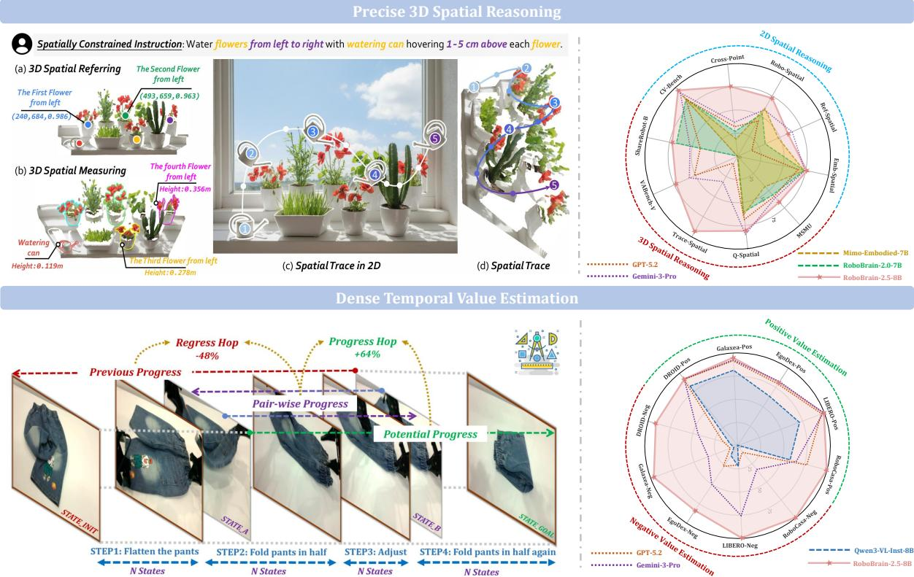

[← 返回 README](../README.md)

# 1 Introduction

## 📌 预览
Introduction 阐述了当前具身 AI 模型的两个根本局限（空间度量盲 + 时间开环），提出 RoboBrain 2.5 的愿景和三大贡献。

---

*Figure 1: New Features of RoboBrain 2.5. Top: Precise 3D spatial reasoning with depth-aware grounding, metric measuring, and full manipulation trace generation under physical constraints. Bottom: Dense temporal value estimation for step-aware progress/regress prediction from state transitions across viewpoints and tasks; radar plots summarize performance gains on 2D/3D spatial and temporal benchmarks.*

> 💡 **Figure 1 批读**:
> - 上半部分展示 3D 空间推理：浇花任务中生成 3D 关键点序列，需要理解"从左到右"的顺序 + "悬浮 1-5cm"的度量约束
> - 下半部分展示时间价值估计：从多视角状态转换中预测进度/退步
> - 雷达图对比了 2D/3D 空间和时间基准上的性能提升

---

Embodied AI foundation models have rapidly advanced in bridging language, vision, and action, enabling the generation of actionable plans from natural language instructions and visual observations [7, 32, 73]. However, a critical gap persists. While these models often succeed in curated demonstrations, they frequently falter during rigorous real-world deployments. This reliability issue stems from the challenge of translating high-level semantic reasoning into physically grounded manipulation. Real-world tasks are unforgiving. They demand that robots respect absolute metric constraints, operate robustly under occlusions and viewpoint shifts, and continuously self-correct in a closed loop. Unfortunately, these precise physical capabilities remain beyond the reach of current semantic planners.

> 💡 **批注**: 开篇指出核心问题——demo 级别的成功 ≠ 部署级别的可靠性。模型在 curated demonstrations 上表现不错，但真实场景中会因为缺少度量约束、视角鲁棒性和闭环纠错能力而失败。

---

These requirements expose two fundamental limitations in current generalist models. First, on the spatial dimension, models suffer from "metric blindness." Grounding is typically restricted to 2D pixel coordinates or weak topological representations [9, 13, 85]. Lacking absolute depth and scale information, such outputs inherently fail to ensure physical compliance. Specifically, they cannot guarantee millimeter-level clearance or generate collision-free 3D trajectories which are critical for precise interaction. Second, on the temporal dimension, models usually operate as "open-loop" predictors. They treat action generation as a static sequence prediction task without an intrinsic mechanism to monitor execution progress. Relying on sparse external supervision such as success labels [2, 53], the agent remains oblivious to intermediate failures like slippage or regression. This limitation makes adaptive recovery impossible in long-horizon tasks.

> 💡 **批注**: 两大根本局限的精确诊断：
> 1. **空间维度 - "度量盲"**: 只有 2D 像素坐标，无法保证毫米级间隙或无碰撞 3D 轨迹
> 2. **时间维度 - "开环预测"**: 依赖稀疏的成功标签（如 success/fail），对中间失败（滑动、回退）视而不见
>
> 这两个问题在长时程、接触密集的任务中尤其致命。

---

To bridge this gap, embodied foundation models must undergo a paradigm shift from semantic reasoners to physically-grounded agents. This evolution requires two precise upgrades. Spatial reasoning must advance from 2D pointing to precise 3D planning to satisfy metric constraints. Simultaneously, temporal modeling must shift from open-loop generation to dense value estimation to ensure closed-loop reliability.

> 💡 **批注**: 范式转变的核心命题——从"语义推理器"到"物理接地的智能体"。

---

To realize this vision, we present RoboBrain 2.5. Building upon the robust general perception and reasoning capabilities of its predecessor [33, 72], this next-generation model introduces critical upgrades to align internal representations with physical reality. Through large-scale training on high-quality spatiotemporal data, RoboBrain 2.5 achieves a comprehensive upgrade in core capabilities:

> 💡 **批注**: RoboBrain 系列的迭代路线：RoboBrain (CVPR 2025) → RoboBrain 2.0 → RoboBrain 2.5。2.5 版本的架构基于 Qwen3-VL。

---

• Spatial: Depth in Sight (Precise 3D Spatial Reasoning). We extend the spatial interface from 2D grounding to depth-aware coordinate prediction and full manipulation trace generation. Instead of predicting a single target point, the model learns to output an ordered sequence of keypoints that describes the complete manipulation procedure, thereby naturally encoding spatial planning. This capability is built via a curriculum of three complementary skills: (1) 3D Spatial Referring to localize objects; (2) $3D$ Spatial Measuring to estimate absolute metric quantities (e.g., distance, clearance) required by physical constraints; and (3) 3D Spatial Trace Generation to produce collision-free keypoint traces. Crucially, this is achieved by standardizing supervision into a decoupled $(u, v, d)$ representation convertible to 3D via camera intrinsics, leveraging large-scale, high-quality 3D supervision across diverse scenes.

> 💡 **批注 - 空间能力详解**:
> - 不是预测单个目标点，而是输出**有序关键点序列**描述完整操作过程
> - 三个递进技能：定位(Referring) → 测量(Measuring) → 轨迹生成(Tracing)
> - **关键设计**: $(u, v, d)$ 解耦表示——图像平面坐标 + 绝对深度，可通过相机内参转换为 3D 坐标
> - 好处：不需要模型隐式学习相机几何，且兼容现有 2D 数据集

---

• Temporal: Time in Mind (Dense Temporal Value Estimation). In parallel, we establish a breakthrough in temporal modeling that provides immediate, step-aware feedback robust to viewpoint variations. The objective is to estimate the execution state (progress, stagnation, regression, or error) using only visual observations. We implement this by modeling general reward on multi-view expert trajectories using hop-normalized temporal transition labels. This formulation normalizes progress by the remaining distance to the goal, producing bounded and stable supervision signals even with dense sampling. Furthermore, we employ multi-perspective fusion to aggregate value predictions, significantly improving robustness under occlusion. Consequently, RoboBrain 2.5 provides dense progress tracking that serves as a high-fidelity reward signal for downstream reinforcement learning.

> 💡 **批注 - 时间能力详解**:
> - 目标：仅从视觉观测估计执行状态（进度/停滞/回退/错误）
> - **Hop-normalized labels**: 进度归一化到剩余距离，保证信号在 $[-1, 1]$ 范围内
> - **多视角融合**: 聚合不同视角的预测，提升遮挡下的鲁棒性
> - 核心价值：为下游 RL 提供高保真的 reward signal

---

• Synergy and Impact. Crucially, RoboBrain 2.5 integrates these physical capabilities without sacrificing the general interactive reasoning of the original architecture. By imparting "Depth in Sight" to ensure kinematic feasibility and "Time in Mind" to ensure execution robustness, our model successfully bridges the reliability gap. Extensive experiments on serious benchmarks demonstrate state-of-the-art performance. Furthermore, real-world evaluations confirm superior zero-shot robustness in contact-rich tasks, effectively translating demo-level success into deployment-level reliability.

> 💡 **批注**: 强调两个新能力的协同效应：空间确保运动学可行性，时间确保执行鲁棒性。且不牺牲原有的通用推理能力。

---

## 🔖 Section 总结

### 核心洞察
1. 当前具身模型的 demo→deployment 鸿沟：curated 场景下成功不等于真实部署可靠
2. 两个根本局限：空间"度量盲"（2D only）+ 时间"开环"（无中间反馈）
3. RoboBrain 2.5 的解决方案：$(u,v,d)$ 解耦 3D 表示 + hop-normalized 密集时间标签
4. 三个空间子技能：Referring → Measuring → Tracing（递进式课程）
5. 时间估计作为通用 reward signal，可直接用于下游 RL
