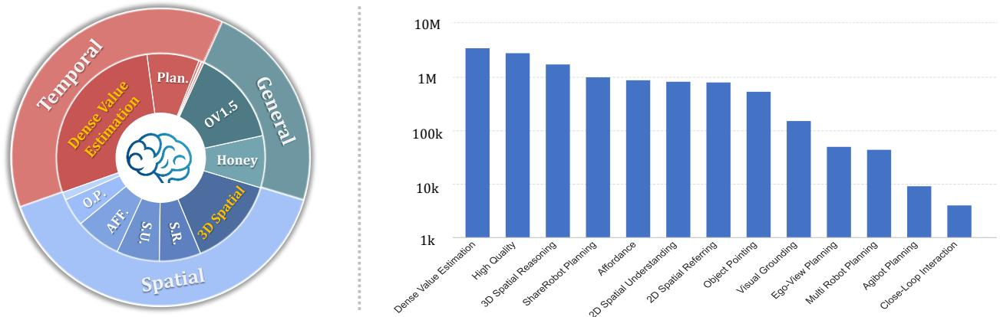

[← 返回 README](../README.md)

# 3 Training Data

## 📌 预览
RoboBrain 2.5 的训练数据总量约 12.4M 样本，分为三大域：General MLLM（2.83M）、Spatial Reasoning（含 2D 和 3D 共 ~5.5M）、Temporal Prediction（含 Dense Value Estimation ~3.5M）。

---

As shown in Figure 2, RoboBrain 2.5 is trained on a diverse and extensive dataset designed to enhance its capabilities in spatial understanding, temporal modeling and causal reasoning in embodied settings. Specifically, we construct a unified corpus of approximately 12.4M high-quality samples, categorized into three core domains: (1) General MLLM Data for robust semantic perception; (2) Spatial Reasoning Data spanning 2D perception to metric-aware 3D tracing; and (3) Temporal Prediction Data for hierarchical planning and dense value estimation. This mixture strategically balances large-scale web knowledge with fine-grained physical world interactions to bridge the gap between high-level reasoning and low-level control.

> 💡 **Section 概览**: 12.4M 样本，三大数据域：
> - **General** (~2.83M): 通用视觉-语言，奠定感知基础
> - **Spatial** (~5.5M+): 从 2D grounding 到 3D metric tracing
> - **Temporal** (~4M+): 从规划到密集价值估计

---

*Figure 2: Training Data Distribution for RoboBrain 2.5. The left pie chart illustrates the hierarchical composition of the dataset, structured into Temporal (red), General (teal), and Spatial (blue) domains. The right bar chart displays the sample count for each specific sub-task on a logarithmic scale.*

> 💡 **Figure 2 批读**:
> - 左侧饼图：三域层次结构，Spatial 占比最大
> - 右侧柱状图（log scale）：Dense Value Estimation、High-Quality General Data、3D Spatial Reasoning 是数据量最大的三类
> - 注意 Dense Value Estimation 原始 35M，下采样到 3.5M

---

## 3.1 General MLLM Data

> 💡 **3.1 要点预览**: 2.83M 通用多模态数据，源自 Honey-Data-1M 和 LLaVA-Onevision，经过去重、截断 CoT、平衡采样。

**High-Quality General Data.** To establish a robust foundation for general visual perception and reasoning, the general training dataset for RoboBrain 2.5 incorporates approximately 2.83 million high-quality samples. These are primarily sourced and refined from two state-of-the-art open-source collections: Honey-Data-1M [82] and LLaVA-Onevision-1.5-Instruct-Data [5]. (1) Honey-Data-1M Processing. We utilize Honey-Data-1M [82] as a key data source, which provides a diverse set of visual-language instructions designed to enhance multimodal understanding. To align the response style with our embodied agent's requirements for concise and direct execution commands, we truncated the extensive Chain-of-Thought (CoT) reasoning components, retaining only the final answers to streamline the supervision signal for direct instruction following. (2) LLaVA-Onevision Data Refinement. We further integrate LLaVA-Onevision-1.5-Instruct-Data [5], a comprehensive dataset covering a wide array of visual tasks including OCR, math, and general VQA. To strictly focus on vision-centric capabilities, we first filtered out all text-only samples. To address data imbalance, we applied balanced sampling across each visual-based subclass. Furthermore, to optimize training efficiency and context window utilization, we employed a sample packing strategy where shorter training samples are concatenated. This results in a more uniform sequence length distribution, primarily falling within the 2048 to 8192 token range. (3) De-duplication and Merging. Given the overlap in data sources between these two repositories, we conducted a rigorous de-duplication process to prevent redundancy and data leakage. We filtered the combined pool based on both image similarity and question-answer textual similarity. The final curated dataset consists of 2.83M unique, high-quality multimodal instruction-following samples.

> 💡 **3.1 小结**:
> - **Honey-Data-1M**: 截断 CoT，只保留最终答案（具身场景需要简洁直接的指令）
> - **LLaVA-Onevision**: 过滤纯文本，平衡采样，sample packing（序列长度 2048-8192）
> - **去重**: 基于图像相似度 + QA 文本相似度双重去重
> - 最终 2.83M unique 样本

---

## 3.2 Spatial Reasoning Data

> 💡 **3.2 要点预览**: 空间推理数据从基础到高级递进——Visual Grounding → Object Pointing → Affordance → Spatial Understanding → Spatial Referring → 3D Spatial Reasoning（新特性）。

**Visual Grounding.** The visual grounding dataset is constructed to enhance multimodal understanding through precise object-level localization, leveraging the extensive annotations from LVIS [27]. We carefully curate 152K high-resolution images from LVIS, ensuring broad coverage of diverse object categories and complex visual scenes. Each object annotation is converted into standardized bounding box coordinates $(x_{1}, y_{1}, x_{2}, y_{2})$ representing the top-left and bottom-right corners, enabling consistent spatial referencing. To facilitate rich visual dialogue, we generated 86K conversational sequences, each containing multiple rounds of QA pairs that progressively explore visual relationships, attribute reasoning, and contextual understanding. The dataset maintains a balanced distribution across object categories while preserving challenging cases of occlusion, viewpoint variation, and rare instances to support robust visual grounding.

> 💡 **批注**: LVIS 数据 → 152K 图 + 86K 多轮对话序列，标准 bbox 格式。

---

**Object Pointing.** The object pointing dataset is constructed to enable RoboBrain 2.5 to identify the locations of specified objects through pointing within an image. We leverage the Pixmo-Points [22] dataset, which includes 2.3M point annotations across 223K images as our data source. However, direct utilization of Pixmo-Points data for RoboBrain 2.5 training presents challenges due to densely repeated object instances (e.g., books on a shelf). To address this, we implement a two-step filtering process: (1) we discard annotations with more than ten labeled points to simplify training, and (2) we use GPT-4o [31] as a scene analyzer to select only indoor-relevant objects, such as kitchenware, furniture, and decorations, excluding irrelevant or outdoor scenes. This process yields 190K QA pairs for 64K images with reduced clutter, making the data more suitable for embodied contexts. To construct QA pairs for pointing tasks, we construct 28 human-designed templates, such as "Point out all instances of {label} in the image." or "Help me find {label} in the image by pointing to them." Here, {label} refers to object categories from the annotations. Templates are randomly selected to ensure linguistic diversity and improve the model's generalization ability in referencing tasks. For object reference pointing, we incorporate object reference data sourced from RoboPoint [78], which includes 347K QA annotations across 288K images. To address the potential issue of excessive points hindering training convergence, we randomly sample up to ten points per question. Additionally, all coordinates are converted into the normalized values to better support RoboBrain 2.5 training.

> 💡 **批注**: 
> - Pixmo-Points: 过滤 >10 个点的标注 + GPT-4o 筛选室内场景 → 190K QA / 64K 图
> - RoboPoint: 347K QA / 288K 图，每问最多 10 个点
> - 所有坐标归一化处理

---

**Affordance.** The affordance dataset focuses on understanding object functionality and spatial vacant areas for placement. For object affordance recognition, we utilize part-level annotations from PACO-LVIS [63], covering 75 object categories and 200 part categories across 46K images. Bounding boxes and segmentation masks are extracted for both whole objects and their functional parts. These annotations are transformed into bounding box coordinates $(x_{1}, y_{1}, x_{2}, y_{2})$, serving as ground truth labels for affordance prediction tasks. Questions are constructed using GPT-4o [31] to query object functionality and part usage, e.g., "Which part of a handbag can be grasped to carry it?" for the handle of a handbag. For whole-object affordances, questions avoid naming the object directly, such as "What device can be moved to control the cursor on a screen?" for a mouse (computer equipment). This automatic process results in 561K QA pairs. For spatial affordance learning, we include region reference data from RoboPoint [78]. This dataset consists of 270K images with 320K QA pairs and 14 spatial relationship labels. Each annotation is converted into a set of the normalized coordinates $[(x_{1}, y_{1}), (x_{2}, y_{2}), ...]$, and ground truth points are resampled to a maximum of ten points per answer for optimization. This dataset enables RoboBrain 2.5 to reason about spatial affordances for object placement in real-world settings.

> 💡 **批注**: Affordance 分两类：
> 1. **物体功能** (PACO-LVIS): 75 物体类 × 200 部件类 → 561K QA
> 2. **空间放置** (RoboPoint): 270K 图 × 320K QA，14 种空间关系

---

**Spatial Understanding.** To enhance RoboBrain 2.5's spatial reasoning, we present the Spatial Understanding Dataset, comprising 826K samples. This dataset emphasizes object-centric spatial attributes (e.g., position, orientation) and inter-object relations (e.g., distance, direction), covering both qualitative and quantitative aspects. It covers 31 distinct spatial concepts, substantially surpassing the $\sim15$ typically found in previous datasets. We partially adopt the RefSpatial [85] pipeline to construct 2D web image and 3D video datasets via automated template- and LLM-based generation: (1) 2D web images aim to provide core spatial concepts and depth perception across diverse indoor and outdoor scenes. To bridge scale and category gaps between these domains, we utilize the large-scale OpenImage [38] dataset. Since direct 3D reasoning from 2D images is challenging, we convert them into pseudo-3D scene graphs. Specifically, after filtering 1.7M images to 466K, we first use RAM [83] for object category prediction and GroundingDINO [49] for 2D boxes Detection. Then we enhance using Qwen2.5-VL [62] and a heuristic method to generate hierarchical captions given the 2D bounding box, ranging from coarse (e.g., "cup") to fine-grained (e.g., "the third cup from the left"). This enables unambiguous spatial referring in cluttered environments and captures both coarse and fine-grained spatial references. Next, we use UniDepth V2 [60] and WildeCamera [87] for depth and camera intrinsics to enable 3D point cloud reconstruction. Finally, combining this with object boxes from GroundingDINO [49] and masks from SAM 2.1 [64], each scene graph includes object labels, 2D boxes, instance masks, and object-level point clouds, yielding axis-aligned 3D boxes. Object captions serve as nodes, and spatial relations form the edges. QA pairs are generated via templates and LLMs (e.g., QwQ [74]), including object-location questions derived from the hierarchical captions. (2) scanning datasets integrates multimodal 3D scene understanding data from five original datasets: MMScan [50], 3RScan [76], ScanQA [6], SQA3D [51], and SpaceR [58]. We conduct template-based question filtering through rigorous data processing to ensure task relevance, perform multi-stage quality screening (e.g., consistency checks, outlier removal), and standardize all formats into a unified representation. This curation enables fine-grained environmental perception with enhanced reliability, supporting tasks ranging from object localization to complex spatial reasoning in 3D scenes. (3) 3D embodied videos focus on fine-grained spatial understanding in indoor environments. We leverage the CA-1M [39] dataset, filtering 2M frames to 100K high-quality ones. Compared to 2D, the availability of accurate 3D bounding boxes allows us to construct richer scene graphs with more diverse spatial relations, thereby generating more quantitative QA pairs (e.g., size, distances).

> 💡 **批注 - Spatial Understanding 数据构建管线**:
> - **826K 样本，31 种空间概念**（远超之前的 ~15 种）
> - 三个来源：
>   1. **2D web images** (OpenImage → pseudo-3D scene graph): RAM + GroundingDINO + UniDepth → 3D 点云重建
>   2. **3D scanning** (MMScan, 3RScan, ScanQA, SQA3D, SpaceR): 模板化问题生成
>   3. **3D embodied videos** (CA-1M): 2M → 100K 帧，精确 3D bbox
> - 关键技巧：**层次化 caption**（从粗到细），避免拥挤场景中的歧义引用

---

**Spatial Referring.** After enhancing foundational 3D spatial understanding, we extend these capabilities to physical-world interactions by introducing the Spatial Referring Dataset [85], consisting of 802K samples. Unlike prior datasets in visual grounding or object pointing, which often deal with ambiguous or multiple referents, this dataset targets a single unambiguous target, aligning with robotic applications such as precise pick-and-place that demand accurate object identification and localization. Following the RefSpatial [85] construction pipeline, for location data, we sample caption-point pairs from scene graphs built on 2D web images (OpenImage [38]) and 3D embodied videos (CA-1M [39]), using hierarchical captions. For placement data, we leverage fully annotated 3D datasets to generate top-down occupancy maps encoding object positions, orientations, and metric spatial relations (e.g., "10cm right of the chair"), facilitating accurate spatial referring.

> 💡 **批注**: 802K 样本，核心区别——**单一无歧义目标**，对齐机器人精确抓取/放置需求。

---

**3D Spatial Reasoning (RoboBrain 2.5 New Feature).** To equip the model with robust 3D spatial reasoning capabilities for tasks such as 3D spatial referring, measuring, and tracing, we introduce the 3D Spatial Reasoning Dataset, comprising 1.74M samples (8.08M QA pairs). Unlike the Spatial Understanding dataset, which focuses on qualitative, metric-agnostic spatial concepts (e.g., left, far, inside), this part is metric-grounded and supports flexible output in appropriate units (e.g., cm, inch, m). Following the TraceSpatial [86] construction pipeline, we propose a data pipeline that progressively integrates 3D scanning and video sources to perform 3D spatial referring, measuring, and tracing. (1) 3D Scanning datasets want to arm the model with a focused metric-grounded spatial reasoning of indoor scenes. We thus leverage the richly annotated CA-1M [39] and ScanNet [21]. After fine-grained filtering, similar to the Spatial Understanding part, we construct pseudo-3D scene graphs with more diverse spatial relations, enabled by precise 3D bounding boxes compared to 2D approaches. Moreover, we generate 3D occupancy maps that encode positions, orientations, and metric distances (e.g., "35cm right of the toy") for accurate object-centric spatial trace generation. (2) Manipulation videos provide spatial traces aligned with the embodied manipulation in tabletop settings. While 3D scans enable object-centric tracing, they lack physically plausible manipulations for robotics. Hence, we curate both real (e.g., AgiBot-Beta [19], DROID [36]) and simulated (e.g., RoboTwin 2.0 [17]) tabletop videos. Through a rigorous data cleaning process, such as verifying valid camera poses, coherent task flows, and clean trajectories, we reduce the dataset from 167K to 59K samples for AgiBot-Beta, and from 116K to 24K for DROID. We further leverage Qwen3-VL [62] to decompose these tasks into subgoals, enabling precise multi-step spatial tracing for single-/dual-arm across 3 robot configurations.

> 💡 **批注 - 3D Spatial Reasoning（核心新数据）**:
> - **1.74M 样本，8.08M QA 对** —— 量级最大的空间数据集
> - 与 Spatial Understanding 的关键区别：**度量接地**（带单位的精确数值，如 cm/m/inch）
> - 两类来源：
>   1. **3D Scanning** (CA-1M + ScanNet): 3D 场景图 + 占据图 → metric referring & measuring
>   2. **Manipulation Videos** (AgiBot-Beta, DROID, RoboTwin 2.0): 真实操作轨迹 → spatial tracing
> - 数据清洗严格：AgiBot-Beta 167K → 59K，DROID 116K → 24K
> - 用 Qwen3-VL 分解任务为子目标，支持单臂/双臂 × 3 种机器人配置

---

## 3.3 Temporal Prediction Data

> 💡 **3.3 要点预览**: 时间预测数据涵盖 6 个子集——Ego-View Planning、ShareRobot Planning、AGIbot Planning、Multi-Robot Planning、Close-Loop Interaction、Dense Value Estimation（新特性）。

**Ego-View Planning.** We construct Ego-View Planning dataset by partially processing the EgoPlan-IT [18] dataset, which contains 50K automatically generated samples. For each selected task instance, we extract multiple frames from prior actions to represent task progress, and one frame to capture the current viewpoint. To enhance linguistic variety, we use multiple prompt templates that describe the task goal, video context, and current observation. Each question includes the correct next action along with up to three distractor actions randomly sampled from negative examples. This setup supports multimodal instruction tuning with diverse visual and textual input, aimed at improving egocentric task planning performance.

> 💡 **批注**: EgoPlan-IT 50K 样本，多选题形式（1 正确 + 3 干扰动作）。

---

**ShareRobot Planning.** The ShareRobot dataset [33] is a large-scale, fine-grained resource for robotic manipulation, offering multi-dimensional annotations tailored for task planning. Its planning component provides detailed low-level instructions aligned with individual video frames, effectively transforming high-level task descriptions into structured and executable sub-tasks. Each data instance includes precise planning annotations to support accurate and consistent task execution. The dataset comprises 1M QA pairs from 51K instances, spanning 102 diverse scenes across 12 robot embodiments and 107 atomic tasks filtered according to the Open-X-Embodiment taxonomy [59]. All planning data were meticulously annotated by human experts following the RoboVQA [65] format, enabling models to learn robust multi-step planning strategies grounded in diverse real-world scenarios. The scale, quality, and diversity of ShareRobot help improve the model's ability to perform fine-grained reasoning and task decomposition in complex embodied environments.

> 💡 **批注**: ShareRobot — 1M QA / 51K 实例 / 12 种机器人 / 107 原子任务，人工标注。

---

**AGIbot Planning.** The AgiBot Planning dataset is a large-scale robotics task planning dataset built upon the AgiBot-World [12] dataset, comprising 9,148 QA pairs across 19 manipulation tasks with 109,378 first-person perspective images. Each sample contains 4-17 consecutive frames documenting task progression with multimodal conversational format. AgiBot-Planning provides step-by-step planning instructions that transform high-level goals into executable sub-tasks. Each data point includes current objectives, historical steps, and required subsequent actions. The dataset covers diverse scenarios from household refrigerator operations to supermarket shopping tasks across different environments. The meticulously crafted annotations use standardized conversational formats, enabling models to learn from varied real-world contexts. Through continuous visual sequences and fine-grained action plans, AgiBot-Planning enhances RoboBrain 2.5's ability to perform long-horizon task planning and spatial reasoning in complex embodied scenarios.

> 💡 **批注**: AgiBot Planning — 9,148 QA / 19 任务 / 109K 第一人称图像，每样本 4-17 帧。

---

**Multi-Robot Planning.** The Multi-Robot Planning dataset is constructed by simulating collaborative task scenarios across three environments—household, supermarket, and restaurant—based on RoboOS [68, 69]. Each sample is generated using structured templates that specify a detailed scene graph, robot specifications, and associated tool lists. For every scenario, we design high-level, long-horizon collaborative task goals that require coordination among multiple robots present in the scene, and generate corresponding workflow graphs that decompose the tasks into subtasks with detailed reasoning explanations. Based on these decompositions, we further generate agent-specific robotic tool plans that translate high-level task goals into precise low-level Observation-Action pairs for each subtask. Specifically, we define 1,659 types of multi-robot collaboration tasks across the three environments and produce 44,142 samples using DeepSeek-V3 [46].

> 💡 **批注**: 多机器人协作 — 3 环境 × 1,659 任务类型 → 44,142 样本，用 DeepSeek-V3 生成。

---

**Close-Loop Interaction.** The Close-Loop Interaction dataset is designed to facilitate advanced embodied reasoning [84], featuring a large-scale collection of synthesized Observation-Thought-Action (OTA) trajectories that combine first-person visual observations with structured thought tokens. It spans 120 diverse indoor environments—including kitchens, bathrooms, bedrooms, and living rooms—containing over 4,000 interactive objects and receptacles. The dataset is constructed within the AI2Thor [37] simulator through a rigorous multi-stage pipeline based on Embodied-Reasoner [81], which includes: (1) crafting task instructions from constrained templates to ensure scene-appropriate validity; (2) deriving key action sequences from an object-affiliation graph encoding functional relationships; and (3) strategically incorporating search actions to emulate realistic exploration. To enrich the depth of reasoning, GPT-4o [31] generates detailed thought processes—covering situational analysis, spatial reasoning, self-reflection, task planning, and verification—which are seamlessly integrated between observations and actions, forming coherent reasoning chains that guide models through complex, long-horizon interactive tasks.

> 💡 **批注**: OTA（Observation-Thought-Action）轨迹 — AI2Thor + GPT-4o 生成思维链，120 室内环境 / 4000+ 交互对象。

---

**Dense Value Estimation (RoboBrain 2.5 New Feature).** To empower the dense temporal value estimator with robust generalization capabilities, we construct a comprehensive dataset comprising approximately 35 million value estimation samples derived from over 27 million raw frames, and then down-sample to 3.5M for final training. Following the Dopamine-Reward [67] pipeline, this corpus is meticulously aggregated from three complementary domains, strategically balanced to bridge the gap between physical reality and semantic understanding: (1) Real-World robot data, which constitutes the majority ($\sim60\%$) of the training set, integrating diverse datasets such as AGIBot-World [12], DROID [36], and RoboBrain-X [25] to ground the model in physical interaction dynamics across varied environments; (2) Simulation data ($\sim13\%$), incorporating benchmarks like LIBERO [47], RoboCasa [55], and RoboTwin [17] to foster strong instruction-following capabilities through high-quality, occlusion-free labels; and (3) Human-Centric data ($\sim26\%$), leveraging the massive scale of EgoDex [30] to acquire universal object affordance priors independent of robot morphology. Crucially, this heterogeneous mixture spans a wide spectrum of embodiments, ranging from single-arm industrial robots (e.g., Franka Emika Panda) to complex bimanual humanoids (e.g., AGIBot-A2D), preventing overfitting to specific kinematics and ensuring the model focuses on object state changes. We apply the hop-based labeling strategy described in Section 2.2 to this multi-source collection, enabling the model to provide stable, embodiment-invariant progress feedback across a wide spectrum of tasks.

> 💡 **批注 - Dense Value Estimation（核心新数据）**:
> - 原始 **35M 样本 / 27M 帧**，下采样到 **3.5M** 训练
> - 三域配比：真实机器人 60% + 仿真 13% + 人类视频 26%
> - 覆盖从单臂工业机器人到双臂人形机器人的广泛 embodiment
> - 关键设计：多 embodiment 混合 → 防止过拟合特定运动学，聚焦**物体状态变化**
> - 使用 Section 2.2 的 hop-based 标注

---

## 🔖 Section 总结

### 关键数字速查
| 数据类别 | 数量 | 来源 |
|----------|------|------|
| General MLLM | 2.83M | Honey-Data-1M, LLaVA-Onevision |
| Visual Grounding | 86K 对话 / 152K 图 | LVIS |
| Object Pointing | 190K + 347K QA | Pixmo-Points, RoboPoint |
| Affordance | 561K + 320K QA | PACO-LVIS, RoboPoint |
| Spatial Understanding | 826K | OpenImage, 5 scanning datasets, CA-1M |
| Spatial Referring | 802K | RefSpatial pipeline |
| **3D Spatial Reasoning** | **1.74M (8.08M QA)** | CA-1M, ScanNet, AgiBot-Beta, DROID, RoboTwin 2.0 |
| ShareRobot Planning | 1M QA / 51K 实例 | ShareRobot |
| Multi-Robot Planning | 44K | RoboOS + DeepSeek-V3 |
| **Dense Value Estimation** | **3.5M (from 35M)** | AGIBot-World, DROID, EgoDex, etc. |
| **总计** | **~12.4M** | — |

### 核心洞察
1. 数据构建是这篇论文的重工程——几乎每个子数据集都有独立的处理管线
2. 两个新特性数据（3D Spatial + Dense Value）贡献了 ~5M 样本，占总量 ~40%
3. 多 embodiment、多视角、多域的数据混合是保证泛化性的关键
