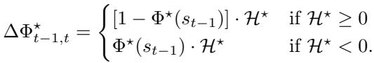

[← 返回 README](../README.md)

# 4 Training Strategy

## 📌 预览
两阶段渐进式训练：Stage 1 建立通用时空基础（8.3M），Stage 2 精细化 3D 空间和时间估计（4.1M）。支持 NVIDIA 和摩尔线程 GPU 双平台。

---

Similar to RoboBrain 2.0 [72], RoboBrain 2.5 achieves embodied capabilities (spatial understanding, temporal modeling) through a progressive dual-phase training strategy, as shown in Table 1. Starting from a robust vision-language foundation, we introduce escalating complexity in embodied supervision, enabling the model to evolve from static perception to dynamic reasoning and actionable planning in real-world environments. Specifically, the training pipeline is divided into two distinct phases: (1) Foundational Spatiotemporal Learning, which establishes broad visual semantics, 2D spatial grounding, and open-loop planning capabilities; and (2) Specific Spatiotemporal Enhancement, which fine-tunes the model on quantitative 3D spatial reasoning and dense temporal value estimation to ensure precise, metric-aware physical interaction.

> 💡 **Section 概览**: 从"粗到精"的训练课程——先学会看和理解，再学会精确测量和估计进度。

---

*Table 1: Detailed configuration for each training stage of the RoboBrain 2.5.*

> 💡 **Table 1 批读**:
> - 两阶段都是全模型训练（Full Model 8B），1 epoch
> - LR: 视觉编码器 $1\times10^{-6}$，语言模型 $1\times10^{-5}$（10x 差异）
> - NVIDIA: 64×8 GPU；Moore Threads: 128×8 GPU
> - 最大序列长度 16384 token
> - Stage 1: 8.3M 样本，Stage 2: 4.1M 样本

---

## 4.1 Stage 1: Foundational Spatiotemporal Learning

In the first stage, we focus on establishing a robust "Generalist Brain" capable of understanding multimodal instructions, grounding objects in 2D space, and mastering high-level planning logic. We utilize the Full Model across 8.3 million samples, comprising the General MLLM Data, Spatial Reasoning Data (excluding metric 3D points/traces), and Temporal Prediction Data (Planning and pairwise comparisons). To ensure stable convergence on this heterogeneous corpus, we employ a standard next-token prediction loss. The primary objectives of this stage are threefold: (1) General Visual Perception: Leveraging high-quality general data (e.g., Honey-Data-1M) to maintain and enhance the model's general visual-linguistic capabilities. This ensures the model retains a robust understanding of open-world semantics, complex user queries, and diverse visual scenes, serving as a versatile foundation for specific embodied tasks. (2) 2D Grounding & Qualitative 3D Understanding: Beyond standard 2D visual grounding and affordance detection, this stage incorporates text-based QA from the 3D Spatial Reasoning dataset. This enables the model to comprehend complex spatial relationships (e.g., spatial relations, occupancy) and qualitative 3D concepts without the burden of precise metric coordinate regression. (3) Planning & Temporal Logic: We integrate diverse planning datasets to teach logical task decomposition. Furthermore, we introduce a Temporal Value Comparison task derived from the Dense Value Estimation dataset. Instead of predicting absolute values, the model learns to order keyframes temporally (i.e., identifying which frame represents a later state), establishing a preliminary awareness of task progress and state evolution. This stage yields a model proficient in general perception, logical planning, and qualitative spatiotemporal reasoning, providing a solid initialization for fine-grained training.

> 💡 **Stage 1 批注**:
> - 8.3M 样本 = General + Spatial（不含 metric 3D）+ Temporal（规划 + 时序比较）
> - 关键设计：3D Spatial 数据在 Stage 1 只用**文本 QA 部分**（定性理解），不做坐标回归
> - 时间估计在 Stage 1 降级为**帧排序任务**（比较哪个帧更晚），而非绝对值预测
> - 目的：先建立定性理解，再过渡到定量预测

---

## 4.2 Stage 2: Specific Spatiotemporal Enhancement

To bridge the gap between semantic understanding and physical actuation, the second stage introduces Specific Spatiotemporal Enhancement, focusing on precise quantitative reasoning. This stage utilizes approximately 4.1 million samples, targeting the newly introduced Metric 3D Spatial Reasoning and Dense Value Estimation capabilities. (1) Metric-Aware 3D Tracing. We introduce the specific 3D data focusing on point and trajectory generation to transition the model from qualitative understanding to quantitative perception. This enables the model to predict absolute 3D coordinates, depth-aware traces, and metric distances (e.g., in centimeters), which are critical for precision manipulation tasks. (2) Dense Value Estimation. We transition from pairwise comparison to explicit Hop prediction. The model is trained to act as a robust value function (Critic) by predicting continuous progress values (Hops) frame-by-frame, enabling it to provide fine-grained, closed-loop feedback for policy ranking and error recovery. (3) Anti-Forgetting Strategy. To prevent the catastrophic forgetting of general capabilities while learning these specialized metric tasks, we adopt a data replay strategy. We randomly sample $15\%$ of the Stage-1 data and mix it with the Stage-2 specific data. This ensures the model retains its conversation, 2D grounding, and logical planning abilities while mastering fine-grained physical skills for 3D embodied environment.

> 💡 **Stage 2 批注**:
> - 4.1M 样本 = metric 3D + Dense Value Estimation + 15% Stage-1 数据重放
> - 从定性 → 定量：开始预测绝对 3D 坐标和 hop 值
> - **抗遗忘策略**: 15% 数据重放，保留通用能力
> - 这个两阶段设计很经典——先通识后专精，避免专业数据冲击通用能力

---

## 🔖 Section 总结

### 关键数字速查
| 配置 | Stage 1 | Stage 2 |
|------|---------|---------|
| 数据量 | 8.3M | 4.1M |
| 参数 | 8B (Full) | 8B (Full) |
| Batch Size | 1024 | 1024 |
| LR (vision/LM) | 1e-6 / 1e-5 | 1e-6 / 1e-5 |
| Epoch | 1 | 1 |
| NVIDIA GPU | 64×8 | 64×8 |
| MTT GPU | 128×8 | 128×8 |

### 核心洞察
1. 两阶段课程学习：定性理解 → 定量推理
2. Stage 1 中巧妙地将 3D 和时间任务"降级"为更简单的版本（文本 QA / 帧排序）
3. 15% 数据重放是抗遗忘的关键
