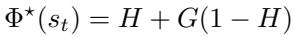
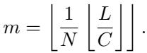
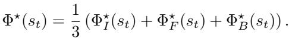

[← 返回 README](../README.md)

# 6 Evaluation Results

## 📌 预览
全面评估三个维度：2D 空间推理（5 benchmarks）、3D 空间推理（5 benchmarks）、时间价值估计（6 testsets）。NVIDIA 和摩尔线程两个版本性能一致。

---

We conducted a comprehensive evaluation of RoboBrain-2.5, significantly expanding the assessment scope of its predecessor to include 3D quantitative spatial reasoning and fine-grained temporal value estimation. To ensure consistency and rigor, we continued to employ FlagEvalMM [29], our flexible framework for systematic multimodal model assessment. Notably, to demonstrate the cross-platform robustness of our training infrastructure, we report performance for RoboBrain-2.5 variants trained on two distinct hardware backends: NVIDIA (NV) GPUs and Moore-Threads (MTT) GPUs.

Evaluations on spatial reasoning benchmarks, which now encompass both foundational 2D tasks (e.g., CVBench [75], RoboSpatial [66]) and advanced 3D quantitative measurement (e.g., MSMU [14], TraceSpatial [86], VABench-V [79]), are presented in Section 6.1 and Section 6.2. Furthermore, we introduce a new dimension of evaluation for temporal value estimation in Section 6.3, leveraging the General Process Reward Modeling (GPRM) paradigm from Robo-Dopamine [67]. We assess the model's ability to perceive manipulation progress across diverse data sources, organized into Real-Bench (real-world robot data including AgiBot [12], DROID [36], and Galaxea [35]), Sim-Bench (simulation environments like Libero [47] and RoboCasa [55]), and Human-Bench (human manipulation videos from EgoDex [30]). Qualitative examples are provided in Section A.

> 💡 **Section 概览**: 评估使用 FlagEvalMM 框架，覆盖 2D/3D 空间 + 时间三个维度，对比通用模型（Gemini-3-Pro, GPT-5.2, Qwen3-VL）和具身模型（RoboBrain 2.0, Mimo-Embodied）。

---

## 6.1 2D Spatial Reasoning Capability

*Table 2: Performance on 2D spatial reasoning benchmarks.*

> 💡 **Table 2 批读**:
> - RoboBrain 2.5 NV/MTT 平均分都是 **75.82**，显著超越所有 baseline
> - 最大亮点：**CrossPoint** 从 ~30 左右飙升到 **75-76**（跨视角点对应）
> - CV-Bench 94.58 > Qwen3-VL 92.89 > Gemini-3-Pro 92.00
> - NV 和 MTT 版本性能几乎一致，验证了跨平台训练的可靠性

---

We first evaluate RoboBrain-2.5 on five representative 2D spatial reasoning benchmarks: CV-Bench [75], CrossPoint [77], RoboSpatial [66], RefSpatial [85], and EmbSpatial [24]. Results are summarized in Table 2. Overall, the RoboBrain-2.5 variants trained on the NVIDIA GPU Platform and Moore-Threads (MTT) GPU Platform achieve same average scores of 75.82. Both deliver substantial improvements over general-purpose and embodied baselines.

• **CV-Bench** [75]. CV-Bench assesses vision-centric spatial understanding and visual processing via repurposed 2D/3D vision tasks. RoboBrain-2.5 (8B) trained on NVIDIA achieves the best accuracy of 94.58, with the MTT variant closely following at 93.90. Both consistently outperform strong general baselines such as Qwen3-VL-8B-Inst. (92.89), Gemini-3-Pro-Preview (92.00), and GPT-5.2 (86.84), as well as embodied baselines including RoboBrain-2.0 (7B) (85.75) and Mimo-Embodied (7B) (88.82), indicating a clear gain in foundational 2D spatial perception.

• **CrossPoint** [77]. CrossPoint-Bench evaluates cross-view point correspondence, requiring fine-grained point-level matching across different viewpoints. RoboBrain-2.5 demonstrates a decisive advantage, achieving 76.30 (MTT) and 75.40 (NVIDIA), which substantially surpasses all evaluated baselines, including Gemini-3-Pro-Preview (38.60), GPT-5.2 (33.00), Qwen3-VL-8B-Inst. (28.40), RoboBrain-2.0 (7B) (26.00), and Mimo-Embodied (7B) (20.02). This highlights the model's strong capability in transitioning from coarse spatial judgment to actionable, coordinate-level correspondence.

> 💡 **批注**: CrossPoint 是最惊艳的提升——从 ~28（Qwen3-VL）到 75+，几乎翻了 3 倍。这说明 3D 空间推理训练对跨视角点匹配有极强的迁移效果。

---

• **RoboSpatial** [66]. RoboSpatial measures spatial reasoning in robotics-oriented environments. RoboBrain-2.5 achieves the best scores of 73.03 (NVIDIA) and 73.00 (MTT), outperforming Qwen3-VL-8B-Inst. (66.90) and Gemini-3-Pro-Preview (57.96), as well as embodied baselines like Mimo-Embodied (7B) (61.76) and RoboBrain-2.0 (7B) (54.23).

• **RefSpatial** [85]. RefSpatial evaluates spatial referring under complex spatial constraints. RoboBrain-2.5 achieves strong results of 60.50 (NVIDIA) and 59.00 (MTT), substantially exceeding Qwen3-VL-8B-Inst. (54.20), Mimo-Embodied (7B) (48.00), RoboBrain-2.0 (7B) (32.50), and GPT-5.2 (15.00), while remaining competitive with the best-performing general baseline (Gemini-3-Pro-Preview, 65.50).

• **EmbSpatial** [24]. EmbSpatial-Bench assesses embodied spatial understanding from an egocentric perspective. RoboBrain-2.5 attains competitive performance with 76.92 (MTT) and 75.58 (NVIDIA), closely matching Gemini-3-Pro-Preview (76.62) and surpassing GPT-5.2 (68.02), while approaching the strongest baseline Qwen3-VL-8B-Inst. (78.50).

> 💡 **2D 评估小结**: 5 个 benchmark 全面领先，尤其 CrossPoint（3x 提升）。唯一不占优的是 EmbSpatial（略低于 Qwen3-VL 的 78.50）。

---

## 6.2 3D Spatial Reasoning Capability

*Table 3: Performance on five 3D spatial reasoning benchmarks.*

> 💡 **Table 3 批读**:
> - **TraceSpatial** 是核心新 benchmark：RoboBrain 2.5 的 Success=44（NV）/36（MTT），而最好的通用模型 Gemini-3-Pro 只有 7
> - **MSMU**: 64.17 > Gemini-3-Pro 59.44 > GPT-5.2 57.96
> - **VABench-V** (↓ better): 0.1189 (MTT) 大幅领先
> - RoboBrain 2.0 在 TraceSpatial 上没有结果（不支持 3D tracing）

---

We further evaluate RoboBrain-2.5 on five 3D spatial reasoning benchmarks that stress metric-grounded and trajectory-aware understanding: MSMU [14], Q-Spatial [45], TraceSpatial [86], VABench-V [79], and ShareRobot-Bench [33]. Results are summarized in Table 3.

• **MSMU** [14]. MSMU evaluates quantitative 3D spatial measuring and understanding. RoboBrain-2.5 achieves the best performance, with 64.17 (NVIDIA) and 61.66 (MTT), surpassing Gemini-3-Pro-Preview (59.44) and GPT-5.2 (57.96).

• **Q-Spatial** [45]. Q-Spatial Benchmark assesses quantitative reasoning about object sizes and distances. RoboBrain-2.5 (MTT) achieves 78.31, outperforming Qwen3-VL-8B-Inst. (70.74) and GPT-5.2 (69.16), while remaining competitive with Gemini-3-Pro-Preview (81.37).

• **TraceSpatial** [86]. TraceSpatial-Bench evaluates multi-step, metric-grounded spatial tracing in cluttered 3D scenes. We report three fine-grained 3D metrics: 3D Start measures grasp success, 3D End measures placement success, and Success measures the final spatial trace success by jointly considering grasp success, placement success, and collision checking along the trace. RoboBrain 2.5 (NV) achieves 83/63/44 on Start/End/Success, dramatically outperforming Qwen3-VL (30/20/6) and Gemini-3-Pro (19/25/7).

> 💡 **批注**: TraceSpatial Success=44 vs 其他模型的 0-7，这是**量级差异**。说明 3D spatial tracing 是一个全新能力，现有通用模型几乎无法完成。

---

• **VABench-V** [79]. RoboBrain-2.5 achieves the lowest error of 0.1189 (MTT) and 0.1281 (NVIDIA), substantially improving over Gemini-3-Pro-Preview (0.1705), GPT-5.2 (0.1962), and Qwen3-VL-8B-Inst. (0.1979).

• **ShareRobot-T** [33]. RoboBrain-2.5 attains the best results with 0.1164 (NVIDIA) and 0.1171 (MTT), improving over RoboBrain-2.0 (0.1240) and strongly outperforming general baselines.

---

## 6.3 Temporal Value Estimation

*Table 4: Temporal value estimation on six testsets. VOC+ / VOC− (both ↑).*

> 💡 **Table 4 批读**:
> - 核心指标：VOC+ (正向) / VOC- (时间反转后重新评估)
> - **VOC- 是杀手指标**——衡量模型是否真正理解时间方向（而非仅靠视觉相似度）
> - RoboBrain 2.5: VOC+ 和 VOC- **都很高且接近**（如 LIBERO: 98.97/98.94）
> - GPT-5.2: VOC+ 高但 VOC- 极低（如 AgiBot: 90.02/15.91），说明不理解时间方向
> - 这揭示了通用 VLM 在时间理解上的根本缺陷

---

To evaluate fine-grained temporal value estimation for manipulation progress, we follow the General Process Reward Modeling (GPRM) paradigm in Robo-Dopamine [67]. Concretely, the model is prompted with a task instruction and conditioned on multi-view images of the initial and goal states, together with paired multi-view observations of the BEFORE and AFTER states, and predicts a discretized relative progress/regress hop as a value signal [67]. We evaluate temporal ordering robustness via two rank-correlation metrics: Forward VOC ($\text{VOC}^{+}$) computed on the original temporal direction, and Reverse VOC ($\text{VOC}^{-}$) computed by time-reversing the video and re-evaluating the model.

• **AgiBot** [12]. RoboBrain-2.5 (MTT) achieves 87.36/87.48. GPT-5.2 achieves a higher Forward VOC (90.02) but substantially lower Reverse VOC (15.91), indicating a lack of robust bidirectional temporal understanding.

• **DROID** [36]. RoboBrain-2.5 (MTT) attains 93.67/89.26, substantially improving over all baselines. GPT-5.2's Reverse VOC drops to 15.29.

• **Galaxea** [25]. Both variants perform exceptionally well: MTT 94.58/94.54, NV 93.38/95.79.

• **EgoDex** [30]. RoboBrain-2.5 (MTT) achieves 80.67/81.12. Gemini-3-Pro-Preview shows 80.48/50.15.

• **LIBERO** [47]. Near-ceiling: NV 98.97/98.94, MTT 98.88/98.91.

• **RoboCasa** [55]. MTT achieves the best 98.54/99.58.

> 💡 **时间估计评估小结**:
> - RoboBrain 2.5 在所有 6 个 testset 上 VOC+/VOC- 都很高且平衡
> - 通用模型（GPT-5.2, Gemini）的 VOC- 普遍很低，暴露了它们"不真正理解时间方向"的问题
> - 仿真环境（LIBERO, RoboCasa）几乎满分，真实环境（AgiBot, EgoDex）更有挑战性

---

## 🔖 Section 总结

### 关键数字速查
| 基准 | RoboBrain 2.5 (Best) | 最强 Baseline |
|------|----------------------|---------------|
| CV-Bench (2D) | 94.58 | Qwen3-VL 92.89 |
| CrossPoint (2D) | 76.30 | Gemini 38.60 |
| RoboSpatial (2D) | 73.03 | Qwen3-VL 66.90 |
| MSMU (3D) | 64.17 | Gemini 59.44 |
| TraceSpatial Success (3D) | 44 | Gemini 7 |
| VABench-V (3D, ↓) | 0.1189 | Gemini 0.1705 |
| LIBERO VOC+/VOC- | 98.97/98.94 | Gemini 98.42/76.31 |

### 核心洞察
1. 3D 空间推理是**全新能力维度**——TraceSpatial Success 44 vs baseline 7，量级差异
2. CrossPoint 3x 提升说明 3D 训练对 2D 跨视角任务有强迁移
3. VOC- 指标揭示通用 VLM 的时间理解是"假象"——只有正向 ok，反向就崩
4. NV 和 MTT 版本性能一致，是国产 GPU 训练的有力证明
