[← 返回 README](../README.md)

# Appendix

## 📌 预览
附录包含两部分：A 为定性示例（3D 空间推理 + 时间价值估计的可视化），B 为 Bounded Global Progress 的数学证明。

---

## A Qualitative Examples

This section provides a comprehensive set of qualitative examples that illustrate the capabilities of RoboBrain 2.5 in various embodied AI tasks. As Capabilities like pointing, affordance, planning, etc. are similar to those shown in RoboBrain 2.0 [72], the examples in this section ONLY demonstrate the model's proficiency in 3D spatial reasoning, temporal value estimation, showcasing its potential for real-world applications.

### A.1 Examples on 3D Spatial Reasoning

> 💡 **A.1 概览**: 3D 空间推理的定性示例聚焦三个方面：细粒度空间约束遵循、多步组合推理、跨环境泛化。

**Compliance with Fine-Grained Spatial Constraints.** RoboBrain 2.5 excels at interpreting spatially constrained instructions and generating accurate 3D manipulation traces that adhere to both relative positional requirements and metric constraints.

**Multi-Step Compositional Reasoning.** Complex manipulation tasks often demand multi-step reasoning to decompose high-level goals into executable sub-tasks.

**Generalization Across Environments and Objects.** RoboBrain 2.5's 3D spatial reasoning generalizes to diverse indoor settings and object categories.

---

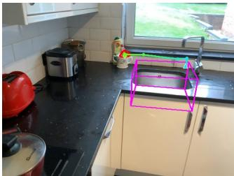

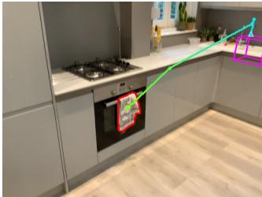

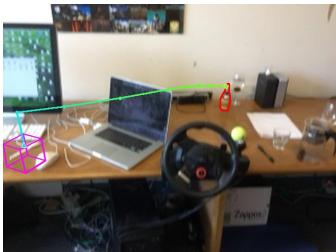

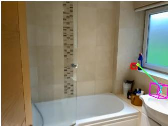

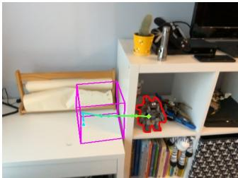

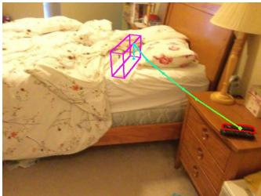

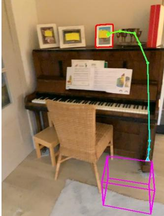

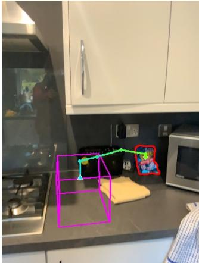
*Figure 3: Visualization of TraceSpatial-Bench Rollouts and RoboBrain 2.5's Predicted Traces. The red mask marks the ground-truth starting point, the purple 3D bounding box represents the ground-truth endpoint, and the 2D projection of RoboBrain 2.5's predicted 3D spatial trace is displayed.*

> 💡 **Figure 3 批读**: 展示了 Reasoning Step 2-6 的不同复杂度任务。红色 mask = GT 起点，紫色 3D bbox = GT 终点，彩色线 = 模型预测的 3D trace 投影。

---

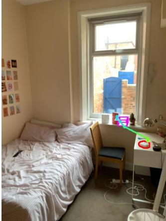

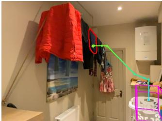

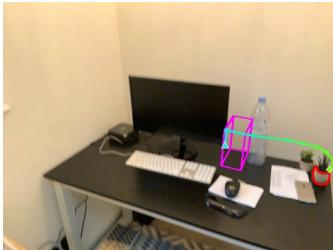

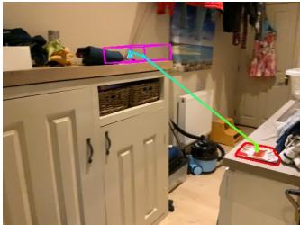

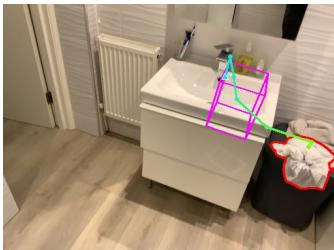

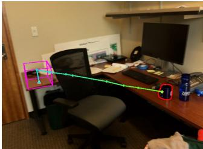

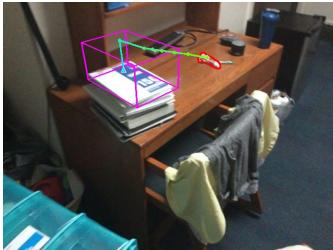

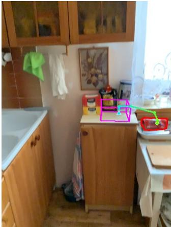

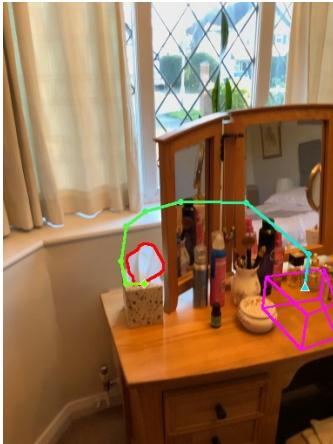

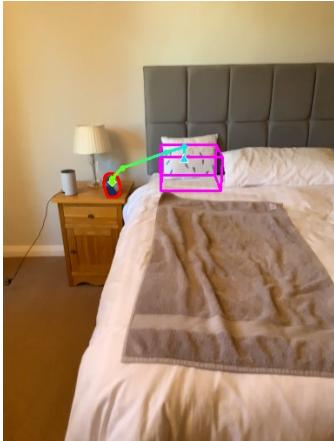
*Figure 4: Visualization of TraceSpatial-Bench Rollouts and RoboBrain 2.5's Predicted Traces.*

---

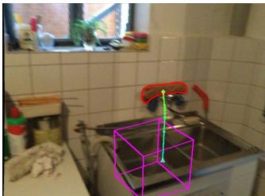

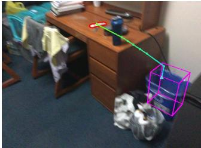

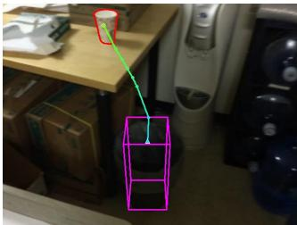

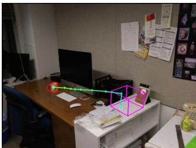

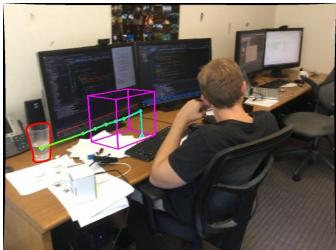

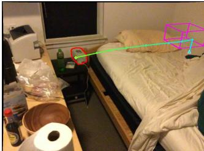

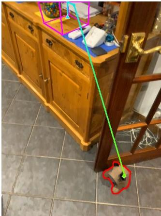

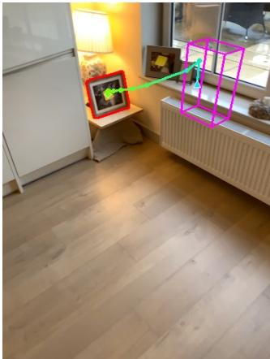

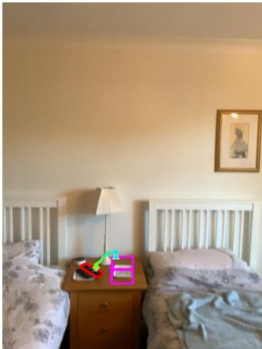
*Figure 5: Visualization of TraceSpatial-Bench Rollouts and RoboBrain 2.5's Predicted Traces.*

---

**Application on RoboTwin 2.0**

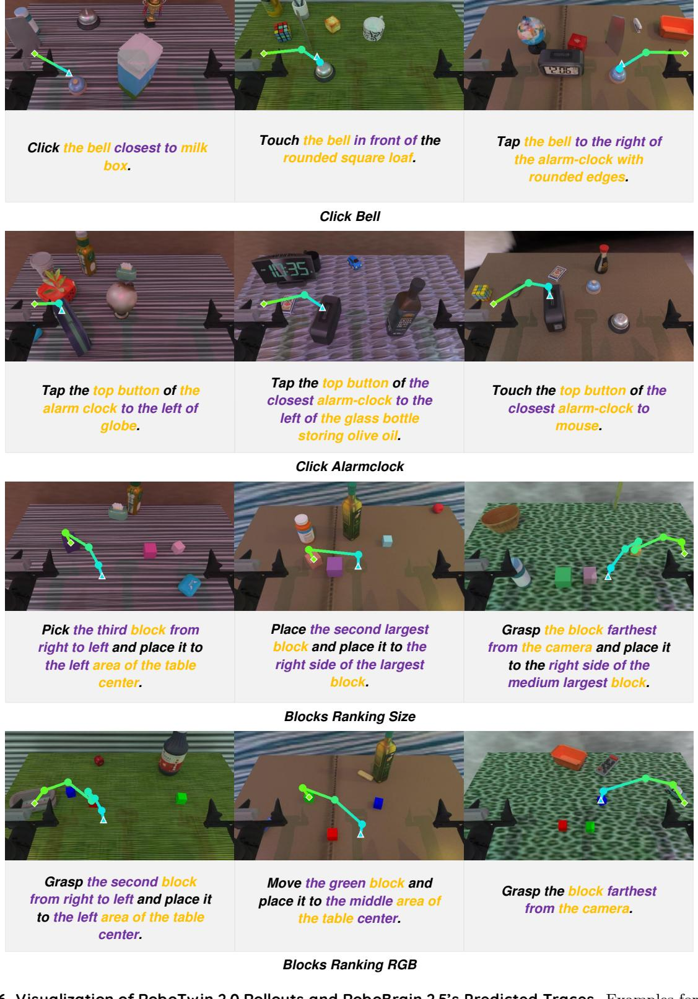
*Figure 6: RoboTwin 2.0 Rollouts — AgiLex Dual-Arm tasks: Click Bell; Click Alarm clock; Blocks Ranking.*

> 💡 **Figure 6 批读**: 展示细粒度空间辨别——在多个干扰物中识别特定目标（如"离牛奶盒最近的"、"第二大的"）。

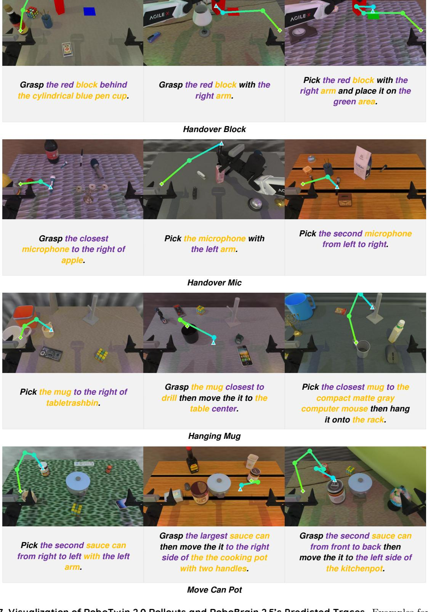
*Figure 7: RoboTwin 2.0 Rollouts — AgiLex Dual-Arm tasks: Handover Block; Handover Mic; Hanging Mug; Move Can Pot.*

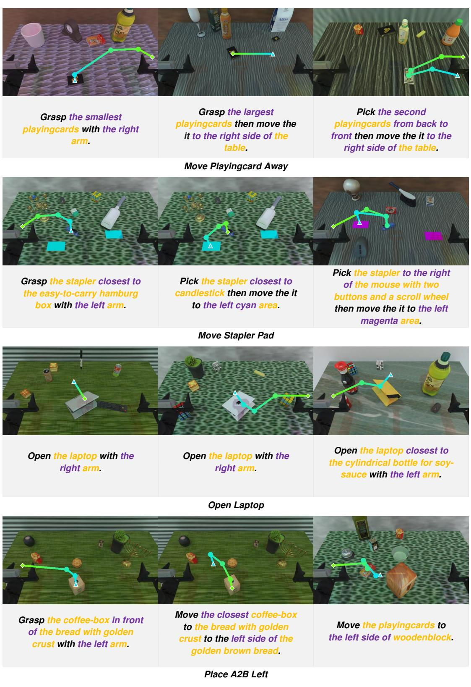
*Figure 8: RoboTwin 2.0 Rollouts — AgiLex Dual-Arm tasks: Move Playingcard Away; Move Stapler Pad; Open Laptop; Place A2B Left.*

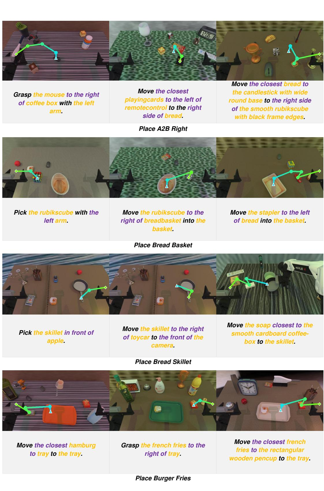
*Figure 9: RoboTwin 2.0 Rollouts — AgiLex Dual-Arm tasks: Place A2B Right; Place Bread Basket; Place Bread Skillet; Place Burger Fries.*

---

### A.2 Examples on Temporal Value Estimation

> 💡 **A.2 概览**: 时间价值估计的定性示例展示三方面：多任务泛化、时间间隔鲁棒性、真实 RL 部署。

**Dense Value Predictions on Diverse Tasks.**

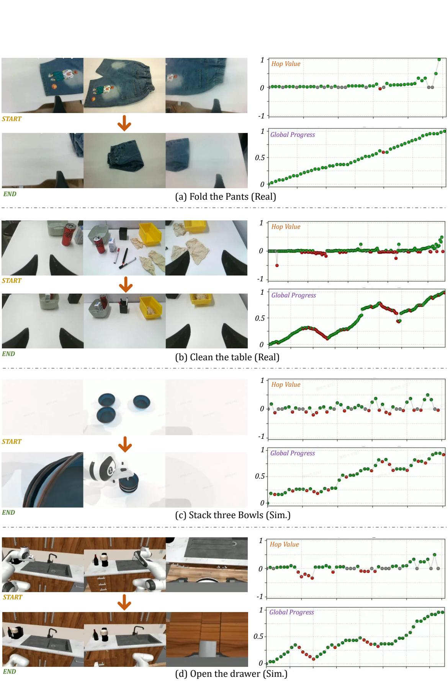
*Figure 10: RoboBrain 2.5 Progress Predictions across Diverse Tasks. Hop (instantaneous change) and accumulated Progress on unseen validation tasks.*

> 💡 **Figure 10 批读**: 多种任务（叠碗、折裤子、清桌子等）的 Hop 和 Progress 曲线。成功轨迹中 Hop 持续为正，Progress 单调递增。

---

**Robustness to Temporal Intervals.**

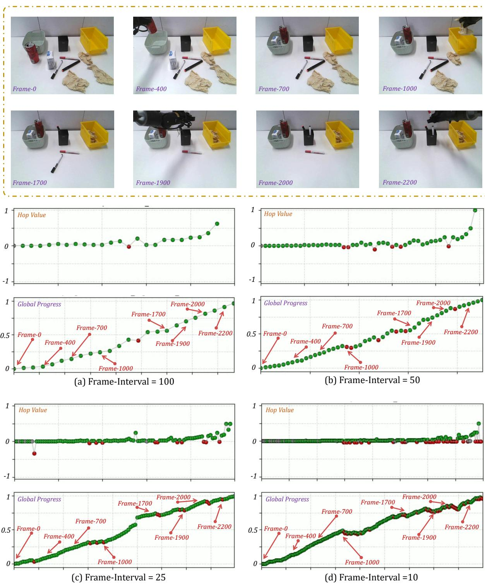
*Figure 11: Progress Estimation Consistency across Sampling Intervals (Δt = 10, 25, 50, 100 frames).*

> 💡 **Figure 11 批读**: 不同采样率下 Progress 曲线高度重合——模型学会了将物理进度与时间间隔解耦。Δt 越大，单步 Hop 越大，但累积 Progress 不变。

---

**Visualization of Different Progress Estimation Modes.**

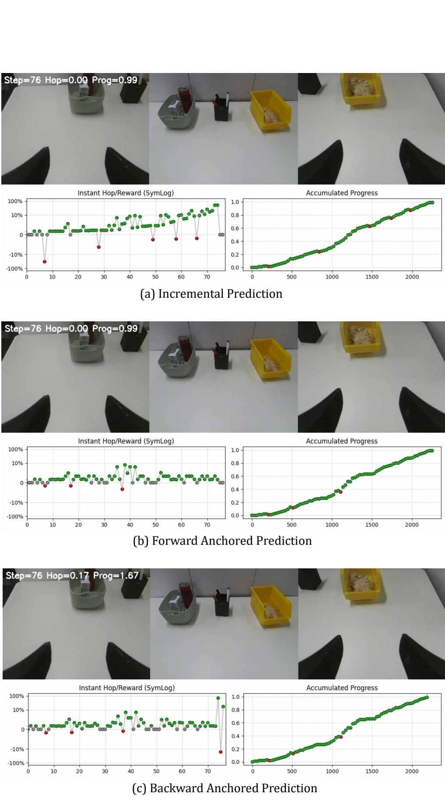
*Figure 12: RoboBrain 2.5 Progress Predictions across three modes: incremental, forward-anchored, backward-anchored.*

> 💡 **Figure 12 批读**: 三种估计模式在未见验证任务上都产生一致的单调 Progress 曲线，验证了多视角融合策略的有效性。

---

**Real-World RL Rollout Visualization.**

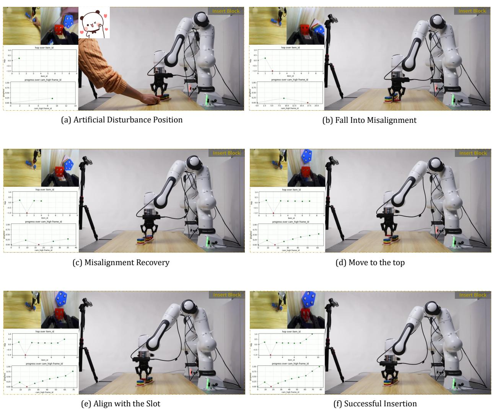
*Figure 13: Robustness to Artificial Disturbance during Real-World Execution. (a) Human interference shifts target. (b) Robot misses → Progress drops. (c-d) Recovery. (e-f) Successful insertion. Policy trained ~20 min, >95% success rate.*

> 💡 **Figure 13 批读**:
> - 这是整篇论文最令人印象深刻的实验——人为干扰下的闭环恢复
> - 人手移动目标 → 机器人错过 → **Progress 立刻大幅下降**（红点）→ 策略自动调整 → 成功完成
> - 只训练了 ~20 分钟就达到 >95% 成功率，说明 Dense Value 作为 RL reward 的高效性
> - 这证明了 RoboBrain 2.5 作为 reward model 在闭环 RL 中的实际价值

---

## B Proof of Bounded Global Progress

> 💡 **B 概览**: 证明 hop-based 迭代更新保证 $\Phi^*(s) \in [0,1]$。用数学归纳法，分正 hop 和负 hop 两种情况。

The proof shows that iteratively applying predicted relative progress hops guarantees $\Phi^{\star}(s) \in [0, 1]$, provided $\Phi^{\star}(s_0) = 0$ and $H \in [-1, 1]$.

**Update rule:**

$$\Phi^{\star}(s_{t}) = \begin{cases} \Phi^{\star}(s_{t-1}) + H \cdot [1 - \Phi^{\star}(s_{t-1})] & \text{if } H \geq 0 \\ \Phi^{\star}(s_{t-1}) + H \cdot \Phi^{\star}(s_{t-1}) & \text{if } H < 0 \end{cases}$$

**Base Case:** $\Phi^{\star}(s_0) = 0 \in [0, 1]$. ✓

**Inductive Step (assume $G = \Phi^{\star}(s_{t-1}) \in [0,1]$):**

- **Case 1 ($H \geq 0$):** $\Phi^{\star}(s_t) = G + H(1-G) = H + G(1-H)$. Since $G, H \in [0,1]$: lower bound $\geq 0$, upper bound $\leq H + (1-H) = 1$. ✓
- **Case 2 ($H < 0$):** $\Phi^{\star}(s_t) = G(1+H)$. Since $H \in [-1,0)$: $(1+H) \in [0,1)$, so $G(1+H) \in [0, 1)$. ✓

> 💡 **证明批读**: 
> - 正 hop 情况：$\Phi^*(s_t) = H + G(1-H)$ 是 $H$ 和 $G$ 的凸组合，自然有界
> - 负 hop 情况：$\Phi^*(s_t) = G(1+H)$ 是 $G$ 乘以 $[0,1)$ 中的因子，必然缩小
> - 直觉：正向前进永远无法超过 1（因为归一化到剩余距离），后退永远无法低于 0（因为归一化到已走距离）
> - 这个性质是 hop formulation 相比朴素 $\Delta\Phi$ 的核心优势

---

## 🔖 Section 总结

### 核心洞察
1. Figure 13（人为干扰恢复）是最有说服力的实验——证明了 Dense Value 在真实闭环 RL 中的价值
2. 不同采样率下 Progress 曲线高度一致（Figure 11），说明模型学会了物理进度而非帧率
3. Bounded progress 证明虽然简单，但保证了实用中不会出现值爆炸
