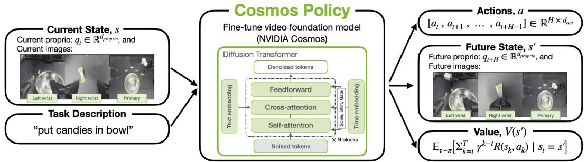

[← 返回 README](../README.md)

# Abstract

## 📌 预览
Cosmos Policy：把预训练视频生成模型（Cosmos-Predict2）直接微调成机器人策略，不改架构、单阶段训练，同时生成动作、未来状态和价值函数。

---

# COSMOS POLICY: FINE-TUNING VIDEO MODELS FOR VISUOMOTOR CONTROL AND PLANNING

Moo Jin Kim¹² Yihuai Gao¹² Tsung-Yi Lin¹ Yen-Chen Lin¹ Yunhao Ge¹ Grace Lam¹ Percy Liang² Shuran Song¹² Ming-Yu Liu¹ Chelsea Finn² Jinwei Gu¹

¹NVIDIA ²Stanford University
https://research.nvidia.com/labs/dir/cosmos-policy/

> 💡 NVIDIA + Stanford 联合团队。Chelsea Finn（机器人学习）+ Ming-Yu Liu（视觉生成）共同指导。一作 Moo Jin Kim 此前做了 OpenVLA 系列，现转向视频模型路线。

*Figure 1: Cosmos Policy 概览。输入多模态观测（多视角图像 + 语言指令 + 本体感知），输出动作序列、未来状态图像和价值。所有输出都编码为 latent frames，复用视频扩散管线生成。*

---

Recent video generation models demonstrate remarkable ability to capture complex physical interactions and scene evolution over time. To leverage their spatiotemporal priors, robotics works have adapted video models for policy learning but introduce complexity by requiring multiple stages of post-training and new architectural components for action generation. In this work, we introduce Cosmos Policy, a simple approach for adapting a large pretrained video model (Cosmos-Predict2) into an effective robot policy through a single stage of post-training on the robot demonstration data collected on the target platform, with no architectural modifications. Cosmos Policy learns to directly generate robot actions encoded as latent frames within the video model's latent diffusion process, harnessing the model's pretrained priors and core learning algorithm to capture complex action distributions. Additionally, Cosmos Policy generates future state images and values (expected cumulative rewards), which are similarly encoded as latent frames, enabling test-time planning of action trajectories with higher likelihood of success. In our evaluations, Cosmos Policy achieves state-of-the-art performance on the LIBERO and RoboCasa simulation benchmarks (98.5% and 67.1% average success rates, respectively) and the highest average score in challenging real-world bimanual manipulation tasks, outperforming strong diffusion policies trained from scratch, video model-based policies, and state-of-the-art vision-language-action models fine-tuned on the same robot demonstrations. Furthermore, given policy rollout data, Cosmos Policy can learn from experience to refine its world model and value function and leverage model-based planning to achieve even higher success rates in challenging tasks. We release code, models, and training data at https://research.nvidia.com/labs/dir/cosmos-policy/.

> 💡 **批注**:
>
> **背景**：Video generation model 已经展现出捕捉复杂物理交互的能力。为了利用它们的时空先验，已有工作将 video model 用于 policy learning（策略学习，即学习从观测到动作的映射），但引入了多阶段后训练和新的模型架构来生成动作。
>
> **方法**：本文提出 Cosmos Policy，在 Cosmos-Predict2 基础上改进，通过单阶段后训练将其变成一个有效的 robot policy。核心思路是把 action 编码成 latent frames，在 video model 的 latent diffusion 过程中生成，从而直接复用模型的预训练先验和扩散去噪算法来捕捉复杂的动作分布。
>
> **额外能力**：Cosmos Policy 还能生成未来 state image 和 value（期望累计奖励），同样编码为 latent frames。这使得 test-time planning 成为可能——采样多条 action trajectory，选 value 最高的执行，提高成功率。
>
> **进一步**：基于 policy rollout 的数据，Cosmos Policy 可以 learn from experience 来优化 world model 和 value function，利用 model-based planning 实现更高成功率。
>
> **结果**：LIBERO 98.5%，RoboCasa 67.1%，真实世界双臂任务最高分。

---

## 🔖 Section 总结

### 关键数字速查
| 指标 | 数值 |
|------|------|
| 基础模型 | Cosmos-Predict2-2B |
| LIBERO 成功率 | 98.5% |
| RoboCasa 成功率 | 67.1% |
| ALOHA 平均分 | 93.6% |
| 规划增益 | +12.5% |

### 核心洞察
1. 视频模型的时空先验比 VLM 的语义先验更适合 low-level 控制
2. 把所有输出统一编码为 latent frames，不需要额外的动作模块
3. 同一架构同时做策略、世界模型、价值函数，支持 test-time planning
