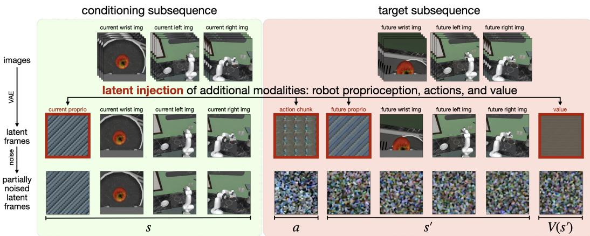

[← 返回 README](../README.md)

# 3. Preliminaries

## 📌 预览
这个 section 介绍两个基础背景：(1) Cosmos 视频模型的架构和训练目标；(2) MDP + 模仿学习的形式化。这些是理解后续 Section 4 方法设计的前提。

---

## Cosmos video model

The pretrained video model that serves as the initialization for Cosmos Policy is Cosmos-Predict2-2B-Video2World (NVIDIA et al., 2025), a latent video diffusion model that receives a starting image and textual description as input and predicts subsequent frames to create a short video. The model operates over continuous tokens encoded by the Wan2.1 spatiotemporal VAE tokenizer (Wan et al., 2025) and is trained using the EDM denoising score matching formulation (Karras et al., 2022). The core training objective for the denoiser network $D_\theta$ at noise level $\sigma$ is: $\mathcal{L}(D_\theta, \sigma) = \mathbb{E}_{\mathbf{x}_0, \mathbf{c}, \mathbf{n}} \left[ \| D_\theta(\mathbf{x}_0 + \mathbf{n}; \sigma, \mathbf{c}) - \mathbf{x}_0 \|_2^2 \right]$, where $\mathbf{x}_0$ is a clean VAE-encoded image sequence, c represents the textual description encoded as T5-XXL embeddings (Raffel et al., 2020), $\mathbf{n} \sim \mathcal{N}(\mathbf{0}, \sigma^2 \mathbf{I})$ is i.i.d. Gaussian noise used to corrupt $\mathbf{x}_0$, and $D_\theta$ is a diffusion transformer (Peebles & Xie, 2023) that learns to recover the clean sample given the corrupted one. $D_\theta$ conditions on c via cross-attention and on $\sigma$ via adaptive layer normalization (Perez et al., 2018; Peebles & Xie, 2023). The Wan2.1 tokenizer compresses a video sequence of size $(1 + T) \times H \times W \times 3$ into a latent sequence of size $(1 + T') \times H' \times W' \times 16$, where $T' = T/4$, $H' = H/8$, $W' = W/8$; these resulting latent frames compose $\mathbf{x}_0$ above. The first frame undergoes no temporal compression to allow for conditioning on a single input image. During training, a conditioning mask is used to ensure that the first latent frame corresponding to the input image remains clean (without noise) while subsequent frames are corrupted with noise.

> 💡 **Cosmos-Predict2-2B 关键技术细节**:
> 
> **模型基本信息**：
> - 模型名：Cosmos-Predict2-2B-Video2World
> - 参数量：2B
> - 类型：Latent Video Diffusion Model
> - 输入：起始图像 + 文本描述 → 输出：后续视频帧
> 
> **核心组件**：
> - **VAE Tokenizer**：Wan2.1 spatiotemporal VAE
>   - 空间压缩：8× (H/8, W/8)
>   - 时间压缩：4× (T/4)，但第一帧不做时间压缩（用于条件输入）
>   - 通道数：16（latent channel dimension）
> - **去噪网络**：Diffusion Transformer (DiT)
>   - 文本条件：T5-XXL embeddings → cross-attention
>   - 噪声级别条件：$\sigma$ → adaptive layer normalization
> - **训练目标**：EDM 去噪分数匹配（denoising score matching）
> 
> **为什么这个设计适合做 policy**：
> - VAE 的 latent space 是连续的 → 适合表示连续动作
> - DiT 能处理序列中的任意 token → 可以自然地加入新的 modality
> - 条件生成机制（conditioning mask）→ 可以控制哪些帧是输入、哪些是要生成的

---

## MDP formulation and imitation learning

We frame robotic manipulation tasks as finite-horizon Markov decision processes (MDPs) defined by the tuple $\langle S, A, T, R, H \rangle$, where $S$ is a set of states, $A$ is a set of actions, $T: S \times A \to \Pi(S)$ is the state transition function, $R: S \times A \to \mathbb{R}$ is the reward function, and $H \in \mathbb{N}$ is the time horizon, with time steps $t \in \{1, 2, \ldots, H\}$. We train a policy $\pi: S \to \Pi(A)$ to maximize rewards, using sparse rewards where $R(s_t, a_t) = 0$ for $t < H$ and terminal rewards $R(s_H, a_H) \in [0, 1]$. We train policies via imitation learning on expert demonstrations containing state-action pairs. Following Zhao et al. (2023), all policies predict action chunks—sequences of actions for multiple timesteps—to improve motion smoothness and success rates.

> 💡 **形式化关键点**:
> - **Sparse reward**：只在最后一步给奖励 $R(s_H, a_H) \in [0, 1]$，中间步骤奖励为 0 → 这对 value function 学习很重要
> - **Action chunks**：不是逐步预测动作，而是一次预测多步动作序列 → ACT (Zhao et al., 2023) 提出的技巧，提升运动平滑性
> - **Imitation learning**：从专家示范学习，不做 RL 探索（至少 base policy 训练阶段不做）

---

*Figure 2: Cosmos Policy 的 latent diffusion 序列。展示了 latent frame injection — 将预训练的 Cosmos-Predict2 适配为可以预测机器人动作、未来状态和价值的策略的主要机制。首先，原始图像被 tokenize 为 latent frames（第一行）。然后，额外的模态直接插入到视频扩散模型的 latent frame 序列中（第二行）。模型被训练对加噪的 latent frames 进行去噪，以 clean frames 为条件（第三行）。*

> 💡 **Figure 2 批读**:
> - **第一行**（Tokenization）：多视角相机图像 → VAE → latent frames
> - **第二行**（Latent Injection）：在 latent 序列中插入新模态（本体感知、动作、价值）的 latent frames
> - **第三行**（Training）：clean frames 作为条件，noised frames 作为去噪目标
> 
> **核心洞察**：latent frame injection 的精妙之处在于：
> 1. 新模态被编码成与图像 latent 同样形状的 tensor → DiT 无法区分"图像 token" 和 "动作 token"
> 2. 因此不需要任何架构修改！DiT 只是在处理一个更长的 latent 序列
> 3. 哪些帧加噪、哪些帧不加噪 → 决定了条件输入和生成目标 → 决定了训练的是 policy、world model 还是 value function

---

## World models and value functions

A world model $\hat{T}: S \times A \to \Pi(S)$ learns to predict the future state given current state and action, approximating the true environment dynamics. The value function for a policy $\pi$ at state $s$ represents expected discounted returns from $s$ under $\pi$. It is defined as $V^\pi(s) = \mathbb{E}_{\tau \sim \pi} \left[ \sum_{k=t}^{H} \gamma^{k-t} R(s_k, a_k) \mid s_t = s \right] = \mathbb{E}_{\tau \sim \pi} \left[ \gamma^{H-t} R(s_H, a_H) \mid s_t = s \right]$ in the sparse reward setting, where $\gamma$ is a discount factor that backpropagates the terminal reward through time. We simply use Monte Carlo returns in this work, labeling each transition in a rollout with the observed return $\gamma^{H-t} R(s_H, a_H)$. Note: To be precise, we acknowledge that the true state is not fully observable, and the world model predicts future observations (robot proprioception and camera images). However, for notational simplicity and readability, we opt to use the term "state" and treat observations as approximations of the state.

> 💡 **Value Function 设计选择**:
> - 用 **Monte Carlo returns**（最简单的方法）：每个 transition 的 value = $\gamma^{H-t} R(s_H, a_H)$
> - 由于是 sparse reward（只有终端奖励），value 本质上就是 "从当前状态出发，成功完成任务的折扣概率"
> - $\gamma$ 的作用：越早的步骤 value 越小（因为 $\gamma^{H-t}$ 衰减），这鼓励模型快速完成任务
> - **简化假设**：用 observation 代替 state（部分可观测），这在实际中是合理的简化

---

## 🔖 Section 总结

### 关键技术组件
| 组件 | 具体实现 |
|------|---------|
| 基础模型 | Cosmos-Predict2-2B (DiT + Wan2.1 VAE) |
| 空间压缩 | 8× |
| 时间压缩 | 4×（第一帧除外）|
| Latent 通道 | 16 |
| 训练目标 | EDM denoising score matching |
| 文本编码 | T5-XXL |
| 奖励 | Sparse terminal reward ∈ [0,1] |
| Value 估计 | Monte Carlo returns |

### 核心洞察
1. Cosmos-Predict2 的 latent space 设计天然适合注入新模态：连续、高维、DiT 处理
2. Sparse reward + MC returns 是最简单的 value 学习方式，但对于长 horizon 任务可能不够准确
3. Figure 2 是理解整个方法的关键图——latent frame injection 是核心创新
