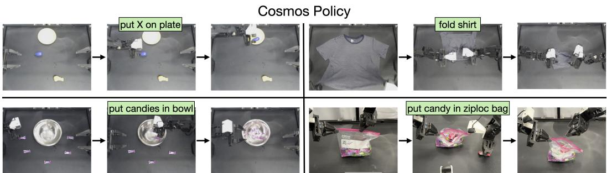

[← 返回 README](../README.md)

# 4. Cosmos Policy: Adapting Video Model for Control & Planning

## 📌 预览
方法核心分三部分：(1) **Latent Frame Injection** — 不改架构，把新模态编码为 latent frames 注入视频扩散序列；(2) **Joint Training** — 用同一架构同时训练 policy、world model、value function；(3) **Model-based Planning** — 从 rollout 数据学习，用 best-of-N 搜索提升成功率。

---

In this section, we discuss how to adapt Cosmos-Predict2 into a unified model that predicts actions, future states, and values. We also discuss leveraging policy rollout data to enable effective planning.

## 4.1 LATENT FRAME INJECTION: INCORPORATING NEW MODALITIES

The original Cosmos-Predict2 model takes as input an image and a textual description to generate a short video for a single camera view. It does not support robot proprioception as input, robot actions or state values as output, nor multiple camera views—all of which are desired or required for manipulation policies.

> 💡 **问题定义**: 原始 Cosmos-Predict2 的能力 vs 做机器人策略需要的能力：
> | | 原始模型 | 策略需要 |
> |--|---------|---------|
> | 输入 | 单张图 + 文本 | 多视角图像 + 本体感知 + 文本 |
> | 输出 | 视频帧 | 动作 + 未来状态 + 价值 |
> | 视角 | 单视角 | 多视角（腕部、第三人称等）|

---

Rather than designing new model components or making architectural modifications as done in prior works, we propose to encode additional modalities as new latent frames that are directly injected into the video model's latent diffusion sequence. Given a $(1 + T') \times H' \times W' \times 16$ sequence of latent frames, which originally correspond to images in a video, we interleave new modalities (robot state, action chunk, and state values) and images from additional camera views by inserting new latent frames between existing image latent frames. For multiple camera viewpoints, the process is simpler: we simply insert the additional camera images at the image sequence level as shown in the top row of Figure 2) (and the model is subsequently fine-tuned to handle these additional viewpoints).

> 💡 **Latent Frame Injection 核心思路**:
> - 视频模型处理的是 latent frames 序列
> - 我们**在序列中间插入新的 latent frames**，分别编码不同模态
> - 对 DiT 来说，这些新插入的 frames 和图像 frames 是一样的 tensor → 不需要架构修改
> - 多视角：直接在图像序列层面插入额外相机图像
> - 新模态（动作、本体感知、价值）：把低维向量 normalize 到 [-1, +1]，然后 duplicate 填满一个 latent volume

---

We now discuss an illustrative example of latent injection for incorporating new modalities. For a robotic platform with two static third-person cameras and a wrist-mounted camera, our latent sequence contains 11 latent frames: (1) a blank placeholder, (2) robot proprioception (e.g., end-effector pose or joint angles), (3) wrist camera image, (4) first third-person camera image, (5) second third-person camera image, (6) action chunk, (7) future robot proprioception, (8) future wrist camera image, (9) future first third-person camera image, (10) future second third-person camera image, and (11) future state value. Among these, (2), (6), (7), and (11) represent new modalities while (3), (5), (8), and (10) represent additional camera views (assuming that the first third-person camera is the "primary" camera). To encode the new modalities as latent frames, we fill each $H' \times W' \times C'$ latent volume with normalized and duplicated copies of the robot proprioception, action chunk, or value (where normalization simply consists of rescaling to $[-1, +1]$). See Figure 2 for an illustration. This ordering of modalities in the sequence represents $(s, a, s', V(s'))$, and it allows for autoregressive decoding of actions, future state, and future state value from left to right (see Section 4.2 for further discussions on this). Note that $s$ and $s'$ only consist of the observations at time $t$ and $t + K$, respectively, where $K$ is the action chunk size. In other words, we do not use input history nor predict future frames across multiple subsequent timesteps. Lastly, latent injection is flexible and can be adapted for any particular robot setup: for example, for a robot with only one third-person camera, one can simply remove the latent frames corresponding to additional camera viewpoints, and this would result in only seven total latent frames.

> 💡 **11-frame 序列详解**:
> ```
> 当前状态 s:
>   [1] blank placeholder
>   [2] robot proprioception (joints/EE pose)  ← 新模态
>   [3] wrist camera image
>   [4] third-person camera 1 image
>   [5] third-person camera 2 image
> 
> 动作 a:
>   [6] action chunk (K steps)  ← 新模态
> 
> 未来状态 s':
>   [7] future robot proprioception  ← 新模态
>   [8] future wrist camera image
>   [9] future third-person camera 1 image
>   [10] future third-person camera 2 image
> 
> 价值:
>   [11] V(s')  ← 新模态
> ```
> 
> **编码方式**（以 action chunk 为例）：
> 1. Action chunk: $K \times d_{act}$ → flatten → $(K \times d_{act})$ 向量
> 2. Normalize 到 [-1, +1]
> 3. Duplicate 到 $H' \times W' \times C'$ 大小 → 一个 latent frame
> 
> **关键设计选择**：
> - 序列顺序是 $(s, a, s', V(s'))$ → 支持 left-to-right autoregressive decoding
> - 只看当前和未来一步（不用历史、不预测多步）→ 简化了问题
> - **Blank placeholder**: 因为 Wan2.1 VAE 对第一帧做特殊处理（无时间压缩），所以用空白帧占位

---

## 4.2 JOINT TRAINING OF POLICY, WORLD MODEL, & VALUE FUNCTION

**Implementing joint training objectives.** Now that we have a latent diffusion scheme that incorporates additional modalities and camera views that are compatible with robotic policy learning, we can adapt the video model into a policy by training on robot data. For each training step, we sample a batch of $(s, a, s', V(s'))$ tuples. 50 percent of the batch is sampled from the demonstrations dataset and is used to train the policy ($p(a, s', V(s') | s)$), while the other 50 percent is sampled from the rollouts dataset and is split into two halves: one half for training the world model ($p(s', V(s') | s, a)$) and the other half for training the value function ($p(V(s') | s, a, s')$). The conditioning scheme—i.e., which part of the latent diffusion sequence is used as conditioning and which part is used as the target to generate—determines which of these three functions is being trained (see Figure 12 for more details). Initially, the rollouts dataset is simply a superset of the demonstrations dataset that also includes failed demonstrations, if they exist. (Failed demonstrations are those that do not successfully complete the task when replayed in the environment due to human error during data collection, e.g., in the LIBERO and RoboCasa simulations where roughly 10 to 20 percent of demonstrations fail when replayed. In certain environments where teleoperation data is collected more carefully, such as our real-world ALOHA environment, failed demonstrations do not exist; in this case, the demonstrations dataset and rollouts dataset are equal.)

> 💡 **联合训练方案**:
> 
> **Batch 分配**（初始训练阶段）：
> ```
> 50% batch → Policy 训练: p(a, s', V(s') | s)
>   └── 数据来源: demonstrations dataset
>   └── 条件: s (clean) → 生成目标: a, s', V(s')
> 
> 25% batch → World Model 训练: p(s', V(s') | s, a)  
>   └── 数据来源: rollouts dataset
>   └── 条件: s, a (clean) → 生成目标: s', V(s')
> 
> 25% batch → Value Function 训练: p(V(s') | s, a, s')
>   └── 数据来源: rollouts dataset
>   └── 条件: s, a, s' (clean) → 生成目标: V(s')
> ```
> 
> **精妙之处**：
> 1. 三个目标共享同一个模型，只通过 **conditioning mask** 来区分训练的是哪个功能
> 2. Policy 训练有 **auxiliary targets**：不只学 $p(a|s)$，而是学 $p(a, s', V(s') | s)$ → 联合预测未来状态和价值提供额外监督
> 3. Rollouts dataset 初始就是 demonstrations（含失败样本）→ 不需要额外数据
> 
> **关于失败样本**：
> - LIBERO/RoboCasa 约 10-20% 的示范在 replay 时会失败 → 这些 "失败" 数据对训练 world model 和 value function 非常有价值
> - ALOHA 的遥操作数据更精心收集，没有失败样本

---

Note that policy and world model training involves auxiliary targets, i.e., the policy is trained to model not just $p(a|s)$ but rather $p(a, s', V(s') | s)$, and the world model learns not just $p(s'|s, a)$ but rather $p(s', V(s') | s, a)$. We find in Section 5.2 that the auxiliary supervision improves policy performance. Also, note that the $V(s')$ predictions are conditioned on the full latent prefix (i.e., all of $(s, a, s')$) during initial Cosmos Policy training. However, when we later fine-tune this base checkpoint on policy rollout data to produce a model with more accurate future state and value predictions, we can choose to condition the value generation on a subset of $(s, a, s')$ via input masking. The choice of the input mask determines whether the value function represents the state value $V(s')$ or state-action value $Q(s, a)$; we compare these variations in planning experiments (Section 5.3).

> 💡 **Auxiliary Supervision 的效果**:
> - 去掉 auxiliary losses → LIBERO 平均成功率下降 1.5%（Table 4）
> - 这说明联合预测未来状态对 policy 学习有正面影响
> - 直觉上，预测未来状态迫使模型理解 "action 导致什么后果"，这对学习好的 action 有帮助
> 
> **V(s') vs Q(s,a)** 的选择：
> - 在 planning 阶段，可以选择用什么做条件来预测 value
> - $V(s')$: mask 掉 $(s, a)$，只看未来状态 → 需要 world model 先预测未来状态
> - $Q(s, a)$: mask 掉 $s'$，只看当前状态和动作 → model-free，不需要 world model
> - 实验表明 $V(s')$ 更好（Section 5.3）

---

**Parallel vs. autoregressive decoding.** Since Cosmos Policy learns to both jointly and conditionally predict the targets $(a, s', V(s'))$ based on apportioned training samples, it can generate actions, future states, and values either jointly in parallel or autoregressively from left to right. Parallel decoding offers greater speed, while autoregressive decoding may provide higher-quality predictions and allow for separate checkpoints to be used for the policy versus the world model and value function. For direct policy evaluation without planning, only the actions are required for task execution, while the latter two outputs can be discarded. Therefore, we use parallel decoding in this case. For evaluations with planning, we enable autoregressive decoding for higher-quality future state and value predictions.

> 💡 **两种解码模式**:
> | 模式 | 速度 | 质量 | 使用场景 |
> |------|------|------|---------|
> | Parallel | 快 | 一般 | 直接策略执行（只用 action） |
> | Autoregressive (L→R) | 慢 | 高 | Planning（需要高质量的 s' 和 V 预测）|
> 
> 这个设计很灵活：同一个模型，根据需求选择不同的解码方式。

---


*Figure 3: Cosmos Policy 在 ALOHA 机器人任务中的表现。Cosmos Policy 能成功执行需要长 horizon、高精度操作且动作多模态性高的真实世界机器人控制任务。*

> 💡 **Figure 3 批读**:
> - 展示了 4 个 ALOHA 双臂任务的执行过程
> - **Put X on plate**: 语言指令条件化 → 测试语言跟随能力
> - **Fold shirt**: 多步骤折叠 T 恤 → 测试长 horizon 接触丰富的操作
> - **Put candies in bowl**: 收集散落的糖果 → 测试多模态抓取序列
> - **Put candy in ziploc bag**: 打开并将物品放入密封袋 → 测试毫米级精度操作
> - 这些任务的难度递增，后两个尤其具有挑战性

---

## 4.3 PLANNING WITH COSMOS POLICY'S WORLD MODEL AND VALUE FUNCTION

Cosmos Policy can be deployed as (1) a direct policy without planning or (2) a planning policy using future state and value predictions to search for higher-quality actions. However, training on demonstrations alone is insufficient for effective planning since the data only covers successful outcomes, which means that the world model and value function see a narrow state-action distribution and may struggle to generalize beyond that distribution. We thus find it critical to collect policy rollout data and learn from these experiences.

> 💡 **为什么只有 demonstrations 不够做 planning?**
> - Demonstrations 几乎全是成功的轨迹
> - World model 只见过 "正确操作导致成功" → 对 "错误操作导致什么" 没有概念
> - Value function 只见过 V ≈ 1 的样本 → 无法区分好动作和坏动作
> - **因此需要 rollout data**：包含成功和失败的经验 → world model 和 value function 才能学到有区分度的预测

---

**Learning from rollout experiences.** We collect rollout data by deploying Cosmos Policy in diverse initial conditions and recording the trajectory as well as the episode outcome (success/fail or a fractional score). Given the rollout dataset, we fine-tune our Cosmos Policy checkpoint, with heavier weighting on the world model and value function predictions: 90 percent of each training batch is split evenly between training the world model and value function, while only 10 percent is used to train the policy.

> 💡 **Rollout 微调方案**:
> ```
> 初始训练 batch 分配:  Policy 50% | WM 25% | VF 25%
> Rollout 微调 batch 分配:  Policy 10% | WM 45% | VF 45%
> ```
> 重心从 policy → world model + value function，因为 policy 已经足够好了，现在需要提升规划能力。

---

Once we have the fine-tuned checkpoint for refined world modeling and policy learning, we propose dual deployment: the original Cosmos Policy checkpoint serves as the policy (we thus call it the "policy model"), while the refined checkpoint serves as the world model and value function (we thus call it the "planning model"). This ensures that the refined world model and value function are trained on on-policy data collected by the original policy.

> 💡 **Dual Deployment 策略**:
> ```
> Policy Model (原始 checkpoint)  →  生成候选动作
>              ↓
> Planning Model (rollout 微调版)  →  预测未来状态 + 评估价值
>              ↓
> 选择最高价值的动作执行
> ```
> 
> **为什么要分开？** Planning model 是在 policy model 的 rollout 数据上训练的 → 是 **on-policy** 的 → world model 预测更准确。如果用同一个 checkpoint 既生成动作又做规划，可能会产生 distribution mismatch。

---

**Model-based planning.** Given the policy model and the planning model, we implement best-of-N sampling as follows: (1) sample multiple action proposals from the policy, (2) use the planning model to predict the future state and value for each proposal, (3) select and deploy the action that leads to the predicted state with the highest predicted value. For greater accuracy and better modeling of potentially multimodal future state and value distributions, we ensemble the predictions by querying the world model three times per action and the value function five times per future state, resulting in fifteen total value predictions for each action proposal. We aggregate these via "majority mean": we determine whether the majority predict success or failure (via a fixed threshold) and then average values within the majority group. This approach is more robust to outliers than naive averaging when value predictions are bimodal or exhibit high variance.

> 💡 **Best-of-N Planning 详解**:
> ```
> 对每个候选动作 a_i (共 N 个):
>   1. World Model 预测 3 次 → 3 个 s'_j
>   2. 对每个 s'_j，Value Function 预测 5 次 → 5 个 V_k
>   3. 共 15 个 value 预测
>   4. "Majority Mean": 
>      - 判断多数预测是成功还是失败（二值化）
>      - 取多数组的平均值作为最终 value
> 选择 value 最高的 a_i 执行
> ```
> 
> **Majority Mean 的直觉**：
> - 如果 15 个预测中 10 个说成功（V > threshold），5 个说失败
> - 取 10 个 "成功" 预测的平均值，忽略 5 个 "失败" 预测
> - 比简单平均更鲁棒：避免少数极端值拉偏结果

---

To speed up the search process, we use parallelized inference, using N GPUs in best-of-N sampling. We also execute the full action chunk (rather only part of it, as done in receding-horizon control) to avoid further increases in computational cost.

> 💡 **计算开销**:
> - Best-of-8 搜索，8 个 H100 GPU 并行 → 约 4.9 秒生成一个 action chunk
> - 执行完整 action chunk（ALOHA: 2 秒 = 50 步 @ 25Hz）
> - 总延迟 = 4.9s 搜索 + 2s 执行 ≈ 7s per chunk
> - **这个速度对动态任务来说偏慢**，是主要局限之一

---

## 🔖 Section 总结

### 方法三件套
| 组件 | 机制 | 创新点 |
|------|------|--------|
| Latent Frame Injection | 新模态 → normalize → duplicate → 替换 placeholder latent | 不改架构 |
| Joint Training | conditioning mask 决定训练目标 | 一个模型三个功能 |
| Model-based Planning | best-of-N + dual deployment | rollout data 提升规划 |

### 核心洞察
1. **Latent Frame Injection** 是最核心的设计：把所有模态统一到 latent space，让 DiT 一视同仁地处理
2. **Joint training 的 auxiliary supervision** 很重要：联合预测未来状态帮助 policy 学习（+1.5%）
3. **Dual deployment** 解决了 on-policy/off-policy 的矛盾
4. **计算开销**是主要局限：planning 需要 8 GPU × 4.9s，不适合实时控制
