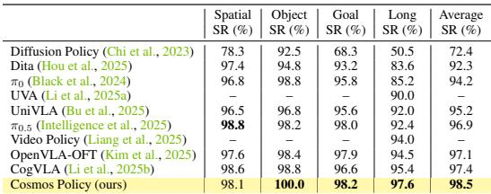
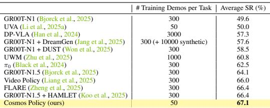
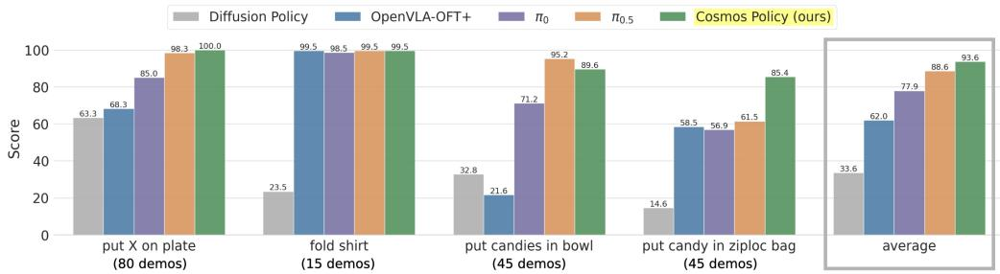
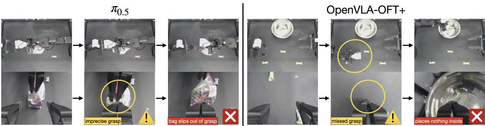
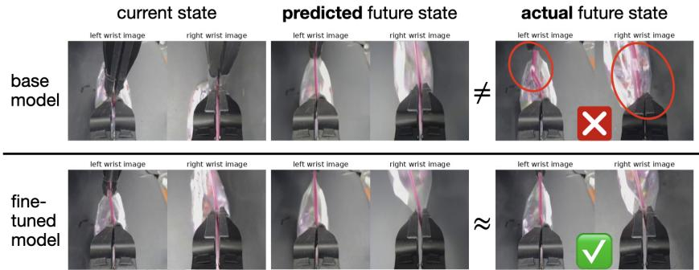
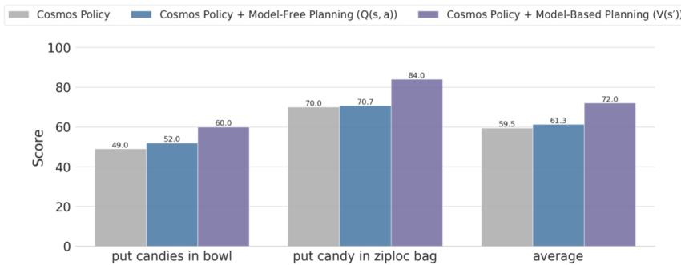

[← 返回 README](../README.md)

# 5. Experiments

## 📌 预览
实验部分回答四个问题：(Q1) 作为直接策略，Cosmos Policy 与 SOTA 的比较；(Q2) 各组件的重要性（消融）；(Q3) 结合 rollout 经验的 model-based planning 是否有效；(Q4) Model-based vs model-free planning 哪个更好。评估覆盖 LIBERO、RoboCasa 仿真和真实世界 ALOHA 双臂任务。

---

We evaluate Cosmos Policy to answer four key questions: (Q1) How does Cosmos Policy compare with state-of-the-art imitation learning policies when used as a direct policy? (Q2) How important are different components of Cosmos Policy? (Q3) Can Cosmos Policy leverage rollout experiences and learn an accurate world model and value function for effective planning? (Q4) Is it more effective to search using a world model and state value function or a Q-value function (a model-free variation)? We answer these through simulated and real-world evaluations spanning single-arm and dual-arm manipulation tasks.

---

## 5.1 EXPERIMENTAL SETUP

We now describe the three task suites used in our evaluations. Note that further training and evaluation details are available in Appendices A.2 and A.3.

### LIBERO simulation benchmark

The LIBERO benchmark (Liu et al., 2024) consists of a variety of environments and tasks featuring a single Franka Emika Panda robot arm. The four primary task suites include LIBERO-Spatial, LIBERO-Object, LIBERO-Goal, and LIBERO-Long (also called LIBERO-10); these assess a policy's ability to handle different spatial layouts, objects, language-specified goals, and long-horizon tasks, respectively. Each task suite provides a training dataset of 500 total demonstrations (10 tasks and 50 demonstrations each). Following Kim et al. (2024), we filter unsuccessful demonstrations for policy training but use the full unfiltered set for world model and value function training.

> 💡 **LIBERO 数据处理策略**:
> - Policy 训练：过滤掉失败样本（只要成功的示范）
> - World model / Value function 训练：用全量数据（包括失败的）
> - 这个 split 很聪明：policy 应该学成功经验，world model 应该学 "什么导致成功、什么导致失败"

---

### RoboCasa simulation benchmark

The RoboCasa benchmark (Nasiriany et al., 2024) consists of 24 static kitchen manipulation tasks featuring a single Franka Emika Panda robot arm. We follow the evaluation protocol of several prior works (Nasiriany et al., 2024; Bjorck et al., 2025; Zheng et al., 2025; Han et al., 2024; Jang et al., 2025; Liang et al., 2025). Specifically, for each task, success rate is evaluated over 50 trials across five evaluation scenes with different floor plans and styles (10 trials per scene), and the average success rate is computed across all 24 tasks over 3 random seeds (3600 trials total). Unlike LIBERO evaluations, the RoboCasa evaluations only consist of unseen object instances, and two of the five scenes per task include styles never encountered in the training data.

> 💡 **RoboCasa 评估比 LIBERO 更严格**:
> - 24 个厨房操作任务 × 50 trials × 3 seeds = 3600 trials
> - 所有评估用**未见过的物体实例**
> - 5 个场景中有 2 个是**训练中从未见过的风格** → OOD 泛化测试
> - 这使得 67.1% 的成绩更令人印象深刻

---

The benchmark provides a set of 50 human-teleoperated demonstrations for each task and an additional set of 1000 demonstrations generated via MimicGen (Mandlekar et al., 2023), and prior works have shown clear increases in success rates from using larger training datasets (Nasiriany et al., 2024; Bjorck et al., 2025; Zheng et al., 2025; Liang et al., 2025; Jang et al., 2025). However, to assess the relative data efficiency of Cosmos Policy compared to prior works, we train our method on the 50 human-teleoperated demonstrations alone. Similar to LIBERO data preprocessing, we filter unsuccessful demonstrations for policy training but use the full unfiltered dataset for world model and value function training.

> 💡 **数据效率亮点**:
> - 其他方法用 300-3000 个 demo（含 MimicGen 合成数据）
> - Cosmos Policy **只用 50 个人类遥操作 demo** → 仍然 SOTA
> - 这说明视频模型的预训练先验大幅减少了对训练数据的需求

---

### Real-world ALOHA robot tasks

The ALOHA platform (Zhao et al., 2023) consists of two ViperX 300 S robot arms with three cameras: one top-down and two wrist-mounted. We reduce the controller frequency from 50Hz to 25Hz for computational efficiency. All policies take as input robot proprioceptive state (14 joint angles), three camera images, and task descriptions, predicting action chunks of 50 timesteps (2 seconds). We deploy the full action chunk before requerying the policy.

Our evaluation suite consists of four challenging bimanual manipulation tasks (shown in Figure 3): (1) "put X on plate" (80 demos): place objects on a plate based on language instructions, testing language following; (2) "fold shirt" (15 demos): fold one of three T-shirts in multiple steps, testing long-horizon contact-rich manipulation; (3) "put candies in bowl" (45 demos): collect scattered candies, testing ability to handle multimodal grasp sequences; and (4) "put candy in ziploc bag" (45 demos): open and place items in a ziploc slider bag, testing high-precision manipulation with millimeter tolerance.

> 💡 **ALOHA 任务设计分析**:
> 
> | 任务 | Demo 数 | 测试能力 | 难度核心 |
> |------|---------|---------|---------|
> | Put X on plate | 80 | 语言跟随 | 语义理解 |
> | Fold shirt | 15 | 长 horizon + 接触丰富 | 多步骤精确控制 |
> | Put candies in bowl | 45 | 多模态动作分布 | 需要选择抓哪个糖果 |
> | Put candy in ziploc bag | 45 | 毫米级精度 | 滑块抓取 + 袋口操作 |
> 
> - 所有 policy 在**同一份 185 个 demo** 上训练（4 个任务合并），**单个模型处理所有任务**
> - 101 总 trials，包含 in-distribution 和 OOD 测试

---

The evaluations consist of both in-distribution and out-of-distribution testing conditions, with 101 trials total per method across all tasks. We ensure fair comparison between methods by using the same fixed set of initial states for each method.

---

*Table 1: LIBERO 仿真基准结果。4 个 LIBERO 基准任务套件的成功率 (SR)。Cosmos Policy 的成功率在每个套件的 500 次试验（10 个任务 × 50 轮）和 3 个随机种子（共 6000 次试验）上取平均。*

> 💡 **Table 1 批读**:
> - **Cosmos Policy: 98.5% 平均成功率** → 新 SOTA
> - 特别突出的是 **LIBERO-Long (97.6%)**，比第二名 CogVLA (95.4%) 高 2.2%
> - LIBERO-Object 达到 **100.0%**
> - 对比梯度：
>   - Diffusion Policy (72.4%) → π₀ (94.2%) → π₀.₅ (96.9%) → OpenVLA-OFT (97.1%) → CogVLA (97.4%) → **Cosmos Policy (98.5%)**
> - 在这个已经接近饱和的 benchmark 上还能提升，说明视频模型先验确实有效

---

*Table 2: RoboCasa 仿真基准结果。24 个厨房操作任务的成功率 (SR)。Cosmos Policy 的成功率在每个任务的 50 次试验和 3 个随机种子（共 3600 次试验）上取平均。*

> 💡 **Table 2 批读**:
> - **Cosmos Policy: 67.1% 平均成功率，只用 50 个 demo** → SOTA
> - 对比数据用量：
>   - GR00T-N1 (300 demo): 49.6%
>   - π₀ (300 demo): 62.5%
>   - Video Policy (300 demo): 66.0%
>   - FLARE (300 demo): 66.4%
>   - **Cosmos Policy (50 demo): 67.1%** ← 数据量是别人的 1/6
> - **数据效率是这张表最重要的发现**：用 6 倍少的数据超过所有方法
> - UVA 虽然也用 50 demo，但只有 50.0% → Cosmos Policy 的预训练先验优势明显

---

*Figure 4: 真实世界 ALOHA 机器人评估结果。我们在 4 个任务上评估 SOTA 策略，测量分数（每个任务的平均完成百分比）。Cosmos Policy 总体得分最高，在 4 个任务中的 3 个任务上超过所有其他方法。*

> 💡 **Figure 4 批读**:
> - Cosmos Policy 总体平均 **93.6%** → 最高
> - 在最具挑战性的两个任务上优势明显：
>   - Put candies in bowl: Cosmos Policy >> π₀.₅ >> π₀ >> OpenVLA-OFT+
>   - Put candy in ziploc bag: Cosmos Policy >> OpenVLA-OFT+ >> π₀ ≈ π₀.₅
> - **Diffusion Policy** 在所有任务上都表现最差 → 从头训练的小模型确实不够
> - π₀.₅ 在 fold shirt 上与 Cosmos Policy 持平，但在 ziploc bag 上差距很大

---

## 5.2 COMPARING AGAINST STATE-OF-THE-ART IMITATION POLICIES WITHOUT PLANNING

Here we aim to answer questions Q1 and Q2 posed in the beginning of this section. We answer Q1 by comparing Cosmos Policy as a direct policy (without planning) with state-of-the-art imitation learning policies and assessing their relative effectiveness. We answer Q2 by ablating various components of Cosmos Policy and analyzing the resulting effects on task performance.

**Methods in comparison.** In LIBERO and RoboCasa, we compare against recent top-performing methods including diffusion-based policies trained from scratch (Diffusion Policy (Chi et al., 2023), Dita (Hou et al., 2025)), video model-based policies (UVA (Li et al., 2025a), UWM (Zhu et al., 2025), Video Policy (Liang et al., 2025)), and fine-tuned VLA models (π₀, π₀.₅, OpenVLA-OFT, CogVLA, UniVLA, DP-VLA (Han et al., 2024), GR00T-N1.5 (Bjorck et al., 2025)). In real-world ALOHA evaluations, we compare against a competitive subset of policies that have demonstrated strong performance in real-world bimanual manipulation tasks: Diffusion Policy, OpenVLA-OFT⁺, π₀, and π₀.₅.

---

**Results.** Tables 1 and 2 show the performance of Cosmos Policy and prior works in LIBERO and RoboCasa, respectively, while Figure 4 shows performance on the ALOHA robot. We find that Cosmos Policy achieves highest overall performance in all three domains, while establishing a new state of the art in the LIBERO and RoboCasa benchmarks with 98.5% and 67.1% average success rates, respectively. These results demonstrate Cosmos Policy's strong multi-task manipulation performance in both in-distribution and out-of-distribution generalization scenarios. In addition, in ALOHA robot evaluations, we find that Cosmos Policy outperforms fine-tuned VLAs π₀.₅ and OpenVLA-OFT+—which have been pretrained on large amounts of robotic imitation data—despite not having benefited from similar large-scale action supervision. This finding suggests that video model priors provide a strong initialization for control policies without requiring additional action-labeled robot data. Sample Cosmos Policy rollouts are visualized in Figure 3.

> 💡 **关键发现**:
> 1. **三个域全 SOTA**：LIBERO, RoboCasa, ALOHA 全部第一
> 2. **超越大规模预训练 VLA**：π₀.₅ 和 OpenVLA-OFT+ 都在大规模机器人数据上预训练过，Cosmos Policy 没有 → 说明 video prior > action-labeled data
> 3. **ID 和 OOD 都强**：ALOHA in-distribution 96.3%, OOD 89.3%

---

Qualitatively, we find that while the fine-tuned VLAs show strong performance on the first two tasks, they encounter difficulties in the last two tasks—"put candies in bowl" and "put candy in ziploc bag"—which require handling high action multimodality and executing high-precision grasps, respectively. Figure 5 visualizes two common failure modes of π₀.₅ and OpenVLA-OFT⁺: (1) π₀.₅, despite showing highly competitive performance on the first three tasks, struggles to reliably handle the ziploc bag, often missing the initial grasp of the slider with the right arm or not grasping the left side of the bag securely enough with the left arm. (2) OpenVLA-OFT+ often reaches in between two candies rather than directly going for one; we hypothesize that its L1 regression of actions leads to inaccurate modeling of the action distribution in tasks with high multimodality. Compared to these methods, Cosmos Policy handles both high multimodality and high precision with substantially greater reliability.

> 💡 **失败模式分析——非常有洞察力**:
> - **π₀.₅ 的问题**：在高精度任务（ziploc bag）上抓不住滑块 → 可能是因为 VLM backbone 的空间分辨率不够？
> - **OpenVLA-OFT+ 的问题**：在多模态任务（candies）上会 "折中"——手伸向两个糖果的中间位置
>   - 原因：L1 regression 倾向于预测多模态分布的均值 → 实际上是两个抓取目标的中间点
>   - 这是 mode-averaging 的经典问题，diffusion-based 方法天然避免了这个问题
> - **Cosmos Policy 的优势**：diffusion process 能建模多模态分布 → 每次采样一个 mode 而非 average

---

*Figure 5: π₀.₅ 和 OpenVLA-OFT⁺ 在两个具有挑战性的 ALOHA 任务上的常见失败模式。左：π₀.₅ 难以执行高精度抓取，失去对 ziploc 袋的抓握。右：OpenVLA-OFT⁺ 伸向两个糖果之间而非朝向其中一个，暗示其在建模高度多模态的动作分布时存在困难。*

> 💡 **Figure 5 批读**:
> - 左图（π₀.₅）：右臂试图抓滑块但没抓稳 → 后续操作全部失败
> - 右图（OpenVLA-OFT+）：手伸向两颗糖果的中间 → mode averaging 的直接可视化
> - 这两个失败模式分别代表了两类根本性挑战：精度和多模态性

---

*Figure 6: World model 预测对比：base Cosmos Policy vs 微调后的 checkpoint。上：base Cosmos Policy 的 world model 可能无法预测错误情况（如失去对 ziploc 袋滑块的抓握），因为它只在 demonstrations 上训练。下：在 policy rollout 数据上微调后，world model 更准确地预测了结果状态，实现更有效的规划和最终的成功。*

> 💡 **Figure 6 批读**:
> - **上排**（只在 demo 训练）：world model 预测 "一切正常"，即使实际执行会失败 → 过于乐观
> - **下排**（rollout 微调后）：world model 能预测 "如果这样做，会失去抓握" → 能区分好动作和坏动作
> - **这是 planning 有效的关键前提**：world model 必须能准确预测失败情况

---

**Ablation experiments.** Recall from Section 4.2 that Cosmos Policy's policy and world model training involves additional targets which provide additional supervision: the policy learns to jointly predict $p(a, s', V(s') | s)$ instead of $p(a|s)$, and the world model learns to jointly predict $p(s', V(s') | s, a)$ instead of $p(s'|s, a)$. To evaluate the effect of these auxiliary learning objectives, we train a version of Cosmos Policy without them by masking the loss on the additional targets. In addition, we assess the importance of the video model priors by training Cosmos Policy from randomly initialized weights. We use the same number of gradient steps as the full policy for both of these variants. As shown in Table 4, removing the auxiliary losses leads to a 1.5% absolute drop in average success rate while training from scratch leads to a 3.9% drop, suggesting that these components are important for maximal performance. We further evaluate Cosmos Policy trained from scratch on the ALOHA robot for additional supporting evidence and find that it obtains an average score of 80.8 on the "fold shirt" task, which is 18.7 points lower than the full Cosmos Policy. Qualitatively, the from-scratch variant exhibits jerky motions that may damage the robot over prolonged deployment, so we halt further evaluations with it. Additional ablation studies on the Cosmos Policy design and joint training scheme are discussed in Appendix A.4.1.

> 💡 **消融实验总结**:
> 
> | 变体 | LIBERO 平均 SR | 下降 |
> |------|-------------|------|
> | Full Cosmos Policy | 98.5% | — |
> | w/o auxiliary losses | 97.0% | -1.5% |
> | w/o pretrained model (从头训) | 94.6% | -3.9% |
> 
> **解读**：
> - 预训练权重贡献 3.9%，auxiliary supervision 贡献 1.5%
> - 预训练的影响更大 → 视频模型的 spatiotemporal prior 是核心优势
> - 从头训的版本动作生硬（jerky），可能损坏机器人 → **预训练不仅提升性能，还改善动作质量**

---

## 5.3 EVALUATIONS OF COSMOS POLICY WITH MODEL-BASED PLANNING

Here we aim to answer Q3 by evaluating Cosmos Policy when deployed with model-based planning (as described in Section 4.3), and Q4 by analyzing how the proposed model-based approach compares different variants of planning, such as directly learning a Q-value function without a world model. Since our base Cosmos Policy already obtains high success rates in LIBERO and on the first two ALOHA robot tasks, we focus our study on the last two more challenging ALOHA robot tasks ("put candies in bowl" and "put candy in ziploc bag"), where there is more room for improvement. Further, we focus on a more challenging set of initial conditions (difficult in-distribution conditions and OOD conditions) and assess whether planning can enhance performance in these settings.

**Rollout data collection.** To refine Cosmos Policy's world model and value function predictions and enable more effective planning, we gather a rollout dataset that we use for post-training. Conveniently, by running the prior direct policy evaluations, we have already aggregated 505 policy rollouts across all policies. Adding to this, we collect 143 more rollouts from Cosmos Policy for the "put candy in ziploc bag" task. The additional episodes are important for this task since training an accurate world model for it is particularly challenging due to low camera observability from the robot's self-occlusion and highly stochastic environment dynamics where even millimeter differences in control can dictate success or failure. We fine-tune the base Cosmos Policy checkpoint on this pool of 648 rollouts to produce a refined "planning model" for world modeling and value prediction, as described in Section 4.3.

> 💡 **Rollout 数据来源**:
> - 505 rollouts（来自之前所有 policy 的评估） + 143 额外 rollouts（Cosmos Policy 自己跑的）
> - 共 648 rollouts → 用于微调 planning model
> - **聪明的做法**：复用了评估实验的数据，不需要额外的数据收集流程
> - Ziploc bag 任务特别需要额外数据：因为自遮挡和高度随机性

---

**Comparing different value function formulations.** When fine-tuning the base Cosmos Policy checkpoint on the rollout dataset, we use three independent formulations for value function training by using input masks to condition the value predictions on different subsets of inputs: $V(s')$ (mask out $(s, a)$) or $Q(s, a)$ (mask out $s'$). The $V(s')$ variant requires a world model to predict the future state before the value can be estimated, while the $Q(s, a)$ variant enables model-free planning by directly predicting Q-values without future state predictions.

---

*Figure 7: Model-based planning 结果。我们在两个具有挑战性的 ALOHA 任务的困难初始状态上评估 base Cosmos Policy，并与两种 planning 变体（model-based 和 model-free）进行比较。model-based 变体 (V(s')) 整体性能最高。*

> 💡 **Figure 7 批读**:
> - **Put candies in bowl**:
>   - Base (no planning): ~74
>   - V(s') (model-based): ~86 (+12)
>   - Q(s,a) (model-free): ~78 (+4)
> - **Put candy in ziploc bag**:
>   - Base (no planning): ~72
>   - V(s') (model-based): ~85 (+13)  
>   - Q(s,a) (model-free): ~81 (+9)
> - **平均提升约 12.5%**
> 
> **为什么 V(s') > Q(s,a)?**
> - V(s') 利用了 world model 预测的未来状态 → 额外的信息源
> - Q(s,a) 直接从 (s, a) 预测价值 → 输入维度高，更难学
> - 在有限的 rollout 数据下，model-based 方法更 sample-efficient

---

**Results.** We observe that model-based planning using the $V(s')$ formulation consistently improves success rates over the base Cosmos Policy without planning, as shown in Figure 7. In ALOHA tasks, we observe a 12.5-point average score increase in the two challenging manipulation tasks which involve multimodal grasp sequences and high-precision manipulation. This is a notable improvement given the limited amount of rollout data available for refining the planning model. Qualitatively, we find that the fine-tuned planning model predicts future states more accurately (see Figure 6) and can plan more effectively, ultimately avoiding making mistakes that the base Cosmos Policy makes, such as losing grasp of the slider while opening the ziploc bag. When comparing model-based ($V(s')$) versus model-free ($Q(s, a)$) planning variants, we observe higher performance with the former, which we attribute its ability to leverage learned environment dynamics for more effective and sample-efficient planning. Given a limited amount of rollout data, we expect difficulty with learning an accurate Q-function and suspect that the model may also overfit given higher input dimensionality.

> 💡 **Planning 结果的核心洞察**:
> 1. Model-based planning 在困难任务上显著有效（+12.5%）
> 2. World model 微调后能预测失败情况 → 帮助避免错误
> 3. Model-based > Model-free：在有限数据下，利用学到的 dynamics 更高效
> 4. **局限**：需要 648 个 rollouts，需要 8 GPU，搜索耗时 ~5s → 实际部署成本高

---

## 🔖 Section 总结

### 关键数字速查
| 指标 | 数值 |
|------|------|
| LIBERO SOTA | 98.5% (Cosmos Policy) vs 97.4% (CogVLA) |
| RoboCasa SOTA | 67.1% (50 demo) vs 66.4% (FLARE, 300 demo) |
| ALOHA 最高分 | 93.6% (Cosmos Policy) vs 88.6% (π₀.₅) |
| Planning 增益 | +12.5% 平均 |
| 预训练贡献 | +3.9% (LIBERO ablation) |
| Auxiliary loss 贡献 | +1.5% (LIBERO ablation) |

### 核心洞察
1. **数据效率惊人**：RoboCasa 用 1/6 的数据超过所有方法
2. **多模态建模优势**：Diffusion process 天然处理多模态分布，避免 mode averaging
3. **视频先验 > 大规模动作数据**：超过了在海量机器人数据上预训练的 VLA
4. **Planning 有效但昂贵**：12.5% 提升 vs 8 GPU × 5s 的代价
5. **Model-based > Model-free**：在有限数据下，world model 提供额外归纳偏置
