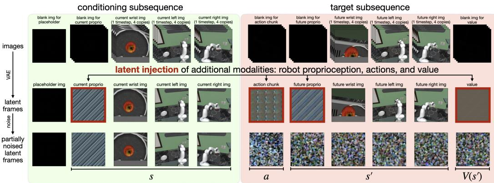
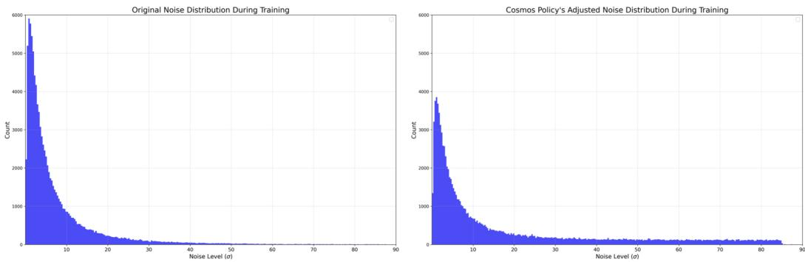
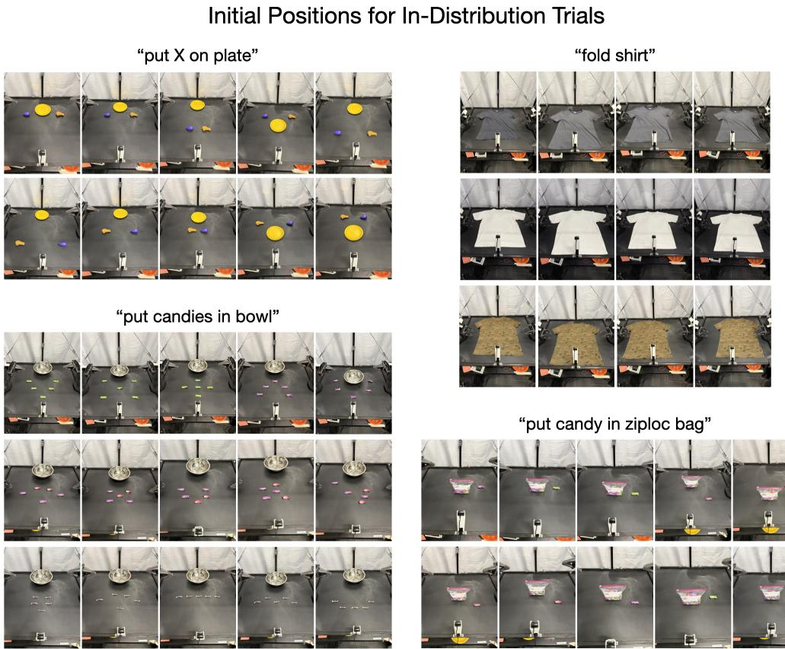
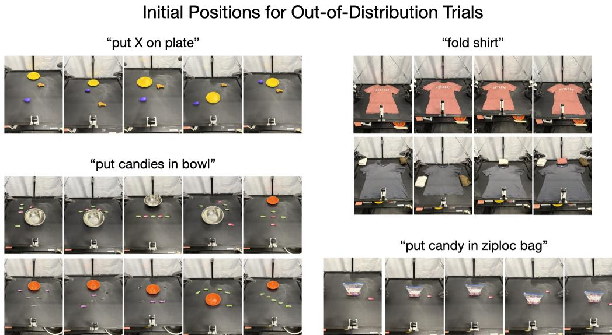
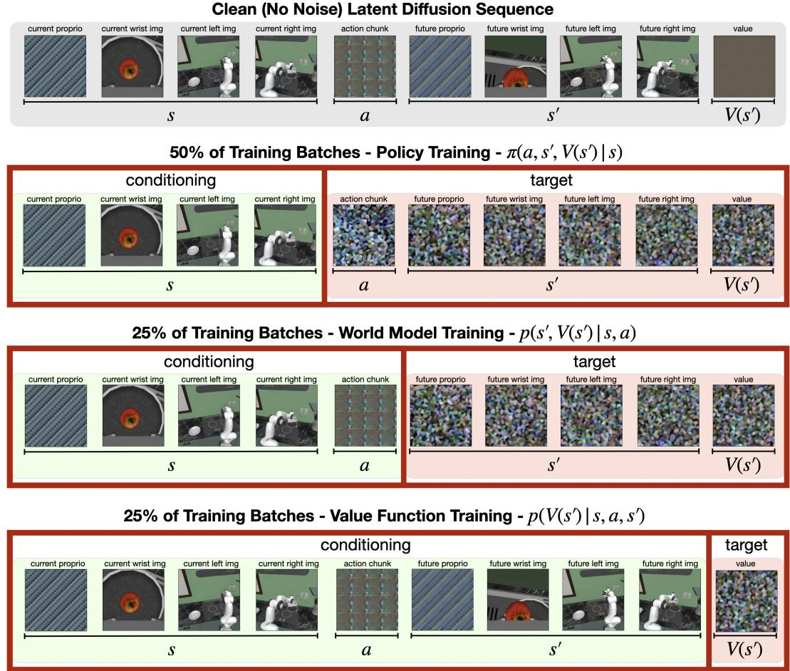

[← 返回 README](../README.md)

# Appendix

## 📌 预览
Appendix 包含大量重要的实现细节：Latent Injection 的具体操作、噪声分布调整（这个很关键！）、各环境的训练超参、详细评估设置、额外消融实验、推理延迟数据。

---

## A.1 LATENT INJECTION IMPLEMENTATION DETAILS

The process begins with a sequence of images from multiple camera viewpoints, along with blank (all-zero) images that serve as placeholders for the new modalities to be injected. Once the video model's VAE tokenizer converts this image sequence into latent frames, we perform latent injection by overwriting the latent frames corresponding to the blank placeholder images with normalized and duplicated copies of the robot proprioception, action chunk, and value. Normalization rescales each modality to the range $[-1, +1]$, while duplication resolves the shape mismatch between the low-dimensional vectors and the target latent volumes.

For instance, consider an action chunk with shape $K \times d_{act}$. We first normalize each action dimension to $[-1, +1]$, and then flatten the array into a $(K \times d_{act})$ vector. This vector is duplicated $\frac{(H' \times W' \times C')}{(K \times d_{act})}$ times (where $(H', W', C')$ represents the shape of a single latent frame), reshaped into a $(H' \times W' \times C')$ volume, and used to overwrite the corresponding target latent frame. We apply an analogous process for robot proprioception and value, though their initial shapes differ.

> 💡 **Latent Injection 的具体实现**:
> ```
> Action chunk: K × d_act 
>   → normalize to [-1, +1]
>   → flatten to (K × d_act) vector
>   → duplicate N times where N = (H' × W' × C') / (K × d_act)
>   → reshape to H' × W' × C'
>   → overwrite placeholder latent frame
> ```
> 
> **提取时（inference）**：
> - 生成的 latent frame → average across all N copies → un-normalize → 得到 action chunk
> - Value（标量）→ average across entire latent volume → un-normalize → 得到 value
> - **不需要 VAE decoding**！因为非图像模态是直接注入 latent space 的

---


*Figure 8: Cosmos Policy latent diffusion 序列的详细视图。这是 Figure 2 的更详细版本，展示了实现细节。*

> 💡 **Figure 8 批读**:
> - **Blank placeholder 的位置**：放在序列最前面，因为 Wan2.1 VAE 对第一帧做特殊处理（无时间压缩）
> - **四帧一组的复制**：每个图像被复制 4 份 → 因为 VAE 的时间压缩比是 4:1，每组 4 帧压缩成 1 个 latent frame
> - 当前状态和未来状态都放在第一帧之后 → 确保结构一致
> - 这个图比 Figure 2 更清楚地展示了实际的数据流

---

## A.2 TRAINING DETAILS

### A.2.1 COSMOS POLICY NOISE DISTRIBUTION

**Changes to noise levels during training and inference.** We find that the base Cosmos-Predict2 model's $\sigma$ (noise level) sampling scheme is suitable for video generation tasks but not the most effective for robot policy training. The latter requires generations to be very precise since the generated actions are used to directly control a robot and small imprecisions can lead to catastrophic failures. Therefore, to improve the accuracy of the generations at test time, we modify the noise level sampling scheme at both train and test time.

The base model's original noise distribution is a log-normal distribution, similar to the EDM formulation (Karras et al., 2022): $\ln(\sigma) \sim \mathcal{N}(P_\text{mean}, P_\text{std}^2)$ where $P_\text{mean} = 1.39, P_\text{std} = 1.2$ for Cosmos-Predict2-2B. For action generation, we observe that the low weight on higher noise levels causes inaccurate action predictions during sampling. Diffusion generation begins with pure noise scaled by $\sigma_\text{max} = 80$ and iteratively denoises over multiple steps as $\sigma$ decreases to $\sigma_\text{min} \approx 0$. At each step, the network predicts the noise at the current $\sigma$ level to progressively recover a clean sample. Since the log-normal distribution concentrates training weight at lower noise levels, the model has insufficient signal at the high-$\sigma$ regime where generation begins, causing poor initial denoising and cascading errors. While this may not be critical for image and video generation, we find it is harmful for action generation, where predictions must be precise.

> 💡 **噪声分布调整——这是一个容易被忽略但非常关键的细节**:
> 
> **问题**：
> - 原始 EDM 的 log-normal 分布在低噪声级别权重高，高噪声级别权重低
> - 扩散生成从高噪声开始 → 第一步去噪不准确 → 错误级联
> - 对视频生成来说不是大问题（视觉上的小偏差不明显）
> - **但对 action 生成是致命的**：小误差 → 机器人做出错误动作 → 任务失败

---

Therefore, for Cosmos Policy training, we use a hybrid log-normal-uniform distribution with greater weight on larger noise levels. To implement this, we sample from the original log-normal distribution with probability 0.7 and from a uniform distribution over [1.0, 85.0] with probability 0.3, creating a log-normal distribution with an extended tail at higher $\sigma$ values. We find this empirically improves action prediction accuracy and overall success rate. We chose the 0.7/0.3 split to stay close to the original distribution while extending the high-$\sigma$ tail; these probability values were not tuned.

At test time, we find that the final denoising steps with $\sigma \approx 0$ are less accurate than earlier steps at larger $\sigma$ values, likely due to the low signal-to-noise ratio at very small noise levels. Therefore, when sampling from Cosmos Policy, we set a higher lower bound with $\sigma_\text{min} = 4$ (rather than $\sigma_\text{min} = 0.002$ as in the original EDM formulation) while keeping $\sigma_\text{max} = 80$. This higher lower bound empirically improves prediction accuracy at inference time for actions, future states, and values, as measured by lower L1 loss on training and validation samples.

> 💡 **训练和推理的噪声调整**:
> 
> **训练时**：
> ```
> 原始: ln(σ) ~ N(1.39, 1.2²)  → 低噪声权重高
> 调整: 0.7 × 原始 + 0.3 × Uniform[1.0, 85.0]  → 高噪声权重增加
> ```
> 
> **推理时**：
> ```
> 原始: σ_min = 0.002, σ_max = 80
> 调整: σ_min = 4, σ_max = 80  → 跳过最后的低噪声步骤
> ```
> 
> 这个发现暗示：**扩散模型的噪声调度需要针对不同的输出模态进行调整**。视频和动作虽然在同一个扩散过程中，但对精度的要求不同。

---


*Figure 9: Base model 噪声分布 vs Cosmos Policy 调整后的噪声分布。将原始的 log-normal 分布（左）改为混合 log-normal-uniform 分布（右），高噪声级别权重更大。*

> 💡 **Figure 9 批读**:
> - 左图（原始）：权重集中在 σ ≈ 2-10 区间
> - 右图（调整后）：在 σ > 10 区间增加了大量权重
> - 0.7/0.3 的 split 没有调优 → 可能还有进一步提升空间

---

### A.2.2-A.2.4 训练超参汇总

> 💡 **各环境训练配置对比**:
> 
> | 配置 | LIBERO | RoboCasa | ALOHA |
> |------|--------|----------|-------|
> | GPU | 64 H100 | 32 H100 | 8 H100 |
> | Batch size | 1920 | 800 | 200 |
> | 训练步数 | 40K | 45K | 50K |
> | 训练时间 | 48h | 48h | 48h |
> | Action chunk | 16 | 32 (exec 16) | 50 |
> | Action L1 loss | 0.012 | 0.016 | 0.010 |
> | Value L1 loss | 0.007 | 0.007 | 0.007 |
> 
> **观察**：
> - 所有环境训练时间统一为 48h → 控制变量
> - Action L1 loss 远低于 image latent L1 loss → 动作比图像更容易学
> - Value L1 loss 都是 0.007 → 标量值容易收敛
> - **ALOHA 公平比较**：π₀.₅ 和 π₀ 也用 48h/8 GPU 微调（400K steps），OpenVLA-OFT+ 32K steps

---

## A.3 EVALUATION DETAILS

### A.3.1 推理配置

> 💡 **去噪步数选择**:
> 
> | 模式 | 去噪步数 | 延迟 (1 GPU) |
> |------|---------|-------------|
> | Direct (LIBERO/RoboCasa) | 5 | 0.61s |
> | Direct (ALOHA) | 10 | 0.95s |
> | Direct (1-step) | 1 | 0.16s |
> | Planning (actions) | 10 | — |
> | Planning (future state, ×3) | 5 | — |
> | Planning (value, ×5) | 5 | — |
> | Planning (total, 8 GPU) | — | 4.9s |
> 
> **1-step denoising** 只损失 0.7% (66.4% vs 67.1%) → 巨大的效率提升！

### A.3.2 ALOHA 评估细节

> 💡 **评分标准（非二值化）**:
> 
> 每个任务有精细的分段评分：
> - **Put X on plate**: 触碰正确物体 50分 + 放到盘子上 50分
> - **Fold shirt**: 10 个步骤各 10 分（抓边、对折、抓袖、折袖...）
> - **Put candies in bowl**: 5 个糖果各 20 分
> - **Put candy in ziploc bag**: 5 个阶段各 20 分（抓滑块、抓袋角、开袋、抓糖、放入）
> 
> 这比 binary success/fail 提供了更细粒度的比较信息。

---

## A.4 ADDITIONAL EXPERIMENTS

### A.4.1 额外消融实验

> 💡 **RoboCasa 消融实验（Table 5）—— 逐步简化的影响**:
> 
> | 变体 | 平均 SR |
> |------|---------|
> | Full Cosmos Policy (5步去噪) | 67.1% |
> | (1) 去掉 value training samples | 66.6% (-0.5) |
> | (2) 去掉 WM + VF training samples | 64.0% (-3.1) |
> | (3) 进一步去掉 auxiliary value supervision | 62.5% (-4.6) |
> | (4) 只预测 action（barebones） | **44.4%** (-22.7) |
> 
> **最关键的发现**：去掉 future state prediction 后性能暴跌 22.7%！
> - 这说明训练 policy 同时预测未来状态是 **核心设计**，不是可选项
> - 联合预测 s' 迫使模型理解 action-state 因果关系 → 显著提升 policy 质量

---

### A.4.2 推理延迟

> 💡 **延迟总结**:
> - 1-step: 0.16s → 几乎实时
> - 5-step: 0.61s → 实用水平
> - 10-step: 0.95s → 可接受（ALOHA action chunk 跑 2s）
> - Planning (8 GPU): 4.9s → 偏慢但对静态任务可用

---


*Figure 10: ALOHA 评估的 in-distribution 初始条件示例。*

> 💡 **Figure 10 批读**: 展示了 4 个任务的 in-distribution 初始配置，物体位置和种类与训练数据一致。

---


*Figure 11: ALOHA 评估的 out-of-distribution 初始条件示例。*

> 💡 **Figure 11 批读**: OOD 测试包括：
> - Put X on plate: 物体不在同一行
> - Fold shirt: 未见过的粉色 T恤 + 干扰物
> - Put candies in bowl: 不平衡分布 + 未见过的小碗
> - Put candy in ziploc bag: 未见过的蓝色密封袋 + 更满

---


*Figure 12: Cosmos Policy balanced batches 训练方案。展示了 Section 4.2 讨论的联合训练目标方案。*

> 💡 **Figure 12 批读**:
> - 清晰展示了 50/25/25 的 batch 分配
> - 每行对应一个训练目标：Policy / World Model / Value Function
> - **蓝色** = clean (conditioning) / **橙色** = noised (target to generate)
> - 同一个 latent sequence，不同的 conditioning mask → 不同的训练目标
> - 这种设计的优雅之处：**零架构修改**，纯粹通过 masking 实现多目标训练

---

## 🔖 Section 总结

### 核心洞察
1. **噪声调度**是从视频模型到策略模型适配的关键细节：增加高噪声权重 + 提高推理 σ_min
2. **Future state prediction 是 Cosmos Policy 的命脉**：去掉后性能从 67.1% 暴跌到 44.4%
3. **1-step denoising** 几乎不损失性能 → 实时部署的可能性
4. **48h 训练统一控制** → 公平比较各方法
5. 评分标准精细化 → 更好地区分方法差异
