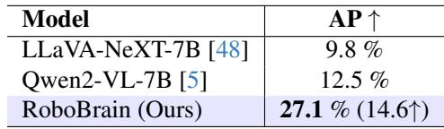
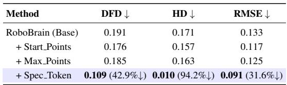

[← 返回 README](../README.md)

# 05 - Experiments

## 📌 预览
Section 5 包含实现细节、评测指标和实验结果。RoboBrain 在 RoboVQA、OpenEQA、ShareRobot 三个 planning benchmark 上达到 SOTA，affordance AP 27.1%（超 Qwen2-VL 14.6 点），trajectory 预测通过 Spec Token 设计大幅降低误差。

---

# 5. Experiment

## 5.1. Implementation Details

### 预览
训练环境和超参数概述。

---

During the entire training phase, we employed the Zero3 [71] distributed training strategy, conducting all experiments on a cluster of servers, each equipped with 8×A800 GPUs. The training components for each stage, including image resolution settings, batch size, epochs, and learning rates, are provided in Tab. 1.

> 💡 **计算资源**: 使用 A800 GPU 集群 + DeepSpeed Zero3 分布式训练。从 Table 1 可知 Stage 3 用了 22×8=176 张 A800，训练成本相当高昂。所有 Stage 均只训练 1 个 epoch。

### 小结
标准的大规模分布式训练设置，计算开销主要集中在 Stage 2-3 的全模型训练。

---

## 5.2. Evaluation Metrics

### 预览
三类任务分别采用不同评测指标：Planning 用 BLEU/GPT-4o 评分，Affordance 用 AP，Trajectory 用 DFD/HD/RMSE。

---

**Planning Task** We selected RoboVQA [73], OpenEQA [61], and the test set of ShareRobot as robotic benchmarks for multi-dimensional assessment. For RoboVQA, we adopt the BLEU1 to BLEU4 metrics [69] used in RoboMamba [50] for evaluation. Additionally, for OpenEQA and ShareRobot, we use GPT-4o [68] as the evaluation tool, scoring based on the alignment or similarity between model predictions and ground truth, which serves as the final performance score for the model.

> 💡 **Planning 评测**: 混合使用 BLEU（RoboVQA）和 GPT-4o 评分（OpenEQA/ShareRobot）。BLEU 适合短文本匹配，GPT-4o 评分更适合开放式回答的语义相似度评估。使用自家提出的 ShareRobot test set 作为 benchmark 需注意 data leakage 风险（虽然 train/test 已划分）。

**Affordance Prediction** We utilize the Average Precision (AP) to evaluate the affordance performance of our model. AP metric summarizes the precision-recall affordance curve, which plots the relationship between precision and recall at various threshold settings. It is calculated across multiple Intersection over Union (IoU) thresholds to obtain a more comprehensive evaluation.

**Trajectory Prediction** We evaluate the similarity between ground truth and predicted trajectories, both represented as sequences of 2D waypoints normalized to [0, 1000), following Qwen2-VL [87]. The evaluation uses three metrics: Discrete Frechet Distance (DFD) [ ´ 25], Hausdorff Distance (HD), and Root Mean Square Error (RMSE). DFD captures overall shape and temporal alignment, HD identifies maximum deviation, and RMSE measures average pointwise error. Together, these metrics provide a comprehensive assessment of trajectory accuracy and similarity.

> 💡 **Trajectory 评测指标**:
> - **DFD (Discrete Fréchet Distance)**: 捕捉整体形状和时序对齐
> - **HD (Hausdorff Distance)**: 最大偏差，衡量最差情况
> - **RMSE**: 平均逐点误差
> 
> 三个指标从不同角度评估轨迹质量，坐标归一化到 [0, 1000) 确保跨分辨率可比。

### 小结
评测设计合理，覆盖了三大能力的不同维度。GPT-4o 评分的引入弥补了 BLEU 在开放式回答上的局限。

---

## 5.3. Evaluation on Robot Brain Task

### 预览
三个子任务的实验结果：Planning 全面 SOTA，Affordance 大幅领先，Trajectory 通过设计优化降低 42-94% 误差。

---

**Evaluation on Planning Task** We selected 6 powerful MLLMs as our baselines for comparison, including both open-source and closed-source models with different architectures. Specifically, these models include GPT-4V [2], Claude3 [1], LLaVA-1.5 [48], LLaVA-OneVision-7b [41], Qwen2-VL-7b [86] and RoboMamba [50]. Our specific experimental results are shown in Fig. 5. Our RoboBrain outperformed all baseline models across three robotic benchmarks. RoboBrain significantly outperformed all baseline models on OpenEQA and ShareRobot, which can be attributed to its robust capabilities in understanding robotic tasks and perceiving long videos. Additionally, this pattern was observed in other benchmarks as well, with RoboBrain consistently demonstrating superior performance on RoboVQA, achieving a BLEU-4 score that exceeded that of the second-place model by 18.75. This result highlights its capability to decompose complex long-range task planning.

  
Figure 5. The performance of our model RoboBrain on the OpenEQA, ShareRobot, and RoboVQA benchmarks. RoboBrain surpassed all baseline models, achieving state-of-the-art results.

> 💡 **Figure 5 / Planning 结果解读**:
> - **RoboVQA**: BLEU-4 = 55.05，超第二名（RoboMamba 36.3）18.75 分 — 巨大优势
> - **OpenEQA**: 全面超越 GPT-4V，在功能推理和空间理解上表现突出
> - **ShareRobot**: 在自家 benchmark 上自然表现最好
> 
> 注意：RoboBrain 用了 RoboVQA 800K 训练数据，在 RoboVQA benchmark 上取得高分有一定 "主场优势"。与 GPT-4V/Claude3 等闭源模型相比，7B 开源模型能超越它们说明专用数据 + 训练策略的有效性。

**Evaluation on Affordance Prediction** Our results are summarized in Tab. 2. We compare the Qwen2-VL-7B and LLaVA-NeXT-7B models. Qwen2-VL [86] has a superior visual grounding ability and LLaVA-NeXT [44] owns a high-resolution and strong vision tower. We test them all on the AGD20K affordance test set. Our RoboBrain outperforms significantly the other models. It surpasses Qwen2-

  
Figure 6. This visualization illustrates that RoboBrain can interpret human instructions and visual images to generate action plans and assessments based on real-time image feedback. Furthermore, it predicts trajectories for each step and identifies corresponding affordances.

> 💡 **Figure 6 解读**: 综合可视化展示了 RoboBrain 的完整工作流：输入指令 + 图像 → 多轮交互生成 plan → 为每步预测 trajectory（绿色曲线）和 affordance（红色框）。这体现了 "abstract to concrete" 的端到端能力。

Table 2. The comparison of affordance prediction. We utilize AP as the metric, and test them on affordance test set.   

> 💡 **Table 2 解读**: Affordance AP 对比：
> - LLaVA-NeXT-7B: 9.8%
> - Qwen2-VL-7B: 12.5%
> - **RoboBrain: 27.1% (+14.6)**
> 
> 绝对值来看 27.1% 仍然不算高，说明 affordance 预测本身是个困难任务。但相对提升 >100%，证明了专用 A-LoRA + ShareRobot 数据的有效性。

VL [86] by 14.6 AP, and LLaVA-NeXT by 17.3 AP. It validates our RoboBrain can understand the physical properties of objects and provide the affordance accurately.

**Evaluation on Trajectory Prediction** We compare several variants of our model, and the results are in Tab. 3: (1) Baseline, fine-tuned on trajectory-related VQA data; (2) Start Points, which adds the 2D start coordinates of the end-effector; (3) Max Points, limiting waypoints to 10 via uniform sampling; and (4) Spec Token & End Points, which adds end-effector positions and special tokens to emphasize waypoints and start/goal points. Each variant builds on the previous one, with the final model integrating all components. Our most effective model integrates all design choices. As shown in the last row of Tab. 3, DFD, HD, and RMSE decreased by $4 2 . 9 \%$ , $9 4 . 2 \%$ , and $3 1 . 6 \%$ , respectively, compared to the baseline. We found that adding start points corrected the translational offset between the generated trajectory and the end-effector.

Table 3. Trajectory Prediction Results Comparison. Discrete Frechet Distance (DFD), Hausdorff Distance (HD), and Root ´ Mean Square Error (RMSE).   

> 💡 **Table 3 / Trajectory 结果解读**:
> | 变体 | DFD | HD | RMSE |
> |------|-----|-----|------|
> | Base | 0.191 | 0.171 | 0.133 |
> | +Start Points | 0.176 | 0.157 | 0.117 |
> | +Max Points | 0.185 | 0.163 | 0.125 |
> | +Spec Token | **0.109** (-42.9%) | **0.010** (-94.2%) | **0.091** (-31.6%) |
> 
> - **Start Points**: 提供起始坐标修正了位移偏移 — 简单但有效
> - **Max Points**: 限制 waypoints ≤ 10 反而略提升，减少了冗余点
> - **Spec Token**: 贡献最大，HD 降低 94.2%！特殊 token 帮助模型区分关键 waypoints
> 
> 注意：这是 ablation study 而非与其他方法的对比。缺乏与 RT-Trajectory 等方法的直接比较。

### 小结
三个任务均取得了优异结果。Planning 的优势最明显（BLEU-4 超第二名 18.75），affordance 的绝对数值仍有提升空间，trajectory 的 Spec Token 设计是关键创新。

---

## 5.4. Visualization

### 预览
可视化展示 RoboBrain 的综合能力。

---

In this section, we present visual examples of RoboBrain in Fig. 6. Given human instructions and visual inputs, RoboBrain engages in multi-turn interactions, understanding and planning future steps. It also outputs more concrete affordances and trajectories.

> 💡 **可视化总结**: Figure 6 展示了完整的推理链——从指令理解到多步规划再到具体的 affordance 和 trajectory 输出。多轮交互能力说明模型能根据实时反馈调整计划，这对长序操作至关重要。

### 小结
可视化结果验证了 RoboBrain "abstract to concrete" 的端到端能力。

---

## 🔖 Section 总结
实验全面验证了 RoboBrain 的三大能力：
- **Planning**: 三个 benchmark 全面 SOTA，RoboVQA BLEU-4 超第二名 18.75 分
- **Affordance**: AP 27.1%，超 Qwen2-VL 14.6 点（相对提升 >100%）
- **Trajectory**: Spec Token 设计使 HD 降低 94.2%
- **不足**: 缺乏与专用机器人模型（如 RT-2、Octo）的直接对比；affordance 和 trajectory 的评测基线偏少；未展示真机实验结果
