[← 返回 README](../README.md)

# 06 - Conclusion & Appendix

## 📌 预览
Conclusion 简要总结贡献。Appendix 内容丰富，包含详细训练配置、数据集细节、更多实验（通用 benchmark、不同架构/LLM backbone、消融实验）、可视化结果（good/bad cases）和数据集标注模板。

---

# 6. Conclusion

In this paper, we introduce ShareRobot, a high-quality dataset that labels multi-dimensional information, including task planning, object affordance, and end-effector trajectory. We also present RoboBrain, an MLLM-based model that integrates robotic and general multi-modal data, employs a multi-stage training strategy, and leverages long videos and high-resolution images to enhance robotic manipulation. Extensive experiments demonstrate that RoboBrain achieves state-of-the-art performance across various robotic tasks, underscoring its potential to significantly advance robotic capabilities.

> 💡 **结论评价**: 结论部分非常简洁，基本是摘要的压缩版。没有讨论局限性和未来工作（这些放在了 Appendix F 中）。

# Acknowledgments

This work was supported by the National Natural Science Foundation of China 62476011, 72225011 and 72434005.

---

# Appendix 概要

Appendix 内容较长（约占论文一半篇幅），以下为各部分概要总结：

## A. Details of Models and Training
- **模型细节**: SigLIP-so400m-patch14-384（27 层，729 tokens/image）、2 层 MLP Projector、Qwen2.5-7B-Instruct（28 层，128K context）
- **LoRA 设置**: rank=64，加在 Projector 和 LLM 的 FFN 层，冻结所有非 LoRA 参数
- **完整训练配置**: Table 4 给出了比 Table 1 更详细的版本，包括梯度累积、优化器（AdamW）、warmup ratio（0.03）、cosine LR schedule、最大序列长度等

> 💡 **关键补充信息**: Stage 3 使用 22×8=176 张 GPU，Stage 4 仅需 4×8=32 张。最大序列长度从 Stage 1 的 8192 增至后续的 32768（Stage 4 降回 4096）。

## B. Details of Training Dataset

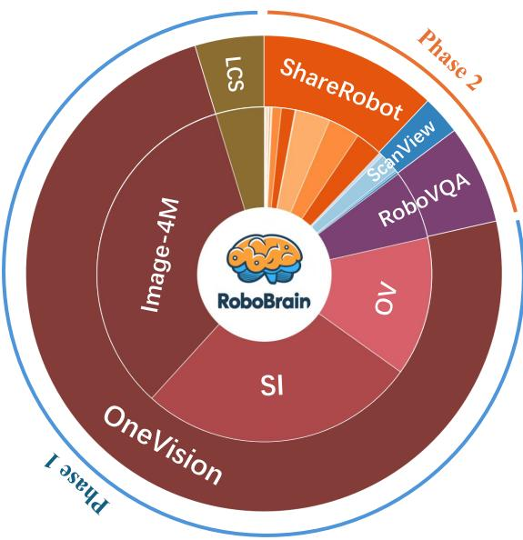  
Figure 7. The distribution of the entire training dataset.

> 💡 **Figure 7 解读**: 训练数据分布饼图，展示各阶段数据来源。LCS-558K 用于对齐，Image-4M/SI-3.2M/OV-1.6M 用于通用训练，RoboVQA-800K + ScanView-318K + ShareRobot-200K 构成机器人训练数据。

- **LCS-558K**: LAION/CC/SBU 子集，用于 Stage 1 视觉-语言对齐
- **Image-4M**: 8 个数据源（BLIP558K, COCO118K, CC3M 等），Stage 1.5
- **SI-3.2M**: Cambrian + Cauldron + UReader 等，Stage 2 单图
- **OV-1.6M**: 800K 重采样 + M4-Instruct + 视频数据，Stage 2 OneVision
- **RoboVQA-800K**: 5,246 长序 + 92,948 中序 episodes
- **ScanView-318K**: MMScan-224K + 3RScan-43K + ScanQA-25K + SQA3D-26K

## C. Complementary Experiments

### C.1 More Results on General Benchmarks (Table 5)

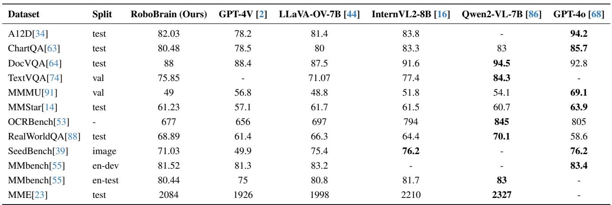

> 💡 **通用 Benchmark 表现**: RoboBrain 在 12 个通用 benchmark 上与 LLaVA-OV-7B、GPT-4V 表现相当甚至更好，说明机器人训练没有显著损害通用能力。特别是 RealWorldQA 上超越了 GPT-4o（68.89 vs 58.6），展示了强大的真实世界理解能力。

### C.2 More Results on Robotic Benchmarks (Table 6)

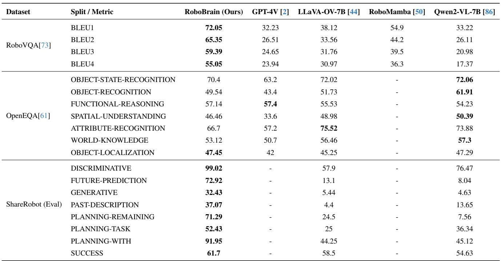

> 💡 **完整机器人 Benchmark**: RoboVQA 上 BLEU-1~4 全面领先约 30%。OpenEQA 上各子类别表现均衡。ShareRobot Eval 上在 DISCRIMINATIVE（99.02）和 PLANNING-WITH（91.95）上表现尤为突出。

### C.3 Effectiveness of ShareRobot (Table 7 部分)
- 对比有/无 ShareRobot 训练：有 ShareRobot 时 ShareRobot Eval 分数 63.11 vs 27.03，证明 ShareRobot 数据的关键作用

### C.4 Effectiveness of Robot Data Proportion (Table 7 完整)

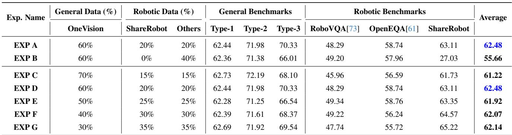

> 💡 **数据配比消融**: 测试了 3:7 到 7:3 五种比例。4:6（机器人:通用）达到最佳平衡（平均 62.48），既保持通用能力又获得机器人能力。过多机器人数据反而在通用 benchmark 上略有下降。

### C.5 Different Architecture and MLLMs (Table 8a)

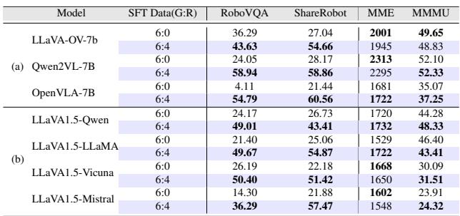

> 💡 **不同架构对比**: LLaVA-OV-7B、Qwen2VL-7B、OpenVLA-7B 三种架构加入 ShareRobot 训练后均获得显著提升。Qwen2VL-7B 在 RoboVQA 上提升最大（24.05 → 58.94）。

### C.6 Different LLM Backbones (Table 8b)
- 测试了 Qwen2.5、LLaMA、Vicuna、Mistral 四种 LLM backbone，均从 ShareRobot 数据中受益

### C.7 Ablation Studies of Different Stages (Table 9)

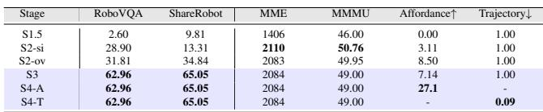

> 💡 **分阶段消融**: 从 S1.5 到 S4，每个 Stage 都带来了明确的能力提升。S3 是 planning 能力的关键跳跃（RoboVQA 31.81 → 62.96），S4-A 和 S4-T 分别提升 affordance（7.14 → 27.1）和 trajectory（1.00 → 0.09）。

## D. More Qualitative Results

# D.1. Visualization on Planning

Here, we present additional embodied planning for robotic tasks generated by RoboBrain, as shown in Fig. 8. In this figure, we demonstrate the planning results of RoboBrain for four distinct robotic manipulation tasks: "Water plants", "Put the pot in the drawer", "Cluster blocks of the same color into different corners", and "Clean the desk", where the first three are categorized as good cases, and the last one as a bad case. Additionally, the model provides a rationale and detailed explanation for each step of the planning process across all four cases.

From the first three planning cases, it is evident that RoboBrain effectively utilizes environmental information and the states of interactive objects—captured from first- or third-person perspective images—to generate task plans for various types of robotic manipulation tasks. Notably, in the "Cluster blocks of the same color into different corners" task, RoboBrain not only analyzes the number of blocks of each color on the table in Steps 1 and 2 but also provides detailed sub-steps in Step 3, i.e., "Move the objects to form clusters". Specifically, it plans the movement of blocks of four different colors to their designated locations: "top left corner", "top right corner", "bottom left corner", and "bottom right corner". The exceptional task generalization capability of RoboBrain in planning further validates the effectiveness of our training dataset—including the proposed ShareRobot dataset—and the Multi-Phase training strategy.

We also present a bad case for RoboBrain, namely the "Clean the desk" task. In this case, the first-person perspective image depicts a work desk spilled with coffee, where the main objects of focus include a "tissue box", a "tipped-over coffee cup", and the "spilled coffee liquid". The errors in the planning results inferred by RoboBrain are summarized as follows: (1) Object recognition error. The only available object for wiping the desk in the image is a "tissue", rather than a "disinfectant wipe". (2) Omission of critical steps. Before wiping the desk, it is necessary to extract a tissue from the tissue box. However, this step is missing in RoboBrain's planning. (3) Action decision deviation. In Step 2, i.e., "Wipe down the desk with a disinfectant wipe", the detailed description states, "Start from one end of the desk and move to the other". This implies that RoboBrain fails to prioritize wiping the "spilled coffee liquid" specifically, focusing instead on cleaning "the entire desk". The primary cause might be the similarity in color between the desk and the spilled coffee, making it difficult for the model to distinguish.

In our extensive testing, although a small number of unreasonable bad cases like the one described above were observed, RoboBrain demonstrated robust planning capabilities in the vast majority of cases. This provides a solid foundation for executing long-horizon manipulation tasks.

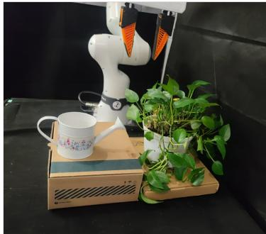

(a) Embodied planning for Task [Water plants].

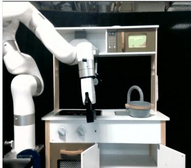

(b) Embodied planning for Task [Put the pot in the drawer].

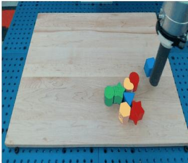

(c) Embodied planning for Task [Cluster blocks of the same color into different corners].

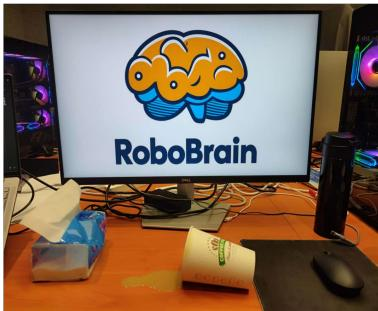

(d) Embodied planning for Task [Clean the desk].

Figure 8. Additional embodied planning of RoboBrain. (a) ∼ (c) show some good cases of RoboBrain's embodied planning, while (d) shows its bad case. More detailed analysis can be found in Sec.D.1.

> 💡 **D.1 Planning 可视化解读**: 4 个案例（3 good + 1 bad），展示了 RoboBrain 在浇花、放锅、分类积木等任务上的规划能力。Bad case（清理桌面）暴露了物体识别错误（tissue vs disinfectant wipe）、关键步骤遗漏（从 tissue box 取纸）、动作决策偏差（全桌擦拭而非重点擦咖啡液）等问题，根本原因是桌面与咖啡液颜色相近，模型难以区分。

---

# D.2. Visualization on Affordance

Here, we present the visualizations of RoboBrain's perception of affordance areas, as shown in Fig.9. The text below each subfigure indicates the task instructions, while the red bounding boxes represent the affordance areas predicted by the RoboBrain model. The visualizations in the first three rows demonstrate that our RoboBrain model can effectively provide reasonable affordance areas based on human instructions and visual information. For example, given the instruction "drink with the bottle", RoboBrain can determine that the bottle cap is in a closed state, thus providing affordance information for the cap area. This highlights RoboBrain's strong understanding of abstract instructions.

We also present several failure cases, as illustrated in the fourth row of Fig.9. These include misidentified objects, interference from other objects in the scene, and instances where no objects were recognized. These issues may stem from the model's limited ability to perceive and localize in noisy environments.

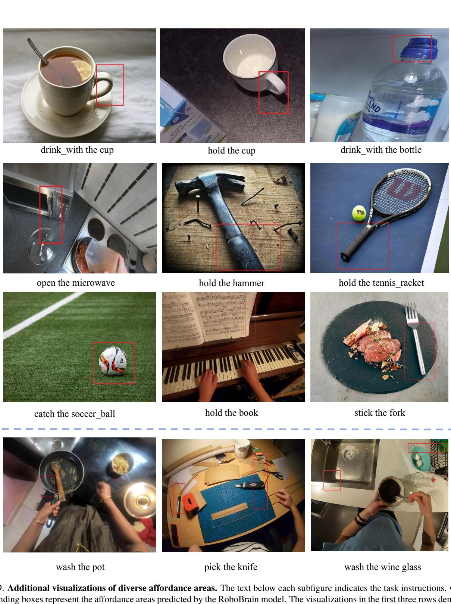  
that our RoboBrain model effectively identifies reasonable affordance areas based on human instructions and visual information. The fourth row presents several failure cases, which may stem from the model's lack of ability to perceive and localize in noisy environments. This limitation could be attributed to the absence of such scenarios in the training data used during Stage 4. The complete prompt provided to RoboBrain is: "You are a Franka robot using joint control. The task is $\$ 123,456$. Please predict all possible affordance areas of the end effector." Here, $\$ 123,456$ represents specific task instructions, such as "drink with the cup."

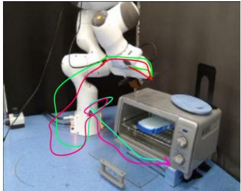

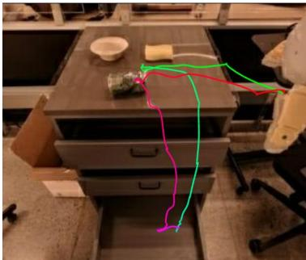

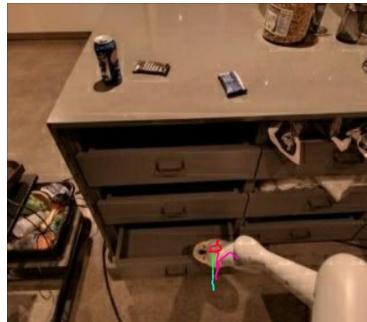  
open bottom drawer

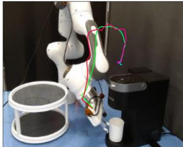  
place green rice chip bag into top drawer

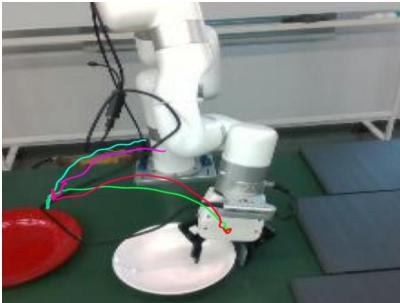  
make a piece of toast with the oven   
Pick up a white plate, and then place it on the red plate

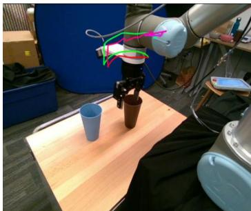

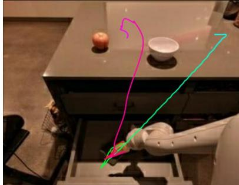  
pick sponge from middle drawer and place on counter

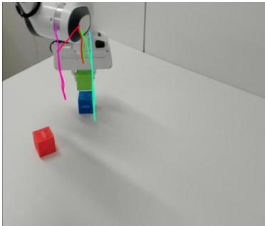  
make a cup of coffee with keurig machine   
place green cube on table

Figure 9. Additional visualizations of affordance perception. The visualizations in the first three rows demonstrate that our RoboBrain model effectively identifies reasonable affordance areas based on human instructions and visual information. The fourth row presents several failure cases, which may stem from the model's lack of ability to perceive and localize in noisy environments.

> 💡 **D.2 Affordance 可视化解读**: 多种物体的 affordance 预测网格图。成功案例（前三行）展示了指令理解能力——如 "drink with the bottle" → 识别出瓶盖区域。失败案例（第四行）包括：物体误识别、其他物体干扰、未能识别到任何物体。这些问题源于 Stage 4 训练数据中缺乏嘈杂环境场景。

---

# D.3. Visualization on Trajectory

Here, we present additional visualizations generated by RoboBrain using start points, as shown in Fig.10. In this figure, the red-to-purple gradient curves represent the ground truth, while the green-to-blue gradient curves indicate the predicted trajectories. For clarity, waypoints are omitted. The first three rows demonstrate that, regardless of the complexity of the end-effector trajectory, RoboBrain accurately predicts 2D trajectories based on visual observations and task instructions. These predictions closely align with the structure of the ground truth and remain executable.

Additionally, RoboBrain's predictions often capture the essential features of the trajectories, leading to smoother and potentially more efficient paths compared to the ground truth. This improvement may stem from the inherent variability in the robot's actual trajectories, which can include redundant waypoints under similar manipulation scenarios. By learning from a large, embodied dataset and utilizing the reasoning capabilities of large language models, RoboBrain is able to infer effective and optimized execution paths.

The visualizations in the third row further suggest that RoboBrain avoids overfitting; it generalizes well across different scenarios, producing trajectories that are both executable and reasonable.

We also present several failure cases, as shown in the fourth row of Fig. 10. These include the robot's end-effector failing to accurately locate the cup, neglecting the articulated nature of the fridge door while opening it, and not accounting for the deformable properties of clothing during folding. These examples highlight the need for improved spatial perception, as well as the incorporation of object-specific physical constraints and world knowledge to generate more feasible and realistic trajectories.

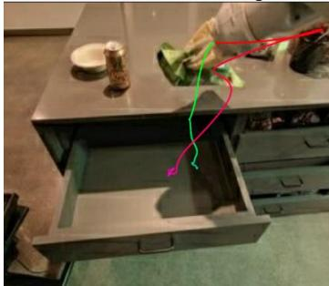  
pick up the blue cup and put it into the brown cup   
place green rice chip bag into top drawer

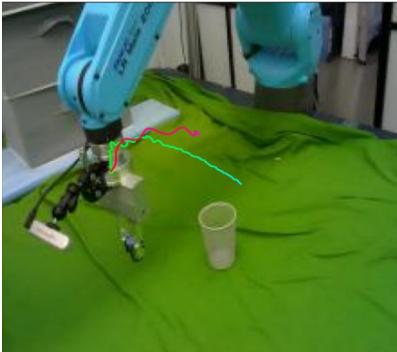  
opening the fridge

Pick up the object on the table and place it in the cup

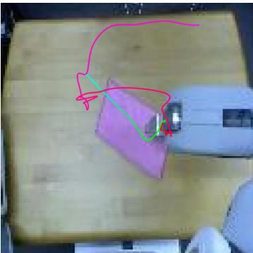  
folding a cloth   
Figure 10. Additional visualizations of diverse 2D trajectories. The red-to-purple gradient curves represent the ground truth, while the green-to-blue gradient curves indicate the predicted trajectories. The visualizations in the first two rows demonstrate that our RoboBrain model effectively generates end-effector manipulation curves based on the robot's observations and task instructions. The third row shows that RoboBrain is not merely fitting trajectories but also exhibits the ability to generate more reasonable and feasible curves. The fourth row presents some failure cases, which stem from a lack of spatial awareness and world knowledge. These limitations result in an inability to accurately localize the objects involved in interactions, account for physical constraints, and adapt to the variability of deformable objects.

> 💡 **D.3 Trajectory 可视化解读**: 多样的 2D 轨迹预测（红紫渐变=GT，绿蓝渐变=预测）。RoboBrain 生成的轨迹往往比 GT 更平滑高效（减少冗余 waypoints）。失败案例包括：杯子定位失败（空间感知不足）、未考虑冰箱门的铰链约束（缺乏物理约束知识）、未考虑衣物可变形属性（world knowledge 不足）。

## E. Details of ShareRobot Dataset
- **E.1 Prompts**: Gemini 标注的完整 prompt 模板
- **E.2 Templates**: 10 种问题类型各 5 个模板
- **E.3 高层描述示例**: 40 个最频繁的 high-level descriptions（Closing/Opening drawer 最多）
- **E.4 低层指令示例**: 40 个最频繁的 low-level instructions（Grasp/Reach/Lift 最多）

## F. Future Work
计划增强空间理解、具身推理、工具使用、长文本理解能力，并关注模型效率和安全性。

---

## 🔖 Section 总结
Appendix 提供了大量补充实验和细节：
- **通用能力未被牺牲** — 12 个通用 benchmark 上与 LLaVA-OV 持平甚至更好
- **ShareRobot 数据有效** — 有/无 ShareRobot 在自家 benchmark 上差距 36 分
- **4:6 数据配比最优** — 过多机器人数据损害通用能力
- **跨架构/LLM 普适性** — 多种模型均从 ShareRobot 受益
- **渐进训练有效** — 每个 Stage 都有明确的能力增量
- **可视化揭示局限** — 物体识别错误、空间感知不足、物理约束缺失是主要失败原因
