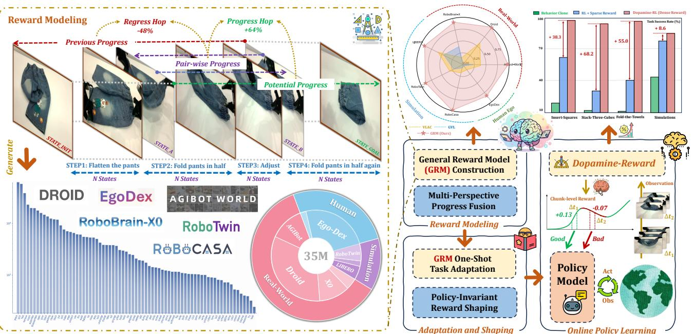

[← 返回 README](../README.md)

# 1. Introduction

## 📌 预览
Introduction 分四层递进：IL 的根本局限 → RL 奖励难题 → 现有 PRM 的两大缺陷 → 本文方案。Figure 1 是全文的路线图。

---

While large-scale imitation learning (IL) has substantially advanced embodied intelligence [1, 4, 5, 15, 21, 25], its reliance on static, expert-curated datasets imposes fundamental limitations [7, 24, 43, 52, 64, 65], which exhibits sub-optimal sample efficiency, poor generalization to out-of-distribution (OOD) scenarios, and also struggles to acquire precise and contact-rich manipulation skills [23, 63]. In contrast, reinforcement learning (RL) offers a compelling alternative [11, 29, 33, 35, 56, 58, 60]. Through continuous environmental interaction, RL enables agents to transcend the limitations of static expert data, facilitating superior generalization and the mastery of high-precision tasks.

> 💡 **IL 受限于静态数据，所以需要 RL**:
> - IL 依赖专家数据集，有三大硬伤：样本效率差、OOD 泛化差、精细操作（如接触丰富的灵巧操作）学不好
> - RL 通过和环境持续交互来学习，不受静态数据限制，能获得更好的泛化能力和高精度操作技能

---

However, the primary obstacle for applying RL to real-world robotics is the design of effective reward functions. Conventional approaches falter at two extremes: sparse, binary outcome rewards [11, 33, 35, 56, 60] make exploration in long-horizon, contact-rich tasks prohibitively difficult, while handcrafted dense rewards [16, 44, 54, 55] require significant domain expertise, limiting scalability and general applicability. This dichotomy has motivated the shift towards learning-based Process Reward Models (PRMs) [2, 8, 36, 37, 59].

> 💡 **RL 应用到机器人的最大挑战是 reward function 的设计**。传统方法走向两个极端：
>
> - **Sparse (binary) reward**：只在任务完成时给 +1，信号太稀疏，长步骤、接触丰富的任务中 agent 几乎无法探索
> - **Handcrafted dense reward**：人工为每一步设计奖励规则，信号丰富但需要大量领域知识，每换一个任务就得重新写，无法扩展
>
> 两者都不理想，因此目前趋势是转向 **learning-based Process Reward Model (PRM)**——让模型自己学会评估每一步的进度，既有密集信号又可扩展。

---

Despite their promise, current PRMs are hindered by two fundamental limitations. First, the underlying reward models often exhibit critical deficiencies: their task-specific design [8, 18] inherently limits generalization; uniform reward distributions [37, 59] fail to capture the varying salience of crucial sub-steps; and a reliance on single-view observations [2, 8, 36, 37, 59] fails in manipulation scenes where occlusions obscure fine-grained progress only visible from wrist-level views. Second, the reward shaping algorithms utilizing these dense signals are often theoretically flawed. Naively incorporating dense rewards can induce a semantic trap [41] that misguides policy optimization by inadvertently altering the optimal policy, causing the agent to prioritize high proxy rewards from intermediate steps over the true task objective.

> 💡 **PRM 两大根本缺陷（核心 motivation）**:
>
> **缺陷 1 — 奖励模型能力不足**:
> - task-specific 设计 → 泛化差（SARM [8]）
> - uniform reward 分配 → 忽略关键子步骤的重要性差异（GVL [37], VLAC [59]）
> - 单视角 → 遮挡时失效（几乎所有现有工作）
>
> **缺陷 2 — 奖励塑形理论有漏洞**:
> - naive dense reward ($`r = \Phi(s_{t+1}) - \Phi(s_t)`$) 会改变最优策略
> - 产生 "semantic trap"：agent 学会到达高 reward 状态后**原地不动**
> - 引用 Ng et al. 1999 [41] 的经典工作

---

To address these, we introduce Dopamine-Reward, a novel dense reward modeling method for learning a general-purpose, step-aware process reward from multi-view inputs. Dopamine-Reward directly tackles the first limitation by leveraging two key techniques: Hop-based Step-wise General Reward Model (GRM) Construction for a fine-grained, structural understanding of task progression from various viewpoints, and Multi-Perspective Reward Fusion via GRM to integrate bidirectional global reward and state-wise incremental reward for more precise reward estimation, which are made possible by a meticulous annotation pipeline encompassing over 3,400 hours of data, 100K trajectories, and more than 350 daily tasks, offering broad coverage, fine-grained labels, and well-balanced distributions across real robots, simulations, and egocentric human videos.

> 💡 **Dopamine-Reward 方案**:
> - **Hop-based GRM**: 不直接回归绝对进度，而是预测相对进度 "hop"——归一化到 [-1, 1] 的相对变化
> - **Multi-Perspective Fusion**: 融合 incremental + forward + backward 三个视角
> - 数据规模：3,400h / 100K trajectories / 350+ tasks / 三种来源（真实机器人 + 仿真 + 人类自我视角视频）

💡 **Hop-based 详解——为什么不直接预测"完成了百分之几"？**

假设机器人正在做一个"把杯子放到盘子上"的任务，当前完成了 60%。

**Naive 方法**（直接回归绝对进度）：模型预测"当前进度 = 0.60"，下一步"进度 = 0.65"。问题是：每次预测都有误差（比如 ±0.03），连续预测 20 步后误差累积，可能算出进度 = 1.2（超出 [0,1]）或者 -0.1（不合理）。

**Hop-based 方法**（预测相对比例）：不问"你到了哪里"，而是问"你完成了**剩余路程的多少比例**"。比如当前 60%，模型预测"前进了剩余 40% 中的 12.5%"（hop = 0.125）。数学上可以证明，不管怎么迭代，重建出的进度**永远在 [0, 1] 内**。

用一个例子说明：
- 当前进度 60%，剩余 40%
- GRM 预测 hop = 0.125（前进了剩余的 12.5%）
- 新进度 = 60% + 40% × 0.125 = 65%（保证不超过 100%）
- 即使 hop 预测有误差（比如 0.15），新进度 = 60% + 40% × 0.15 = 66%，仍然合理

这就是 hop-based 的核心优势：**误差被"剩余距离"自然压缩**，越接近目标，同样的 hop 误差对绝对进度的影响越小。

---

Building upon GRM via Dopamine-Reward, we propose a robust and unified policy learning framework Dopamine-RL to resolve the second limitation. Dopamine-RL employs a theoretically-sound Policy-Invariant Reward Shaping method, which enables the agent to leverage the dense rewards from our GRM for highly efficient self-improvement without altering the underlying optimal policy, thereby fundamentally avoiding the semantic trap.

> 💡 **Dopamine-RL 方案**:
> - Policy-Invariant Reward Shaping: $`r_{GRM} = r_{gold} + \gamma\Phi^{*}(s_{t+1}) - \Phi^{*}(s_t)`$
> - 这是 PBRS 框架的直接应用，数学上保证 $`\arg\max_a Q^{*}_{GRM}(s,a) = \arg\max_a Q^{*}_{gold}(s,a)`$
> - 与 RL 算法无关：兼容 PPO、Cal-QL、ReinFlow 等

💡 **Policy-Invariant Reward Shaping 详解——为什么不能直接用进度差当奖励？**

**问题：Semantic Trap（语义陷阱）**

最直觉的 dense reward 是进度差：$`r = \Phi(s_{t+1}) - \Phi(s_t)`$。看起来很合理——前进就奖励，后退就惩罚。但 RL 优化的是**折扣累积回报** $`J(\pi) = \sum \gamma^t r_t`$。展开这个求和后会发现，agent 实际上在最大化的是**所有状态进度值的加权和**，而不是"完成任务"。

这会导致一个荒诞的最优策略：agent 快速到达 90% 进度，然后**永远停在那里不动**。因为每待一个时间步，它都在"享受"高进度状态带来的折扣回报。完成任务反而意味着 episode 结束、不再获得回报。

**解法：加一个 $`\gamma`$ 系数**

PBRS 的修复非常优雅：把 $`\Phi(s_{t+1}) - \Phi(s_t)`$ 改成 $`\gamma\Phi(s_{t+1}) - \Phi(s_t)`$。就多了一个折扣因子 $`\gamma`$（通常 0.99）。

为什么这就解决了问题？因为这个形式构成了 **telescoping sum**（望远镜求和）：

$`\sum_{t=0}^{\infty} \gamma^t [\gamma\Phi(s_{t+1}) - \Phi(s_t)] = -\Phi(s_0)`$

所有中间项相消，只剩初始状态的常数！这意味着无论 agent 采取什么策略，PBRS 项的累积贡献都是同一个常数。因此 agent 的最优策略完全由 $`r_{gold}`$（稀疏的任务完成奖励）决定，PBRS 只是加速了探索，不会改变目标。

**一句话总结**：dense reward 让 agent 知道方向（加速学习），PBRS 保证 agent 不会被方向误导（保持正确目标）。

---

Extensive experiments on over 10 simulation and 8 real-world tasks demonstrate the superiority of our methods: (1) State-of-the-art Reward Accuracy. The GRM achieves over 92.8% accuracy in progress assessment, with a Value-Order Consistency (VOC) score of 0.953 on rank-correlation benchmarks, outperforming established baselines. (2) High Training Efficiency. After GRM is adapted to a new task in a one-shot manner from a single expert demonstration, the resulting reward model enables Dopamine-RL to improve a policy from near-zero to 95% success rate within approximately 150 online rollouts (about one hour of real robot interaction), with some tasks reaching 100% success rate. (3) Improved Generalization. By combining step-wise structural modeling, reward fusion, and multi-view perception for robust estimation under occlusion and fine-grained state changes, our GRM provides more reliable learning signals, enabling Dopamine-RL to generalize more effectively to unseen layouts, backgrounds, and object variations.

> 💡 **三大实验亮点**:
> 1. **奖励精度 SOTA**: 92.8% 准确率 + VOC 0.953（碾压 GVL 的 0.20、VLAC 的 0.33）
> 2. **极高样本效率**: 150 rollouts ≈ 1 小时 → 95% 成功率（部分任务 100%）
> 3. **强泛化**: OOD 下仅 8-19% 性能下降 vs BC 的 50-60%

---


*Figure 1. Overview of Robo-Dopamine. (Left) GRM 架构：35M 样本训练，多视角输入预测 hop-based 相对进度。(Bottom Right) Dopamine-RL：one-shot 适配 + policy-invariant reward shaping。(Top Right) 雷达图：奖励精度 SOTA；柱状图：仿真和真实世界的策略提升。*

> 💡 **Figure 1 批读**:
> - **左侧**: GRM 的数据来源（真实机器人 + 仿真 + 人类视频）和模型架构（VLM 输入初始/目标/before/after 四帧）
> - **右下**: Dopamine-RL 流程——one-shot 适配 → reward shaping → RL 训练
> - **右上雷达图**: 在所有 benchmark 上 GRM 都显著优于 GVL 和 VLAC
> - **右上柱状图**: Dopamine-RL 在仿真和真实世界都大幅提升成功率

---

An overview of Dopamine-Reward and Dopamine-RL, together with our empirical gains in reward accuracy and policy performance, is shown in Figure 1. In summary, our main contributions are as follows:

- We propose Dopamine-Reward, a novel reward modeling method built around a General Reward Model (GRM) that provides step-aware, fine-grained, and occlusion-resilient process rewards for precise robotic manipulation.

- We introduce Dopamine-RL, a robust policy learning framework with a theoretically grounded Policy-Invariant Reward Shaping scheme, which effectively exploits dense GRM rewards to accelerate policy optimization while avoiding the semantic trap.

- We curate a large-scale, 3,400-hour multi-view dataset with over 100K trajectories and 350 daily manipulation tasks across real robots, simulation, and egocentric human videos, offering broad coverage, fine-grained annotations, and balanced supervision for training GRM.

- Extensive experiments validate our framework as follow: GRM achieves state-of-the-art reward assessment (over 92.8% progress accuracy and a 0.953 Value-Order Consistency score), while on 10 simulated and 8 real-world tasks, Dopamine-RL, after one-shot GRM adaptation, raises policy success from near-zero to 95% within 150 online rollouts (about one hour of robot interaction), with some tasks reaching 100% success and generalizing to unseen layouts, backgrounds, and object variations.

> 💡 **贡献总结**:
> | 贡献 | 解决的问题 |
> |------|-----------|
> | Dopamine-Reward (GRM) | PRM 缺乏 step-aware + 单视角局限 |
> | Dopamine-RL (PBRS) | 奖励塑形的 semantic trap |
> | 大规模数据集 | 数据覆盖不足、标注不均衡 |
> | 实验验证 | 端到端有效性证明 |

---

## 🔖 Section 总结

### 核心洞察
1. IL → RL 的转变是必然趋势，但奖励设计是核心瓶颈
2. 现有 PRM 的两大问题高度互补：模型能力 + 理论正确性缺一不可
3. Dopamine 的命名寓意：多巴胺 = 奖励信号，无论在人脑还是机器人中

---

## 📚 RL 基础知识补充

> 以下内容帮助没有 RL 背景的读者理解本文的核心概念。

### 核心符号

| 符号 | 含义 | 直觉理解 |
|------|------|----------|
| $`s_t`$ | 时刻 t 的状态 (state) | 机器人当前姿态、物体位置等 |
| $`a_t`$ | 时刻 t 的动作 (action) | 机器人执行的操作（如移动手臂） |
| $`r_t`$ | 时刻 t 的奖励 (reward) | 这一步做得好不好的标量分数 |
| $`\pi(a \mid s)`$ | 策略 (policy) | 在状态 s 下选择动作 a 的概率分布 |
| $`\Phi(s)`$ | 势函数 (potential function) | 对状态的"打分"，如离目标越近分越高 |
| $`\gamma`$ | 折扣因子 (discount factor) | 通常 0.99，表示未来奖励没当前值钱 |
| $`R`$ | 累积回报 (return) | 整个 episode 所有 reward 的加权总和 |

### Reward vs Policy

- **Reward** = 评分标准（人类设计的）：告诉 agent "什么是好的"
- **Policy** = 行为策略（agent 学出来的）：在每个状态下该怎么做

RL 的目标：找到让累积回报 R 最大的 policy $`\pi^* = \arg\max_\pi \mathbb{E}[\sum \gamma^t r_t]`$

**reward 的设计直接决定了 agent 学出什么样的 policy**：reward 设计对了 → 正确行为；reward 有 bug → agent 钻空子。这也是为什么本文花大力气解决 reward 设计问题。

### 为什么 naive dense reward 会改变最优策略？

如果直接用 $`r_t = \Phi(s_{t+1}) - \Phi(s_t)`$ 作为奖励，累加整个 episode：

$$R = [\Phi(s_1) - \Phi(s_0)] + [\Phi(s_2) - \Phi(s_1)] + \cdots = \Phi(s_T) - \Phi(s_0)$$

中间项全部消掉（telescoping），agent 的总收益只取决于最终状态的 Φ 值。于是 agent 会找到 Φ 最高的状态然后**停着不动**（semantic trap），因为离开会让 Φ 变小、reward 变负。

**正确做法（Ng et al. 1999）**：加上折扣因子 γ，$`r_{shaped} = r_{orig} + \gamma\Phi(s_{t+1}) - \Phi(s_t)`$。γ 的存在打破了完美 telescoping，保证最优策略不变。本文的 Dopamine-RL 正是基于此理论。

### Online RL vs Offline RL

| | Online RL | Offline RL |
|--|-----------|------------|
| 数据来源 | agent 实时和环境交互产生 | 使用预先收集好的数据集 |
| 类比 | 自己下棋，输了总结经验 | 看别人的棋谱学 |
| 优点 | 能持续探索、发现新策略 | 安全、省成本 |
| 缺点 | 机器人试错成本高 | 数据没覆盖的情况学不到 |

### On-policy vs Off-policy

| | On-policy | Off-policy |
|--|-----------|------------|
| 数据使用 | 只用**当前 policy** 产生的数据 | 可用**任何 policy** 的数据 |
| 代表算法 | PPO, A2C | SAC, DQN, TD3 |
| 优点 | 稳定 | 样本利用率高 |

本文的 Dopamine-RL 使用 **Online RL**（agent 和环境持续交互），且兼容 PPO（on-policy）和 Cal-QL（off-policy）等多种算法。reward 设计得越好 → agent 学得越快 → 需要的交互次数越少（本文实现了 150 rollouts ≈ 1 小时达到 95% 成功率）。

### Naive Dense Reward → PBRS → Dopamine-RL 的演进

| | Naive Dense Reward | PBRS (Ng 1999) | Dopamine-RL (本文) |
|--|-------------------|----------------|-------------------|
| 公式 | $`r = \Phi(s_{t+1}) - \Phi(s_t)`$ | $`r = r_{orig} + \gamma\Phi(s_{t+1}) - \Phi(s_t)`$ | $`r = r_{gold} + \gamma\Phi^*(s_{t+1}) - \Phi^*(s_t)`$ |
| 原始奖励 | ❌ 直接替换掉了 | ✅ 保留 $`r_{orig}`$ | ✅ 保留 $`r_{gold}`$（稀疏的任务完成奖励） |
| 折扣因子 γ | ❌ 没有 | ✅ 有 | ✅ 有 |
| Φ 来源 | 人工设计 | 人工设计 | **GRM 学出来的** $`\Phi^*`$ |
| 最优策略 | ❌ 被改变（semantic trap） | ✅ 不变 | ✅ 不变 |
| 可扩展性 | - | ❌ 每个任务要手写 Φ | ✅ GRM 自动泛化 |

Naive → PBRS 有**两个关键修复**（不只是加了 γ）：

1. **加回了原始奖励 $`r_{orig}`$** — shaping 是补充引导信号，不是替代原始目标
2. **加了折扣因子 γ** — 打破 telescoping 求和，保证最优策略不变

Dopamine-RL 相比经典 PBRS 的进步在于 **Φ 不再是人工设计的，而是用 GRM（一个 VLM）学出来的**。GRM 看多视角图片，预测 hop-based 的相对进度作为 $`\Phi^*`$，所以能泛化到不同任务，不需要每个任务手写势函数。

一句话总结演进路线：

```
Naive:       Φ 手工设计，直接替代原始奖励        → 策略错误
PBRS:        Φ 手工设计，补充原始奖励 + γ        → 策略正确，但不 scalable
Dopamine-RL: Φ 由 GRM 学出，补充原始奖励 + γ    → 策略正确 + scalable
```

### Robo-Dopamine 完整流程：GRM → Φ → Reward → Policy

**GRM、Φ、Reward、Policy 四者关系**：

- **GRM 是"眼睛"** — 一个 VLM，看多视角图片判断任务进度
- **Φ 是"进度条"** — GRM 输出的 hop 值累积而成，表示"当前完成了多少"
- **PBRS 是"安全转换器"** — 把进度条变成不会误导 agent 的 reward
- **Policy 是"大脑"** — 根据 reward 学会在每个状态下怎么行动

**GRM vs 传统 RM 的核心区别**：传统 RM（如 RLHF 中的 Reward Model）直接输出绝对分数当 reward 用；GRM 输出的是**相对进度 hop**，不直接当 reward，而是经过 PBRS 公式转换后才变成 reward，多了一层"保护壳"保证不改变最优策略。

**什么是 hop？** hop = "跳一步"，指完成了**剩余进度的多少比例**，归一化到 [-1, 1]。比如当前完成 60%，hop = 0.125 表示前进了剩余 40% 的 12.5%，新进度 = 65%。因为每次跳的是剩余比例，进度**永远不会越界 [0, 1]**。

**GRM 的三视角融合（Multi-Perspective Progress Fusion）**：

| 视角 | BEFORE 设为 | 衡量的是 |
|------|-----------|---------|
| **Incremental** | 上一步状态 | 相邻两步的进步量 |
| **Forward-Anchored** | 初始状态 | 从起点到现在走了多远 |
| **Backward-Anchored** | 目标状态 | 离终点还有多远 |

三个 hop 融合成最终的 $`\Phi^*`$，比单一视角更鲁棒。

**完整流程**：

```
Step 1: GRM 训练（离线，一次性）
        在 3400h / 100K 轨迹上训练 VLM，学会看图判断进度
                    ↓
Step 2: One-Shot GRM Adaption
        给 GRM 看一条新任务的示范轨迹，它就能评估该任务的进度
                    ↓
Step 3: GRM 推理 → 输出 hop → 累积成 Φ*(s)
        输入：STATE_INIT + STATE_GOAL + BEFORE + AFTER 四帧图片
        输出：hop 值（相对进度变化）→ 累积得到 Φ*(s)
                    ↓
Step 4: Policy-Invariant Reward Shaping
        r = r_gold + γΦ*(s') - Φ*(s)
        r_gold = 稀疏奖励（完成任务 +1），γΦ* 部分 = 密集引导信号
                    ↓
Step 5: RL 训练 → 学出 Policy
        用构造好的 reward 训练 agent（兼容 PPO / Cal-QL / ReinFlow）
        150 rollouts ≈ 1 小时 → 95% 成功率
```
