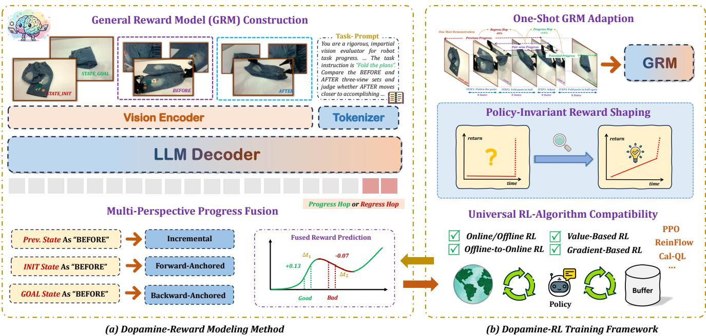
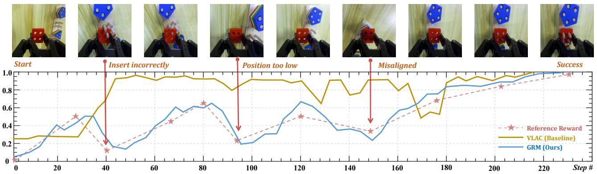
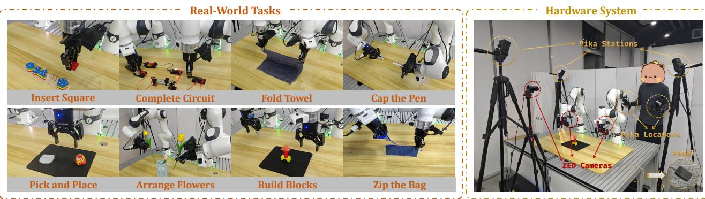

[← 返回 README](../README.md)

# 3. Method

## 📌 预览
Method 由两大模块组成：(a) Dopamine-Reward——如何构建 GRM 并从中获取精确的进度估计；(b) Dopamine-RL——如何将进度估计转化为理论正确的 RL 奖励信号。核心公式集中在 hop-based 归一化、三视角融合、和 policy-invariant reward shaping。

---

Our approach is designed to address the core challenges in real-world robotic learning by introducing two synergistic components. First, we develop Dopamine-Reward that learns a general-purpose, step-aware process reward from multi-view inputs (Section 3.1). Second, we propose Dopamine-RL, a robust policy learning framework built upon Dopamine-Reward, resolving the theoretical flaws in conventional reward shaping (Section 3.2).

> 💡 **本文提出两个模块**：
> - **Dopamine-Reward (3.1)**：提出 GRM，通过 hop-based 进度预测 + 多视角融合，解决现有 PRM 评不准的问题（对应 Introduction 缺陷 1）
> - **Dopamine-RL (3.2)**：提出 Policy-Invariant Reward Shaping，通过 PBRS 公式将 GRM 输出安全地转化为 reward，解决 naive dense reward 导致 semantic trap 的问题（对应 Introduction 缺陷 2）

---

*Figure 2. The overview of our method. (a) Dopamine-Reward: GRM 接收任务描述 + 多视角的 initial/goal/before/after 图像，预测 hop。Multi-Perspective Fusion 融合三种预测。(b) Dopamine-RL: One-Shot Adaptation + Policy-Invariant Reward Shaping。*

> 💡 **Figure 2 解读**:
> - **(a) 左半部分 — GRM 架构**: 输入是多视角的 initial/goal/before/after 图片 + task description，经过 Vision Encoder → LLM Decoder，输出一个 hop 值（相对进度变化）
> - **(a) 右半部分 — Multi-Perspective Fusion**: 同一个 GRM 用三种不同方式推理（Incremental/Forward/Backward），融合得到最终进度 $`\Phi^*`$
> - **(b) 左 — One-Shot Adaptation**: 给 GRM 看 1 条新任务示教，做 SFT 微调即可适配
> - **(b) 右 — Policy-Invariant Reward Shaping**: 用 PBRS 公式 $`r = r_{gold} + \gamma\Phi^*(s') - \Phi^*(s)`$ 把进度转成 reward，再喂给任意 RL 算法训练 policy

---

## 3.1. Dopamine-Reward Modeling Method

### 3.1.1. General Reward Model (GRM) Construction

The core of our modeling method is to build the GRM, a vision-language model designed to estimate precise task progress. To ensure the model generalizes across diverse embodiments and tasks, we construct a large-scale dataset structured around relative temporal transitions. This section details the three-stage GRM training data construction pipeline, from raw video segmentation to a scientifically rigorous hop-based labeling strategy as follows:

> 💡 **GRM 本质是一个基于 VLM 微调的 Reward Model**，输入多视角图片，输出任务进度估计。这一节讲的是如何给 GRM 造训练数据，分三个阶段：
> 1. 把连续视频变成带进度标签的离散状态序列
> 2. 把绝对进度差转成 hop-based 相对进度标签
> 3. 数据平衡，保证各种情况都有覆盖

---

**Step-wise task progress discretization.** We treat task progress itself as the supervision signal. Given raw multi-view video trajectories, we first segment each expert trajectory into sub-tasks using human-annotated multi-view keyframes $`\{K_0, K_1, \ldots, K_N\}`$, where $`K_0`$ is the initial observation, $`K_N`$ is the final success observation, and each $`K_j`$ is a set of synchronized multi-view keyframes. To obtain dense supervision, we perform adaptive sampling within each segment. For a trajectory with $`L`$ frames per view, we set a chunk size $`C`$ to determine the total number of sampled points and distribute them uniformly across the $`N`$ segments. The number of intermediate points $`m`$ within segment $`[K_j, K_{j+1}]`$ is:

$$
m = \left\lfloor \frac{1}{N} \left\lfloor \frac{L}{C} \right\rfloor \right\rfloor .
$$

> 💡 **Stage 1 — 进度离散化：把连续视频变成带进度标签的状态序列**
>
> 具体流程：
> 1. **人工标注关键帧** $`K_0, K_1, ..., K_N`$：标出子任务的分界点（如"抓起杯子"、"移到盘子上方"、"放下"），将轨迹切成 N 个 segment
> 2. **在每个 segment 内均匀采样**：不是对整条轨迹无脑均匀采，而是先按子任务切段再在每段内采，保证每个阶段都有足够样本
> 3. **给每个采样点打进度标签**：$`\Phi(s_i) = i/M`$，就是"第 i 个点 / 总点数"= 完成百分比
>
> **公式中的变量**：
> - L = 轨迹总帧数，C = chunk size（每隔 C 帧采一个点），L/C = 总采样数
> - N = 关键帧分出的 segment 数，m = 每个 segment 分到的采样点数
> - M = 最终状态序列总长度 ≈ L/C
>
> **举例**：L=300 帧，C=30，N=3 段 → 总采样 10 个点，每段分到 m=3 个点，Φ 从 0 线性排到 1

This yields a sequence of states $`\mathcal{S} = \{s_0, s_1, \ldots, s_M\}`$ where each state $`s_i`$ is a set of synchronous multi-view visual observations. We then define the ground-truth global progress as $`\Phi(s_i) = i/M`$.

> 💡 **进度函数 $`\Phi(s)`$**：这里的 $`\Phi`$ 就是后文 PBRS 公式中的势函数（potential function）。在这一步它是 ground-truth 标签（$`\Phi(s_i) = i/M`$，线性分配）；后续 GRM 训练好后，GRM 的输出 $`\Phi^*(s)`$ 就是对这个进度的预测值。$`\Phi`$ 的含义始终是"任务完成了多少"，从 0（开始）到 1（完成）。

---

**Hop-based relative progress normalization.** A naive choice is to regress the progress gain $`\Phi_\delta(s_p, s_q) = \Phi(s_q) - \Phi(s_p)`$ between two states, but iterating such predictions accumulates error and can push the reconstructed $`\Phi^{\star}(s)`$ outside $`[0, 1]`$. Instead, we introduce a hop-based formulation that learns relative-relative progress. Each training sample is a tuple $`\mathcal{D}`$ containing a task description $`d_{task}`$, the initial state $`s_0`$, the goal state $`s_M`$, a "BEFORE" state $`s_p`$, an "AFTER" state $`s_q`$, and a hop label $`\mathcal{H}(s_p, s_q)`$ that normalizes the progress from $`s_p`$ to $`s_q`$ relative to the full task span from $`s_0`$ to $`s_M`$. Given $`\Phi(s_p)`$ and $`\Phi(s_q)`$, we define:

$$
\mathcal{H}(s_p, s_q) = \begin{cases} \dfrac{\Phi(s_q) - \Phi(s_p)}{\Phi(s_M) - \Phi(s_p)} & \text{if } q \geq p \text{ (PROGRESS)} \\ \dfrac{\Phi(s_q) - \Phi(s_p)}{\Phi(s_p) - \Phi(s_0)} & \text{if } q < p \text{ (REGRESS)} \end{cases}
$$

> 💡 **Stage 2 — Hop-based 归一化**
>
> **传统做法（绝对进度差）**：$`r = \Phi(s_q) - \Phi(s_p)`$
>
> 问题：每步预测都有误差（如 ±0.03），连续迭代 20 步后误差累加，重建的进度可能超出 [0,1]
>
> **Hop 做法（相对比例）**：
> - **前进** (q ≥ p)：$`\mathcal{H} = \dfrac{\Phi(s_q) - \Phi(s_p)}{\Phi(s_M) - \Phi(s_p)}`$，分母是**剩余距离**，预测"完成了剩余路程的多少比例"
> - **后退** (q < p)：$`\mathcal{H} = \dfrac{\Phi(s_q) - \Phi(s_p)}{\Phi(s_p) - \Phi(s_0)}`$，分母是**已走距离**，预测"倒退了已走路程的多少比例"
>
> 因为分母会随进度自动缩放（越接近目标剩余距离越小），同样的 hop 误差对绝对进度的影响也越来越小，重建的 $`\Phi^*`$ 数学上保证永远在 [0, 1] 内（Appendix A.1）。

This dynamically scales the supervision into $`[-1, 1]`$: for forward progress, the change is normalized by the remaining distance to the goal; for regression, by the distance already covered from the initial state. A key theoretical advantage is that, when global progress is reconstructed by iteratively applying predicted hops, the resulting $`\Phi^{\star}(s)`$ is guaranteed to remain strictly within [0, 1]. A detailed proof is provided in Appendix A.1.

---

**Sampling strategy and data balancing.** For each trajectory, we construct a balanced set of hop-based training samples. Continuous hop values are first discretized into $`N_{hop}`$ hop bins. The temporal distance between the "BEFORE" state $`s_p`$ and "AFTER" state $`s_q`$ in each pair is then chosen from $`N_{dis}`$ distance bins within each hop bin, yielding in total $`N_{hop} \times N_{dis}`$ non-trivial transitions. To reduce bias toward static segments, we further introduce an additional fraction $`\alpha`$ of samples explicitly labeled as zero-hop (i.e., $`\mathcal{H}(s_p, s_q) = 0`$), constructed by selecting pairs $`(s_p, s_q)`$ whose progress change is below a small threshold $`\epsilon`$:

$$
|\Phi(s_q) - \Phi(s_p)| \leq \epsilon.
$$

> 💡 **Stage 3 — 数据平衡：防止训练数据偏向某类样本**
>
> 如果随机采样状态对，大部分样本的 hop 值会集中在某个小范围，导致 GRM 对其他情况预测不准。通过三个操作解决：
>
> **操作 1 — Hop 分箱**：把连续的 hop 值离散化成 $`N_{hop}`$ 个区间（如 0\~0.1、0.1\~0.3、0.3\~1.0），保证每种进步幅度的样本数量均衡，GRM 不会只擅长预测小变化。
>
> **操作 2 — 时间距离分箱**：同样的 hop 值可能对应不同的时间跨度。比如 hop=0.2，可能是"1 步内快速完成了 20%"，也可能是"20 步内缓慢积累了 20%"。在每个 hop bin 内，再按 $`s_p`$ 和 $`s_q`$ 之间隔了多少步分成 $`N_{dis}`$ 个 bin，让 GRM 见过各种速度下的进度变化。两个维度交叉共 $`N_{hop} \times N_{dis}`$ 种组合。
>
> **操作 3 — 零 hop 样本**：额外加入 α 比例的"无变化"样本（$`|\Phi(s_q) - \Phi(s_p)| \leq \epsilon`$）。这是因为实际操作中经常有"手在动但任务没进展"的情况，如果训练数据里没有这类样本，GRM 会偏向总是预测"有进展"。
>
> **最终规模**：35M 训练样本，来自 3,400 小时视频、100K+ 轨迹

Applying this three-stage pipeline yields a dataset of 35M samples from about 3,400 hours of video and over 100K trajectories (see Appendix B). We train the GRM on this corpus to estimate hop-based relative progress between arbitrary state pairs, conditioned on the initial state, goal state, and task description.

> 💡 **3.1.1 小结 — 三阶段流水线**：
>
> | 阶段 | 做什么 | 输入 → 输出 |
> |------|--------|-----------|
> | 1. 进度离散化 | 标关键帧 → 切段 → 均匀采样 → 打进度标签 | 视频 → 状态序列 + $`\Phi(s_i) = i/M`$ |
> | 2. Hop 归一化 | 把绝对进度差转成相对比例 | 状态对 → hop 标签 ∈ [-1,1] |
> | 3. 数据平衡 | 双重分箱 + 零 hop 补充 | hop 标签集 → 35M 均衡训练样本 |

---

### 3.1.2. Multi-Perspective Progress Fusion from GRM

To mitigate error accumulation and ensure consistent accuracy, we fuse predictions based on GRM from three complementary perspectives: incremental prediction, forward-anchored prediction, and backward-anchored prediction.

> 💡 **为什么需要融合？** GRM 训练好后，用它来推理时有不同的用法。单一用法都有缺陷（局部准但会累积漂移，或全局稳但不够精细），所以融合三种互补方式来提高精度。

---

**Incremental Prediction** first offers a fine-grained, step-by-step assessment. Refer to Equation (2), the predicted global progress $`\Phi_I^{\star}(s_t)`$ is recursively computed from the preceding state's progress $`\Phi^{\star}(s_{t-1})`$ and the predicted hop $`\mathcal{H}^{\star}(s_{t-1}, s_t)`$. Let $`\Delta\Phi_{t-1,t}^{\star}`$ be the estimated progress hop:

$$
\Delta\Phi_{t-1,t}^{\star} = \begin{cases} [1 - \Phi^{\star}(s_{t-1})] \cdot \mathcal{H}^{\star} & \text{if } \mathcal{H}^{\star} \geq 0 \\ \Phi^{\star}(s_{t-1}) \cdot \mathcal{H}^{\star} & \text{if } \mathcal{H}^{\star} < 0 \end{cases}
$$

> 💡 **增量公式解读**：这个公式就是把 3.1.1 的 hop 定义**反过来解**。训练时 hop = 进度差 ÷ 可用空间，推理时反过来：进度差 = 可用空间 × hop。
> - **前进**（hop ≥ 0）：可用空间 = 1 - 当前进度（剩余空间），hop 表示"用掉了剩余空间的百分之几"
> - **后退**（hop < 0）：可用空间 = 当前进度（已完成空间），hop 表示"退掉了已完成空间的百分之几"
>
> 例：当前进度 0.6，hop = 0.5 → 剩余空间 0.4 × 0.5 = 0.2，增量 = 0.2

The incremental progress is then calculated as follow:

$$
\Phi_I^{\star}(s_t) = \Phi^{\star}(s_{t-1}) + \Delta\Phi_{t-1,t}^{\star},
$$

where $`\Phi_I^{\star}(s_t)`$ is accumulated along the trajectory, initialized with $`\Phi^{\star}(s_0) = 0`$.

> 💡 **视角 1 — Incremental（逐步递推）**：
> - **做法**：BEFORE = 上一步状态，AFTER = 当前状态，GRM 预测相邻两步间的 hop，从 $`s_0`$ 开始逐步累加得到进度
> - **优点**：局部精度高，能捕捉每一步的细微变化
> - **缺点**：误差会逐步累积，长轨迹后段可能偏离真实进度

---

While this method excels at capturing local dynamics, it is susceptible to the accumulation of prediction errors over long trajectories. To counteract this drift, we introduce extra two global perspectives. **Forward-Anchored Prediction** provides a stable global reference by anchoring to the initial state $`s_{init}`$, where progress is zero:

$$
\Phi_F^{\star}(s_t) = \mathcal{H}^{\star}(s_{init}, s_t).
$$

> 💡 **视角 2 — Forward-Anchored（前锚定）**：
> - **做法**：BEFORE = 初始状态 $`s_{init}`$，AFTER = 当前状态 $`s_t`$，直接问 GRM"从头到现在完成了多少"
> - **优点**：不依赖中间步骤，全局稳定，不会累积误差
> - **缺点**：当 $`s_t`$ 离 $`s_{init}`$ 很远时（比如任务快完成了），一次性跨越太大，单次预测精度下降

---

Conversely, **Backward-Anchored Prediction** is anchored to the goal state $`s_{goal}`$, where progress is one. This approach offers high sensitivity near task completion:

$$
\Phi_B^{\star}(s_t) = 1 + \mathcal{H}^{\star}(s_{goal}, s_t).
$$

> 💡 **视角 3 — Backward-Anchored（后锚定）**：
> - **做法**：BEFORE = 目标状态 $`s_{goal}`$，AFTER = 当前状态 $`s_t`$，问 GRM"从目标看，当前退了多少"，然后 1 + 负数 = 当前进度
> - **优点**：接近任务完成时剩余距离短，hop 预测最准
> - **缺点**：远离目标时（任务刚开始），跨度太大，精度下降

---

These three methods offer complementary strengths: local precision (incremental), initial stability (forward), and goal sensitivity (backward). We fuse them via averaging to obtain a robust final progress estimate:

$$
\Phi^{\star}(s_t) = \frac{1}{3}\left(\Phi_I^{\star}(s_t) + \Phi_F^{\star}(s_t) + \Phi_B^{\star}(s_t)\right).
$$

> 💡 **三者简单平均即可互补**：Incremental 在开头准（局部精度），Backward 在结尾准（接近目标），Forward 全程提供稳定的基准。
> 消融实验（Table 5）：去掉任一视角性能下降 15%~22.5%，说明三者都不可或缺。

This fusion yields a more accurate and drift-resistant signal, which is critical for the subsequent reward shaping.

---

### 3.1.3. Progress Consistency Checking (Optional)

While the multi-perspective fusion via averaging (Equation (8)) serves as a baseline, its naive application in online RL faces the risk of Out-of-Distribution (OOD) hallucination. Due to the inherent limitations of data coverage, it is impossible for the training set to encompass every corner of the state space. During RL, the policy inevitably explores unseen regions where the reward model may yield spurious high signals, leading to "reward hacking." To address these, we propose a bi-directional consistency checking strategy that leverages consistency as a proxy for reliability, which is motivated by the observation that forward $\Phi_F^{*}$ and backward $\Phi_B^{*}$ predictions tend to exhibit significant divergence in OOD scenarios or observations, whereas they remain consistent in familiar states.

> 💡 **问题**：RL 训练中 agent 会探索到训练数据没覆盖过的状态（OOD），此时 GRM 可能给出虚假的高分 → agent 被骗去重复这些状态（reward hacking）。
>
> **解决思路**：在熟悉的状态上，Forward 和 Backward 两个方向的预测应该一致；在 OOD 状态上，两者会明显不一致。利用这个不一致性来判断预测是否可信。

---

**Consistency-Aware Weighting.** We first define the mean estimated progress $\bar{\Phi}^{*}(s_t) = (\Phi_F^{*}(s_t) + \Phi_B^{*}(s_t)) / 2$. To quantify uncertainty, we calculate a normalized discrepancy metric:

$$
\Delta_{norm}(s_t) = \frac{|\Phi_B^{*}(s_t) - \Phi_F^{*}(s_t)|}{\bar{\Phi}^{*}(s_t) + \epsilon},
$$

where $\epsilon$ is a small constant for numerical stability. Normalization by $\bar{\Phi}^{*}$ ensures that discrepancies are penalized more heavily during the early stages (where $\Phi$ is small), as precise guidance is critical initially. We then derive a confidence weight $w_t \in (0,1]$ using a Gaussian kernel with sensitivity $\alpha$:

$$
w_t = \exp\left(-\alpha \cdot (\Delta_{norm}(s_t))^2\right).
$$

> 💡 **一致性权重**：
> - Forward 和 Backward 预测差异越大 → $\Delta_{norm}$ 越大 → $w_t$ 越接近 0（不信这个预测）
> - 两者一致 → $\Delta_{norm}$ 小 → $w_t$ 接近 1（信任这个预测）
> - 除以 $\bar{\Phi}$ 的作用：在任务早期 $\Phi$ 值小，同样的绝对差异对应更大的 $\Delta_{norm}$，即早期对不一致的惩罚更重（因为早期的引导方向很关键）

---

**Conservative State Update.** To prevent the policy from exploiting erroneous estimates in OOD scenarios, we employ a conservative update rule for the maintained progress state $\Phi^{*}(s_t)$ instead of Equation (8):

$$
\Phi^{*}(s_t) = \Phi^{*}(s_{t-1}) + \frac{w_t}{2} \cdot \left(\bar{\Phi}^{*}(s_t) - \Phi^{*}(s_{t-1}) + \Delta\Phi_{t-1,t}^{*}\right).
$$

This mechanism acts as a semantic filter: it ignores uncertain updates when $w_t \to 0$ (retaining $\Phi^{*}(s_{t-1})$) and fully trusts the estimate when consistency is high ($w_t \to 1$).

> 💡 **保守更新——3.1.3 的完整逻辑链**：
>
> 3.1.2 用三视角简单平均得到进度，但 online RL 中 agent 会跑到 OOD 状态，GRM 在这些状态上不可信。3.1.3 的解决方案分三步：
>
> **Step 1: 定义均值进度 $\bar{\Phi}^{*}$**：只取 Forward 和 Backward 的均值（不含 Incremental），因为这两个方向是独立预测，适合互相校验。
>
> **Step 2: 用 $\bar{\Phi}^{*}$ 算置信度 $w_t$**：Forward 和 Backward 差异越大 → $\Delta_{norm}$ 越大 → $w_t$ 越接近 0。本质是：两个独立视角对同一个状态的判断不一致，说明 GRM 在这个状态上"没见过"，不可信。
>
> **Step 3: $w_t$ 门控进度更新**：括号里有三项，拆开看：
> - $\bar{\Phi}^{*}(s_t)$：Forward 和 Backward 的均值，代表"全局视角认为当前进度是多少"
> - $\Phi^{*}(s_{t-1})$：上一步的进度（被减掉了，所以 $\bar{\Phi}^{*}(s_t) - \Phi^{*}(s_{t-1})$ 就是"全局视角认为这一步该更新多少"）
> - $\Delta\Phi_{t-1,t}^{*}$：Incremental 算出的局部增量，代表"局部视角认为这一步该更新多少"
>
> 三项合起来 = 全局更新量 + 局部更新量，然后整体乘以 $w_t/2$ 做门控。
>
> **为什么好**：不需要额外的 OOD 检测器，直接利用已有的 Forward 和 Backward 的"一致性"作为免费的可信度信号，在不可信时自动刹车，避免 reward hacking。

---

## 3.2. Dopamine-RL Framework

Building upon Dopamine-Reward with GRM, we further introduce the Dopamine-RL framework, a reinforcement learning pipeline producing high-performance policy stimulated by Dopamine-Reward, featuring three key critical attributes: minimal downstream task effort for rapid progress alignment (Section 3.2.1), fast convergence with policy-invariant guarantees (Section 3.2.2) and seamless integration with diverse RL paradigms (Section 3.2.3).

> 💡 **Dopamine-RL 是把 GRM 的进度估计转化为 RL 可用的 reward 的框架**。原文强调三个关键属性（three key critical attributes）：
> 1. **Minimal downstream task effort（3.2.1）**：适配新任务的成本极低，只需 1 条人类示教做 SFT 微调，不需要重新训练 GRM
> 2. **Fast convergence with policy-invariant guarantees（3.2.2）**：用 PBRS 理论保证加了 dense reward 后最优策略不变，同时加速收敛
> 3. **Seamless integration with diverse RL paradigms（3.2.3）**：只替换 reward 信号，不改 RL 算法本身，所以兼容 SAC、PPO、RLPD 等任意方法

---

### 3.2.1. One-shot GRM Adaptation

Dopamine-RL requires only one single human demonstration $`\mathcal{D}_{human}`$ to adapt the pre-trained GRM to novel or high-precision tasks, since the pre-trained GRM has already possessed a broad prior for assessing progress. Given a new task, we minimize the Mean Squared Error (MSE) between its predicted hop value, $`\mathcal{H}_\omega^{\star}`$, and the ground-truth, $`\mathcal{H}_{gt}`$:

$$
\mathcal{L}_{GRM}(\omega) = \mathbb{E}_{(s_p, s_q) \sim \mathcal{D}_{human}} \|\mathcal{H}_\omega^{\star} - \mathcal{H}_{gt}\|_2^2,
$$

where $`\omega`$ represents the GRM's parameters, initialized by pre-trained $`\text{GRM}_{\omega_0}`$. After SFT, we obtain a task-adapted $`\text{GRM}_{\omega_{\star}}`$, poised for efficient reinforcement learning.

> 💡 **One-Shot 适配**：
> - GRM 在 35M 样本上预训练后已经具备广泛的进度评估能力，面对新任务只需要 1 条人类示教做 SFT 微调
> - 损失函数就是 MSE：让 GRM 在新任务上的 hop 预测尽量接近 ground-truth
> - 消融实验（Table 5）：不做 adaptation（zero-shot）性能下降 21.8%，说明微调是必要的

---

*Figure 3. Reward profiles on a challenging real-world rollout. 对比人类标注参考 reward、VLAC baseline、和 GRM 在同一轨迹上的输出。*

> 💡 **Figure 3 解读**：
> - **Human（绿色线）**：人类标注的参考 reward，在错误操作时给低分，接近成功时给高分
> - **VLAC（蓝色线）**：对错误操作不够敏感，曲线波动大
> - **GRM（红色线）**：与人类参考高度吻合，能准确识别错误操作并给出低分
> - 直观证明 GRM 比现有方法更准

---

*Figure 4. Real-world tasks and hardware setup. 左：8 个代表性长 horizon 操作任务。右：多视角硬件平台（Pika 遥操作 + ZED 相机）。*

> 💡 **Figure 4 解读**：
> - **8 个真实任务**：插入、电路连接、折叠、拾放、组装等，都是需要精细操作的 contact-rich 任务
> - **硬件**：Pika 遥操作系统 + ZED 相机提供同步的腕部和第三人称视角
> - 这些任务的共同特点：手经常遮挡物体 → 正是多视角 GRM 的优势场景

---

### 3.2.2. Policy-Invariant Reward Shaping

A straightforward approach to defining the dense process reward function for policy learning is to use the direct increment of this progress: $`r(s_t, a_t, s_{t+1}) = \Phi^{\star}(s_{t+1}) - \Phi^{\star}(s_t)`$. However, optimizing the standard discounted return, $`J(\pi) = \mathbb{E}_\pi[\sum_{t=0}^{\infty} \gamma^t r(s_t, a_t, s_{t+1})]`$, with this reward is mathematically equivalent to maximizing a different objective: $`J'(\pi) \propto \mathbb{E}_\pi[\sum_{t=1}^{\infty} \gamma^{t-1} \Phi^{\star}(s_t) \mid s_0]`$, as detailed in Appendix A.2.

> 💡 **为什么不能直接用进度差当 reward？**
> - 最直觉的做法：$`r = \Phi(s') - \Phi(s)`$，前进奖励，后退惩罚
> - 但展开折扣累积回报后发现，agent 实际最大化的是"各状态进度值的加权和"，而不是"完成任务"
> - 结果：agent 快速跑到高进度状态（如 90%）然后**停着不动**，因为每待一步都在"享受"高进度带来的折扣回报。这就是 semantic trap

This transformed objective creates a perverse incentive: it encourages the agent not to complete the task, but rather to seek and maintain states with high progress values. Consequently, the resulting policy is rewarded for stagnation, preferring a safe, suboptimal state over potentially risky trajectories that lead to true task completion. To resolve the misalignment, we formulate our GRM reward $`r_{GRM}`$ that adheres to three desiderata:

- **Optimal policy invariance.** The optimal policy learned with $`r_{GRM}`$ must coincide with that under the sparse gold reward $`r_{gold}`$ (1 at task completion, 0 otherwise), so shaping guides exploration without changing task objective.
- **Discount consistency**: $`r_{GRM}`$ must be compatible with the standard exponentially discounted return and TD or Bellman updates with factor $`\gamma`$ under a memoryless (Markov) reward assumption.
- **Locality.** At any step $`t`$, $`r_{GRM}`$ is efficiently computable from the single transition $`(s_t, a_t, s_{t+1})`$.

> 💡 **设计 reward 必须满足的三个约束**：
> - **Policy invariance**：加了 dense reward 后最优策略不变，不偏离原始任务目标
> - **Discount consistency**：兼容标准的 γ 折扣和 TD/Bellman 更新，与现有 RL 算法兼容
> - **Locality**：只需当前 transition (s, a, s') 就能算出 reward，不需要回看整条轨迹

---

Adherence to these desiderata uniquely determines the reward structure, we derive the reward from the continuous-time "discounted potential" $`e^{-\lambda t}\Phi^{\star}(s_t)`$. As detailed in Appendix A.4, the natural discrete-time, single-step increment that is consistent with this continuous form is:

$$
F(s_t, s_{t+1}) = \gamma\Phi^{\star}(s_{t+1}) - \Phi^{\star}(s_t),
$$

where $`\gamma = e^{-\lambda h}`$. To enable autonomous learning on real robots without the need for continuous human monitoring, we automate the determination of the sparse outcome reward $`r_{gold}`$. Specifically, we consider the task completed when the estimated progress falls within a close margin of the target (i.e., $`\Phi^{\star}(s_{t+1}) \geq 1 - \delta`$, with $`\delta = 0.05`$). Thus, $`r_{gold} = 1`$ if the completion threshold is met, and 0 otherwise. We add the shaping term $`F`$ to this automated gold-standard reward to define our final reward function:

$$
r_{GRM}(s_t, a_t, s_{t+1}) = r_{gold} + \gamma\Phi^{\star}(s_{t+1}) - \Phi^{\star}(s_t).
$$

> 💡 **核心公式**：$`r_{GRM} = r_{gold} + \gamma\Phi^*(s_{t+1}) - \Phi^*(s_t)`$
>
> 和 naive 做法 $`r = \Phi(s') - \Phi(s)`$ 相比有**两个关键区别**（不只是加了 $`\gamma`$）：
> 1. **保留了原始奖励 $`r_{gold}`$**（完成任务 = 1，否则 = 0）：shaping 是补充信号，不替代任务目标
> 2. **加了折扣因子 γ**：打破 telescoping，保证最优策略不变
>
> 额外设计：当 $`\Phi^*(s') \geq 0.95`$ 时自动判定任务完成（$`r_{gold} = 1`$），无需人工监督

---

This form guarantees policy invariance: the cumulative discounted shaping term $`F`$ forms a telescoping sum that collapses to a constant boundary term depending only on the initial state $`s_0`$. Appendix A.5 shows that the discrete-time sum and the continuous-time integral of the discounted potential's derivative converge to the same constant:

$$
\underbrace{\sum_{t=0}^{\infty} \gamma^t (\gamma\Phi^{\star}(s_{t+1}) - \Phi^{\star}(s_t))}_{\text{Discrete PBRS Sum}} = \underbrace{-\Phi^{\star}(s_0)}_{\text{Boundary Term}}
$$

Since the shaping term telescopes to a state-dependent constant that is independent of the subsequent policy $`\pi`$, the shaped Q-function is simply a state-wise shift of the original one:

$$
Q_{GRM}^{\pi}(s, a) = Q_{gold}^{\pi}(s, a) - \Phi^{\star}(s).
$$

The shift $`-\Phi^{\star}(s)`$ is identical for all actions $`a`$ in a given state $`s`$, so the optimal action remains unchanged:

$$
\arg\max_a Q_{GRM}^{*}(s, a) = \arg\max_a Q_{gold}^{*}(s, a).
$$

> 💡 **为什么加了 γ 就能保证最优策略不变？**
> 1. PBRS 项 $`\gamma\Phi^*(s') - \Phi^*(s)`$ 在折扣累加后完美 telescope（相消），只剩常数 $`-\Phi^*(s_0)`$
> 2. 因此 $`Q_{GRM} = Q_{gold} - \Phi^*(s)`$，只是加了一个**与 action 无关的偏移**
> 3. 偏移对所有 action 相同 → argmax 不变 → 最优策略不变
> 4. 结论：dense reward 加速了探索（让 agent 知道方向），但不改变最终目标
>
> 消融实验（Table 5）：去掉 PBRS 后性能暴降 43.7%——agent 掉入 semantic trap

This matches the standard Potential-Based Reward Shaping (PBRS) framework [41], with the GRM progress $`\Phi^{\star}`$ serving as the potential function.

---

### 3.2.3. Universal RL-Algorithm Compatibility

Dopamine-RL exhibits strong universality, seamlessly integrating with any RL algorithm, encompassing online RL, offline RL, and offline-to-online RL paradigms. It adapts effectively to both value-based methods and gradient-based approaches. By reshaping targeted reward functions to guide agent learning, Dopamine-RL is inherently agnostic to the specific RL algorithm employed. Experimental results confirm this flexibility. In simulations, we deploy under two settings: PPO [46] (Proximal Policy Optimization) algorithm and OpenVLA-OFT [26] model, and ReinFlow [61] algorithm with $`\pi_0`$ [6] model. In real-world settings, we combine with Cal-QL [39] (a offline-to-online Q-learning based RL algorithm) and it also delivers exceptional outcomes. Further details are shown in Appendix C.

> 💡 **Dopamine-RL 只改 reward 函数，不改 RL 算法本身，因此天然兼容一切 RL 方法**：
>
> | 环境 | RL 算法 | Policy 架构 | 类型 |
> |------|---------|------------|------|
> | 仿真 | PPO [46] | OpenVLA-OFT [26] | Online RL |
> | 仿真 | ReinFlow [61] | π₀ [6] | Online RL (Flow) |
> | 真实世界 | Cal-QL [39] | — | Offline-to-Online |
>
> 这是 PBRS 框架的固有优势——reward shaping 发生在 reward 层面，与 policy 优化算法完全解耦。

---

## 🔖 Section 总结

### 整体 Pipeline 流程表

| 阶段 | 模块 | 输入 | 输出 | 关键操作 |
|-----|------|------|------|---------|
| 1 | 数据构建 | 多视角视频 | 35M hop 标签样本 | 关键帧标注 + 自适应采样 + hop 归一化 |
| 2 | GRM 预训练 | 35M 样本 | 通用 VLM 奖励模型 | 基于 RoboBrain 2.0 的 SFT |
| 3 | One-Shot 适配 | 1 条示教 + GRM | 任务适配的 GRM | MSE 微调 |
| 4 | 进度估计 | 当前观测 + GRM | $`\Phi^*(s_t)`$ | 三视角融合 (+ 一致性检查) |
| 5 | 奖励塑形 | $`\Phi^*(s_t)`$, $`\Phi^*(s_{t+1})`$ | $`r_{GRM}`$ | PBRS: $`r_{gold} + \gamma\Phi^* - \Phi^*`$ |
| 6 | RL 训练 | $`r_{GRM}`$ + 任意 RL 算法 | 高性能策略 | PPO / Cal-QL / ReinFlow |

### 关键设计选择及理由

**设计 1: Hop-based 相对进度（而非绝对进度）**
- **具体设计**: 预测归一化的相对进度变化 $`\mathcal{H} \in [-1,1]`$
- **设计理由**: 绝对进度迭代累积误差、可能超出 [0,1]
- **解决的问题**: 进度估计的稳定性和有界性

**设计 2: 三视角融合（而非单一预测）**
- **具体设计**: Incremental + Forward + Backward 简单平均
- **设计理由**: 三种方式互补——局部精度、全局稳定、目标敏感
- **解决的问题**: 长轨迹误差累积（消融: -15% ~ -22.5%）

**设计 3: PBRS 而非 naive reward shaping**
- **具体设计**: $`r = r_{gold} + \gamma\Phi - \Phi`$（多一个 $`\gamma`$）
- **设计理由**: 数学保证最优策略不变（telescoping sum）
- **解决的问题**: Semantic trap（消融: -43.7%）
