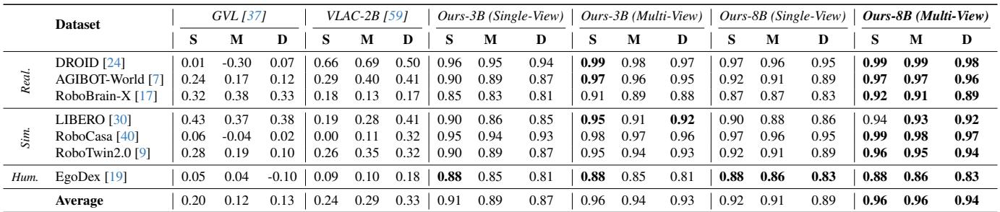
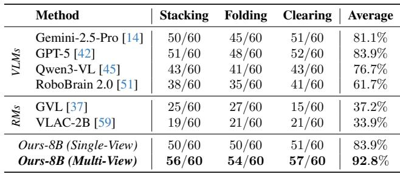
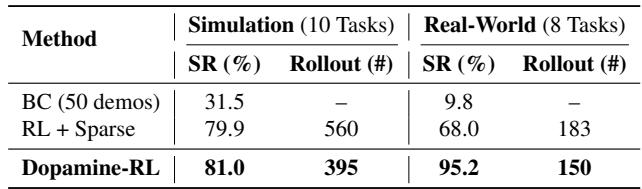
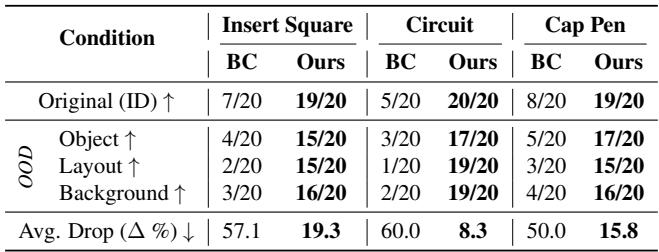
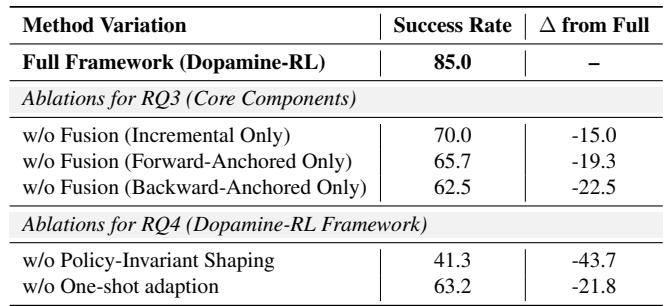

[← 返回 README](../README.md)

# 4. Experiments

## 📌 预览
实验围绕四个 Research Questions 展开：RQ1 奖励精度、RQ2 策略性能/效率/泛化、RQ3 多视角融合的必要性、RQ4 Dopamine-RL 框架的必要性。覆盖 10 个仿真 + 8 个真实世界任务。

---

We evaluate Dopamine-Reward with GRM and Dopamine-RL on both simulation and real-world robotic platforms, covering a broad range of manipulation skills and deployment scenarios. This section summarizes our empirical findings and is organized around four questions:

- RQ1: How accurate is the GRM at perceiving task progress compared to VLMs and existing reward models?
- RQ2: How does Dopamine-RL perform in success rate, sample efficiency, and generalization against strong BC and RL baselines?
- RQ3: How critical is Multi-Perspective Progress Fusion for final performance?
- RQ4: How important is the Dopamine-RL framework for turning reward modeling into practical policy learning?

> 💡 **四个 RQ 的对应关系**:
> | RQ | 验证什么 | 对应方法 |
> |----|---------|---------|
> | RQ1 | GRM 奖励精度 | Dopamine-Reward (3.1) |
> | RQ2 | 端到端策略性能 | 完整框架 |
> | RQ3 | 三视角融合 | 3.1.2 消融 |
> | RQ4 | PBRS + One-shot | 3.2 消融 |

---

## 4.1. Accurate Task Progress Perception (RQ1)

### 4.1.1. Video Frame Rank-Correlation

To quantitatively assess task progress perception, we follow the evaluation methodology of GVL [37] and measure the Value-Order Correlation (VOC) between the GRM's predicted progress and the ground-truth chronological order of shuffled frames. A higher VOC score ([-1, 1]) indicates a better understanding of temporal progress. We evaluate on a diverse suite of eight datasets spanning real-world robotics (DROID [24], AGIBOT-World [7], RoboBrain-X [17]), simulation (Libero [30], RoboCasa [40], RoboTwin2.0 [9]), and egocentric human manipulation (EgoDex [19]). To test robustness to temporal granularity, we test under three distinct sampling strategies: Sparse (S) using only major keyframes, Medium (M) using uniform samples between keyframes, and Dense (D) using uniform samples across the entire trajectory.

> 💡 **VOC 评测方法**:
> - 打乱视频帧顺序 → 让模型预测每帧的进度 → 计算与真实时间顺序的 rank correlation
> - 三种采样密度（S/M/D）测试不同粒度下的鲁棒性
> - 7 个数据集覆盖：真实机器人 + 仿真 + 人类自我视角

---

*Table 1. Video Frame Rank-Correlation (VOC) on Diverse Datasets. GRM 在所有 benchmark 和采样密度上都取得最优。*

> 💡 **Table 1 批读**:
>
> **关键发现**:
>
> | 对比项 | 数据 | 说明 |
> |-------|------|------|
> | GRM-8B MV vs GVL | 0.96 vs 0.20 (Avg S) | 碾压级优势，GVL 几乎随机 |
> | GRM-8B MV vs VLAC | 0.96 vs 0.29 (Avg S) | VLAC 也远不如 GRM |
> | Multi-View vs Single-View | 0.96 vs 0.92 (8B, Avg S) | 多视角一致性更好 |
> | Sparse vs Dense | 0.96 → 0.94 (8B MV) | GRM 在各密度下都稳定 |
> | Baselines Dense 退化 | GVL: 0.20→0.13, VLAC: 0.24→0.33 | 细粒度区分能力差 |
>
> **最突出的点**: GRM 在 DROID 上 VOC 达 0.99（几乎完美），而 GVL 仅 0.01（基本随机）。

We compare our multi-view and single-view GRM against four state-of-the-art reward models: GVL [37], and VLAC [59]. As shown in Table 1, our multi-view GRM consistently achieves the highest VOC scores across all seven datasets and all sampling strategies. The performance of baseline models tends to degrade as sampling becomes denser, indicating a struggle with fine-grained temporal distinctions. In contrast, our model maintains exceptionally high performance, highlighting the robustness of our hop-based learning formulation and multi-perspective fusion. The performance gap is most significant in complex, long-horizon tasks (e.g., LIBERO [30], RoboBrain-X [17]), where our model's ability to accurately contextualize progress is paramount.

---

### 4.1.2. Task Completion Judgment

To assess the GRM's ability to make high-level judgments about task outcomes, we follow the protocol from SARM [8]. We collect 60 real-world rollouts for each of three tasks (stacking blocks, folding T-shirt, clearing desktop), with 20 successful (SE), 20 partially successful (PSE), and 20 failed (FE) episodes.

---

*Table 2. Task Completion Classification Accuracy (successes out of 60). GRM 比专门的奖励模型和大型通用模型都更准确。*

> 💡 **Table 2 批读**:
>
> | 对比项 | 数据 | 说明 |
> |-------|------|------|
> | GRM-8B MV vs GPT-5 | 92.8% vs 83.9% | 超越最强通用 VLM (+9%) |
> | GRM-8B MV vs Gemini-2.5-Pro | 92.8% vs 81.1% | 专用模型 > 通用大模型 |
> | GRM-8B MV vs GVL | 92.8% vs 37.2% | GVL 几乎不可用 |
> | GRM-8B MV vs VLAC | 92.8% vs 33.9% | VLAC 也几乎不可用 |
> | Multi-View vs Single-View | 92.8% vs 83.9% | 多视角关键（+9%） |
>
> **三个关键洞察**:
> 1. **GPT-5/Gemini 不够用**: 大模型在空间精度上有短板——"near-miss"(PSE) 常被误判为成功
> 2. **单视角 PRM 失败**: GVL/VLAC <40%，因为遮挡时丢失物体跟踪
> 3. **多视角是 killer feature**: 即使一个视角被遮挡，另一个视角仍可验证进度

---

## 4.2. Performance, Efficiency, Generalization (RQ2)

We now evaluate the Dopamine-RL framework across 10 simulation tasks (from LIBERO [30] and RoboTwin2.0 [9]) and 8 real-world tasks, whose task setups and hardware platform are illustrated in Figure 4. In our simulation experiments, Dopamine-RL is evaluated under two distinct configurations: one leveraging the PPO [46] algorithm alongside the OpenVLA-OFT [26] model, and the other integrating the ReinFlow [61] algorithm with the $\pi_0$ [6] model. For real-world implementations, we pair Dopamine-RL with Cal-QL [39] and we employ a Human-in-the-Loop setup where we use just one single human demonstrations to adapt the GRM.

> 💡 **实验设置**:
> | 环境 | 任务数 | RL 算法 | Policy 架构 |
> |------|--------|---------|------------|
> | 仿真 (LIBERO + RoboTwin2.0) | 10 | PPO / ReinFlow | OpenVLA-OFT / $\pi_0$ |
> | 真实世界 | 8 | Cal-QL | — |
>
> Baselines: BC (50 demos), PPO+Sparse, ConRFT

---

*Table 3. Policy Performance and Sample Efficiency. Dopamine-RL 用更少的 rollout 达到更高的成功率。*

> 💡 **Table 3 批读**:
>
> | 对比项 | 数据 | 说明 |
> |-------|------|------|
> | Dopamine-RL vs BC (Real) | 95.2% vs 9.8% | BC 50 demos 几乎不可用 |
> | Dopamine-RL vs Sparse RL (Real) | 95.2% vs 68.0% | 密集奖励大幅优于稀疏 |
> | Rollout 效率 (Real) | 150 vs 183 | 比稀疏 RL 少 18% 的交互 |
> | Dopamine-RL vs Sparse RL (Sim) | 81.0% vs 79.9% | 仿真差距不大 |
> | Rollout 效率 (Sim) | 395 vs 560 | 比稀疏 RL 少 29% 的交互 |
>
> **关键洞察**: 真实世界的提升远大于仿真（95.2% vs 68.0%），说明 dense reward 在真实世界中价值更大（因为探索更困难、rollout 更昂贵）

---

*Table 4. Generalization Performance Breakdown: ID vs. OOD. 对比 BC 和 Dopamine-RL 在 OOD 条件下的鲁棒性。*

> 💡 **Table 4 批读**:
>
> | 对比项 | 数据 | 说明 |
> |-------|------|------|
> | Ours ID 成功率 | 19-20/20 | 接近完美 |
> | Ours OOD 平均下降 | 8.3-19.3% | 仅轻微退化 |
> | BC OOD 平均下降 | 50-60% | 严重退化 |
> | Circuit: Ours vs BC (Layout) | 19/20 vs 1/20 | 布局变化下差距最大 |
>
> **三种 OOD 条件**:
> - Object Change（物体属性变化）
> - Layout Change（工作空间布局变化）
> - Background Change（背景视觉变化）
>
> **核心结论**: Dopamine-RL 学到了任务语义而非表面视觉特征，BC 严重过拟合

---

## 4.3. Ablation Studies (RQ3 & RQ4)

Finally, we conduct a series of ablation studies on a representative subset of three real-world tasks to validate the key design choices in the Dopamine-Reward framework.

---

*Table 5. Ablation Study Results (Average Success Rate %). 每个组件都对最终性能至关重要。*

> 💡 **Table 5 批读 — 最重要的消融实验**:
>
> ### RQ3: 多视角融合
> | 消融项 | 成功率 | 下降 | 含义 |
> |-------|--------|------|------|
> | Full Framework | **85.0%** | — | 基线 |
> | w/o Fusion (Incremental Only) | 70.0% | -15.0% | 误差累积问题 |
> | w/o Fusion (Forward Only) | 65.7% | -19.3% | 长距离预测不准 |
> | w/o Fusion (Backward Only) | 62.5% | -22.5% | 远离目标时最差 |
>
> **洞察**: 三种视角的重要性排序 Incremental > Forward > Backward（但融合后效果最好）
>
> ### RQ4: Dopamine-RL 框架
> | 消融项 | 成功率 | 下降 | 含义 |
> |-------|--------|------|------|
> | w/o Policy-Invariant Shaping | 41.3% | **-43.7%** | **最关键组件！** |
> | w/o One-shot Adaptation | 63.2% | -21.8% | Zero-shot 在 OOD 任务不够 |
>
> **最 surprising 的发现**: 去掉 PBRS 后性能暴降 43.7%！agent 学到了到达高 reward 状态就停下来（semantic trap 的实证确认）

For RQ3, we ablate the Multi-Perspective Progress Fusion in Dopamine-Reward. Removing fusion and relying on a single progress estimator consistently hurts performance: the incremental-only, forward-anchored-only, and backward-anchored-only variants incur 15.0%, 19.3%, and 22.5% absolute drops, respectively. The incremental-only variant is particularly vulnerable to error drift over long horizons, confirming the importance of combining local and global progress perspectives.

For RQ4, the importance of the Dopamine-RL is evident. Removing policy-invariant reward shaping leads to a massive performance drop of 43.7%. The agent learns to reach "good-enough" states and stagnates, failing to complete the tasks, which confirms the "semantic trap" discussed in Section 3. Besides, relying solely on zero-shot GRM, it occasionally provides incorrect rewards for corner cases in out-of-distribution (OOD) tasks, such as assigning positive rewards to poor actions and negative rewards to good ones. This hinders the convergence of the policy, resulting in a 21.8% drop in success rate.

> 💡 **消融总结**:
> - **PBRS 是最关键设计** (-43.7%)：没有它，整个框架失效
> - **One-shot Adaptation 次之** (-21.8%)：预训练 GRM 有泛化能力但不够精准
> - **三视角融合是锦上添花** (-15~22.5%)：单一视角也能工作，但显著不如融合

---

## 🔖 Section 总结

### 关键数字速查
| 指标 | 数值 |
|------|------|
| VOC (GRM-8B MV, Avg Sparse) | 0.96 |
| VOC (GVL, Avg Sparse) | 0.20 |
| 任务完成判断准确率 | 92.8% (GRM) vs 83.9% (GPT-5) |
| 真实世界成功率 | 95.2% (Dopamine-RL) vs 9.8% (BC) |
| 真实世界 Rollout 数 | 150 (~1 hour) |
| OOD 性能下降 | 8-19% (Ours) vs 50-60% (BC) |
| PBRS 消融影响 | -43.7% |

### 核心洞察
1. GRM 在奖励精度上碾压所有 baseline（VOC: 0.96 vs 0.20-0.33）
2. 多视角 > 单视角 > 现有方法（+9% 在 task completion）
3. Dopamine-RL 在真实世界的优势远大于仿真——因为真实世界探索更昂贵
4. PBRS 是整个框架的命脉：没有它 = semantic trap = 失败
