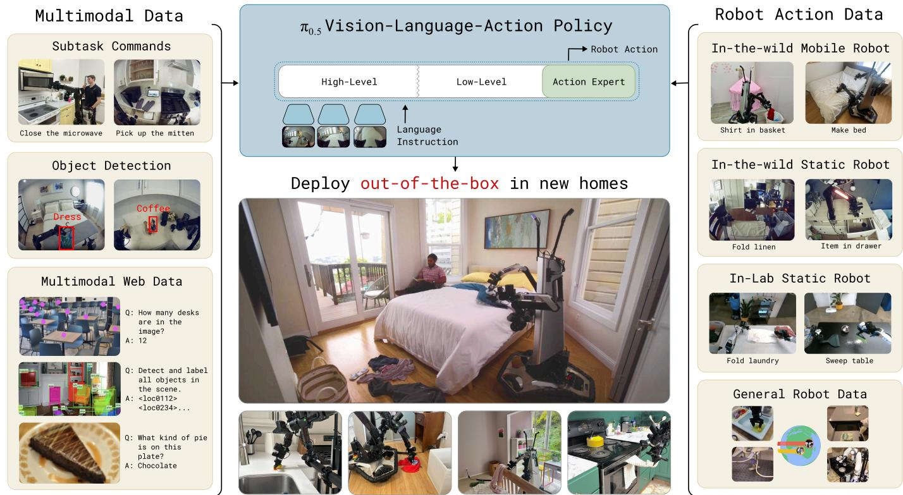
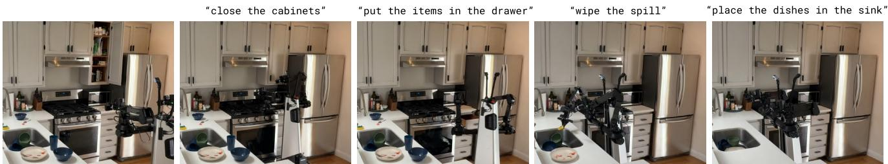

[← 返回 README](../README.md)

# I. Introduction

## 📌 预览
Introduction 阐述了开放世界泛化的核心挑战：机器人不仅需要规模，更需要多层次抽象的知识迁移。π0.5 通过异构数据源的协同训练来实现这一目标。

---

*Stuff your eyes with wonder... See the world. It's more fantastic than any dream made or paid for in factories.*

*Ray Bradbury, Fahrenheit 451*

Open-world generalization represents one of the biggest open problems in physical intelligence: embodied systems such as robotic arms, humanoids, and autonomous vehicles only truly become useful when they can leave the lab and handle the diverse situations and unexpected events that occur in the real world. Learning-based systems offer a path to enabling broad generalization, particularly with recent advances that have enabled scalable learning systems in domains ranging from natural language processing [79, 21, 10, 78] to computer vision [34, 66, 35, 43]. However, the diversity of situations that a robot might encounter in the real world requires more than just scale: we need to design training recipes that can provide the breadth of knowledge that will allow robots to generalize at many levels of abstraction. For example, if a mobile robot is asked to clean up a kitchen that it has never seen before, some behaviors generalize readily if they are well represented in the data with a sufficient range of scenes and objects (e.g., picking up a knife or plate), others might require adapting or modifying existing skills to use them in a new way or in a new sequence, and yet others might require understanding the semantics of the scene based on prior knowledge (e.g., which drawer to open, or which object on the counter is most likely to be a drying rack). How can we structure a training recipe for a robotic learning system that can enable this kind of flexible generalization?

> 💡 **泛化的三个层次**:
> 1. **技能层** — 简单抓取等，靠数据覆盖就能泛化
> 2. **组合层** — 已有技能的新组合/新序列，需要适应能力
> 3. **语义层** — 需要先验知识理解场景（哪个抽屉？哪个是晾碗架？）
>
> 这三个层次不能仅靠扩大同类数据来解决，需要**多源异构知识**。

---

*Fig. 1: The π0.5 model transfers knowledge from a heterogeneous range of data sources, including other robots, high-level subtask prediction, verbal instructions, and data from the web, in order to enable broad generalization across environments and objects. π0.5 can control a mobile manipulator to clean kitchens and bedrooms in new homes that were not present in the training data, performing complex multi-stage behaviors with durations of 10 to 15 minutes.*

> 💡 **Figure 1 批读**:
> - 展示了 π0.5 的核心理念：**异构数据源** → **广泛泛化**
> - 数据来源：其他机器人 + 高层子任务预测 + 语言指令 + 网络数据
> - 目标任务：在全新家庭中清洁厨房/卧室，持续 10-15 分钟
> - 这张图是整篇论文的路线图

---

*Fig. 2: π0.5 cleaning a new kitchen. The robot is tasked with cleaning a kitchen in a home that was not in the training data. The model is given general tasks (close the cabinets, put the items in the drawer, wipe the spill, and put the dishes in the sink), which it performs by both predicting subtasks to accomplish (e.g., pick up the plate) and emitting low-level actions.*

> 💡 **Figure 2 批读**:
> - 具体展示了层级推理过程：高层任务 "close the cabinets" → 子任务 "pick up the plate" → 低层动作
> - 完全是在**训练数据中未见过的新厨房**中执行

---

A person can draw on a lifetime of experience to synthesize appropriate solutions to each of these challenges. Not all of this experience is firsthand, and not all of it comes from rote practice – for example, we might use facts that we were told by others or read in a book, together with bits of insight from other tasks we have performed in different contexts, combined with direct experience in the target domain. Analogously, we might hypothesize that generalizable robotic learning systems must be able to transfer experience and knowledge from a variety of information sources. Some of these sources are firsthand experience with direct relevance to the task at hand, some require transfer from other robot embodiments, environments, or domains, and some represent entirely different data types, such as verbal instructions, perceptual tasks based on web data, or prediction of high-level semantic commands. The heterogeneity of these different sources of data present a major obstacle, but fortunately recent advances in vision-language-action (VLA) models provide us with a toolkit that can make this possible: by casting different modalities into the same sequence modeling framework, VLAs can be adapted to train on robot data, language data, computer vision tasks, and combinations of the above.

> 💡 **人类学习的类比**:
> - 人类的泛化能力不只来自直接经验，还有**间接知识**（书本、他人经验、其他领域的洞察）
> - VLA 的序列建模框架天然适合整合异构数据 — 所有模态都变成 token 序列

---

In this paper, we leverage this observation to design a cotraining framework for VLAs that can utilize heterogeneous and diverse knowledge sources to enable broad generalization.

Building on the $\pi _ { 0 }$ VLA, we propose to include a range of different data sources to create the $\pi _ { 0 . 5 }$ model ("pi oh five"), which can control mobile manipulators to perform a variety of household tasks even in homes that were never seen during training. $\pi _ { 0 . 5 }$ draws on experience from many sources: in addition to a medium-sized dataset collected directly with mobile manipulators in a variety of real homes (about 400 hours), $\pi _ { 0 . 5 }$ uses data from other non-mobile robots, data of related tasks collected under laboratory conditions, training examples that require predicting "high-level" semantic tasks based on robot observation, verbal language instructions provided to the robot by human supervisors, and a variety of multi-modal examples created from web data, such as image captioning, question answering, and object localization (see Figure 1). The overwhelming majority of training examples provided to $\pi _ { 0 . 5 }$ ($97.6\%$ during the first training phase) do not come from mobile manipulators performing household tasks, but from these other sources, such as other robots or data from the web. Nonetheless, $\pi _ { 0 . 5 }$ is able to control mobile manipulators in entirely new homes not seen during training, perform intricate tasks such as hanging up towels or making beds, and can carry out long-horizon manipulation skills 10 to 15 minutes in length, cleaning an entire kitchen or bedroom based on only a high-level prompt.

> 💡 **关键数字**:
> - **400 小时**移动操作数据（~100 个家庭环境）
> - **97.6%** 预训练数据不来自目标移动操作平台！
> - 任务持续 **10-15 分钟**
> - 这说明泛化主要靠**迁移**，而非目标域的暴力扩展

---

The design of $\pi _ { 0 . 5 }$ follows a simple hierarchical architecture: we first pre-train the model on the heterogeneous mixture of training tasks, and then fine-tune it specifically for mobile manipulation with both low-level action examples and high-level "semantic" actions, which correspond to predicting subtask labels such as "pick up the cutting board" or "rearrange the pillow." At runtime, during each step of inference, the model first predicts the semantic subtask, inferring the behavior that is appropriate to perform next based on the task structure and the semantics of the scene, and then predicts the low-level robot action chunk based on this subtask. This simple architecture provides both the ability to reason about long-horizon multi-stage tasks and the ability to leverage different sources of knowledge for the two levels: the low-level action inference procedure readily benefits from action data collected by other robots, including simpler static robots in other environments, while the high-level inference procedure benefits from semantic examples from the web, high-level annotation prediction, and even verbal commands that can be provided to the robot by human "supervisors" that walk the robot through complex tasks step by step, instructing it (much like how they might instruct a person) on the appropriate subtasks to perform to complete a complex task such as cleaning a room. We illustrate this design in Figure 1.

> 💡 **层级架构的优势**:
> - **高层推理** (预测子任务) ← 受益于网络数据、语义标注、语言指令
> - **低层推理** (预测动作) ← 受益于跨机器人动作数据
> - 两个层次利用不同的数据源，这是 co-training 的精髓
> - 训练分两阶段：pre-training (通用) → post-training (专注移动操作)

---

Our central contribution is a system for training a highly generalizable VLA, $\pi _ { 0 . 5 }$ , together with a proof of concept that generalization can emerge from this model when it is trained on appropriately diverse data. We provide a detailed empirical evaluation of both $\pi _ { 0 . 5 }$ 's generalization capabilities and the relevance of different co-training ingredients. To our knowledge, our work is the first to demonstrate an end-to-end learning-enabled robotic system that can perform long-horizon and dexterous manipulation skills, such as cleaning a kitchen or bedroom, in entirely new homes. Our experiments and comparisons further show that this is enabled by transferring knowledge from other robots, high-level semantic prediction, verbal language instruction from human supervisors, web data, and other sources.

> 💡 **核心贡献总结**:
> 1. π0.5 系统：可泛化的 VLA 训练框架
> 2. 概念验证：泛化能从异构数据的 co-training 中涌现
> 3. 首次证明端到端系统在全新家庭中完成长时域灵巧操作
> 4. 详细的 ablation 展示各数据源的贡献

---

## 🔖 Section 总结

### 关键数字速查
| 指标 | 数值 |
|------|------|
| 移动操作数据量 | ~400 小时 |
| 训练家庭环境数 | ~100 个 |
| 非目标域数据占比 | 97.6% |
| 任务持续时间 | 10-15 分钟 |

### 核心洞察
1. 开放世界泛化需要**多层次抽象**的知识迁移，不仅仅是数据规模
2. VLA 的序列建模框架是整合异构数据的天然载体
3. 层级推理（高层语义 + 低层动作）让不同数据源各得其所
4. 97.6% 的数据来自非目标域，证明迁移学习的威力
