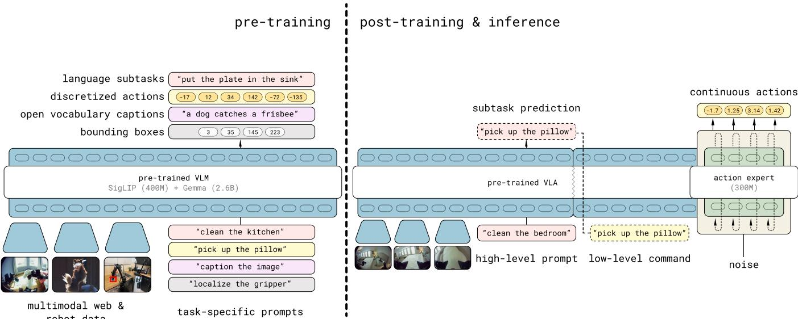
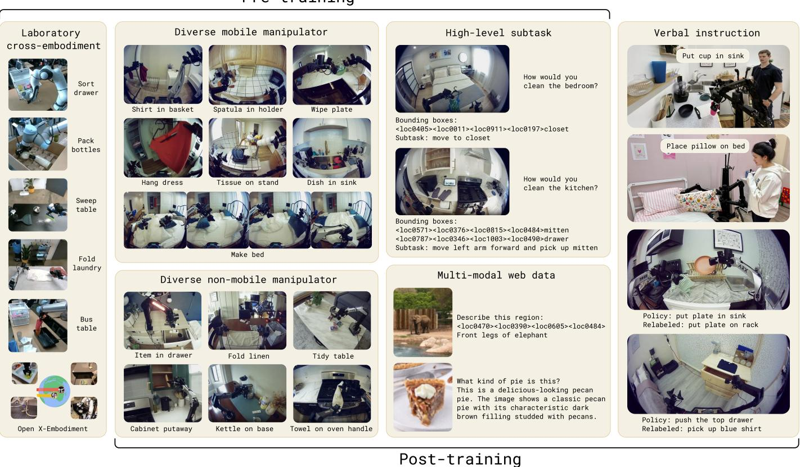
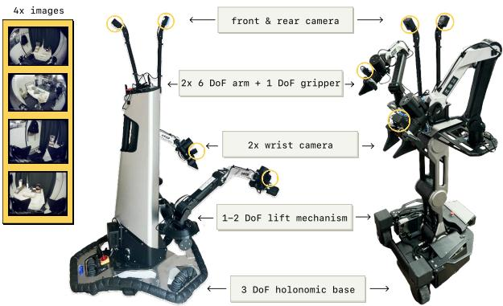

[← 返回 README](../README.md)

# IV. The π0.5 Model and Training Recipe

## 📌 预览
核心方法章节。π0.5 的架构支持文本和动作双输出，训练分 pre-training（离散 token）和 post-training（flow matching）两阶段。数据源包括 5 类：MM、ME、CE、HL、WD，加上 post-training 特有的 VI。

---

We provide an overview of the $\pi_{0.5}$ model and training recipe in Figure 3. The model weights are initialized from a standard VLM trained on data from the web, and training then proceeds in two stages: a pre-training stage intended to adapt the model to diverse robotic tasks, and a post-training stage intended to specialize it to mobile manipulation and equip it with the mechanisms for efficient test-time inference. During pre-training, all tasks, including tasks with robot actions, are represented with discrete tokens, which leads to simple, scalable, and efficient training [64]. During post-training, we adapt the model to also have an action expert, as with $\pi_0$, in order to both represent actions with finer granularity and enable more compute-efficient inference for real-time control. At inference-time, the model first produces a high-level subtask for the robot to perform and then, conditioned on this subtask, predicts the low-level actions via the action expert. We describe the model architecture below, followed by a description of each of the phases and their corresponding training tasks.

> 💡 **训练流程概览**:
> ```
> VLM 初始化 → Pre-training (280k steps, 离散 token) → Post-training (80k steps, + flow matching)
>                    ↓                                          ↓
>            所有数据源 (MM+ME+CE+HL+WD)              专注移动操作 (MM+ME+HL+WD+VI)
> ```

---


*Fig. 3: Model overview. π0.5 is trained in two stages. First, a pre-training stage combines all of the different data sources to produce an initial VLA with discrete tokens. This stage uses data from diverse robotic platforms, high-level semantic action prediction, and data from the web. Robotic data uses the FAST action tokenizer to represent actions as discrete tokens. Second, a post-training stage specializes the model for low-level and high-level inferences for mobile manipulation, leveraging the most task-relevant data, including verbal instructions from human supervisors. This stage uses flow matching to represent the action distribution, enabling efficient real-time inference and the ability to represent fine-grained continuous action sequences. At inference time, the model first infers a high-level subtask, and then predicts the actions based on this subtask.*

> 💡 **Figure 3 批读**:
> - **Pre-training**: 多机器人数据 (FAST token) + 高层语义 + 网络数据 → 离散 token 训练
> - **Post-training**: 移动操作数据 + flow matching action expert → 连续动作 + 文本双输出
> - **推理**: 先预测子任务文本 → 再预测低层动作
> - 关键设计：pre-training 不需要 action expert，降低训练复杂度

---

## A. The π0.5 architecture

The $\pi_{0.5}$ architecture can flexibly represent both action chunk distributions and tokenized text outputs, with the latter used both for co-training tasks (e.g., question-answering) and for outputting high-level subtask predictions during hierarchical inference. The distribution captured by the model can be written as $\pi_\theta(\mathbf{a}_{t:t+H}, \hat{\ell} | \mathbf{o}_t, \ell)$, where $\mathbf{o}_t = [\mathbf{I}_t^1, ..., \mathbf{I}_t^n, \mathbf{q}_t]$ consists of the images from all of the cameras and the robot's configuration (joint angles, gripper pose, torso lift pose, and base velocity), $\ell$ is the overall task prompt (e.g., "put away the dishes"), $\hat{\ell}$ represents the model's (tokenized) textual output, which could be either a predicted high-level subtask (e.g., "pick up the plate") or the answer to a vision-language prompt in web data, and $\mathbf{a}_{t:t+H}$ is a predicted action chunk. We decompose the distribution as

$$
\pi_\theta(\mathbf{a}_{t:t+H}, \hat{\ell} | \mathbf{o}_t, \ell) = \pi_\theta(\mathbf{a}_{t:t+H} | \mathbf{o}_t, \hat{\ell}) \pi_\theta(\hat{\ell} | \mathbf{o}_t, \ell),
$$

where the action distribution does not depend on $\ell$, only on $\hat{\ell}$. Thus, high-level inference captures $\pi_\theta(\hat{\ell} | \mathbf{o}_t, \ell)$, and low-level inference captures $\pi_\theta(\mathbf{a}_{t:t+H} | \mathbf{o}_t, \hat{\ell})$, with both distributions represented by the same model.

> 💡 **架构核心设计**:
> - **输出分解**: $p(\text{action}, \text{subtask} | \text{obs}, \text{task}) = p(\text{action} | \text{obs}, \text{subtask}) \times p(\text{subtask} | \text{obs}, \text{task})$
> - **关键**: 动作只依赖子任务 $\hat{\ell}$，不直接依赖高层任务 $\ell$
> - 这个分解使得高层和低层推理可以独立运行
> - 同一个模型承担两个角色：高层策略 + 低层策略

---

The model corresponds to a transformer that takes in $N$ multimodal input tokens $x_{1:N}$ (we use the term token loosely here, referring to both discretized and continuous inputs) and produces a sequence of multimodal outputs $y_{1:N}$, which we can write as $y_{1:N} = f(x_{1:N}, A(x_{1:N}), \rho(x_{1:N}))$. Each $x_i$ can be a text token ($x_i^w \in \mathbb{N}$), an image patch ($x_i^I \in \mathbb{R}^{p \times p \times 3}$), or an intermediate denoising value of a robot action in flow matching ($x_i^a \in \mathbb{R}^d$). The observations $\mathbf{o}_t$ and $\ell$ form the prefix part of $x_{1:N}$. Depending on the token type, as indicated by $\rho(x_i)$, each token can be processed not only by a different encoder, but also by different expert weights within the transformer. For example, image patches are fed through a vision encoder, and text tokens are embedded with an embedding matrix. Following $\pi_0$ [8], we linearly project action tokens $x_i^a$ into the transformer embedding space and use separate expert weights in the transformer to process the action tokens. The attention matrix $A(x_{1:N}) \in [0, 1]^{N \times N}$ indicates if a token can attend to another token. Compared to standard causal attention in LLMs, image patch, textual prompt, and continuous action tokens use bidirectional attention.

> 💡 **Token 类型与注意力机制**:
> | Token 类型 | 编码方式 | 注意力 | 处理权重 |
> |-----------|---------|--------|---------|
> | 文本 | embedding matrix | causal (自回归) | 主 transformer |
> | 图像 patch | vision encoder | bidirectional | 主 transformer |
> | 动作 (flow) | linear projection | bidirectional | action expert |
>
> 关键：不同 token 类型用不同的 transformer 权重（类似 MoE）

---

As we want our model to output both text (to answer questions about the scene or to output next tasks to accomplish) and actions (to act in the world), the output of $f$ is split into text token logits and action output tokens, respectively $(y_{1:M}^\ell, y_{1:H}^a)$. The first $M$ correspond to text token logits that can be used to sample $\hat{\ell}$ and the later $H$ tokens are produced by a separate action expert, as in $\pi_0$, and projected via a linear mapping to continuous outputs used to obtain $\mathbf{a}_{t:t+H}$ (see next section). Note that $M + H \leq N$, i.e., not all outputs are associated with a loss. The robot proprioceptive state is discretized and input to the model as text tokens. More details about the architecture are in Appendix E.

> 💡 **双输出设计**:
> - 前 M 个输出 → 文本 logits (子任务预测 / VQA 回答)
> - 后 H 个输出 → 动作 token (action expert 生成)
> - 本体感知 (关节角等) 被离散化为文本 token 输入

---

## B. Combining discrete & continuous action representations

Similarly to $\pi_0$, we use flow-matching [50] to predict continuous actions in the final model. Given $\mathbf{a}_{t:t+H}^{\tau,\omega} = \tau \mathbf{a}_{t:t+H} + (1-\tau)\omega$, $\omega \sim \mathcal{N}(0, \mathbf{I})$, where $\tau \in [0,1]$ is the flow matching time index, the model is trained to predict the flow vector field $\omega - \mathbf{a}_t$. However, as shown in [64], VLA training can be much faster when actions are represented by discrete tokens, particularly when using a tokenization scheme that is efficient for compressing the action chunks (e.g., FAST). Unfortunately, such discrete representations are less well-suited for real-time inference, because they require expensive autoregressive decoding for inference [64]. Therefore, an ideal model design would train on discretized actions but still allow for use of flow matching to produce continuous actions at inference time.

> 💡 **离散 vs 连续的权衡**:
> | | 离散 Token (FAST) | 连续 (Flow Matching) |
> |---|---|---|
> | 训练速度 | ⚡ 快 | 🐢 慢 |
> | 推理速度 | 🐢 慢 (自回归) | ⚡ 快 (10步去噪) |
> | 精度 | 中等 | 高 |
>
> **理想方案**: 训练时用离散 → 推理时用连续

---

Our model is therefore trained to predict actions both through autoregressive sampling of tokens (using the FAST tokenizer) and iterative integration of the flow field, combining the best of both worlds. We use the attention matrix to ensure that the different action representations do not attend to each other. Our model is optimized to minimize the combined loss

$$
\mathbb{E}_{\mathcal{D}, \tau, \omega} \Big[ H(x_{1:M}, f_\theta^\ell(\mathbf{o}_t, \ell)) + \alpha \| \omega - \mathbf{a}_{t:t+H} - f_\theta^a(\mathbf{a}_{t:t+H}^{\tau,\omega}, \mathbf{o}_t, \ell) \|^2 \Big],
$$

where $H(x_{1:M}, y_{1:M}^\ell)$ is the cross entropy loss between the text tokens and predicted logits (including the FAST encoded action tokens), $y_{1:H}^a = f_\theta^a(\mathbf{a}_{t:t+H}^{\tau,\omega}, \mathbf{o}_t, \ell)$ is the output from the (smaller) action expert, and $\alpha \in \mathbb{R}$ is a trade-off parameter.

> 💡 **联合损失函数**:
> - **项 1**: Cross-entropy loss — 文本预测 + FAST 动作 token 预测
> - **项 2**: Flow matching loss — action expert 的向量场预测
> - $\alpha$ 权衡两项，post-training 设 $\alpha = 10.0$
> - **注意力隔离**: FAST token 和 flow matching token 互不 attend，避免信息泄露

---

This scheme enables us to first pre-train our model as a standard VLM transformer model by mapping actions to text tokens ($\alpha = 0$), and then add additional action expert weights predicting continuous action tokens in a non-autoregressive fashion for fast inference in a post-training stage. We find that following this procedure, which is further explained below, leads to stable pre-training and excellent language following abilities of the VLA model. At inference time we then use standard autoregressive decoding for text tokens $\hat{\ell}$ followed by 10 denoising steps, conditioned on text tokens, to produce actions $\mathbf{a}_{t:t+H}$.

> 💡 **训练策略总结**:
> ```
> Pre-training: α = 0 (纯文本 loss) → 标准 VLM 训练，稳定且高效
> Post-training: α = 10.0 (加入 action expert) → flow matching 微调
> Inference: 自回归生成子任务 → 10 步去噪生成动作
> ```

---

## C. Pre-training

In the first training stage, $\pi_{0.5}$ is trained with a broad range of robot and non-robot data, which we summarize below and illustrate in Figure 4. It is trained as a standard auto-regressive transformer, performing next-token prediction of text, object locations, and FAST encoded action tokens.


*Fig. 4: Examples from pre-training and post-training tasks. π0.5 is pre-trained on data from mobile manipulators (MM), non-mobile robots in diverse environments (ME), and cross-embodiment data collected under laboratory conditions (CE), as well as high-level subtask prediction (HL), and multi-modal web data (WD). In a post-training phase, we additionally use verbal instructions (VI), and omit the laboratory cross-embodiment data (CE) to focus the model on mobile manipulation and diverse environments.*

> 💡 **Figure 4 批读**:
> - 展示了 5+1 类数据的具体示例
> - Pre-training: MM + ME + CE + HL + WD
> - Post-training: MM + ME + HL + WD + **VI** (新增), 去掉 CE (实验室数据)
> - 每类数据的视觉风格差异很大，体现了异构性

---

> 💡 **5 类预训练数据源详解**:

**Diverse Mobile Manipulator data (MM).** We use about 400 hours of data of mobile manipulators performing household tasks in about 100 different home environments, some of which are shown in Figure 7, using the robots in Section IV-E. This slice of the training set is the most directly relevant to our evaluation tasks, which consist of similar cleaning and tidying tasks in new, unseen, home environments.

> 💡 **MM**: ~400 小时，~100 个家庭，最直接相关的数据

**Diverse Multi-Environment non-mobile robot data (ME).** We also collected non-mobile robot data, either with a single arm or two arms, in a variety of home environments. These arms were fixed to surfaces or mounting platforms, and because they are significantly lighter and easier to transport, we were able to gather a more diverse dataset in a wider range of homes with them. However, this ME data comes from a different embodiment than the mobile robots.

> 💡 **ME**: 固定臂数据，不同构型但更多样的家庭环境（因为轻便易运输）

**Cross-Embodiment laboratory data (CE).** We collected data for a wide range of tasks (e.g., bussing a table, folding shirts) in the laboratory, with simpler tabletop environments and a variety of robot types. Some of these tasks are highly relevant to our evaluation (e.g., putting dishes in a bin), while others are not (e.g., grinding coffee beans). This data includes single-arm and dual-arm manipulators, and both static and mobile bases. We also include the open-source OXE dataset [15]. This dataset is an extended version of the dataset used by $\pi_0$ [8].

> 💡 **CE**: 实验室数据，多种机器人+多种任务，包含 OXE 开源数据集

**High-Level subtask prediction (HL).** Breaking down high-level task commands such as "clean the bedroom" into shorter subtasks like "adjust the blanket" and "pick up pillow", similar to chain-of-thought prompting for language models, can help a trained policy reason about the current scene and better determine the next action. For robot data in MM, ME, and CE where the task involves multiple subtasks, we manually annotate all data with semantic descriptions of the subtasks and train $\pi_{0.5}$ to jointly predict the subtask labels (as text) as well as the actions (conditioned on the subtask label) based on the current observation and high-level command. This naturally leads to a model that can act both as a high-level policy (outputting subtasks) and low-level policy that executes actions for these subtasks. We also label relevant bounding boxes shown in the current observation and train $\pi_{0.5}$ to predict them before predicting the subtask.

> 💡 **HL**: 高层子任务标注 — 手动标注所有多步骤任务的子任务描述
> - 训练模型**同时**预测子任务标签 + 动作
> - 还预测 bounding box → 增强视觉定位能力
> - 类似 chain-of-thought：高层命令 → 子任务 → 动作

**Multi-modal Web Data (WD).** Finally we include a diverse set of web data involving image captioning (CapsFusion [87], COCO [12]), question answering (Cambrian-7M [77], PixMo [19], VQAv2 [32]), and object localization in pre-training. For object localization, we further extend the standard datasets with additional web data of indoor scenes and household objects with bounding box annotations.

> 💡 **WD**: 网络数据 — caption、VQA、物体定位
> - 特别扩充了**室内场景和家居物体**的 bounding box 数据
> - 提供广泛的语义和视觉知识

---

For all action data, we train the model to predict target joint and end-effector poses. To differentiate the two, we add `<control mode> joint/end effector <control mode>` to the text prompt. All action data is normalized to $[-1, 1]$ using the $1\%$ and $99\%$ quantile of each action dimension of the individual dataset. We set the dimensionality of the action a to a fixed number to accommodate the largest action space among all the datasets. For robots with lower-dimensional configuration and action spaces, we zero-pad the action vectors.

> 💡 **动作标准化**:
> - 统一动作维度（按最大值 zero-pad）
> - 1%/99% 分位数归一化到 [-1, 1]
> - 用 `<control mode>` 特殊 token 区分关节/末端执行器控制

---

## D. Post-training

After pre-training the model with discrete tokens for $280\text{k}$ gradient steps, we perform a second stage of training that we refer to as post-training. The purpose of this stage is to both specialize the model to our use-case (mobile manipulation in homes), and to add an action expert that can produce continuous action chunks via flow matching. This stage jointly trains with next-token prediction, to preserve text prediction capabilities, and flow matching for the action expert (which is initialized with random weights at the beginning of post-training). We optimize the objective in Equation (1), with $\alpha = 10.0$ for $80\text{k}$ additional steps. The post-training action dataset consists of the MM and ME robot data, filtered down to successful episodes that are below a fixed length threshold. We include web data (WD) to preserve the model's semantic and visual capabilities, and the slice of HL data corresponding to the multi-environment datasets. Additionally, to improve the model's ability to predict appropriate high-level subtasks, we collect verbal instruction demonstrations (VI), which are constructed by expert users providing "language demonstrations," selecting appropriate sub-task commands to command the robot to perform mobile manipulation tasks step by step. These examples are collected by "teleoperating" the robot in real time with language to perform tasks with the learned low level policy, essentially providing demonstrations of good high-level subtask outputs for a trained policy.

> 💡 **Post-training 关键细节**:
> - **280k → +80k steps**, $\alpha = 10.0$
> - Action expert **从随机权重初始化**（不是从 pre-training 继承）
> - 数据筛选：只用成功 episode + 长度阈值
> - **去掉 CE**（实验室数据），聚焦移动操作
> - **新增 VI** — 语言遥操作演示：人用语言指令一步步指挥机器人
>
> **VI 的巧妙设计**: 人类"遥操作"机器人的方式不是物理操作，而是用语言指令，本质是高层策略的演示！

---

## E. Robot system details

The robot systems used in our mobile manipulation experiments are illustrated in Figure 5. We conducted all of our experiments using two types of mobile manipulators. Both platforms are equipped with two 6 DoF arms with parallel jaw grippers and wrist-mounted monocular RGB cameras, a wheeled holonomic base, and a torso lift mechanism. The state and action spaces for the base correspond to linear (2D) and angular (1D) velocity, and the torso lift mechanism is either 1D (up/down) or 2D (up/down and forward/backward). In addition to the two wrist cameras, the robots have a forward and backward facing camera mounted between the arms. We use all four cameras for high-level inference, and the wrist and forward cameras for the low-level inference process. The total dimensionality of the state and action spaces is 18 or 19, depending on the platform.


*Fig. 5: Robot system overview. We use two mobile manipulator platforms – each has four cameras (forward, backward, and both wrists), two 6 DoF arms with parallel jaw grippers, a mobile base, and a torso lift mechanism. The π0.5 model controls the joints and grippers of each arm, base velocity, and the lift position, resulting in 18-19 DoF state and action spaces.*

> 💡 **Figure 5 批读**:
> - 两种移动操作平台，核心配置相同：
>   - 2× 6DoF 臂 + 平行夹爪
>   - 4 个摄像头（前/后/左右腕部）
>   - 全向轮底盘 + 躯干升降
> - **高层推理用 4 个摄像头**，低层推理用 3 个（腕部 + 前方）
> - 18-19 DoF 状态/动作空间，纯端到端控制（简单 PD 跟踪，无轨迹规划）

---

The control system is very simple: the $\pi_{0.5}$ model directly commands target poses for the arms, gripper, and torso lift, and the target base velocities at $50 \text{ Hz}$ (with action chunking). These targets are tracked with simple PD controllers, without any additional trajectory planning or collision detection. All manipulation and navigation control is fully end-to-end.

> 💡 **极简控制栈**:
> - 50 Hz 控制频率 + action chunking
> - 简单 PD 控制器跟踪目标
> - **无**轨迹规划、碰撞检测
> - 这体现了端到端学习的极致——策略直接输出低层控制指令

---

## 🔖 Section 总结

### 关键数字速查
| 指标 | 数值 |
|------|------|
| Pre-training steps | 280k |
| Post-training steps | 80k |
| Flow matching weight α | 10.0 |
| 推理去噪步数 | 10 |
| 控制频率 | 50 Hz |
| Action chunk horizon H | 49 (50步) |
| 机器人 DoF | 18-19 |
| 摄像头数量 | 4 |

### 数据源总结
| 数据源 | 简称 | Pre-train | Post-train | 内容 |
|--------|------|-----------|------------|------|
| Mobile Manipulator | MM | ✅ | ✅ | ~400h, ~100 homes |
| Multi-Environment | ME | ✅ | ✅ | 固定臂，多样家庭 |
| Cross-Embodiment | CE | ✅ | ❌ | 实验室，多种机器人 |
| High-Level | HL | ✅ | ✅ | 子任务标注 |
| Web Data | WD | ✅ | ✅ | Caption/VQA/定位 |
| Verbal Instruction | VI | ❌ | ✅ | 语言遥操作演示 |

### 核心洞察
1. **两阶段训练是关键**: pre-training 用离散 token 高效学习，post-training 用 flow matching 精细化
2. **Action expert 从零初始化**: 说明 pre-training 主要建立语言-视觉理解，动作精度由 post-training 负责
3. **VI 数据的巧妙设计**: 用语言"遥操作"来收集高层策略演示，成本低效率高
4. **极简控制栈**: 完全端到端，无需工程化的运动规划
