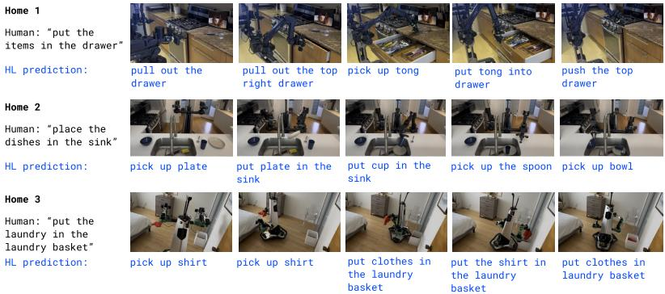
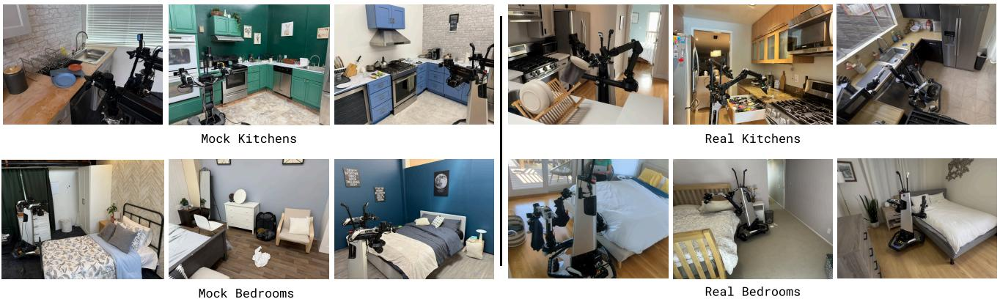
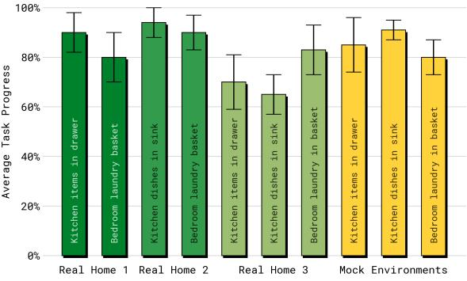
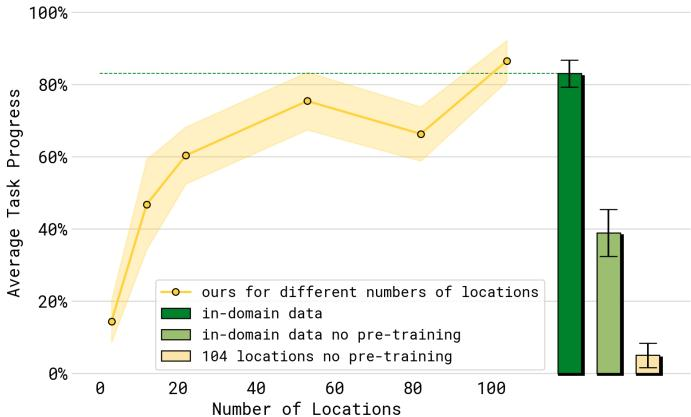
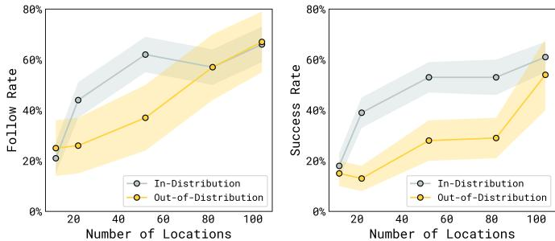
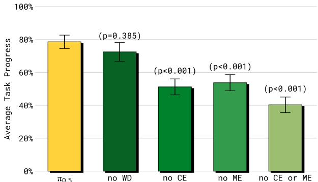
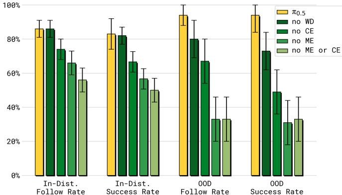
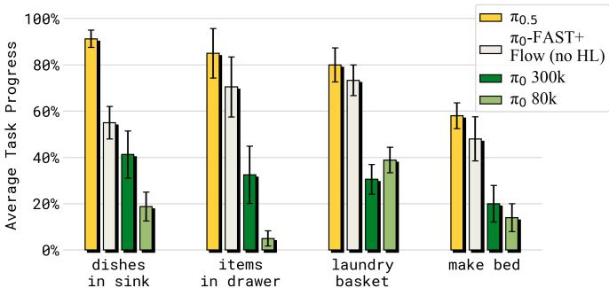
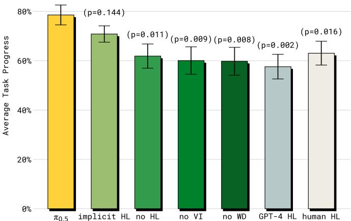

[← 返回 README](../README.md)

# V. Experimental Evaluation

## 📌 预览
实验围绕 5 个核心问题展开：(1) 真实家庭泛化、(2) 场景数量 scaling、(3) 数据源 ablation、(4) 与 π0 对比、(5) 高层推理的重要性。

---

The $\pi_{0.5}$ model is designed to generalize broadly to new environments. While it is common to evaluate VLAs in environments that match the training data, we conduct all of our experiments in novel environments that were not seen in training. For quantitative comparisons, we use a set of mock home environments to provide a controlled and reproducible setup, while the most realistic final evaluation is conducted in three real homes that were not part of the training set (see Figure 6). Our experiments focus on the following questions:

1) Can $\pi_{0.5}$ effectively generalize to complex multi-stage tasks in entirely new homes?
2) How does the generalization of $\pi_{0.5}$ scale with the number of distinct environments in the training data?
3) How do the individual co-training ingredients in the $\pi_{0.5}$ training mixture contribute to its final performance?
4) How does $\pi_{0.5}$ compare to the $\pi_0$ VLA?
5) How important is the high-level inference component of $\pi_{0.5}$, and how does it compare to flat, low-level inference as well as oracle high-level baselines?

> 💡 **实验设计亮点**:
> - **所有评估都在全新环境中** — 不在训练分布内评估
> - Mock homes (可控复现) + Real homes (真实评估) 双轨制
> - 5 个问题覆盖了系统的每个设计选择

---

*Fig. 6: Evaluation environments. We evaluate π0.5 in entirely new kitchens and bedrooms that were not seen during training, with novel objects, backgrounds, and layouts. We use a set of mock rooms for controlled, reproducible quantitative comparisons (left) and real homes for a realistic final evaluation (right).*

> 💡 **Figure 6 批读**:
> - 左边：mock rooms — 可控环境，用于定量对比
> - 右边：真实家庭 — 完全陌生的厨房和卧室
> - 新物体、新背景、新布局 — 全方位泛化挑战

---

## A. Can π0.5 generalize to real homes?

To answer Question (1), we evaluated $\pi_{0.5}$ in three real homes that were not present in the training set, using both types of robots. In each of the homes, the robots were instructed to perform a bedroom and kitchen cleaning task. The evaluation rubrics for each task are provided in Appendix B and roughly correspond to the percentage of steps in each task that were completed successfully (e.g., placing half the dishes in the sink corresponds to around $50\%$).

*Fig. 7(a): Example rollouts. We visualize an exemplary π0.5 episode for one task from each home. Top to bottom: putting items in a drawer in Home 1, followed by putting dishes in the sink in Home 2, and putting clothes in the laundry basket in Home 3. The human instruction for each is given on the left, and the high-level subtask prediction from π0.5 is shown beneath each frame in blue.*

*Fig. 7(b): Quantitative evaluation. We show the task progress per task and environment averaged over 10 trials. We find that π0.5's performance in the mock evaluation setups is representative of its performance in real homes.*

> 💡 **Figure 7 批读**:
> - **(a)** 三个真实家庭的演示：抽屉收纳、洗碗、洗衣篮 — 每帧下方蓝色文字是模型自主预测的子任务
> - **(b)** 定量评估：mock homes 和 real homes 的表现相近，说明 mock 评估是可靠的
> - 多数任务达到 60-90% 的完成率，在**全新家庭**中这是很强的结果

---

The results show that $\pi_{0.5}$ was able to consistently succeed on a variety of tasks in each home (we note that, additionally, the model is capable of performing many more tasks than used in our quantitative evaluation). Many of the tasks involve multiple stages (e.g., moving multiple objects) lasting about 2 to 5 minutes. For these trials, the model is provided with a simple high-level command (e.g., "place the dishes in the sink"), and the high-level inference process autonomously determines appropriate steps (e.g., "pick up the cup"). This level of in-the-wild generalization goes significantly beyond the results demonstrated with prior vision-language-action models, both in terms of the degree of novelty that the model must handle, and the task duration and complexity.

> 💡 **V-A 小结**:
> - 3 个真实家庭 × 2 种机器人 × 多种任务
> - 任务持续 2-5 分钟，模型自主分解子任务
> - 泛化程度远超先前 VLA 工作

---

## B. How does generalization scale with the number of scenes?

In the next set of experiments, we aim to measure how generalization scales with the number of environments seen in the training data. We vary the number of environments in the mobile manipulation data and measure its impact on generalization by training with data from 3, 12, 22, 53, 82, and 104 locations.

*Fig. 8: Evaluating performance with different numbers of locations. Performance over the four test tasks improves with more training environments. The dashed green line and green bar show a baseline model that includes the test homes in the training set. Compared to this model, our best model achieves similar performance, despite not seeing any data from the test homes.*

> 💡 **Figure 8 批读**:
> - **核心发现**: 性能随训练环境数量稳步提升
> - **关键对比**: 104 locations (没见过测试家庭) ≈ 直接在测试家庭上训练的模型
> - 说明 co-training recipe 有效弥补了泛化差距
> - **两个弱基线** (浅色): 不用完整 co-training recipe 时，即使有测试环境数据也表现差 — 证明 co-training 不可或缺

---

*Fig. 9: Evaluating language following with different numbers of training locations. We evaluate language following rate and success rate for picking up user-indicated items and placing them into drawers or sinks, averaged over seen object categories ("in-distribution") or unseen categories ("out-of-distribution"). Performance increases steadily as we increase the number of training locations.*

> 💡 **Figure 9 批读**:
> - 语言跟随率和成功率都随环境数增加而提升
> - **ID 物体** (见过的类别) 提升更快
> - **OOD 物体** (未见类别) 也在持续提升 — 新环境引入新物品，增强泛化
> - 更多环境 = 更多物品种类 = 更好的语义泛化

---

## C. How important is each part of our co-training recipe?

To study Question (3), we compare our full $\pi_{0.5}$ model to other training mixtures to study the importance of each mixture component.

*Fig. 10: Training recipe ablations, mock homes. Including cross-embodiment data, both in diverse environments (ME) and for diverse tasks in laboratory settings (CE) is important for good performance. Web data (WD) does not make a significant difference in these experiments.*

> 💡 **Figure 10 批读**:
> - **去掉 ME 或 CE**: 性能**显著下降** → 跨机器人迁移非常重要
> - **去掉 ME + CE**: 下降更严重
> - **去掉 WD**: 在端到端任务中差异**不显著** — 但见下方语言跟随实验

---

*Fig. 11: Training recipe ablations, language following. Including web data (WD) is important for out-of-distribution (OOD) performance in particular. Cross-embodiment (CE) and diverse environment (ME) data both have a large impact.*

> 💡 **Figure 11 批读**:
> - **去掉 WD**: OOD 物体的语言跟随**显著下降** → WD 提供广泛的物体知识
> - **ME 和 CE 的影响**: 不仅影响操作性能，也影响语言理解
> - **结论**: WD 的价值主要体现在**语义泛化**（识别未见物体），而非操作技能

---

## D. How does π0.5 compare to other VLAs?

We compare $\pi_{0.5}$ to the original $\pi_0$ VLA as well as an improved version $\pi_0$-FAST+Flow. This version is trained via the joint diffusion and FAST action prediction formulation from Equation (1), but on action data only, without the HL or WD datasets.

*Fig. 12: Comparing π0.5 with other models. Our full model significantly outperforms both π0 and π0-FAST+Flow in the mock home test environments.*

> 💡 **Figure 12 批读**:
> - **π0.5 >> π0-FAST+Flow >> π0**
> - π0-FAST+Flow 用了相同的混合训练方案但没有 HL/WD → 差距说明 co-training 数据的贡献
> - 即使给 π0 更多训练步数 (300k)，仍不如 π0.5 → FAST token 训练比纯 diffusion 更高效

---

## E. How important is high-level inference?

Finally, we evaluate the importance of high-level inference, and compare the performance of several alternative high-level inference methods.

*Fig. 13: Evaluation of the high-level inference process. While the full π0.5 model with high-level and low-level inference attains the best results, using only low-level inference ("implicit HL") with the full π0.5 model also benefits from the inclusion of high-level subtask examples in training. Excluding verbal instructions (no VI) or web data (no WD) leads to significant degradation, and zero-shot GPT-4 performs worse.*

> 💡 **Figure 13 批读 — 本文最重要的 ablation 之一**:
>
> | 方法 | 性能排序 | 关键发现 |
> |------|---------|---------|
> | **π0.5 (full)** | 🥇 最佳 | 超过了人类高层 oracle！ |
> | implicit HL | 🥈 第二 | 不做高层推理，但训练时包含 HL 数据 |
> | human HL | 🥉 第三 | 人类 oracle 不如 π0.5 full |
> | no WD | 较差 | WD 主要提升高层策略 |
> | no VI | 较差 | 11% 的 VI 数据影响巨大 |
> | no HL | 差 | 完全去掉高层数据 |
> | GPT-4 HL | 最差 | 零样本 VLM 不如领域微调 |
>
> **核心洞察**:
> 1. **implicit HL 排第二**: 即使不做高层推理，训练时包含子任务数据也大幅提升性能 — co-training 的隐式知识迁移
> 2. **超越人类 oracle**: π0.5 的高层推理比人类手动指定子任务更好！
> 3. **VI 数据价值极高**: 仅占 11% 的高层移动操作数据，但影响巨大
> 4. **GPT-4 垫底**: 领域微调 >> 零样本大模型

---

## 🔖 Section 总结

### 关键数字速查
| 指标 | 数值 |
|------|------|
| 评估真实家庭数 | 3 |
| 每策略每任务评估次数 | 10 |
| 训练环境 scaling 范围 | 3 → 104 |
| 任务持续时间 | 2-5 分钟 |
| VI 数据占比 | ~11% 高层数据 |

### 五个问题的答案
1. ✅ π0.5 能在全新真实家庭中完成复杂多阶段任务
2. ✅ 性能随训练环境数稳步提升，104 locations ≈ 在测试环境训练
3. ✅ ME 和 CE (跨机器人数据) 最关键；WD 对语义泛化重要
4. ✅ π0.5 显著优于 π0 和 π0-FAST+Flow
5. ✅ 高层推理重要，但即使不做推理，co-training 数据也带来隐式提升；π0.5 超越人类 oracle
