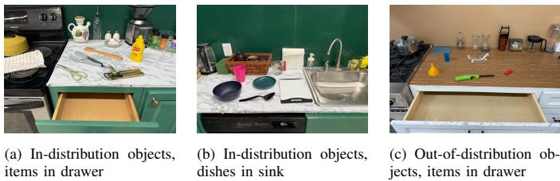
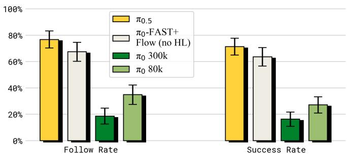
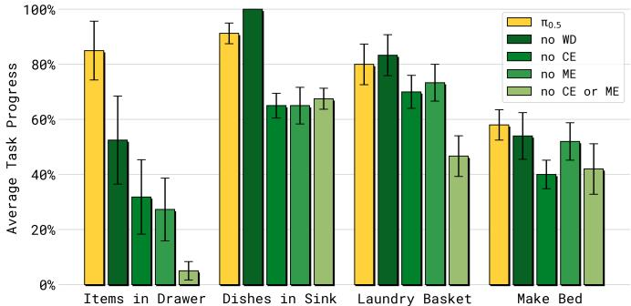
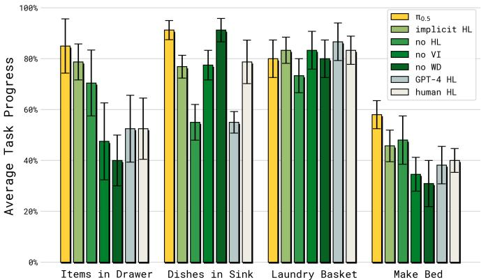
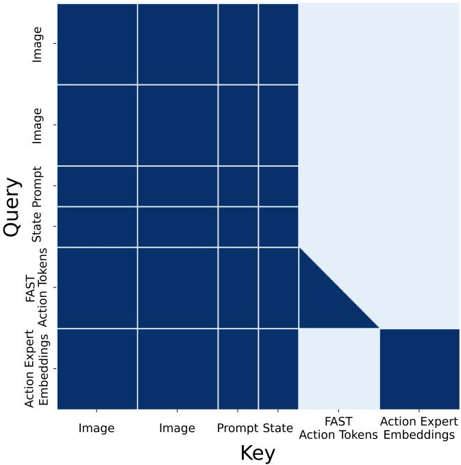

[← 返回 README](../README.md)

# Appendix

## 📌 预览
附录包含贡献声明 (A)、评估指标 (B)、语言跟随实验细节 (C)、逐任务性能分析 (D)、模型技术细节 (E)。

---

## A. Contributions

Data collection and operations. Noah Brown, Michael Equi, Chelsea Finn, Lachy Groom, Suraj Nair, Lucy Xiaoyang Shi, Anna Walling.
Annotation and supplemental data. Danny Driess, Chelsea Finn, Niccolo Fusai, Lachy Groom, Brian Ichter, Karl Pertsch, Allen Z. Ren, Laura Smith, Kyle Stachowicz, Quan Vuong, Anna Walling, Lili Yu.
Policy training and research. Kevin Black, Danny Driess, Michael Equi, Chelsea Finn, Niccolo Fusai, Dibya Ghosh, Brian Ichter, Liyiming Ke, Sergey Levine, Suraj Nair, Karl Pertsch, Allen Z. Ren, Lucy Xiaoyang Shi, Laura Smith, Jost Tobias Springenberg, Kyle Stachowicz, Quan Vuong, Homer Walke, Lili Yu.
Policy infrastructure. Kevin Black, Karan Dhabalia, Danny Driess, Manuel Y. Galliker, Dibya Ghosh, Adrian Li-Bell, Quan Vuong, Haohuan Wang, Ury Zhilinsky.
Robot hardware. Noah Brown, Adnan Esmail, Tim Jones, Devin LeBlanc, Mohith Mothukuri.
Robot infrastructure. James Darpinian, Adnan Esmail, Manuel Y. Galliker, Karol Hausman, Szymon Jakubczak, James Tanner.
Writing and illustration. Kevin Black, Danny Driess, Chelsea Finn, Karol Hausman, Brian Ichter, Sergey Levine, Karl Pertsch, Allen Z. Ren, Lucy Xiaoyang Shi, Jost Tobias Springenberg.

---

## B. Task evaluation rubric

> 💡 **评估指标设计**: 每个任务有详细的得分点，不是简单的成功/失败

**Kitchen Tasks:**

- **Dishes in Sink**: 4 个碗碟放入水槽。每拿起 +1，每放入 +1。满分 8。
- **Items in Drawer**: 物品放入抽屉。拿起 +1，开抽屉 +1，放入 +1，关抽屉 +1。满分 4。

**Bedroom Tasks:**

- **Laundry in Basket**: 捡衣服放入洗衣篮。导航+拿起 +1，放入 +1，完全在篮内 +1。满分 3。
- **Make the Bed**: 整理床铺。铺平毯子 +1，放枕头 ×2，整洁度 ×2。满分 5。

> 💡 **评估方法论**:
> - 每个策略每个任务 **10 次评估**
> - **交错执行** 不同策略以控制环境变化
> - 结果以**完成百分比**报告
> - 统计显著性用**双侧 t 检验**

---

## C. Language following experiment setup

*Fig. 14: Example initial states of different language following experiments.*

> 💡 **语言跟随实验设计**:
> - 5 个物体中选 1 个，目标物体放得**更远** → 排除距离偏好
> - 随机猜测基线 = 20%
> - ID 物体：常见厨房用品（夹子、木勺等）
> - OOD 物体：漏斗、药瓶、打火枪等（训练中从未见过的类别）

---

*Fig. 15: Comparing π0.5 with other models on language following. π0.5 outperforms π0-FAST+Flow and π0 by a wide margin.*

> 💡 **Figure 15 批读**:
> - π0.5 > π0-FAST+Flow >> π0
> - **离散 token 训练对语言跟随至关重要** — π0 用纯 diffusion，语言能力最差

---

## D. Per-task performance breakdown

*Fig. 16: Per-task performance breakdown for training recipe ablations.*

> 💡 **Figure 16 批读**:
> - **Items in Drawer**: 对所有数据源都敏感（需要广泛物体知识）
> - **Dishes in Sink**: 主要依赖机器人数据 (ME/CE)，WD 影响小
> - **Laundry/Make Bed**: 对 ME/CE 敏感，对 WD 不太敏感

---

*Fig. 17: Per-task performance breakdown for high-level inference methods.*

> 💡 **Figure 17 批读**:
> - **Items in Drawer & Dishes in Sink**: 高层推理至关重要，no HL 大幅下降
> - **Laundry Basket**: 高层策略选择影响较小（任务较简短）
> - π0.5 在所有任务上都优于或接近 human HL oracle

---

## E. Model technical details

The $\pi_{0.5}$ model builds upon $\pi_0$ and adopts the PaliGemma VLM [5] as the backbone for visual-language understanding as well as an "action expert" for fast action generation. The VLM backbone takes in a sequence of images $[\mathbf{I}_t^1, \ldots, \mathbf{I}_t^n]$ and a language prompt $\ell$ as in $\pi_0$, but also the robot's proprioceptive state $q_t$ in tokenized form and tokenized actions [64], which will be auto-regressively predicted. The action expert is a smaller transformer that takes in a sequence of noisy action tokens $\mathbf{a}_{t:t+H}^{\tau,\omega}$ for an action horizon of 50, i.e. $H = 49$, and is trained with the flow matching objective.

> 💡 **模型规格**:
> | 组件 | 参数 |
> |------|------|
> | VLM backbone | PaliGemma, **2B** 参数 |
> | width | 2048 |
> | depth | 18 层 |
> | MLP dim | 16,384 |
> | heads | 18 (1 KV head, GQA) |
> | head dim | 256 |
> | Action Expert | **300M** 参数 |
> | Action Expert width | 1024 |
> | Action Expert MLP dim | 4096 |
> | Action horizon H | 49 (50步) |

---

The noisy action chunk (with action dimension $d$) is first projected to the transformer embedding dimension using a single linear layer. Unlike $\pi_0$ that fuses the flow-matching timestep $\tau$ with the noisy action before being fed into the transformer, $\pi_{0.5}$ uses a separate MLP for projecting $\tau$ only and then applies adaptive RMSNorm to inject the timestep information to each layer of the action expert. The timestep MLP takes in the form of $\text{swish}(W_2 \cdot \text{swish}(W_1 \cdot \phi(\tau)))$, where $\phi: \mathbb{R} \to \mathbb{R}^w$ is a sinusoidal positional encoding function and $W_1, W_2 \in \mathbb{R}^{w \times w}$.

> 💡 **π0.5 vs π0 的架构差异**:
> - π0: timestep $\tau$ 融入 noisy action → 一起输入 transformer
> - π0.5: timestep 用**独立 MLP + adaptive RMSNorm** 注入每层 → 更好的条件化
> - 这个设计类似 DiT (Diffusion Transformer) 的 adaptive layer norm

---

*Fig. 18: Example of the π0.5 attention masking pattern.*

> 💡 **Figure 18 批读 — 注意力掩码设计**:
> - **图像+提示+本体感知**: full prefix mask (双向注意力)
> - **FAST action tokens**: attend to prefix + causal on previous action tokens
> - **Action expert tokens**: attend to prefix + 互相 attend，**不 attend FAST tokens**
> - **信息流向**: VLM → Action Expert (单向)，VLM ← Action Expert (不允许)
> - FAST 和 flow matching 两种动作表示**互相隔离**，避免信息泄露

---

We follow $\pi_0$ for sampling the flow-matching timestep $\tau$. In summary we deviate from standard uniform sampling $\tau \sim \mathcal{U}(0,1)$ and instead use a time-step sampling distribution that emphasizes low time-steps, given by $p(\tau) = \text{Beta}(\frac{s-\tau}{s}; \alpha=1.5, \beta=1)$. Timesteps above the threshold $s$ are excluded from sampling. We use $s = 0.999$ in our experiments, which accommodates up to 1,000 integration steps.

> 💡 **Flow matching 训练技巧**:
> - 偏向采样低 timestep（即更接近噪声的状态）
> - Beta 分布 (α=1.5, β=1) — 偏斜分布
> - 这有助于模型在去噪早期阶段学得更好

---

## 🔖 Section 总结

### 关键技术规格
| 指标 | 数值 |
|------|------|
| VLM backbone | PaliGemma 2B |
| Action Expert | 300M |
| Action horizon | 50 steps |
| Flow matching steps (inference) | 10 |
| Timestep sampling | Beta(α=1.5, β=1) |
| Timestep threshold s | 0.999 |

### 核心洞察
1. **评估方法论严谨**: 交错执行、统计检验、多维度评分
2. **离散 token 训练 → 更好的语言跟随**: π0 的纯 diffusion 训练损害了语言能力
3. **Adaptive RMSNorm 条件化**: π0.5 改进了 timestep 注入方式
4. **注意力隔离**: FAST 和 flow matching 动作表示互不影响
