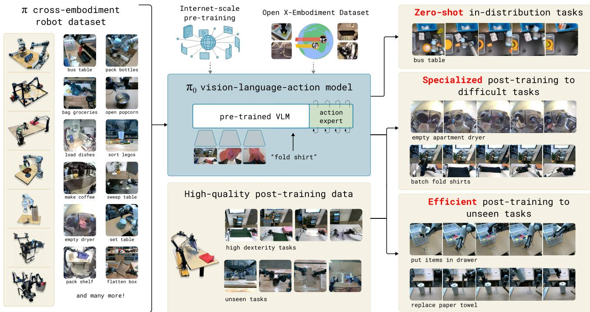
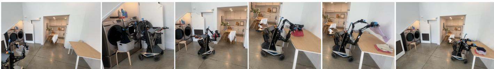

[← 返回 README](../README.md)

# I. Introduction

## 📌 预览
Introduction 阐述了为什么需要通用机器人策略（robot foundation model），π₀ 的设计动机，以及论文的核心贡献。

---

*Figure 1: Our generalist robot policy uses a pre-trained vision-language model (VLM) backbone, as well as a diverse cross-embodiment dataset with a variety of dexterous manipulation tasks. The model is adapted to robot control by adding a separate action expert that produces continuous actions via flow matching, enabling precise and fluent manipulation skills.*

> 💡 **Figure 1 批读**:
> - 左侧：预训练 VLM backbone（PaliGemma）提供语义理解
> - 中间：多样化跨 embodiment 数据集（单臂、双臂、移动机器人）
> - 右侧：action expert 通过 flow matching 输出连续动作
> - 核心架构特点：VLM + action expert 的 mixture-of-experts 设计

---

*Figure 2: π₀ controls a mobile manipulator to fold laundry. Our model is pre-trained on diverse data from 7 distinct robot configurations and 68 tasks, and can then either be prompted directly or fine-tuned to complex downstream tasks.*

> 💡 **Figure 2 批读**:
> - 展示了最复杂的任务之一：完整的洗衣流程（取衣→装筐→搬运→折叠）
> - 体现了 pre-training + fine-tuning 的训练范式
> - 7 种机器人构型 + 68 个任务的预训练规模

---

*A human being should be able to change a diaper, plan an invasion, butcher a hog, conn a ship, design a building, write a sonnet, balance accounts, build a wall, set a bone, comfort the dying, take orders, give orders, cooperate, act alone, solve equations, analyze a new problem, pitch manure, program a computer, cook a tasty meal, fight efficiently, die gallantly. Specialization is for insects.*

*Robert A. Heinlein, Time Enough for Love*

> 💡 **批注**: 以 Heinlein 的名言开篇，强调人类智能的核心优势是**多面性（versatility）**，而非在单一任务上的极致表现。这为论文的 "generalist" 主题定下基调。

---

Artificial intelligence systems come in all shapes and sizes, from highly specialized systems that solve complex problems inaccessible to the human mind, such as predicting the conformation of a protein [21], to systems that can produce lifelike high-resolution images or videos based on textual prompts [40]. However, the axis along which human intelligence most outpaces machine intelligence is versatility: the ability to solve diverse tasks situated in varied physical environments, while responding intelligently to environmental constraints, language commands, and unexpected perturbations. Perhaps the most tangible progress toward this kind of versatility in AI can be seen in large language- and vision-language models [1, 48]: systems that are pre-trained on large and very diverse corpora of images and text from the web, and then fine-tuned ("aligned") using more carefully curated datasets meant to induce the desired pattern of behavior and responsiveness. While such models have been shown to exhibit broad instruction-following and problem-solving abilities [53, 27], they are not truly situated in a physical world the way that people are, and their understanding of physical interaction is based entirely on abstract descriptions. If such methods are to make tangible progress toward AI systems that exhibit the kind of physically situated versatility that people possess, we will need to train them on physically situated data — that is, data from embodied robot agents.

> 💡 **批注**: 
> - AI 的当前格局：专用系统（AlphaFold、Stable Diffusion）很强，但缺乏**通用性**
> - LLM/VLM 展示了"预训练+对齐"范式的成功，但它们不具身（not physically situated）
> - **关键论点**：要实现物理世界的通用 AI，必须用**具身数据**（机器人数据）训练

---

Flexible and general-purpose models that can be tasked to perform a variety of robot behaviors have tremendous practical ramifications, but they may also offer solutions to some of the toughest challenges facing robot learning today, such as availability of data, generalization, and robustness. In natural language [1] and computer vision [39], general-purpose foundation models that are pre-trained on diverse multi-task data tend to outperform narrowly tailored and specialized solutions. For example, if the goal is to recognize birds in photographs, it is likely more expedient to pre-train on many different image-language associations and then fine-tune or prompt for the bird recognition task, than it is to train on only bird recognition data. Similarly, we may find that for effective specialized robot systems, it is more effective to first pre-train on highly diverse robot data, and then fine-tune or prompt for the desired task. This can resolve the data scarcity challenge, because many more sources of data are available to a generalist model — including data from other tasks, other robots, or even non-robot sources — and it may resolve robustness and generalization challenges, because the diverse data exhibits a greater coverage of observations and actions, providing a variety of scenes, corrections, and recovery behaviors that might not be present in more narrow specialized data. Thus, adopting a large-scale pre-training approach to robot learning has the potential to address many of the field's challenges and make practical learning-enabled robots a reality, while at the same time furthering our understanding of the deepest problems in artificial intelligence.

> 💡 **批注**:
> - **类比论证**：NLP/CV 中 foundation model > 专用模型（鸟类识别的例子）→ 机器人领域也可能如此
> - Foundation model 解决三大挑战的逻辑：
>   1. **数据稀缺** → 可用其他任务/机器人/非机器人数据
>   2. **泛化** → 多样数据覆盖更多场景
>   3. **鲁棒性** → 多样数据包含纠正和恢复行为

---

However, developing such generalist robot policies — i.e., robot foundation models — involves a number of major challenges. First, any such research must be done at a very large scale, because the full benefits of large-scale pre-training are often not present at smaller scales [54]. Second, it requires developing the right model architectures that can effectively make use of diverse data sources, while at the same time being able to represent the intricate and subtle behaviors necessary to interact with complex physical scenes. Third, it requires the right training recipe. This is perhaps the most important ingredient, as much of the recent progress with large models in NLP and computer vision has relied heavily on delicate strategies for curating pre-training and post-training data [35].

> 💡 **批注**: 三大技术瓶颈 → 也是论文三大贡献的对应：
> 1. **规模** → 10,000+ 小时机器人数据 + OXE
> 2. **架构** → VLM + flow matching + action expert
> 3. **训练配方** → pre-training / post-training 两阶段

---

In this paper, we present a prototype model and learning framework, which we call $\pi _ { 0 }$ , that illustrates how each of these three bottlenecks could be tackled. We illustrate our model and system in Figure 1. To incorporate diverse data sources, we begin by utilizing a pre-trained vision-language model (VLM) to import Internet-scale experience. By basing our model on a VLM, we inherit the general knowledge, semantic reasoning, and problem-solving abilities of language- and vision-language models. We then further train our model to incorporate robot actions, turning it into a vision-language-action (VLA) model [7]. In order to make it feasible to utilize a variety of diverse robot data sources, we employ cross-embodiment training [10], where data from many robot types is combined into the same model. These different robot types have different configuration spaces and action representations, including single and dual-arm systems, as well as mobile manipulators. Additionally, in order to make it possible to perform highly dexterous and intricate physical tasks, we use an action chunking architecture [57] with flow matching (a variant of diffusion) to represent complex continuous action distributions [28, 32]. This enables our model to control robots at frequencies of up to $50 ~ \mathrm{Hz}$ for dexterous tasks such as laundry folding (see Figure 1). To combine flow matching with VLMs, we use a novel action expert that augments the standard VLM with flow-based outputs.

> 💡 **批注**: π₀ 的核心设计决策：
> - **VLM backbone** (PaliGemma) → 继承互联网规模的语义知识
> - **跨 embodiment 训练** → 统一不同机器人（单臂/双臂/移动）
> - **Action chunking + flow matching** → 高频（50Hz）灵巧控制
> - **Action expert** → 将 flow matching 与 VLM 结合的关键创新（类似 MoE）

---

As with language models, the architecture of our model is only part of our method. In order to flexibly and robustly perform complex tasks, we need the right training recipe. Our recipe mirrors the pre-training/post-training separation commonly seen in exascale language- and image-language models [1, 48], where the model is first pre-trained on a very large and diverse corpus, and then fine-tuned on more narrow and more carefully curated data to induce the desired pattern of behavior — in our case, dexterity, efficiency, and robustness. Intuitively, training only on high-quality data does not teach the model how to recover from mistakes, since mistakes are rarely seen in such data. Training on only lower-quality pre-training data does not teach the model to act efficiently and robustly. Combining both provides the desired behavior: the model attempts insofar as possible to act in a manner similar to the high-quality data, but still has a repertoire of recoveries and corrections that it can deploy in the case of a mistake.

> 💡 **批注**: 
> - **训练配方 ≥ 架构** — 这是 LLM 领域的共识，现在迁移到机器人
> - Pre-training vs post-training 的互补逻辑：
>   - 只用高质量数据 → 不会从错误中恢复（brittle）
>   - 只用预训练数据 → 不够流畅和高效
>   - **两者结合** → 既流畅又鲁棒

---

The contributions of our work consist of a novel generalist robot policy architecture based on VLM pre-training and flow matching, and an empirical investigation of pre-training/post-training recipes for such robot foundation models. We evaluate our model out of the box with language commands, with fine-tuning to downstream tasks, and in combination with a high-level semantic policy that outputs intermediate language commands to perform complex and temporally extended tasks. While our model and system make use of a variety of ideas presented in recent work, the combination of ingredients is novel, and the empirical evaluation demonstrates a level of dexterity and generality that goes significantly beyond previously demonstrated robot foundation models. We evaluate our approach by pre-training on over 10,000 hours of robot data, and fine-tuning to a variety of dexterous tasks, including laundry folding (see Figure 2), clearing a table, putting dishes in a microwave, stacking eggs into a carton, assembling a box, and bagging groceries.

> 💡 **贡献总结**:
> 1. **架构**: VLM + flow matching VLA（action expert 设计）
> 2. **训练配方**: pre-training / post-training recipe 的实证研究
> 3. **评估**: 三种模式（直接 prompting / 语言指令 / fine-tuning）+ 多种复杂灵巧任务
> 4. **规模**: 10,000+ 小时机器人数据预训练

---

## 🔖 Section 总结

### 核心洞察
1. **Versatility 是关键**：通用机器人策略不仅有实用价值，还能解决数据稀缺、泛化、鲁棒性三大挑战
2. **三个技术瓶颈**：规模、架构、训练配方 → π₀ 逐一解决
3. **Pre-training + post-training** 的互补性：前者提供广度和恢复能力，后者提供精度和流畅性
4. **VLM → VLA 的演进**：继承互联网知识 → 加入跨 embodiment 机器人数据 → flow matching 输出连续动作
