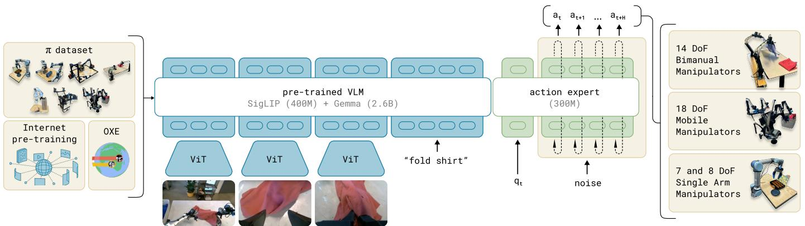

[← 返回 README](../README.md)

# III. Overview

## 📌 预览
Overview 提供了 π₀ 框架的全局视图：预训练混合数据 → 训练 flow matching VLA → 直接 prompting 或 fine-tuning 到下游任务。

---

*Figure 3: Overview of our framework. We start with a pre-training mixture, which consists of both our own dexterous manipulation datasets and open-source data. We use this mixture to train our flow matching VLA model, which consists of a larger VLM backbone and a smaller action expert for processing robot states and actions. The VLM backbone weights are initialized from PaliGemma, providing representations learned from large-scale Internet pre-training. The resulting π₀ model can be used to control multiple robot embodiments with differing action spaces to accomplish a wide variety of tasks.*

> 💡 **Figure 3 批读**:
> - 左：数据混合 — π dataset (自有灵巧操作) + OXE (开源跨 embodiment)
> - 中：模型架构 — VLM backbone (PaliGemma, 大) + Action Expert (小), 通过 self-attention 交互
> - 右：输出 — 同一模型控制多种 embodiment（UR5e、双臂、移动机器人等）
> - 关键：Action Expert 是独立的小型权重集，处理 robot state 和 action tokens

---

We provide an outline of our model and training procedure in Figure 3. In our training framework, we first assemble a pre-training mixture consisting of a weighted combination of our own dexterous manipulation datasets (Section V-C), collected on 7 different robot configurations for 68 different tasks, and the entire OXE dataset [10], which contains data from 22 robots. The pre-training phase (Section V-A) also uses diverse language labels, combining task names and segment annotations (fine-grained labels for sub-trajectories, typically about 2 seconds in length). The purpose of the pre-training phase is to train a base model that exhibits broad capabilities and generalization, but is not necessarily specialized for high performance on any one task. This base model can follow language commands and perform a variety of tasks at rudimentary proficiency. For complex and dexterous tasks, we then employ a post-training procedure (Section V-A), which uses high-quality curated data to adapt the model to specific downstream tasks. We study both efficient post-training with small to moderate amounts of data, and high-quality post-training with larger datasets for complex tasks such as laundry folding and mobile manipulation.

> 💡 **批注**:
> - **预训练数据**: 自有 7 种机器人 × 68 个任务 + OXE 22 种机器人
> - **语言标签**: task name + segment annotation（~2秒粒度的细粒度标注）
> - **预训练目标**: 广泛能力 + 泛化 → 不追求单一任务最优
> - **Post-training**: 高质量数据 → 特定任务的精通
> - 两种 post-training 模式：小数据高效适配 vs 大数据复杂任务精通

---

Our model, which we describe in Section IV, is based on the PaliGemma vision-language model [5], which we then further train with our data mixture. To turn the base PaliGemma VLM into $\pi _ { 0 }$ , we add action outputs that use flow matching [32, 28] to generate continuous action distributions. We describe this design in detail in the following section. Note that we use PaliGemma for convenience and because of its comparatively small size (which is useful for real-time control), but our framework is compatible with any base pre-trained VLM.

> 💡 **批注**:
> - 选 PaliGemma 的原因：开源 + **3B 参数**（相对小，适合实时控制）
> - 框架不绑定特定 VLM → 未来可替换为更大/更强的 VLM
> - VLM → VLA 的核心改动：加入 flow matching action outputs

---

## 🔖 Section 总结

### 关键数字速查
| 指标 | 数值 |
|------|------|
| 自有数据机器人种类 | 7 种构型 |
| 自有数据任务数 | 68 个 |
| OXE 机器人种类 | 22 种 |
| 语言标注粒度 | ~2 秒 segment |

### 核心洞察
1. 训练流程是 LLM 风格的两阶段：pre-training（广度）→ post-training（深度）
2. PaliGemma 是 VLM backbone 的选择，但框架可替换
3. 核心创新在于如何把 flow matching 加到 VLM 上（下一节详述）
