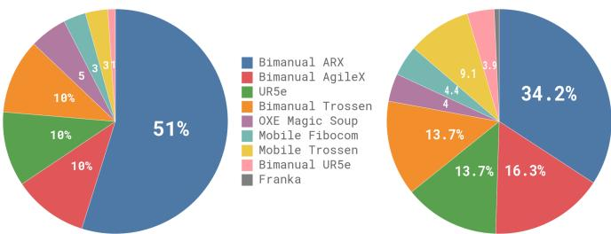
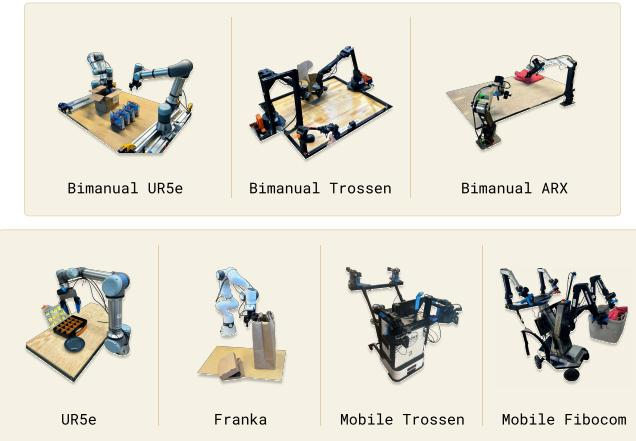

[← 返回 README](../README.md)

# V. Data Collection and Training Recipe

## 📌 预览
本节是论文的"秘方"部分：数据集构成、pre-training/post-training 两阶段训练、语言和高层策略、以及机器人平台详情。

---

Broadly capable robot foundation models require not only an expressive and powerful architecture, but also the right dataset and, more importantly, the right training recipe. In the same way that LLM training is typically divided into pre-training and post-training phases, we employ a multi-stage training procedure for our model. The goal of the pre-training phase is to expose the model to a diverse range of tasks so that it can acquire broadly applicable and general physical capabilities, while the goal of the post-training phase is to provide the model with the ability to skillfully and fluently execute the desired downstream task. Because of this, the requirements for the pre-training and post-training datasets are distinct: the pre-training dataset should cover as many tasks as possible, and within each of those tasks should cover a diversity of behaviors. The post-training dataset should instead cover behaviors that are conducive to effective task execution, which should exhibit a consistent and fluent strategy. Intuitively, the diverse (but lower quality) pre-training data allows the model to recover from mistakes and handle highly varied situations, which might not otherwise occur in the high-quality post-training data, while the post-training data teaches the model to perform the task well.

> 💡 **批注**: Pre-training vs Post-training 的设计哲学：
> | | Pre-training | Post-training |
> |---|---|---|
> | **数据特点** | 大规模、多样、质量参差 | 小规模、高质量、一致策略 |
> | **学到什么** | 广泛物理能力、错误恢复 | 流畅执行、任务精通 |
> | **类比 LLM** | 网页数据预训练 | RLHF/DPO 对齐 |

---

While in principle our model can be initialized from scratch or fine-tuned from any VLM backbone, in practice we use PaliGemma [5] as our base model. PaliGemma is an open-source 3 billion parameter VLM that offers a convenient trade-off between size and performance. We add 300M parameters for the action expert (which is initialized from scratch) for a total of 3.3 billion parameters. We provide a full description of the model architecture in Appendix B.

> 💡 **批注**: 
> - PaliGemma 3B → 开源、性能-尺寸平衡好
> - Action Expert 300M 从头训练 → 总共 3.3B
> - 注意 Action Expert 的参数量只有 VLM 的 1/10 → 推理时只需反复跑这个小模型

---

## V-A. Pre-training and post-training

*Figure 4: Overview of our dataset: The pre-training mixture consists of a subset of OXE and the π dataset. We use a subset of OXE, which we refer to as OXE Magic Soup. The right figure illustrates the weight of the different datasets in the pre-training mixture. The left figure illustrates their relative sizes as measured by the number of steps.*

> 💡 **Figure 4 批读**:
> - 左图（数据量）: π dataset 占绝对主体（~903M steps），OXE 占较小比例
> - 右图（训练权重）: OXE 被上调权重（9.1% → 更大比例），确保多样性
> - OXE Magic Soup = OXE 的精选子集（来自 OpenVLA 的选法）

---

We provide an overview of our pre-training mixture in Figure 4. Since each training example corresponds to a timestep — i.e., a tuple $\left( \mathbf { o } _ { t } , \mathbf { A } _ { t } \right)$ , — we will quantify data in terms of timesteps in this discussion. $9.1\%$ of the training mixture consists of open-source datasets, including OXE [10], Bridge v2 [52], and DROID [23]. The robots and tasks in these datasets typically have one or two cameras and use low-frequency control, between 2 and $10 ~ \mathrm{Hz}$. However, these datasets cover a wide range of objects and environments. To learn dexterous and more complex tasks, we also use 903M timesteps of data from our own datasets, where 106M steps are from single-arm robots and 797M are from dual-arm robots. This data has 68 tasks, where each task is composed of complex behaviors — e.g., the "bussing" task involves putting a wide range of different dishes, cups, and utensils into a bussing bin, and a wide array of trash items into the garbage. Note that this definition of task is significantly different from prior work, which typically uses any combination of noun and verb (e.g., "pick up the cup" vs. "pick up the plate") to constitute a distinct task. Therefore, the actual range of behaviors in our dataset is significantly broader than this number of "tasks" would imply. We discuss the specific robots and tasks in our dataset in more detail in Section V-C.

> 💡 **批注**:
> - **数据量**: 903M timesteps 自有 + OXE 9.1%
> - 自有数据分布：单臂 106M + 双臂 797M → 双臂数据占主体
> - **任务定义不同于前作**: 一个 "task" = 复杂行为（如 bussing 包含多种物品操作），而非简单的动词+名词
> - OXE 等开源数据虽然低频简单，但提供环境和物体多样性

---

Since the datasets are somewhat imbalanced in size (e.g., the more difficult laundry folding tasks are overrepresented), we weight each task-robot combination by $n ^ { 0.43 }$ , where $n$ is the number of samples for that combination, such that over-represented combinations are down-weighted. The configuration vector $\mathbf { q } _ { t }$ and action vectors $\mathbf { a } _ { t }$ always have the dimensionality of the largest robot in the dataset (18 in our case, to accommodate two 6-DoF arms, 2 grippers, a mobile base, and a vertically actuated torso). For robots with lower-dimensional configuration and action spaces, we zero-pad the configuration and action vectors. For robots with fewer than three images, we also mask out the missing image slots.

> 💡 **批注**:
> - **数据平衡**: 权重 ∝ $n^{0.43}$（亚线性）→ 大数据集被降权，小数据集被提权
> - **统一动作空间**: 最大维度 18（两个 6-DoF 臂 + 2 夹爪 + 移动底盘 + 升降躯干）→ 小机器人 zero-pad
> - **图像处理**: 缺少的相机位用 mask → 统一 3 相机输入格式

---

In the post-training phase, we fine-tune our model with a smaller task-specific dataset to specialize it to particular downstream applications. As mentioned previously, our definition of "task" is fairly broad — e.g., the "bussing" task requires manipulating a wide range of different objects. Different tasks require very different datasets, with the simplest of the tasks necessitating only 5 hours and the most complex tasks using 100 or more hours of data.

> 💡 **批注**: Post-training 数据量范围：**5 ~ 100+ 小时**，取决于任务复杂度。

---

## V-B. Language and high-level policies

More complex tasks that require semantic reasoning and high-level strategy, such as table bussing, can also benefit from a high-level policy that decomposes high-level tasks (such as "bus the table") into more immediate subtasks (such as "pick up the napkin" or "throw the napkin into the trash"). Since our model is trained to process language inputs, we can use a high-level VLM to make these semantic inferences, a method that is analogous to LLM/VLM planning methods such as SayCan [2]. We use such a high-level policy to assist our model with high-level strategy for several of our experimental tasks, as we will discuss in Section VI.

> 💡 **批注**:
> - **分层策略**: 高层 VLM 做语义推理和任务分解 → π₀ 执行低层动作
> - 类似 SayCan 的思路，但 π₀ 作为低层执行器远比 SayCan 时代的策略强大
> - 这种设计让 π₀ 能处理需要语义理解的复杂任务（如区分垃圾 vs 餐具）

---

## V-C. Robot system details

Our dexterous manipulation datasets include 7 different robot configurations and 68 tasks. We summarize these platforms in Figure 5, and discuss them below:

*Figure 5: The robots used in our experiments. These include single and dual-arm manipulators with 6-DoF and 7-DoF arms, as well as holonomic and nonholonomic mobile manipulators. π₀ is trained jointly on all of these platforms.*

> 💡 **Figure 5 批读**:
> - 7 种构型涵盖：单臂（UR5e, Franka）、双臂（UR5e×2, Trossen, ARX/AgileX）、移动双臂（Trossen, ARX, Fibocom）
> - 从 6-DoF 到 17 维动作空间，差异非常大
> - 所有平台联合训练 → 真正的跨 embodiment

---

**UR5e.** An arm with a parallel jaw gripper, with a wrist-mounted and over-the-shoulder camera, for a total of two camera images and a 7-dimensional configuration and action space.

**Bimanual UR5e.** Two UR5e setups, for a total of three camera images and a 14-dimensional configuration and action space.

**Franka.** The Franka setup has two cameras and an 8-dimensional configuration and action space.

**Bimanual Trossen.** This setup has two 6-DoF Trossen ViperX arms in a configuration based on the ALOHA setup [4, 57], with two wrist cameras and a base camera, and a 14-dimensional configuration and action space.

**Bimanual ARX & bimanual AgileX.** This setup uses two 6-DoF arms, and supports either ARX or AgileX arms, with three cameras (two wrist and one base) and a 14-dimensional configuration and action space. This class encompasses two distinct platforms, but we categorize them together because of their similar kinematic properties.

**Mobile Trossen & mobile ARX.** This setup is based on the Mobile ALOHA [57] platform, with two 6-DoF arms on a mobile base, which are either ARX arms or Trossen ViperX arms. The nonholonomic base adds two action dimensions, for a 14-dimensional configuration and 16-dimensional action space. There are two wrist cameras and a base camera. This class encompasses two distinct platforms, but we categorize them together because of their similar kinematic properties.

**Mobile Fibocom.** Two 6-DoF ARX arms on a holonomic base. The base adds three action dimensions (two for translation and one for orientation), for a 14-dimensional configuration and 17-dimensional action space.

> 💡 **机器人平台总结**:
> | 平台 | 臂数 | DoF | 相机数 | 动作维度 | 特点 |
> |------|------|-----|--------|----------|------|
> | UR5e | 1 | 6+1 | 2 | 7 | 单臂基准 |
> | Bimanual UR5e | 2 | 6+1×2 | 3 | 14 | 双臂 |
> | Franka | 1 | 7+1 | 2 | 8 | 7-DoF 臂 |
> | Bimanual Trossen | 2 | 6+1×2 | 3 | 14 | ALOHA 风格 |
> | Bimanual ARX/AgileX | 2 | 6+1×2 | 3 | 14 | 双平台合并 |
> | Mobile Trossen/ARX | 2+base | 6+1×2+2 | 3 | 16 | 非全向移动 |
> | Mobile Fibocom | 2+base | 6+1×2+3 | 3 | 17 | 全向移动 |

We summarize the proportion of our dataset from each robot in Figure 4.

---

## 🔖 Section 总结

### 关键数字速查
| 指标 | 数值 |
|------|------|
| 总预训练数据 | ~10,000 小时 |
| 自有数据 timesteps | 903M |
| 开源数据比例 | 9.1% |
| 机器人构型 | 7 种 |
| 任务数 | 68 |
| 最大动作维度 | 18 |
| 数据平衡指数 | n^0.43 |
| Post-training 数据量 | 5~100+ 小时 |
| 模型总参数 | 3.3B |

### 核心洞察
1. **训练配方 ≥ 架构**: 预训练提供广度（恢复能力），post-training 提供深度（流畅执行）
2. **跨 embodiment 统一**: zero-padding + mask 实现不同机器人的统一输入格式
3. **数据平衡**: 亚线性权重避免大任务主导训练
4. **分层策略**: 高层 VLM 做语义推理 + π₀ 做灵巧执行
