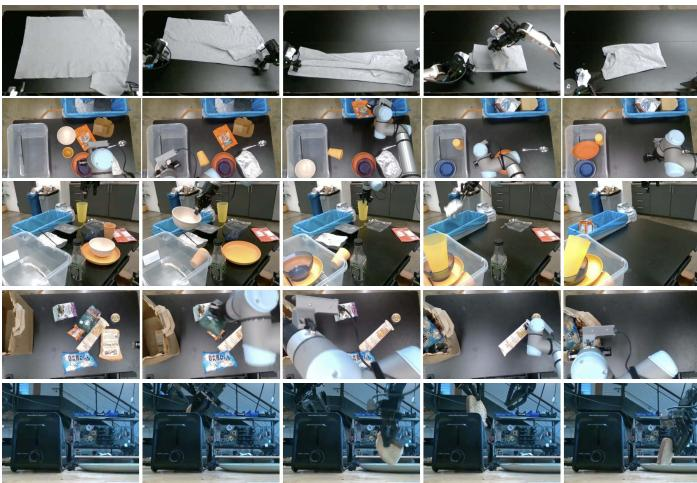
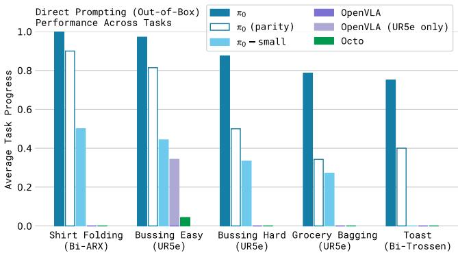
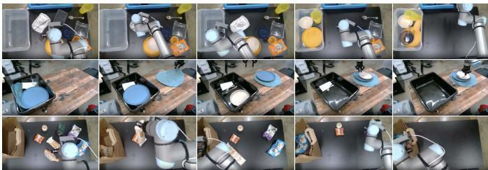
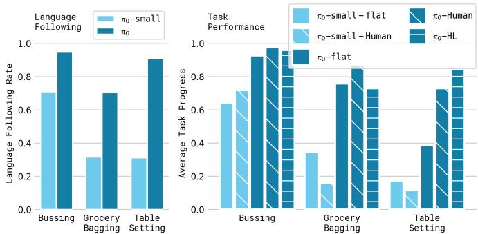
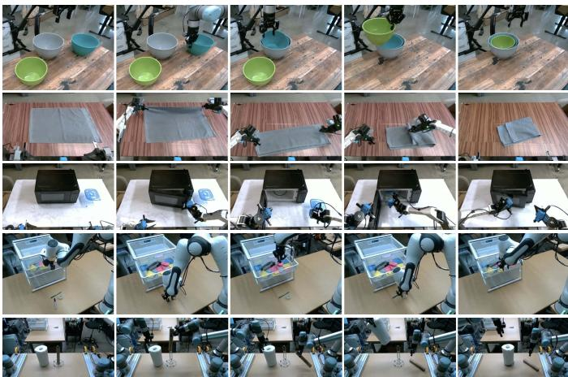
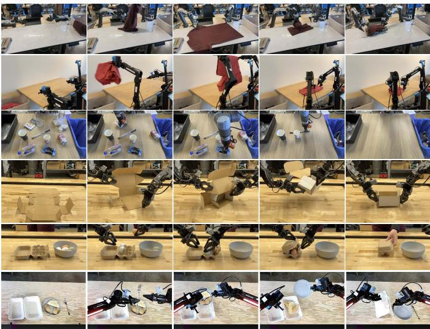
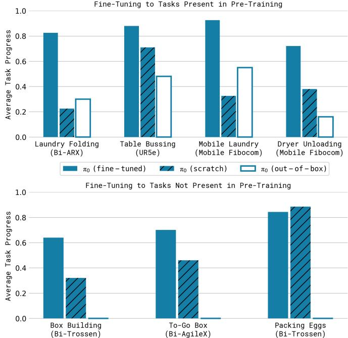

[← 返回 README](../README.md)

# VI. Experimental Evaluation

## 📌 预览
实验部分回答四个研究问题：(A) 预训练模型的 out-of-box 性能，(B) 语言指令跟随能力，(C) fine-tuning 学新任务，(D) 复杂多阶段任务的精通。

---

Our experimental evaluation consists of out-of-box evaluation experiments that compare our base (pre-trained) model to alternative model designs with direct prompting, as well as detailed fine-tuning experiments that evaluate our model on challenging downstream tasks, comparing it to other methods that have been proposed for dexterous manipulation. We study the following research questions:

> 💡 **四个研究问题**:
> 1. 预训练后直接用，效果如何？（vs OpenVLA, Octo）
> 2. 语言指令跟随能力如何？（VLM 预训练的价值）
> 3. Fine-tuning 学新灵巧任务？（vs ACT, Diffusion Policy）
> 4. 能否精通复杂多阶段任务？（叠衣服、清桌子、组装箱子等）

---

How well does $\pi _ { 0 }$ perform after pre-training on a variety of tasks that are present in the pre-training data? We study this question by directly evaluating $\pi _ { 0 }$ , with comparisons to other robot foundation models.

How well does $\pi _ { 0 }$ follow language commands? These experiments compare $\pi _ { 0 }$ to $\pi _ { 0 }$ -small, a smaller version of our model without VLM initialization, to evaluate its performance on following language commands. We evaluate with both human-provided commands and commands specified by a high-level VLM policy, as discussed in Section V-B.

How does $\pi _ { 0 }$ compare to methods that have been proposed specifically for addressing dexterous manipulation tasks? These experiments study downstream tasks for which we can either fine-tune our model from the pre-trained initialization, or train it from scratch on task-specific data, comparing to prior methods that were proposed for dexterous manipulation. We aim to evaluate both the benefits of our architecture and our pre-training procedure.

Can $\pi _ { 0 }$ be adapted to complex, multi-stage tasks? In our final set of experiments, we fine-tune $\pi _ { 0 }$ to a set of particularly complex tasks, including folding laundry and bussing a table. These tasks take between 5 and 20 minutes to complete. Some require guidance from a high-level policy.

---

## VI-A. Evaluating the base model

*Figure 6: Out-of-box evaluation tasks: shirt folding, bussing easy, bussing hard, grocery bagging, and toast out of toaster. The tasks require a combination of dexterous manipulation, multi-stage behaviors, and semantic recognition.*

> 💡 **Figure 6 批读**:
> - 5 个 out-of-box 任务，难度递增
> - 涵盖灵巧操作（折叠）、多阶段（清理多个物品）、语义识别（区分垃圾 vs 餐具）

---

In our first set of experiments, we evaluate the model after pre-training on our full mixture, without any post-training, to evaluate how well our base model can perform a variety of tasks. We compare to other robot foundation models in the literature: both VLAs and smaller models that are trained from scratch on the same pre-training mixture. We evaluate on the following tasks, visualized in Figure 6, with each task commanded to the same base model via a language command.

**Shirt folding**: the robot must fold a t-shirt, which starts flattened.

**Bussing easy**: the robot must clean a table, putting trash in the trash bin and dishes into the dish bin. The score indicates the number of objects that were placed in the correct receptacle.

**Bussing hard**: a harder version of the bussing task, with more objects and more challenging configurations, such as utensils intentionally placed on top of trash objects, objects obstructing each other, and some objects that are not in the pre-training dataset.

**Grocery bagging**: the robot must bag all grocery items, such as potato chips, marshmallows, and cat food.

**Toast out of toaster**: the robot removes toast from a toaster.

> 💡 **批注**: 这些任务都只用预训练模型直接做（zero-shot），不 fine-tune → 测试 base model 的泛化能力。

---

Providing comparisons for these experiments is challenging because very few prior models can operate at this scale. We compare to OpenVLA [24], a 7B parameter VLA model that was originally trained on the OXE dataset [10]. We train OpenVLA on our full mixture. This is a very difficult mixture for OpenVLA, which does not support action chunking or high-frequency control. We also compare to Octo [50], a smaller 93M parameter model. While Octo is not a VLA, it does use a diffusion process to generate actions, providing a valuable point of comparison for our flow matching VLA. We also train Octo on the same mixture as our model. Due to time constraints, we were unable to train OpenVLA and Octo for the same number of epochs as our full model. We therefore also compare to a "compute parity" version of our model, which is trained for only 160k steps (as opposed to $700\mathrm{k}$ steps for our main model), which is equal to or lower than the number of steps provided to the baselines (160k for OpenVLA, 320k for Octo). We also include a version of the OpenVLA model that we fine-tuned only on the UR5e data, without cross-embodiment training, in the hopes of providing an even stronger baseline on the UR5e tasks. Finally, we include a comparison to the $\pi _ { 0 }$ -small model described in Section IV, which can be viewed as a scaled-down version of our model without VLM pre-training.

> 💡 **批注 — Baseline 设置**:
> | 模型 | 参数量 | 训练数据 | 训练步数 | Action chunk | VLM |
> |------|--------|----------|----------|-------------|-----|
> | π₀ | 3.3B | 全混合 | 700k | ✅ | ✅ |
> | π₀ (parity) | 3.3B | 全混合 | 160k | ✅ | ✅ |
> | π₀-small | 470M | 全混合 | - | ✅ | ❌ |
> | OpenVLA | 7B | 全混合 | 160k | ❌ | ✅ |
> | OpenVLA (UR5e) | 7B | UR5e only | - | ❌ | ✅ |
> | Octo | 93M | 全混合 | 320k | ✅ (diffusion) | ❌ |

---

The evaluation metric uses a normalized score averaged over 10 episodes per task and method, where an episode receives a score of 1.0 for a full success, and a fractional score for partial success. For example, the score for bussing is the fraction of objects that are correctly placed in the proper receptacle. We describe the scoring rubrics in Appendix E.

The results, shown in Figure 7, show that $\pi _ { 0 }$ attains by far the best results across the board on all the out-of-box tasks, with near perfect success rates on shirt folding and the easier bussing tasks, and large improvements over all baselines. The "parity" version of $\pi _ { 0 }$ , which is trained for only $160\mathrm{k}$ steps, still outperforms all the baselines, and even $\pi _ { 0 }$ -small outperforms OpenVLA and Octo. OpenVLA struggles on these tasks because its autoregressive discretization architecture does not support action chunks. The UR5e-only OpenVLA model performs better, but is still far below the performance of $\pi _ { 0 }$ . Octo does support action chunks, but has a comparatively limited representational capacity. This comparison illustrates the importance of combining large, expressive architectures with the ability to model complex distributions via flow matching or diffusion. Additionally, the comparison to $\pi _ { 0 }$ -small illustrates the importance of incorporating VLM pre-training. Unfortunately, it is hard to make this last comparison fair: $\pi _ { 0 }$ -small uses fewer parameters, but larger models are difficult to use without pre-training. Overall, these experiments show that $\pi _ { 0 }$ provides a powerful pretrained model with the ability to effectively perform a variety of tasks with a variety of robots, with much better performance than prior models.

*Figure 7: Out-of-box evaluation results: π₀ trained for the full 700k steps, a version trained for 160k steps that matches the number of updates for baseline models, π₀-small, and three baselines. Across all tasks and all comparisons, even the "parity" version outperforms all baselines.*

> 💡 **Figure 7 批读**:
> - π₀ 全面碾压所有 baseline，即使 compute parity 版本也是如此
> - **关键发现**:
>   1. OpenVLA 在这些任务上挣扎 → 自回归离散化不支持 action chunk 是致命缺陷
>   2. Octo 虽支持 diffusion action，但模型太小（93M）→ 表达能力不够
>   3. π₀-small > OpenVLA/Octo → 架构本身就很强，VLM 预训练进一步提升

---

## VI-B. Following language commands

In the next set of experiments, we fine-tune the base $\pi _ { 0 }$ model to follow language commands in a set of evaluation domains. We compare this fine-tuned $\pi _ { 0 }$ model with the $\pi _ { 0 }$ -small model described in Section IV, which we found to be the strongest baseline in the previous section. Recall that $\pi _ { 0 }$ -small does not use a VLM initialization. This experiment therefore aims to measure how much VLM pre-training boosts our model's ability to follow language instructions.

Note that $\pi _ { 0 }$ -small is also a significantly smaller model — unfortunately, it is difficult to remove this confounder, because VLM initialization serves both to make it practical to train a much larger model without overfitting, and to improve language instruction following. We nonetheless hope that this experiment sheds light on the language capabilities of $\pi _ { 0 }$ .

The language instructions for each task consist of objects to pick up and locations to place those objects, with language-labeled segments that are about 2 seconds in length. Each full task consists of numerous such segments. The tasks in this evaluation consist of:

*Figure 8: The tasks in our language evaluation. We evaluate on 3 different language-conditioned tasks: bussing a table (top), setting a table (middle), and packing a shopping bag (bottom).*

> 💡 **Figure 8 批读**:
> - 三个语言条件任务，每个都需要**一系列**中间语言指令
> - Bussing: 语义分类（垃圾 vs 餐具）+ 精确放置
> - Table setting: 从 bin 取出物品 → 按指令摆放
> - Grocery bagging: 按指令挑选特定商品装袋

---

**Bussing**: the robot must clean a table, placing dishes and cutlery in a bin, and trash into a trash bin.

**Table setting**: the robot must take out items from a bin to set a table, including a place mat, dishes, silverware, napkin, and cups, and adjust them according to language instructions.

**Grocery bagging**: the robot must pack grocery items, such as bags of coffee beans, barley, marshmallow, seaweed, almonds, spaghetti, and cans into a bag.

In Figure 8, we show the language-conditioned tasks in our evaluation and present the evaluation results. We evaluate five different conditions. $\pi _ { 0 }$ -flat (and $\pi _ { 0 }$ -small-flat) corresponds to directly command the model with the task description (e.g., "bag the groceries"), without intermediate language commands. $\pi _ { 0 }$ -human (and $\pi _ { 0 }$ -small-human) provides intermediate step commands (e.g., which object to pick and where to place it) from an expert human user. These conditions evaluate each model's ability to follow more detailed language commands: while these intermediate commands provide considerable information for how to perform the task, the model must be able to understand and follow those commands to benefit from them. Finally, $\pi _ { 0 }$-HL evaluates $\pi _ { 0 }$ with high-level commands provided by a high-level VLM, as discussed in Section V-B. This condition is also autonomous, without any human expert.

> 💡 **批注 — 实验条件**:
> | 条件 | 语言指令来源 | 自主性 |
> |------|------------|--------|
> | -flat | 只给总任务描述 | 全自主 |
> | -human | 人类专家给中间步骤 | 人在环 |
> | -HL | 高层 VLM 给中间步骤 | 全自主 |

---

*Figure 9: Language evaluation. We compare "flat" versions (overall task command only) with methods that receive intermediate commands from a human expert or a high-level VLM policy. The results show a significant improvement with π₀ from intermediate language commands.*

> 💡 **Figure 9 批读**:
> - **核心发现**: π₀ 的语言跟随准确率远高于 π₀-small
> - π₀ 能从中间语言指令中**显著获益**（flat → human 大幅提升）
> - π₀-small 因语言能力弱，即使给中间指令也帮助不大
> - π₀-HL（VLM 自主给指令）效果也不错 → 全自主系统可行
> - **关键结论**: VLM 预训练不仅提供视觉语义，还提供真正的语言理解能力

The results in Figure 9, averaging over 10 trials per task, show that the language following accuracy of $\pi _ { 0 }$ is significantly better than that of $\pi _ { 0 }$ -small. This suggests a significant improvement from the larger pre-trained VLM initialization. This capability translates to an improvement in performance with expert human guidance ($\pi _ { 0 }$-human) and with high-level model guidance ($\pi _ { 0 }$-HL). The results indicate that $\pi _ { 0 }$'s language following ability directly translates into better autonomous performance on complex tasks with high-level guidance.

---

## VI-C. Learning new dexterous tasks

In the next set of experiments, we evaluate our model on new tasks that differ significantly from the pre-training data, requiring entirely new behaviors. For these evaluations, we fine-tune the model using various amounts of data for each new task. While each task is new, we partition the tasks into "tiers" depending on how much they differ from tasks in the pre-training data.

*Figure 10: Fine-tuning evaluation tasks: stack bowls, towel folding (easy tier), Tupperware in microwave (medium), paper towel replacement and Franka items in drawer (hard tier).*

> 💡 **Figure 10 批读**:
> - Easy: 与预训练数据相似（碗堆叠 ≈ bussing、毛巾折叠 ≈ 衬衫折叠）
> - Medium: 部分新元素（微波炉是新的，但容器操作类似）
> - Hard: 完全新行为（换纸巾卷、Franka 装抽屉）

---

The tasks, shown in Figure 10, are:

**UR5e stack bowls.** This task requires stacking bowls, with four bowls of different sizes. Since this task requires grasping and moving dishes like the bussing task in the pre-training data, we place it in the "easy" tier. The training data contains a variety of bowls, and the evaluations use a mix of seen and unseen bowls.

**Towel folding.** This task requires folding a towel. Since this is similar to shirt folding, which is present in pre-training, we place it in the "easy" tier.

**Tupperware in microwave.** This task requires opening a microwave, putting a plastic container inside it, and closing it. The containers come in different shapes and colors, and the evaluations use a mix of seen and unseen containers. The container manipulation resembles pre-training data, but the microwave is not found in pre-training.

**Paper towel replacement.** This task requires removing an old cardboard paper towel tube from a holder and replacing it with a fresh paper towel roll. Because no such items are found in pre-training, we consider this "hard."

**Franka items in drawer.** This task requires opening a drawer, packing items into a drawer, and closing it. Because there is no similar task with the Franka robot in pre-training, we consider this "hard."

---

We compare our model after fine-tuning both to OpenVLA [24] and Octo [50], which also employ a pre-training and fine-tuning recipe. Since our aim is to evaluate the specific models (rather than the architectures), we use the publicly available pre-trained checkpoints for these models, which are trained on OXE [10], and then fine-tune them to each task. We also compare to ACT [57] and Diffusion Policy [9], which are designed specifically for learning dexterous tasks from smaller datasets. ACT and Diffusion Policy are trained only on the fine-tuning datasets, which are of similar size to the individual datasets used in the ACT and Diffusion Policy experiments [9, 57]. We evaluate $\pi _ { 0 }$ by fine-tuning from our pre-trained base model, as well as by training from scratch. This comparison is meant to evaluate the individual benefits of the $\pi _ { 0 }$ architecture and our pre-training procedure. We hypothesize that the $\pi _ { 0 }$ architecture with VLM initialization should already provide a stronger starting point for the individual tasks, while the pre-training procedure should further improve its performance, especially with smaller fine-tuning datasets.

*Figure 11: Fine-tuning with varying amounts of data. π₀ can learn some easier tasks even with smaller amounts of data, and the pre-trained model often attains a larger improvement over the model trained from scratch.*

> 💡 **Figure 11 批读**:
> - π₀ (pre-trained) 普遍优于所有 baseline，有时高达 **2x**
> - **有趣发现**: 最强的先前方法是从头训练的 ACT/Diffusion Policy → 说明之前的预训练方法（OpenVLA/Octo）对下游 fine-tuning 帮助有限
> - 预训练对**相似任务**提升更大（符合预期）
> - **数据效率**: 少量数据（1小时）时 π₀ 优势更明显 → 预训练提供了好的初始化

Figure 11 shows the performance across all of the tasks for a variety of methods, averaging over 10 trials per task, with different amounts of fine-tuning data on each task. We include all of the baselines on the stack bowls and Tupperware in microwave tasks. Since OpenVLA and Octo attain significantly worse performance, we only run these for one of the dataset sizes, due to the time cost of evaluating so many models in the real world. The results show that $\pi _ { 0 }$ generally outperforms other methods. Interestingly, the strongest prior models are the ones that are trained entirely from scratch on the target tasks, suggesting that leveraging pre-training in these domains presents a major challenge for prior approaches. While the 5-hour policy for $\pi _ { 0 }$ on the Tupperware task performs similarly to the baselines, the 1-hour version is significantly better. As expected, pre-training leads to larger improvement for tasks that are more similar to the pre-training data, though the pre-trained model is frequently better than the non-pre-trained model, sometimes by as much as $2\mathbf{x}$.

---

## VI-D. Mastering complex multi-stage tasks

In our final set of experiments, we tackle a range of challenging multi-stage tasks via a combination of fine-tuning and language. For some of these tasks, data is present in pre-training, but fine-tuning is required to attain mastery. For some, no data is present in pre-training.

*Figure 12: We evaluate a range of complex and temporally extended tasks: folding laundry (a, b), bussing a real table (c), assembling a box (d), packing eggs (e), and packing food into a to-go box (f). These tasks require combining dozens of individual behaviors and generalization to huge variety of configurations.*

> 💡 **Figure 12 批读**:
> - 这些是论文最具挑战性的任务，每个持续 **5-20 分钟**
> - (a)(b) 洗衣折叠：随机起始 + 变形物体 → 极高难度
> - (c) 清桌子：新物体泛化 + 语义分类
> - (d) 组装箱子：需要两只手协作 + 利用桌面支撑
> - (e) 装蛋：精细力控（鸡蛋滑、脆弱）
> - (f) 外带打包：多物品装箱 + 关盖

---

The tasks in this evaluation, shown in Figure 12, are:

**Laundry folding**: This task requires a static (non-mobile) bimanual system to fold articles of clothing. The clothing items start in a randomized crumpled state in a bin, and the goal is to take out the item, fold it, and place it on top of a stack of previously folded items. The randomized initial configuration of the crumpled laundry presents a major challenge, since the policy needs to generalize to any configuration. This task is present in pre-training.

**Mobile laundry**: Here, the Fibocom mobile robot in Figure 5 has to fold laundry, facing many of the same challenges while controlling orientation and translation. This task is present in pre-training.

**Dryer unloading**: Here, the Fibocom mobile robot has to take laundry out of a dryer and place it into a hamper. This task is present in pre-training.

**Table bussing**: This task requires bussing a table with a diverse array of novel objects in a clutter scene, presenting a much greater challenge than the benchmark in our out-of-box evaluation: the policy must generalize to unseen objects of varying shapes and sizes, and perform complex dexterous motions, such as twisting the gripper to pick up large plates and carefully grasping thin, delicate items such as glasses. The robot must handle dense clutter and intelligently sequence various behaviors — for example, to clean off a plate with trash, it must first pick up the plate, then shake its contents into the garbage, and then place the plate in the bin. This task is not present in pre-training.

**Box building**: The robot has to assemble a cardboard box that starts in a flattened state. This task presents a number of major challenges: the box needs to be bent in the right way, and the robot needs to hold down parts of the box while folding others, utilizing both arms and even the surface of the table to brace during folding motions. The robot might need to retry some folds, requiring a reactive and intelligent strategy. This task is not present in pre-training.

**To-go box**: This task requires moving several food items from a plate into a to-go box, requiring packing the items into the box so that they do not stick out, and then closing the box with both arms. This task is not present in pre-training.

**Packing eggs**: The robot needs to take six eggs out of a bowl and pack them into an egg carton, and then close the carton. The eggs need to be grasped in a manner appropriate to their pose inside the bowl, and then placed into open slots in the carton. This presents challenges due to the egg shape, slipperiness, and the need for careful placement. Closing the box requires the use of both arms. This task is not present in pre-training.

> 💡 **任务难度分析**:
> | 任务 | 预训练中 | 核心挑战 |
> |------|---------|----------|
> | Laundry folding | ✅ | 随机起始、变形物体 |
> | Mobile laundry | ✅ | 同上 + 移动控制 |
> | Dryer unloading | ✅ | 移动 + 从狭小空间取物 |
> | Table bussing | ❌ | 新物体泛化、语义分类、精细抓取 |
> | Box building | ❌ | 双臂协作、利用环境、重试策略 |
> | To-go box | ❌ | 装箱 + 关盖 |
> | Packing eggs | ❌ | 精细力控、脆弱物体 |

---

The results, showing average scores per task over 10 trials, are presented in Figure 13. The scoring rubrics are in Appendix E. A score of 1.0 represents a perfect execution, while partial scores correspond to partially completed tasks (e.g., 0.5 indicates that half the objects were bussed correctly). These tasks are very difficult, and we were not able to solve them with other methods. We therefore use these tasks to compare to ablations of our approach, evaluating $\pi _ { 0 }$ after pre-training and fine-tuning, out of the box after pre-training only ("out-of-box"), and training on the fine-tuning data without any pre-training ("scratch"). The results show that $\pi _ { 0 }$ can solve many of these tasks, with our full pre-training and fine-tuning recipe performing best across the board. Note that many of these more difficult tasks show a very large improvement from using the pre-trained model, indicating that pre-training is especially useful with harder tasks. The absolute performance of $\pi _ { 0 }$ varies across the tasks, likely due to differences in task difficulty and the degree to which the tasks are represented in pre-training. We recommend that readers watch the task videos on the accompanying website for a more complete impression of these tasks and their complexity. We believe that this level of autonomous performance on such challenging tasks represents a new state of the art in dexterous robot manipulation with learned policies.

*Figure 13: Post-training results on complex tasks in terms of average scores over 10 trials. The full pre-trained π₀ model attains more than 50% of the maximum score across all tasks, and typically outperforms the ablations, with especially significant improvements on the hardest tasks.*

> 💡 **Figure 13 批读**:
> - **完整 π₀ (pre-train + fine-tune)** 在所有任务上都最好
> - 关键对比：
>   - pre-trained > scratch → **预训练在困难任务上提升尤其大**
>   - pre-trained + fine-tuned > out-of-box → fine-tuning 对复杂任务必不可少
> - 所有任务 >50% score → 考虑到任务难度（数十分钟的多阶段灵巧操作），这是 SOTA
> - **最重要的发现**: 预训练对越难的任务帮助越大

---

## 🔖 Section 总结

### 关键数字速查
| 指标 | 数值 |
|------|------|
| 评估试次/任务 | 10 episodes |
| 预训练步数 | 700k |
| 比较的 baseline 数 | OpenVLA, Octo, ACT, Diffusion Policy, π₀-small |
| 最复杂任务持续时间 | 5-20 分钟 |
| π₀ 在所有复杂任务上 | >50% score |

### 核心洞察
1. **Out-of-box**: π₀ 全面碾压 OpenVLA/Octo → flow matching + action chunking + VLM 三者缺一不可
2. **语言跟随**: VLM 预训练显著提升语言理解 → π₀-small 即使给中间指令也帮助不大
3. **Fine-tuning**: π₀ > ACT/Diffusion Policy → 预训练提供了好的初始化，数据效率更高
4. **复杂任务**: 预训练对越难的任务帮助越大 → 预训练的恢复能力和多样经验是关键
5. **训练配方**: pre-training + post-training 的组合最优，任何单独一步都不够
