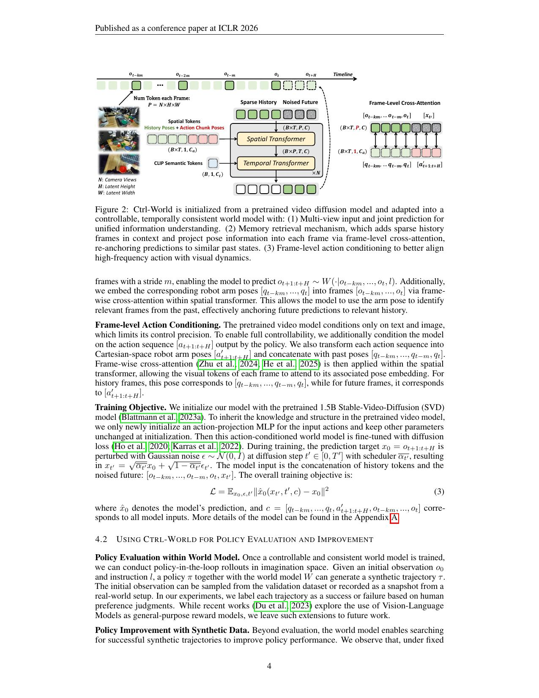

[← 返回 README](../README.md)

# 4. Method

## 架构图



*Figure 2: Ctrl-World 架构。从 SVD 初始化，通过三个关键改造：(1) 多视角输入和联合预测；(2) 记忆检索（稀疏历史帧 + 姿态 cross-attention）；(3) 帧级动作条件。*

---

## 4.1 三大核心组件

### 组件一：多视角联合预测（Multi-View Joint Prediction）

**做法：**
- N 个相机视角的图像，各含 H×W 个 latent token
- **沿 token 维度拼接**：把所有视角的 token concat 在一起
- 空间 transformer 和时间 transformer 联合处理所有视角

```
输入：[视角1 tokens, 视角2 tokens, ..., 视角N tokens]
       各 (B×T, H×W, C)
→ 拼接后：(B×T, N×H×W, C)
→ Spatial Transformer 处理
→ 联合预测所有视角
```

**为什么重要：**
- 腕部相机提供接触事件的细粒度信息，大幅减少幻觉
- 联合预测保证跨视角的空间一致性
- 实验证明：去掉多视角联合预测，腕部相机的 FVD 从 127.1 → 158.1（↑24%）

---

### 组件二：姿态条件记忆检索（Pose-conditioned Memory Retrieval）

**动机：** 长时序 rollout 中预测误差会积累，需要"回望过去"来纠偏。

**做法：**
1. 以 stride `m` 采样 `k` 帧历史观测：`[ot−km, ..., ot−2m, ot−m]`
2. 将这些历史帧与其对应的机器人 arm pose `[qt−km, ..., qt]` 一起输入
3. **帧级 cross-attention（在 Spatial Transformer 内）**：每帧的视觉 token 与其对应的 pose embedding 做 cross-attention

```
Spatial Transformer 内：
每帧 token (B×T, P, C) 
    ↓ Frame-Level Cross-Attention
当前帧 pose / 历史帧 pose  (B×T, 1, Ca)
    ↓
视觉 token 被 pose 锚定 → 便于模型用 pose 相似性检索相关历史帧
```

**为什么有效：**
- 姿态 embedding 让模型能"按照机器人位置"检索相关的历史帧
- 实验中注意力可视化显示：预测 t=4s 帧时，对 t=0s（相同 pose）的帧有强注意力
- 去掉 memory：third-view FVD 从 97.4 → 105.5，wrist-view FVD 从 127.1 → 133.1

---

### 组件三：帧级动作条件（Frame-level Action Conditioning）

**动机：** 预训练 SVD 只接受文本+图像条件，无法跟随高频动作序列。

**做法：**
1. Policy 输出动作序列 `[at+1:t+H]`
2. 将动作转换为笛卡尔空间 EEF pose：`[a′t+1:t+H]`
3. 与历史 pose 拼接：`[qt−km, ..., qt, a′t+1:t+H]`
4. **同样通过帧级 cross-attention** 嵌入到每帧的视觉 token 中
   - 历史帧 → 用历史 pose 嵌入
   - 未来帧 → 用未来 action pose 嵌入

```
未来帧 token ← cross-attention ← 对应的 action pose a′t+k
历史帧 token ← cross-attention ← 对应的历史 pose qt−k
```

**效果：** 厘米级精度的动作控制（见 Figure 4，区分 ±3cm 差异的轨迹）

**去掉帧级条件的影响：** FVD 从 97.4 → 122.7（third-view），从 127.1 → 179.1（wrist-view，↑41%）

---

## 4.2 训练目标

基于 SVD（1.5B 参数），只新初始化一个 action-projection MLP，其他参数保持初始化权重继承。

**扩散 loss（MSE）：**
```
L = E_{x0, ε, t'} ‖x̂0(xt', t', c) - x0‖²
```

其中条件 `c` 包含所有历史帧、历史 pose、未来 action pose。

**训练配置：**
- 2×8 H100，batch size 64
- 预测分辨率：192×320
- 历史帧：7帧，stride 1-2s
- 动作条件：15步（≈1s 动作块）
- 训练时间：~2-3天

---

## 4.3 Policy 评估与改进 Pipeline

### 评估流程

```python
# 世界模型 rollout（Algorithm 1 简化版）
for instruction l, initial_obs o0:
    trajectory = [o0]
    for step j:
        ot = trajectory[-1]
        At = π(ot, l, ε_action)  # policy 带扰动采样
        ot+1:t+H = W(history, ot, At)  # world model 预测
        trajectory.extend(ot+1:t+H)
    label trajectory as success/failure
```

### 改进策略

两种方式增加 rollout 多样性：
1. **指令改写**：用 LLM 改写任务指令（"place glove in box" → "pick up the cloth and put it inside the box"）
2. **初始状态重置**：在 world model 内将机器人 arm 移动到随机初始位置

筛选成功轨迹 → 对 policy SFT 2000 步 → 策略改进

---

## 💡 批读注解

### 关键洞察：Memory Retrieval 的实现方式

Memory 不是简单地"把历史帧拼接在输入里"——而是通过 **pose embedding + cross-attention** 让模型根据"这一帧对应的机器人位姿"去匹配历史帧。这意味着当机器人回到之前去过的位置时，模型能"想起来"那个位置长什么样。

这个机制解决了腕部相机的一个特殊困难：腕部相机视野随机械臂运动变化极大，很难从前几帧预测当前帧。但只要记忆里有"机器人处于相同 pose 时"的帧，就能做好预测。

### 关键实验证据

**消融表（Table 2）说了什么：**

| 组件 | Third-view FVD | Wrist-view FVD |
|------|---------------|----------------|
| Ctrl-World（全） | **97.4** | **127.1** |
| 去掉 memory | 105.5 | 133.1 |
| 去掉 frame-level cond | 122.7 | 179.1 |
| 去掉 joint pred | - | 158.1 |

三个组件都有效，帧级动作条件对腕部相机影响最大（因为腕部相机视野变化大，需要动作信息锚定）。
