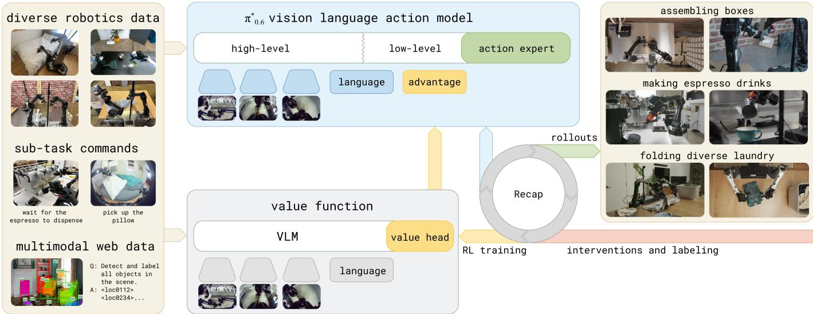
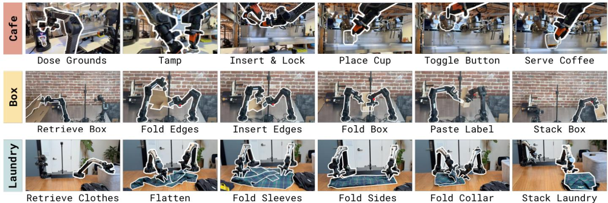

[← 返回 README](../README.md)

# I. Introduction

## 📌 预览
动机：VLA 和人一样需要"练习"才能精通——不仅要从 demo 学，还要从自主执行中纠正错误、提升速度、适应新环境。挑战：如何将 RL 原理落地到大模型 + 异构数据 + 真实世界？

---

It's amazing what you can learn if you're not afraid to try.

Robert A. Heinlein, Have Space Suit–Will Travel

Practice makes perfect: while people are remarkably flexible in acquiring new skills, mastery invariably requires learning from repeated attempts. With general-purpose robotic foundation models, such as vision-language-action (VLA) models, we can flexibly specify tasks for generalist robots through prompts. But just like people, these models will need to practice a skill to achieve mastery. This means leveraging not only on demonstration data, but also autonomously collected experiential data that allows the policy to correct the mistakes that it actually makes in deployment, improve speed and robustness beyond the level of human teleoperation, and adapt to new deployment conditions. The foundations of learning through autonomous practice, as formalized with reinforcement learning (RL) [1], have been known for decades, but instantiating these principles in a general and scalable robotic learning system presents significant challenges: designing scalable and stable RL methods for large models, handling heterogeneous data from different policies, and setting up RL training with reward feedback in the real world, where reward signals might be ambiguous or stochastic.

> 💡 **动机批读**:
> - 核心类比：人也需要"练习"→ VLA 也需要从部署经验中学习
> - 三大挑战非常清晰：(1) 大模型的 scalable RL (2) 异构数据处理 (3) 真实世界的 reward 设计
> - 关键洞察：仅靠 demo 不够，需要 autonomous experience 来纠正"模型实际会犯的错误"

---

In this paper, we present RECAP, a method that enables VLA models to incorporate reward feedback in all stages of the training pipeline, from pre-training all the way to training on data from autonomous execution. RECAP aims to address this problem with a general-purpose recipe that combines demonstrations, autonomous experience, and expert interventions. Starting from the training recipe for a general-purpose VLA and training on diverse data from many different robotic platforms, RECAP first pre-trains the VLA with offline RL, followed by additional training on data collected through deployments. During these deployments, the robot receives (sparse) reward feedback based on the outcome of each trial, and potentially additional expert interventions that correct mistakes. The training process follows an offline RL [2, 3] recipe: we train a value function that evaluates progress toward successful task completion, and then use this value function to estimate the advantage of each action in the dataset. By conditioning the policy on an improvement indicator based on this advantage [4], we can obtain an improved policy. Figure 1 provides a high-level overview of RECAP.

> 💡 **方法总览批读**:
> - RECAP 的完整 pipeline：pretrain with offline RL → deploy → collect data (autonomous + interventions) → retrain
> - 核心机制：value function → advantage estimation → advantage conditioning
> - 关键词 "improvement indicator"：将 advantage 二值化为 positive/negative，作为 policy 的额外输入
> - Reward 是 sparse 的（episode 结果标注），这很实用

*Fig. 1: RECAP enables training VLAs with reward feedback and interventions. Our system starts with a pre-trained VLA that incorporates advantage conditioning, allowing the model to learn effectively from real-world experience. For each task, we deploy the model and collect both autonomous rollouts and online human corrections. We then fine-tune the value function on this online data, improving its estimates of how actions influence performance. Fine-tuning and conditioning the VLA on these updated advantage estimates in turn improves policy behavior.*

> 💡 **Figure 1 批读**:
> - 左：Pre-trained VLA with advantage conditioning（offline RL 预训练阶段）
> - 中：Deploy → collect autonomous rollouts + human corrections
> - 右：Fine-tune value function → update advantage → retrain policy
> - 这是一个 iterative loop，可以重复多次
> - 注意：value function 和 policy 是分开训练的，不是 end-to-end

---

*Fig. 2: Some of the tasks learned by RECAP. π*0.6 trained with RECAP can make espresso drinks, assemble cardboard boxes, and fold diverse and realistic laundry with a high success rate. Each task involves realistic variability – flattened unfolded boxes stick together and bend, making espresso drinks requires pouring liquids, and folding laundry requires generalization to a wide range of clothing items.*

> 💡 **Figure 2 批读**:
> - 三大任务都非常 realistic 且有挑战性：
>   - 浓缩咖啡：需要操作液体、精确控制力
>   - 箱子组装：可变形物体、需要力控制
>   - 叠衣服：需要泛化到各种衣物
> - 这些都是 long-horizon（5-15 分钟）、multi-step 任务

---

We can use RECAP to train policies for complex tasks, such as folding diverse laundry, assembling boxes, or making espresso drinks. We illustrate some of these tasks in Figure 2. The method starts by pre-training the $\pi_{0.6}^{*}$ model with offline RL on a diverse multi-task and multi-robot dataset. $\pi_{0.6}^{*}$ is an adaptation of the $\pi_{0.6}$ model for RL, and $\pi_{0.6}$ is an improvement on $\pi_{0.5}$ [5], adding a larger backbone and more diverse conditioning [6]. $\pi_{0.6}^{*}$ adds the ability to condition on binarized advantage values, which makes it possible to incorporate a value function to improve the policy. After pretraining $\pi_{0.6}^{*}$ finetunes the $\pi_{0.6}^{*}$ model to a downstream task with demonstrations, and then performs one or more iterations of on-robot data collection to improve the model with RL. Training $\pi_{0.6}^{*}$ with RECAP on autonomous experience more than doubles the throughput on some of the hardest tasks, and can decrease failure rates by $2\times$ or more. This enables $\pi_{0.6}^{*}$ to reach practically useful levels of robustness: we were able to run it to make espresso drinks for 13 hours straight, fold novel laundry items in a new home for over two hours without interruptions, and assemble boxes that are used for real packaging in a factory.

> 💡 **模型谱系**:
> - π0.5 → π0.6（更大 backbone + 更多 conditioning）→ π*0.6（+ advantage conditioning for RL）
> - 关键改动很小：π*0.6 只是在 π0.6 基础上加了一个 binarized advantage 输入
> - **实际部署数据**：咖啡连续运行 13 小时、叠衣服 2+ 小时无中断、工厂真实包装箱

---

While RECAP is based on individual algorithmic components that have been explored in prior works, the particular combination of these components is novel, and the results show, for the first time, that a general-purpose reinforcement learning recipe with human reward feedback and interventions can significantly improve both the robustness and throughput of VLA models with experience collected through deployment.

> 💡 **贡献声明批读**:
> - 坦承各个组件不是新的（advantage conditioning, value function, interventions 都有先例）
> - 贡献在于 **组合的新颖性** + **首次在 VLA 上大规模验证** RL 可以显著提升部署性能
> - 这是一篇 system paper + empirical contribution，不是纯 algorithmic novelty

---

## 🔖 Section 总结

### 核心洞察
1. **动机清晰**：VLA 需要"练习"，仅靠 imitation learning 不够
2. **三大数据来源**：demonstrations（基础）、autonomous rollouts（探索+速度）、interventions（纠错）
3. **方法核心**：offline RL + advantage conditioning，简洁且可扩展
4. **实际影响**：throughput 翻倍、failure rate 减半，达到实际可用水平

### 关键数字速查
| 指标 | 数值 |
|------|------|
| 咖啡连续运行 | 13 小时 |
| 叠衣服连续运行 | 2+ 小时（新家、新衣物） |
| Throughput 提升 | 2×+（最难任务） |
| Failure rate 降低 | ~2× |
