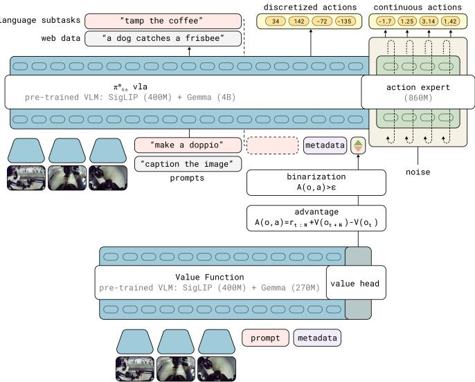
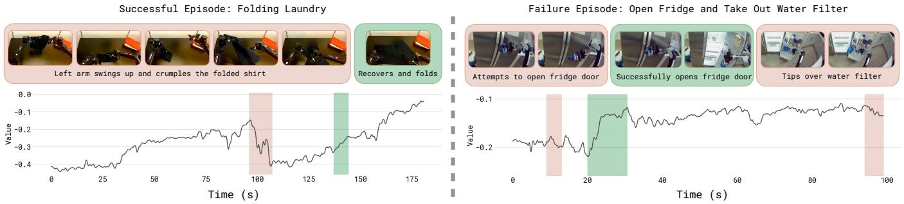

[← 返回 README](../README.md)

# IV. RL with Experience and Corrections via Advantage-conditioned Policies (RECAP)

## 📌 预览
RECAP 方法的三步骤：(1) 数据收集（autonomous rollouts + human interventions） (2) Value function 训练（distributional VF，预测 steps-to-success） (3) Advantage-conditioned policy 训练（二值化 advantage 作为 conditioning）。核心创新在于 policy extraction 用 advantage conditioning 替代 PPO/AWR。

---

Our method consists of the follow steps, which can be repeated one or more times to improve a base VLA model:

1) Data collection. We run the VLA on the task, labeling each episode with task outcome labels (which determine the reward), and optionally providing human interventions to provide examples of corrections for mistakes in the earlier iterations. 2) Value function training. We use all of the data collected so far to train a large, multi-task value function, which we refer to as $V^{\pi_\text{ref}}$, that can detect failures and judge the expected time to task completion. 3) Advantage conditioned training. To improve the VLA policy with this value function, we include an optimality indicator based on advantage values derived from this value function in the VLA prefix. This "advantage conditioned" recipe provides a simple and effective way to extract a more optimal policy from our value function with suboptimal data.

> 💡 **RECAP 三步骤概览**:
> ```
> Step 1: Deploy → Collect data (autonomous + interventions + rewards)
>          ↓
> Step 2: Train Value Function on ALL data so far
>          ↓
> Step 3: Compute advantages → Binarize → Condition VLA → Train
>          ↓
>        (Repeat 1-3 for more iterations)
> ```
> - Value function 是 multi-task 的，可以跨任务共享
> - 数据是 cumulative 的：每轮收集的数据都加入训练集

---

Figure 1 illustrates the overall structure of the training process, while Figure 3 provides more detailed specifics of the value function and policy architectures. Our pre-training phase consists of performing steps (2) and (3) above on our entire pre-training dataset, which consists of tens of thousands of hours of demonstrations from numerous tasks and a variety of different robots. Then, we perform steps (1), (2), and (3) one or more times to further improve the VLA with autonomously collected data. We describe the value function training and policy training steps below, and then present our specific instantiation of this approach for training $\pi_{0.6}^{*}$ in Section V.

> 💡 **Pre-training vs Post-training**:
> - Pre-training：在整个 demo 数据集上做 step 2+3（offline RL），不需要 step 1
> - Post-training：在特定任务上做 step 1+2+3 的迭代
> - 预训练数据量：数万小时，多任务多机器人

---

## A. Distributional value function training

> 💡 **IV-A 要点预览**: 用 distributional value function 预测 return 的分布（201 bins），通过 cross-entropy 训练。为什么用 distributional？因为不同任务长度差异大，distribution 比单点估计更稳定。

To train a value function that can act as a reliable critic for any task in our pre-training or post-training stages, we represent $V^{\pi_\text{ref}}$ with a multi-task distributional value function $p_\phi(V|\mathbf{o}_t, \ell) \in \Delta_B$ [72], mapping the observations $\mathbf{o}_t$ and language command $\ell$ to a distribution over $B$ discretized value bins. In our implementation, this value function uses the same architecture as the VLA policy, but with a smaller VLM backbone. Using $R_t(\tau) = \sum_{t'=t}^{T} r_{t'}$ to denote the empirical return of a trajectory $\tau$ from time step $t$ until the end, we train $p_\phi(V|\mathbf{o}_t, \ell)$ by first discretizing the empirical return value $R_t(\tau)$ into $B = 201$ bins (using $R_t^B$ to denote the discretized returns), and then minimizing the cross-entropy $H$ over the trajectories in the current dataset $\mathcal{D}$:

$$\min_\phi \mathbb{E}_{\tau \in \mathcal{D}} \left[ \sum_{\mathbf{o}_t \in \tau} H(R_t^B(\tau), p_\phi(V|\mathbf{o}_t, \ell)) \right].$$

> 💡 **Eq. 1 批读**:
> - 这是 Monte Carlo value estimation：用实际 return $R_t(\tau)$ 作为 target
> - Distributional：不预测一个数，而是预测 201 个 bin 的分布（C51 风格 [72]）
> - Cross-entropy loss：标准的分类问题
> - 简单但有效：不需要 TD learning、不需要 Q-function、不需要 off-policy correction

---

This is a Monte Carlo estimator for the value function of the policy represented by the dataset $\mathcal{D}$ (i.e., the behavior policy $\pi_\text{ref}$). We can extract a continuous value function (and thus an advantage) from the learned value distribution using $V^{\pi_\text{ref}}(o_t, \ell) = \sum_{b \in [0,B]} p_\phi(V=b|\mathbf{o}_t) v(b)$, where $v(b)$ denotes the value corresponding to bin $b$. During the pre-training phase, the dataset $\mathcal{D}$ corresponds to the human demonstrations, and the value function captures the expected return for the task and metadata we condition on, while on subsequent iterations, it skews toward a weighted combination of the return of the demonstrations and the learned policy.

While this on-policy estimator is less optimal than a more classic off-policy Q-function estimator, we found it to be simple and highly reliable, while still allowing for substantial improvement over imitation learning. Our method could be extended to accommodate off-policy estimators in future work.

> 💡 **设计选择的 trade-off**:
> - Monte Carlo VF（on-policy）vs Q-function（off-policy）
> - 选择 MC 的原因：简单、稳定、可靠
> - 代价：不如 off-policy Q-learning 数据效率高
> - 但在大规模预训练 + 迭代收集的 setting 下，数据量不是瓶颈

---

## B. Policy extraction via advantage conditioning

> 💡 **IV-B 要点预览**: 给定 value function，如何训练更好的 policy？RECAP 用 advantage conditioning：把 advantage 二值化（positive/negative），作为额外输入条件。训练时同时有 conditioned 和 unconditioned 两个目标，inference 时只用 conditioned（I=True）。

Once we have the value function $V^{\pi_\text{ref}}$, we need a way to train an improved policy using this value function. This is called policy extraction. An effective policy extraction method in our setting needs to satisfy several criteria. First, it needs to effectively utilize diverse off-policy data, comprising the initial demonstrations, the expert interventions, and autonomous episodes from both the latest policy and older policies. This is closely related to the challenge faced by offline RL methods [2, 3]. Second, it needs to be scalable and easily to apply to large VLA models, including models that use flow matching or diffusion to generate actions. Third, it needs to effectively utilize both good (near-optimal) and bad (suboptimal) data, which is important if we want to improve the policy using autonomous experience.

> 💡 **Policy extraction 的三个需求**:
> 1. **利用 off-policy 数据**：demo + interventions + 各版本 policy 的数据都要用上
> 2. **Scalable to flow matching**：不能依赖 log-likelihood（flow matching 没有）
> 3. **利用好数据和差数据**：差数据也有信息价值（告诉你什么不该做）


*Fig. 3: Interaction between the π*0.6 VLA and value function during RECAP training. The π*0.6 VLA uses a pre-trained VLM backbone. Training follows the KI recipe [73], with next-token prediction on many data sources in pre-training, and a flow-matching action-expert with stop gradient. The VLA is conditioned on a binarized advantage indicator, obtained from a separate value function initialized from a pre-trained but smaller VLM model.*

> 💡 **Figure 3 批读**:
> - **左侧 VLA**: VLM backbone (Gemma 3 4B) + Action Expert (860M, flow matching)
> - **右侧 Value Function**: 更小的 VLM backbone (670M) + distributional output (201 bins)
> - **关键交互**: VF 输出 advantage → 二值化 → 作为 text token 输入 VLA ("Advantage: positive/negative")
> - **KI recipe**: VLM 和 action expert 之间有 stop gradient，防止 flow matching loss 影响 VLM
> - Value function 是独立训练的，不和 policy 端到端优化

---

Among the existing methods for policy extraction, policy gradient methods (including regularized policy gradients and reparameterized gradients) are perhaps the most widely used [66, 74], but these methods are difficult to apply to flow matching models, which do not readily provide a tractable log-likelihood, making them hard to scale up to modern VLA architectures (see comparisons in Section VI). An alternative is to use weighted regression methods, such as AWR [68, 75, 76], which implicitly provide for regularization to the behavior policy and use a simple (importance-weighted) supervised learning objective. However, these methods discard or significantly downweight a significant portion of the data, effectively implementing a kind of filtered imitation technique. Instead, we use a variant of advantage conditioning [48], where the policy is trained on all of the data with supervised learning, but with an additional input indicating how optimal the action is based on the advantage. This is closely related to a variety of methods in the literature that propose to condition the policy on some function of the resulting trajectory [47, 50].

> 💡 **三种 policy extraction 方法对比**:
> | 方法 | 优点 | 缺点 |
> |------|------|------|
> | Policy gradient (PPO) | 理论完备 | 需要 log-likelihood，对 flow matching 不友好 |
> | Weighted regression (AWR) | 简单 | 丢弃大量数据，浪费信息 |
> | **Advantage conditioning** | 用所有数据、不需要 likelihood | 需要好的 VF |
>
> RECAP 选择 advantage conditioning：最适合 flow matching VLA

---

The specific formulation in our method is most closely related to CFGRL [4]. Building on the formulation in Section III, we can apply Bayes rule to rewrite the probability of policy improvement as $p(I|A^{\pi_\text{ref}}(\mathbf{o}, \mathbf{a})) = \pi_\text{ref}(\mathbf{a}|I, \mathbf{o}) / \pi_\text{ref}(\mathbf{a}|\mathbf{o})$. Applying this to our setting and including language conditioning, we can obtain an alternative closed form for the improved regularized policy described in Section III as

$$\hat{\pi}(\mathbf{a}, |\mathbf{o}, \ell) \propto \pi_\text{ref}(\mathbf{a}|\mathbf{o}, \ell) \left(\frac{\pi_\text{ref}(\mathbf{a}|I, \mathbf{o}, \ell)}{\pi_\text{ref}(\mathbf{a}|\mathbf{o}, \ell)}\right)^\beta.$$

For the special case $\beta = 1$, $\hat{\pi}(\mathbf{a}, |\mathbf{o}, \ell) = \pi_\text{ref}(\mathbf{a}|I, \mathbf{o}, \ell)$.

> 💡 **Eq. 2 批读（核心公式！）**:
> - 通过 Bayes rule，把 improvement probability 转化为 conditional/unconditional policy 的比值
> - **当 β=1 时**：improved policy = conditioned policy $\pi(a|I,o,\ell)$
> - 这意味着：只要训练一个能 condition on I 的 policy，inference 时直接设 I=True 就行！
> - **当 β>1 时**：更 aggressive 的改进，可以用 classifier-free guidance (CFG) 实现
> - 这就是 advantage conditioning 的精髓：把 RL 问题转化为 conditional generation

---

We can therefore represent $\hat{\pi}$ without needing to explicitly represent the improvement probability $p(I|A^{\pi_\text{ref}}(\mathbf{o}, \mathbf{a}))$, if we train the policy so that it can represent both $\pi_\text{ref}(\mathbf{a}|\mathbf{o}, \ell)$ and $\pi_\text{ref}(\mathbf{a}|I, \mathbf{o}, \ell)$. This principle is similar to the approach in classifier-free guidance, where a diffusion model is trained to model the data both with and without a conditioning variable [4]. We assume the improvement indicator $I$ follows a delta distribution

$$p(I|A^{\pi_\text{ref}}(o, a, \ell)) = \delta(A^{\pi_\text{ref}}(o, a, \ell) > \epsilon_\ell),$$

with a task dependent improvement threshold $\epsilon_\ell$. This threshold allows us to control the optimality indicator, and minimizes the need for finding an attenuation factor $\beta$ to sharpen the improvement conditioned distribution after training. The policy objective then corresponds to minimizing the following negative log-likelihood:

$$\min_\theta \mathbb{E}_{\mathcal{D}_{\pi_\text{ref}}} \Big[ -\log \pi_\theta(\mathbf{a}_t | \mathbf{o}_t, \ell) - \alpha \log \pi_\theta(\mathbf{a}_t | I_t, \mathbf{o}_t, \ell) \Big],$$
$$\text{where } I_t = \mathbb{1}(A^{\pi_\text{ref}}(\mathbf{o}_t, \mathbf{a}_t, \ell) > \epsilon_\ell).$$

> 💡 **Eq. 3 批读（训练目标！）**:
> - 两个 loss 的加权和：
>   1. **Unconditional**: $-\log \pi_\theta(a|o,\ell)$ → 学习整体数据分布
>   2. **Conditional**: $-\alpha \log \pi_\theta(a|I,o,\ell)$ → 学习"好动作"的分布
> - $I_t$ 是二值的：advantage > threshold → positive，否则 negative
> - $\epsilon_\ell$ 是 per-task 的阈值，控制多少数据被标记为 "positive"
> - **关键设计**：human corrections 强制设 $I_t$ = True（假设人类干预总是好的）
> - 实践中 $\alpha$ 通过 dropout 替代：30% 概率丢弃 conditioning


*Fig. 4: Visualization of the value functions. We train a multi-task value function to predict the number of steps to success, normalized by maximum task length to (-1, 0), where 0 corresponds to successful completion. We visualize the value function output on a folding task that finished successfully (left), and an unsuccessful example of a manipulation task from the pre-training dataset (right). The red parts highlight a drop in value, and green parts highlight increases; images on top show the corresponding frames of the episode.*

> 💡 **Figure 4 批读**:
> - **左（成功）**: Value 稳步上升（绿色），接近 0 = 成功完成
> - **右（失败）**: Value 先升后降（红色 = 检测到错误），最终大幅下降
> - VF 能有效识别："进展顺利" vs "出错了"
> - 值域 (-1, 0)：-1 = 刚开始/失败，0 = 成功完成

---

The advantage values $A^{\pi_\text{ref}}(\mathbf{o}_t, \mathbf{a}_t, \ell)$ are obtained from the value function in the previous section, and $\alpha$ is a tradeoff hyperparameter. In practice, the dataset $\mathcal{D}_{\pi_\text{ref}}$ consists of all of the data collected so far, including all demonstrations and autonomous task attempts, and the reference policy $\pi_\text{ref}$ is therefore a mixture of human behavior and previously deployed policies. To include human corrections, we found it useful to force $I_t =$ True (i.e., positive) for actions provided as human corrections during autonomous rollouts. This choice is reasonable if we assume that human experts always provide good corrective actions. As we will discuss in Section V, in practice our VLA model produces both discrete and continuous outputs, with the continuous distribution represented via flow matching. Therefore, the real training objective combines likelihoods for the discrete values with the flow matching objective for the continuous values.

In practice, we pre-train one model to represent $\pi_\theta(\mathbf{a}_t | I_t, \mathbf{o}_t, \ell)$ on our entire pre-training dataset, and then perform one or more iterations of our method with on-policy rollouts (and, optionally, expert corrective interventions) for each task.

> 💡 **实践要点**:
> - 数据集 $\mathcal{D}$ 是 heterogeneous 的：human demo + autonomous + interventions
> - Human corrections → 强制 I=True（合理假设：人类纠错总是对的）
> - 预训练阶段就已经包含 advantage conditioning，不是从 scratch

---

## C. Method summary

We provide an overview of our full method in Algorithm 1. As summarized at the beginning of this section, the method can be fully defined through application of three subroutines: collecting data through autonomous rollouts (with optional corrective interventions from an expert), training a value function according to Equation 1, and training a policy according to Equation 3. The only thing that changes between different steps of the method is the data provided to each subroutine: the pre-training stage uses all prior demonstration data, and the training process for the specialists for each skill $\ell^{(i)}$ uses additional autonomous data. In practice, the specialists are fine-tuned from the pre-trained model, while the final generalist is trained from scratch. Additional details on the method are provided in Appendix F.

> 💡 **Algorithm 1 批读**:
> ```
> Pre-training:
>   1. Train V_pre on D_demo (Eq. 1)
>   2. Train π_pre on D_demo (Eq. 3) with V_pre
>
> Post-training (per task ℓ):
>   3. Init D with task demos
>   4. Train V_0 from V_pre on D
>   5. Train π_0 from π_pre on D (SFT: I=True for all demos)
>   6. For k=1 to K:
>      - Collect data with π_{k-1}, add to D
>      - Train V_k from V_pre on D
>      - Train π_k from π_pre on D with V_k
> ```
> - 注意：每轮都从 pre-trained checkpoint 微调，不从上一轮的 model 继续
> - Specialist 从 pretrained 微调；但最终 generalist 从 scratch 训练

---

## 🔖 Section 总结

### 关键数字速查
| 参数 | 值 |
|------|------|
| Value bins (B) | 201 |
| Advantage threshold percentile | 30% (pre-train) / 40% (fine-tune) |
| Conditioning dropout | 30% |
| Default β | 1 (inference) |

### 核心洞察
1. **Advantage conditioning 是关键创新**：把 RL policy extraction 转化为 conditional supervised learning
2. **Distributional VF 简洁有效**：Monte Carlo + 201 bins，不需要 TD/Q-learning
3. **数据利用最大化**：好数据和差数据都用（conditioning 区分），不像 AWR 丢弃差数据
4. **CFG 提供推理时额外提升**：β>1 可以进一步 sharpen policy
