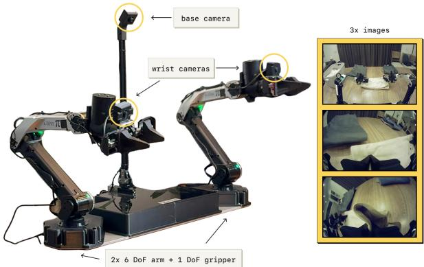

[← 返回 README](../README.md)

# V. Implementation, Model, and System Details

## 📌 预览
π*0.6 的具体实现：基于 π0.6（Gemma 3 4B backbone + 860M action expert），通过加入 advantage indicator text token 变成 π*0.6。Value function 用 670M 的小 VLM。Reward 定义为 steps-to-success（sparse，episode-level）。训练流程：pretrain → SFT on task demos (I=True) → iterative RL with on-robot data。

---

We instantiate RECAP with a VLA that we call π*0.6. π*0.6 is based on the $\pi_{0.6}$ VLA, which is an evolution of the $\pi_{0.5}$ VLA [5] with a few improvements that we detail in the accompanying model card [6]. $\pi_{0.6}^{*}$ additionally adds the ability condition on the binarized advantage indicator $I_t$, making it suitable for RL training with RECAP. The model architecture is illustrated in Figure 3. We train a value function alongside the VLA, following the method described in Section IV-A. This value function is also initialized from a VLM. Training this value function and VLA with RECAP results in our final model, which we call $\pi_{0.6}^{*}$. In this section, we first elaborate on the design of our model and how it can be extended to use advantage values from the value function, then describe the reward function and value function, and then elaborate on the training and data collection process in our implementation.

> 💡 **模型谱系整理**:
> - π0.5 → π0.6 → π*0.6
> - π0.6 的改进：(i) 更多 robot 数据 (ii) Gemma 3 4B backbone (iii) 860M action expert
> - π*0.6 的改进：加了 advantage indicator conditioning

---

## A. The π0.6 model

The $\pi_{0.6}$ model [6] is derived from the $\pi_{0.5}$ model, which can flexibly represent chunked action distributions via flow matching and produce intermediate text for high-level policy reasoning. It uses the Knowledge Insulation (KI) training procedure [73], which trains the entire model end-to-end on continuous actions and discretized tokens (including actions discretized via FAST [77]), while using a stop gradient to prevent the flow-matching action expert from impacting the rest of the model. Pre-training uses both robot data and vision-language co-training data from the web.

$\pi_{0.6}$ improves on $\pi_{0.5}$ in several ways: (i) The pre-training dataset is augmented with additional data from multiple robot platforms. (ii) The base VLM is Gemma 3 [78] 4B model. (iii) The size of the action expert is increased to 860M parameters.

> 💡 **π0.6 架构要点**:
> - **KI (Knowledge Insulation)**: VLM + action expert 联合训练，但 action expert 用 stop gradient 隔离
> - **双重 action 表示**: 连续 (flow matching) + 离散 (FAST tokenizer) → 独立预测
> - **输出顺序**: sub-task text $\hat{\ell}$ → discretized actions → continuous actions
> - Action expert 860M 参数，单独用 flow matching 训练

---

The model can be written as $\pi_\theta(\mathbf{a}_{t:t+H}, \hat{\ell} | \mathbf{o}_t, \ell)$, where $\mathbf{o}_t = [\mathbf{X}_t^1, ..., \mathbf{X}_t^n, \mathbf{q}_t]$ contains camera images $\mathbf{X}$, the robot's configuration q, and $\ell = \ell_t + s$ is the language input consisting of the overall task prompt $\ell_t$ (e.g., "make me an espresso"), as well as additional language inputs $s$ providing metadata that further modulates how the task is performed. The model produces action chunks $\mathbf{a}_{t:t+H}$, which consists of joint angles and gripper commands at 50 Hz, using a separate "action expert" — a dedicated set of weights (860M parameters) that are trained with flow matching specifically for action generation, but can attend to the activations in the rest of the model. The model also produces tokenized discrete outputs $\hat{\ell}_+$, which includes a textual representation of the next predicted sub-task (such as "pick up the coffee cup") used for high-level decision-making. Since the actions are generated after $\hat{\ell}$, action generation is effectively conditioned on this predicted sub-task, providing high-level guidance. At inference time, the sub-task prediction runs at a lower frequency than action generation. During training, the model also predicts a tokenized representation of the action chunk $\mathbf{a}_{t:t+H}$, using the FAST tokenizer [77], as part of the KI recipe [73]. We denote these discretized actions $a_{t:t+H}^\ell$. The action expert does not receive these as input, such that discrete and continuous actions are predicted independently. This results in the final training log-likelihood $\log \pi_\theta(\mathbf{a}_{t:t+H}, a_{t:t+H}^\ell, \hat{\ell} | \mathbf{o}_t, \ell)$. Since we predict $\hat{\ell}$ first, we can factorize this log-likelihood according to:

$$\log \pi_\theta(\mathbf{a}_{t:t+H}, a_{t:t+H}^\ell, \hat{\ell} | \mathbf{o}_t, \ell) = \log \pi_\theta(\hat{\ell} | \mathbf{o}_t, \ell) + \log \pi_\theta(a_{t:t+H}^\ell | \mathbf{o}_t, \ell, \hat{\ell}) + \log \pi_\theta(\mathbf{a}_{t:t+H} | \mathbf{o}_t, \ell, \hat{\ell}).$$

> 💡 **Eq. 4 批读（模型输出分解）**:
> ```
> 输入: images + proprioception + language prompt + metadata
>   ↓
> 输出 1: sub-task text ℓ̂ (autoregressive, cross-entropy)
>   ↓
> 输出 2: discretized actions a^ℓ (autoregressive, cross-entropy, FAST tokens)
>   ↓
> 输出 3: continuous actions a (flow matching, action expert 860M)
> ```
> - 三个输出独立：sub-task → discrete actions → continuous actions
> - Action expert 可以 attend to VLM activations，但 stop gradient 防止反向传播
> - 50 Hz action chunks：高频控制

---

## B. From π0.6 to π*0.6 with advantage conditioning

To incorporate information about the advantage into the policy, we expand the model inputs to contain an additional improvement indicator as an additional text input, inputting "Advantage: positive" when $I_t =$ True, and "Advantage: negative" otherwise. The VLA model is otherwise the same as described in Section V-A. The advantage indicator appears in the training sequence after $\hat{\ell}$ but before the (discretized and continuous) actions, such that only the action log-likelihoods are affected. The continuous part of the log-likelihood cannot be evaluated exactly, and instead is trained via the flow matching loss [79]. It is possible to draw a close parallel between flow matching and diffusion (under some assumptions), and the latter in turn can be interpreted as a lower bound on the log-likelihood [80], so we can roughly motivate the sum of the log-likelihood of the discrete actions and the flow matching loss on the continuous actions as a lower bound on the overall action likelihood:

$$\log \pi_\theta(\mathbf{a}_{t:t+H}, a_{t:t+H}^\ell | I_t, \mathbf{o}_t, \ell, \hat{\ell}) \geq \mathbb{E}_{\eta, \omega} \Big[ \log p_\theta(a_{t:t+H}^\ell | I_t, \mathbf{o}_t, \ell, \hat{\ell}) - \alpha_\eta \| \omega - \mathbf{a}_{t:t+H} - f_\theta(\mathbf{a}_{t:t+H}^{\eta,\omega}, I_t, \mathbf{o}_t, \ell, \hat{\ell}) \|^2 \Big],$$

with $\mathbf{a}_{t:t+H}^{\eta,\omega} = \eta \mathbf{a}_{t:t+H} + (1-\eta)\omega$, $\omega \sim \mathcal{N}(0, \mathbf{I})$ denoting noise, time index $\eta \in [0,1]$, and $f_\theta$ denotes the continuous outputs of the diffusion expert. $\alpha_\eta$ is a loss weighting term (which can optionally be noise dependent). Full details for the loss are provided in Appendix C.

> 💡 **Eq. 5 批读（实际训练 loss）**:
> - **Advantage 如何注入**: 就是一个 text token "Advantage: positive/negative"，放在 sub-task 之后、actions 之前
> - **实际 loss = discrete CE + flow matching MSE**（两者的 lower bound）
> - Flow matching loss：$\|\omega - a - f_\theta(\text{noisy}_a)\|^2$ 就是标准的 denoising 目标
> - 只有 action 部分受 advantage conditioning 影响（sub-task text 不受影响）

---

During training, we randomly omit the indicator $I_t$ instead of tuning the loss multiplier $\alpha$ to allow us to either directly sample from the policy with $I_t =$ True (which corresponds to setting $\beta = 1$ in Equation (2)), or to use both a conditional and unconditional model to implement classifier-free guidance (CFG), which enables inference with $\beta > 1$. See Appendix E for details.

> 💡 **CFG dropout 设计**:
> - 30% 概率丢弃 conditioning → 同时学习 conditional 和 unconditional 分布
> - Inference 时可选：β=1（直接用 conditional）或 β>1（CFG = conditional + unconditional 的加权）
> - 这和 image generation 中的 CFG 完全一样的思路！

---

## C. Reward definition and value function training

Since our aim is to develop a general and broadly applicable method for training VLAs from experience, we use a general sparse reward definition that can be applied to essentially any task. For each episode, we obtain a label indicating whether that episode was successful. We derive the reward from this episode-level success label such that the value function corresponds to the (negative) number of steps until successful completion of the episode. This is equivalent to the following reward function, where $T$ corresponds to the last step in the episode, and $C_\text{fail}$ is a large constant that is chosen so as to ensure that failed episodes have low values:

$$r_t = \begin{cases} 0 & \text{if t=T and success} \\ -C_\text{fail} & \text{if t=T and failure} \\ -1 & \text{otherwise.} \end{cases}$$

> 💡 **Eq. 6 批读（Reward 设计）**:
> - 极其简洁的 reward：每步 -1（鼓励快速完成），成功 +0，失败 -C_fail
> - Value function 的含义：-(剩余步数)（成功 episode）或很负的值（失败 episode）
> - 这同时编码了**速度**和**成功率**两个目标
> - 值归一化到 (-1, 0)：跨任务可比

---

With this reward function, we train the value function to predict the (negative of the) number of remaining steps until success for successful episodes, and a large negative value for failed episodes. In practice, we normalize the values predicted to be between $(-1, 0)$. Since we train on diverse tasks that have very different typical lengths, we normalize the values per task based on the maximum episode length of the task.

The value function takes as input the same language inputs as the $\pi_{0.6}^{*}$ VLA, and uses the same architecture design, with a smaller 670M parameter VLM backbone that is also initialized from Gemma 3 (see Figure 3). To prevent overfitting, we also co-train the value function on a small mixture of multi-modal web data. Figure 4 show visualizations of the value function on some examples of successful and failure episodes, with additional visualizations in Figure 13 in Appendix B.

> 💡 **Value function 细节**:
> | 参数 | 值 |
> |------|------|
> | VLM backbone | Gemma 3, 670M |
> | 输出 | 201 bins distributional |
> | 值域 | (-1, 0)，per-task 归一化 |
> | Co-training | + web multi-modal data（防过拟合）|
> | 输入 | 和 VLA 相同（images + proprioception + language） |

---

## D. Pre-training, data collection, and learning from experience

The data mixture used in the pre-training phase of our model largely follows the recipe used by $\pi_{0.5}$ [5], with vision-language data from the web, prediction of subtasks $\hat{\ell}$, and prediction of low-level actions on a variety of tasks from many different robots. We note that, after pre-training, $\pi_{0.6}^{*}$ can perform many more tasks than the ones used in evaluation in Section VI. During pre-training, we first train the value function on the same dataset, predicting (the negative of) the number of steps to successful completion of each task. Then we estimate the per-task improvement threshold, $\epsilon_\ell$, used in determining the advantage-based improvement indicator $I_t$. We set $\epsilon_\ell$ to the 30% percentile of values predicted by the value function for the task ℓ. We then run the value function on-the-fly during VLA training to estimate $A^{\pi_\text{ref}}(\mathbf{o}_t, \mathbf{a}_t, \ell)$ for each example, and then use it to compute $I_t$ based on $\epsilon_\ell$. $I_t$ is included as an input to $\pi_{0.6}^{*}$ as described in Section V-A. As we use a relatively small VLM backbone (670M) for the value function, on-the-fly inference of the value function incurs minimal additional cost during VLA training.

> 💡 **Pre-training 流程**:
> 1. Train VF on full demo dataset
> 2. Estimate per-task threshold $\epsilon_\ell$ = 30th percentile of VF predictions
> 3. Run VF on-the-fly during VLA training → compute advantages → compute $I_t$
> 4. Train VLA with advantage conditioning
> - VF 在训练时是 on-the-fly inference，670M 模型开销小

---

After pre-training we start a policy improvement loop for the target task. We first finetune $\pi_{0.6}^{*}$ with demonstration data $\mathcal{D}_\ell$ for the target task ℓ. We fix the indicator $I_t$ to True in this stage, which we found to lead to slightly better results, such that this stage corresponds to supervised finetuning (SFT). This results in the initial policy $\pi_\ell^0$, which is then used to collect additional data that is added to $\mathcal{D}_\ell$. While some of the episodes are collected fully autonomously, some are monitored by an expert teleoperator who can intervene to provide corrections. These corrections can show the policy how to avoid catastrophic failures or how to recover from mistakes. Note, however, that the corrections alone are unlikely to fix all issues: intervening during autonomous execution is a disruptive event, and even expert human operators cannot guarantee a consistent quality of interventions nor improve subtle aspects of the behavior, such as overall speed. Thus, the corrections serve more to fix large mistakes and overcome challenges with exploration, and do not by themselves provide for optimal supervision, in contrast to theory [7]. Recall from Section IV-B that we force $I_t =$ True for all corrections, but otherwise the entire episode (both the autonomous parts and the corrections) are optionally added to the dataset $\mathcal{D}_\ell$ regardless of whether or not a correction was provided.

> 💡 **Post-training 流程**:
> 1. SFT：在 task demos 上微调，I=True（纯 imitation learning）
> 2. Deploy：收集 autonomous rollouts + expert interventions
>    - Interventions 的局限：disruptive、质量不保证、不能改善速度
>    - Interventions 的价值：纠正大错误、帮助 exploration
> 3. Retrain：VF → advantages → VLA with conditioning


*Fig. 5: The robot setup used in our experiments. π*0.6 is trained on data from many different robots in pre-training. For the iterative improvement experiments, we use a static bimanual system with two 6 DoF arms with parallel jaw grippers. The arms are controlled at 50 Hz with joint positions. Observations consist of joint and gripper positions, as well as images from three cameras: a base camera mounted between the arms, and a wrist-mounted camera on each arm. The setup can be mounted flexibly, e.g. on a table.*

> 💡 **Figure 5 批读**:
> - 双臂系统：2× 6DoF + parallel jaw grippers
> - 3 cameras：1 base (中间) + 2 wrist
> - 50 Hz joint position control
> - 可灵活安装（桌面等）

---

After data collection, we finetune the value function on all of the data collected for the task so far, and then use it to finetune the policy with updated indicators $I_t$, using the same procedure as in pre-training. Both the value function and policy are finetuned from the pre-trained checkpoint, rather than the policy and value function from the last iteration. We found this to be useful for avoiding drift over multiple iterations, though it may be possible to also obtain good results by consistently finetuning from the last model.

We can repeat this process for several iterations as needed, though in practice we found that even one iteration often leads to significantly improved results.

> 💡 **重要实践细节**:
> - 每轮都从 pre-trained checkpoint 微调（不是从上一轮继续）→ 避免 drift
> - 一轮迭代通常就够了（但实验做了 2 轮）

---

## 🔖 Section 总结

### 关键数字速查
| 参数 | 值 |
|------|------|
| VLA backbone | Gemma 3 4B |
| Action expert | 860M params |
| VF backbone | Gemma 3 670M |
| Control frequency | 50 Hz |
| Cameras | 3 (1 base + 2 wrist) |
| Robot arms | 2× 6DoF |
| Value bins | 201 |
| Value range | (-1, 0) normalized |

### 核心洞察
1. **Advantage conditioning 实现极简**：就是一个 text token "Advantage: positive/negative"
2. **Reward 设计通用**：steps-to-success + failure penalty，适用于任何任务
3. **VF 开销小**：670M backbone，on-the-fly inference during training
4. **从 pretrained checkpoint 重新微调**：避免 iterative drift
