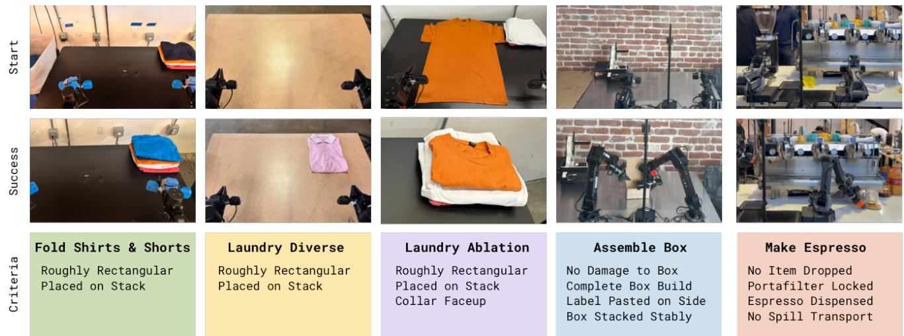
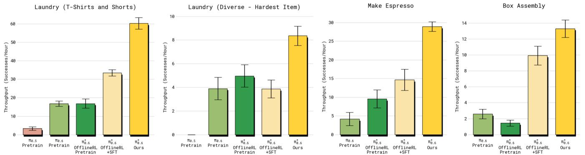
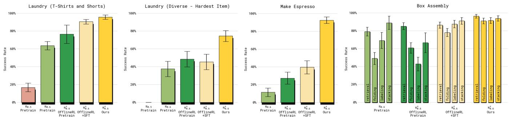
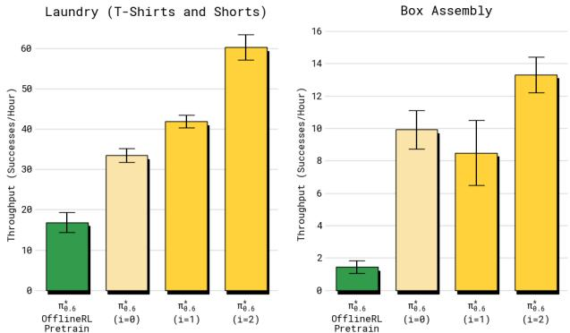
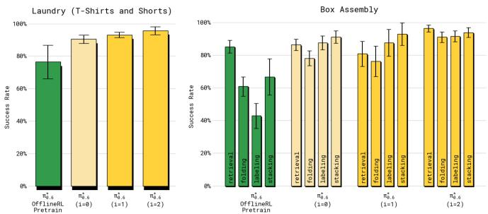
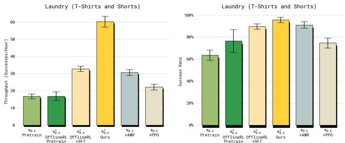
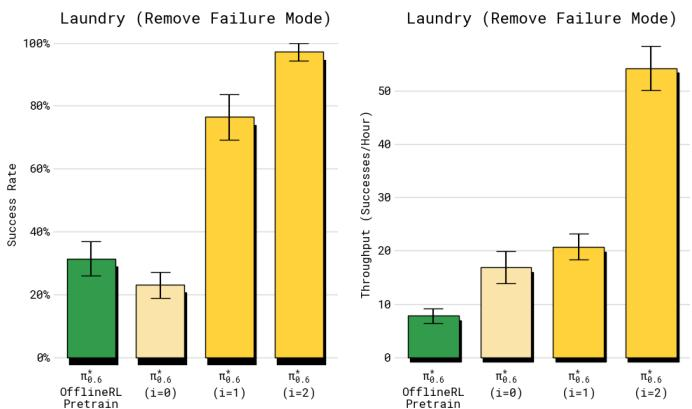

[← 返回 README](../README.md)

# VI. Experimental Evaluation

## 📌 预览
在三大任务（叠衣服、做咖啡、装箱子）上评估 RECAP。核心指标：throughput（成功次数/小时）和 success rate。RECAP 在最难任务上 throughput 翻倍、failure rate 减半。Advantage conditioning 显著优于 AWR 和 PPO。

---

In our experimental evaluation, we use RECAP to train the $\pi_{0.6}$ model on a set of realistic tasks: making espresso drinks, folding diverse laundry, and assembling boxes. Each task requires multiple steps, ranging from 5 to 15 minutes in duration, complex manipulation behaviors (constrained forceful manipulation, pouring liquids, manipulating cloth and cardboard, etc.), and fast execution to provide for high throughput. We illustrate the robotic platform used in our experiments in Figure 5. We give details on the tasks and baselines below, followed by quantitative experiments.


*Fig. 6: Illustrations of the tasks used in our experiments. Tasks include three different laundry variants, assembling boxes, and making coffee drinks with an espresso machine.*

> 💡 **Figure 6 批读**:
> - 5 个任务变体：laundry (T-shirts & shorts)、laundry (diverse)、laundry (failure removal)、box assembly、cafe (espresso)
> - 每个任务都有独特挑战：布料操作、液体倒注、纸板折叠等

---

## A. Evaluation Tasks

> 💡 **VI-A 要点预览**: 三大类任务（5 个变体），难度从简单叠衣到复杂咖啡制作。每个任务有明确的 success criteria 和时间限制。

**Laundry (t-shirts and shorts).** This is the standard laundry folding task in the $\pi_0$ paper [81]. This task entails retrieving either a T-shirt or shorts from a basket with variable initial conditions, flattening, folding. Success requires one clothing item to be folded and stacked in the top right corner of the table within 200 seconds.

**Laundry (diverse items).** The diverse laundry task requires folding a much larger variety of items, considering 11 item types, including towels, button-up shirts, sweaters, jeans, T-shirts, shorts, polos, skirts, long sleeve shirts, socks, and underwear. To obtain a low-variance metric in our experiments, we measure performance on one of the most challenging items – the button-up shirt. However, the policy is trained on all items, and the accompanying videos show results for a variety of clothing. Success is defined as having the target item correctly folded and placed on a stack on the table within 500 seconds.

**Laundry (targeted failure removal).** The final version of the laundry folding task considers a much more structured setup for use in our ablation experiments, in which the task involves folding a single orange T-shirt from a fixed flattened initial condition. We place the highest emphasis on success, with a strict success criteria that requires the shirt to be folded correctly with the collar always facing up within 200 seconds. We found this task to be useful for assessing whether RECAP can remove specific undesirable behaviors via RL (in this case, placing the collar facing down rather than up).

**Cafe (double shot espresso).** We evaluate our policies on the challenging long-horizon task of making coffee with a commercial espresso machine. While our cafe policy can make many drinks (lattes, iced Americanos, espresso, etc), and even clean the espresso machine with a towel, for the purposes of our quantitative experiments we focus on the double espresso shot task. This entails picking up the portafilter, placing it on the grinder and grinding beans into it, tamping the ground coffee beans, locking the portafilter into the espresso machine, bringing over the cup, extracting the full shot of espresso, then serving. Success is measured as completing all steps within 200 seconds without critical mistakes (such as dropping the portafilter or spilling the coffee).

**Box assembly.** We evaluate our policy on the problem of assembling packaging boxes in a real-world factory deployment scenario. Box assembly involves folding a cardboard box starting from a flattened cardboard sheet, attaching a label onto it and placing the box in the appropriate spot in a crate. For the purposes of the quantitative experiments, we focus on all portions of the task and count overall success as going from a flattened to an assembled and stacked box in under 600 seconds.

> 💡 **任务总结表**:
> | 任务 | 时间限制 | 物体类型 | 核心挑战 |
> |------|---------|---------|---------|
> | Laundry (simple) | 200s | T-shirt/shorts | 变化初始条件 |
> | Laundry (diverse) | 500s | 11 种衣物 | 泛化到不同衣物 |
> | Laundry (failure removal) | 200s | 固定 T-shirt | 严格 success criteria |
> | Cafe (espresso) | 200s | 咖啡器具+液体 | Long-horizon、精确操作 |
> | Box assembly | 600s | 纸板箱+标签 | 可变形物体、工厂部署 |

---

## B. Comparisons and Ablations

We compare RECAP to several baselines:

**Pre-trained π0.5 [5].** This baseline does not use RL and does not leverage RECAP.

**Pre-trained π0.6 [6].** It does not include the advantage indicator $I_t$, and is pre-trained with supervised learning.

**RL pre-trained π*0.6.** It is pre-trained with RL alongside its value function, and includes an advantage indicator $I_t$ as described in Section V-D.

**π*0.6 offline RL + SFT.** This model is trained by finetuning the base $\pi_{0.6}^{*}$ pre-trained checkpoint with demonstration data for the target task. We refer to this finetuning as "SFT" because the advantage values are fixed to True for all demonstrations. We find that this combination of the offline RL pre-trained $\pi_{0.6}^{*}$ model with high-quality SFT outperforms standard SFT (without offline RL pre-training), and provides a good starting point for RL with on-robot data.

**π*0.6 (ours).** This is the final model trained with RECAP on the target task, including both autonomous rollouts and expert corrections. By default we evaluate with $\beta = 1$. In some experiments we also consider inference with CFG, which corresponds to $\beta > 1$.

> 💡 **Baseline 递进关系**:
> ```
> π0.5 (SL only)
>   → π0.6 (SL, better backbone)
>     → π*0.6 RL pretrained (+ advantage conditioning in pretraining)
>       → π*0.6 offline RL + SFT (+ task-specific SFT)
>         → π*0.6 (Ours) (+ on-robot RL with RECAP)
> ```
> 每一步都有增量改进，ablation 清晰

---

We also consider two alternative policy extraction methods in the literature as comparisons for our advantage-conditioned approach, both of which use the same on-robot data as RECAP but a different policy learning method:

**AWR.** Starting from the same pre-trained model $\pi_{0.6}$ (without advantage conditioning) we fine-tune using advantage weighted regression [68], based on advantages extracted from our value-function.

**PPO.** We implement a variant of DPPO/FPO [23, 82] in which we calculate likelihoods based on the single step diffusion objective and use an alternative definition of the PPO constraint following SPO [83] (see Appendix D for details).

> 💡 **Policy extraction 对比设置**:
> - 控制变量：相同数据、相同 VF，只换 policy extraction 方法
> - AWR：从 π0.6（无 advantage conditioning）开始微调
> - PPO：基于 DPPO/FPO，用 SPO 约束稳定训练

---

## C. Quantitative results

We use two metrics in our evaluation: throughput and success rate. Throughput measures the number of successful task executions per hour, thus capturing both speed and success rate into one practically relevant quantity. Success rate measures the proportion of episodes that succeed, and is derived from human-provided annotations. Raters are asked to judge the episode with respect to multiple quality metrics, and we aggregate these quality indicators into a success label.

### 1) How much does RECAP improve the policy?

To answer this question, we present the main quantitative results in Figures 7 and 8. Across all tasks, the final $\pi_{0.6}^{*}$ significantly improves over the base (supervised) $\pi_{0.6}$ model, the RL pre-trained $\pi_{0.6}^{*}$ model, and the offline RL + SFT $\pi_{0.6}^{*}$ model. Throughput more than doubles on the diverse laundry folding and espresso tasks from including on-robot data (the improvement from offline RL + SFT to the final $\pi_{0.6}^{*}$ model), and the rate of failure reduces by about a factor of two. On the easier laundry task (t-shirts and shorts), the success rate is already close to the maximum after the SFT phase, but throughput still increases by a significant margin with the final model.


*Fig. 7: Throughput. We show the number of successfully completed tasks per hour for laundry (simple and diverse), espresso making, and box assembly. Error bars show standard error. This metric measures both success and speed. In all cases, RECAP applied to π*0.6 (Ours) leads to substantial improvements in throughput. RECAP has the highest impact on throughput for diverse laundry and espresso tasks, more than doubling successful completions per hour.*

> 💡 **Figure 7 批读（Throughput）**:
> - **Diverse laundry**: ~2× throughput 提升（offline RL+SFT → Ours）
> - **Espresso**: ~2× throughput 提升
> - **Simple laundry**: 显著提升，但基线已经不错
> - **Box assembly**: 明显提升
> - Throughput = 成功数/小时，同时反映速度和成功率


*Fig. 8: Success rates. We show the absolute success rates with standard error. Each stage of RECAP improves performance across the tasks, with the challenging diverse laundry and espresso tasks seeing the largest gains success rate, corresponding to more than 2× reduction in failure rates. For the box assembly task we show the success rate for the different subtasks. RECAP leads to the most consistent (and highest) success across all subtasks.*

> 💡 **Figure 8 批读（Success Rate）**:
> - **Simple laundry**: 接近 100% success
> - **Diverse laundry & Espresso**: failure rate 减半
> - **Box assembly**: 右图展示 4 个子任务各自的 success rate，π*0.6 全面最优
> - 除 diverse laundry 外，最终 π*0.6 都达到 90%+ success rate

---

On all of the tasks except diverse laundry, the success rate of the final $\pi_{0.6}^{*}$ model is in the 90%+ range. This makes it feasible to use in practical settings, such as making espresso drinks at the office or assembling boxes in a factory, as shown in the accompanying videos. For the box assembly task, Figure 8 (right) contains a breakdown of the task success over its four stages: picking up a box sheet, building the box, labeling the box, and placing it at an available spot in a crate. $\pi_{0.6}^{*}$ attains higher success rates for all of the stages compared to the other models. The majority of failures on these stages happen because the policy runs out of time. The accompanying videos present time lapses where each of the tasks is run for multiple hours.

> 💡 **实际可用性**:
> - 90%+ success rate → 可以在实际场景中持续运行
> - 主要失败原因：超时（不是灾难性错误）
> - 已验证：咖啡 13 小时、叠衣 2+ 小时、工厂装箱

---

### 2) How much does RECAP improve π*0.6 over multiple iterations?

We next elucidate how training with RECAP improves policies through multiple iterations of data collection and training. We study the T-shirt and shorts folding task and the box assembly task. For the T-shirt folding task, only data collected with autonomous evaluation (without human corrections) is used to perform policy improvement over two iterations, in order to evaluate how well our method can improve the policy via RL alone. We collect 300 trajectories on four robots in each iteration. Box assembly uses both autonomous trials and trials with expert teleoperator interventions, with 600 autonomous trials and 360 trials with interventions in each iteration.


*Fig. 9: Improvement in throughput over multiple iterations. Both tasks improve significantly in throughput as we take more iterations of RECAP, with box assembling first dropping and then improving significantly.*

> 💡 **Figure 9 批读（Iterations → Throughput）**:
> - **Laundry**: 稳步提升，2 轮迭代 → 50% throughput 提升
> - **Box assembly**: i=1 时先下降（可能因为新数据引入了 noise），i=2 时大幅提升 → 2× throughput
> - Box assembly 需要更多数据才能起效


*Fig. 10: Improvement in success rate over multiple iterations. The laundry task quickly reaches the maximum success rate (but continues to improve in throughput as shown in Figure 9), while box assembly continues to improve.*

> 💡 **Figure 10 批读（Iterations → Success Rate）**:
> - **Laundry**: 第 1 轮就到 90%+，第 2 轮主要提升速度
> - **Box assembly**: 两轮都有明显 success rate 提升
> - 说明：success rate 和 throughput 的提升可以是 decoupled 的

---

We plot the throughput over iterations in Figure 9, comparing two iterations of RECAP, denoted by $i = 1$, $i = 2$ respectively. The final iteration, labeled (Ours), corresponds to the overall best result for these tasks presented in the previous section. We also compare the initial data collection policy, which uses the offline RL pre-trained $\pi_{0.6}^{*}$ model with SFT finetuning. For both tasks, $\pi_{0.6}^{*}$ improves over the two iterations. In the laundry task we can see steady improvement yielding an overall 50% improvement in throughput. For the long-horizon box assembly task, more data is needed to yield a significant improvement, but after the second iteration we see a $2\times$ improvement in throughput.

We also show the success rate over the iterations in Figure 10. For the laundry task, the first iteration already raises the success rate to over 90%, while the second iteration mainly improves throughput. For the box assembly task, we see clear improvements in the success rate over both iterations. While there are still some failures (especially when placing the box on the stack at the end), the final policy achieves a success rate of about 90% both for folding the box and labeling it in the allocated time limit of 600 seconds.

---

### 3) How does the advantage-conditioned policy extraction method in RECAP compare to other methods?

We compare our advantage conditioned policy extraction method from Section IV-B to other methods in the literature: AWR and PPO. We use the T-shirts and Shorts task for this comparison. To ensure a controlled comparison, we use the same data for these comparisons that was used to train our final model. This provides a slight advantage to the baselines, since they have access to better data that was collected while running RECAP. The results are shown in Figure 11.


*Fig. 11: Comparison of different policy extraction methods. RECAP applied to π*0.6 achieves by far the highest throughput for the laundry task compared to AWR and PPO.*

> 💡 **Figure 11 批读（Policy Extraction 对比）**:
> - RECAP (advantage conditioning) >> AWR >> PPO
> - AWR 能达到合理 success rate，但速度慢（throughput 低）
> - PPO 需要很小的 trust region (η=0.01) 才能稳定，但效果差
> - **核心结论**：advantage conditioning 是 flow matching VLA 的最佳 policy extraction 方法

---

While both AWR and PPO can attain reasonable results, they both fall far short of our method, and struggle to improve over the offline RL + SFT $\pi_{0.6}^{*}$ model. For PPO, we had to use a small trust-region constraint ($\eta = 0.01$) to stabilize training in this off-policy setting, and while this makes training stable, the method does not achieve good performance. AWR can achieve a reasonable success rate, but leads to much slower policies with lower throughput.

> 💡 **为什么 AWR 和 PPO 不行？**:
> - **PPO**: flow matching 没有 tractable log-likelihood → 只能用 single-step approximation → 需要很小的 trust region → 改进幅度受限
> - **AWR**: 丢弃/大幅降权差数据 → 相当于 filtered imitation → 无法利用差数据中的信息
> - **Advantage conditioning**: 用所有数据 + 区分好坏 → 信息利用最充分

---

### 4) Can RECAP significantly alter policy behavior with relatively little data and remove a failure mode?

While the preceding experiments have focused on holistic end-to-end evaluations of policy performance, we can also zoom in on a specific failure mode to examine whether RL training with RECAP can remove a specific mistake from the policy. To answer this question, we use a version of the laundry task with a strict success criterion, which requires the policy to fold a t-shirt with the collar centered and facing up. Each episode is initialized with a specific adversarial condition in which the shirt is placed flat on the table in such a way that the baseline offline RL + SFT policy often fails to fold it correctly.


*Fig. 12: Failure mode removal. Here we apply RECAP on a variant of the laundry task with one item but a very strict success criteria. RECAP is particularly effective at removing failure modes that would be considered non successful under the strict criteria. Therefore, our method can also be used to alter a policy's behavior with relatively little data effectively.*

> 💡 **Figure 12 批读（Failure Mode Removal）**:
> - Baseline (offline RL + SFT): 经常把领子朝下
> - RECAP 2 轮迭代后：97% success rate
> - 每轮仅 600 trajectories，纯 RL 无 interventions
> - **结论**：RECAP 可以用少量数据精准去除特定 failure mode

---

As shown in Figure 12, applying RECAP in this setting for two iterations (collecting 600 trajectories in each iteration) results in a policy that succeeds 97% of the time, and with high speed. Thus we conclude that RECAP can be effective at removing specific failure modes, even when learning entirely via RL without any intervention data or additional demonstrations.

---

## 🔖 Section 总结

### 关键数字速查
| 指标 | π0.6 (SL) | π*0.6 offline RL+SFT | π*0.6 (RECAP) |
|------|-----------|----------------------|---------------|
| Simple laundry success | ~80% | ~90% | ~95%+ |
| Diverse laundry throughput | baseline | ~1× | ~2× |
| Espresso throughput | baseline | ~1× | ~2× |
| Box assembly success | ~70% | ~80% | ~90% |
| Failure removal | — | ~60% | 97% |

### 核心洞察
1. **RECAP 全面提升**：每个阶段（RL pretrain → SFT → on-robot RL）都有增量收益
2. **Throughput 是核心指标**：success rate 可能饱和，但 throughput（速度+成功率）持续提升
3. **Advantage conditioning >> AWR >> PPO**：对 flow matching VLA 来说是最佳 policy extraction
4. **少量数据精准纠错**：600 trajectories × 2 轮 → 97% success on targeted failure removal
5. **迭代收益递减但有效**：1-2 轮通常足够
