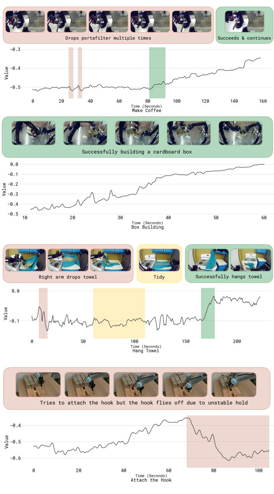

[← 返回 README](../README.md)

# Appendix

## 📌 预览
附录包含：贡献者列表(A)、额外 VF 可视化(B)、log-likelihood 推导(C)、PPO 实现细节(D)、CFG 推理(E)、算法超参数细节(F)。

---

## A. Contributions

Data collection and operations. Michael Equi, Chelsea Finn, Lachy Groom, Hunter Hancock, Karol Hausman, Rowan Jen, Liyiming Ke, Marinda Lamb, Vishnu Mano, Suraj Nair, Charvi Sharma, Laura Smith, Will Stoeckle, Anna Walling, Blake Williams.

Annotation and supplemental data. Chelsea Finn, Catherine Glossop, Hunter Hancock, Brian Ichter, Rowan Jen, Liyiming Ke, Chandra Kuchi, Karl Pertsch, Laura Smith, Will Stoeckle, Quan Vuong, Anna Walling.

Policy training and research. Ashwin Balakrishna, Kevin Black, Danny Driess, Michael Equi, Yunhao Fang, Chelsea Finn, Catherine Glossop, Karol Hausman, Gashon Hussein, Brian Ichter, Liyiming Ke, Sergey Levine, Yao Lu, Suraj Nair, Karl Pertsch, Allen Z. Ren, Lucy Shi, Laura Smith, Jost Tobias Springenberg, Kyle Stachowicz, Alex Swerdlow, Marcel Torne, Quan Vuong, Lili Yu, Zhiyuan Zhou.

Policy infrastructure. Kevin Black, Karan Dhabalia, Danny Driess, Michael Equi, Liyiming Ke, Adrian Li-Bell, Suraj Nair, Allen Z. Ren, Laura Smith, Jost Tobias Springenberg, Kyle Stachowicz, Alex Swerdlow, Haohuan Wang, Ury Zhilinsky, Zhiyuan Zhou.

Robot hardware. Ali Amin, Raichelle Aniceto, Grace Connors, Adnan Esmail, Thomas Godden, Ivan Goryachev, Tim Jones, Ben Katz, Devin LeBlanc, Mohith Mothukuri, Sukwon Yoo.

Robot infrastructure. Ken Conley, James Darpinian, Jared DiCarlo, Karol Hausman, Szymon Jakubczak, James Tanner.

Writing and illustration. Kevin Black, Danny Driess, Michael Equi, Chelsea Finn, Hunter Hancock, Karol Hausman, Brian Ichter, Liyiming Ke, Sergey Levine, Suraj Nair, Allen Z. Ren, Laura Smith, Jost Tobias Springenberg, Zhiyuan Zhou.

> 💡 **团队规模**: Physical Intelligence 全公司级别的项目，50+ 贡献者，涵盖数据收集、标注、训练、基础设施、硬件、写作等

---

## B. Additional Value Function Visualization

*Fig. 13: Additional visualization of value function on five different tasks. Red parts highlight places where value drops, green parts highlight places where value increases, and yellow parts highlight oscillating value regions. Images show the corresponding frames and descriptions of the episode.*

> 💡 **Figure 13 批读**:
> - 5 个不同任务的 VF 可视化：espresso、box assembly、hang towel、attach hook 等
> - VF 能跨任务工作：检测进展（绿）、错误（红）、犹豫（黄）
> - 说明 multi-task distributional VF 的泛化能力

---

## C. Computing the log-likelihood for policy improvement

> 💡 **Appendix C 要点**: 推导 Eq. 5 的完整过程。核心思路：
> 1. 分解 likelihood = autoregressive (sub-task + discrete actions) × flow matching (continuous actions)
> 2. Flow matching 没有 closed-form likelihood → 用 one-step Gaussian approximation
> 3. 参考 [80] 得到 ELBO-style lower bound
> 4. 最终 loss = discrete CE + flow matching MSE（加权和）

To derive the log-likelihood from Equation (4) we can first observe that we can decompose the full model likelihood into autoregressive and diffusion terms

$$
\begin{array} { r l } & { \pi _ { \boldsymbol { \theta } } ( \mathbf { a } _ { t : t + H } , \mathbf { a } _ { t : t + H } ^ { \ell } , \widehat { \ell } | I _ { t } , \mathbf { o } _ { t } , \ell ) = } \\ & { \pi _ { \boldsymbol { \theta } } ( \mathbf { a } _ { t : t + H } | I _ { t } , \mathbf { o } _ { t } , \ell , \widehat { \ell } ) \pi _ { \boldsymbol { \theta } } ( \mathbf { a } _ { t : t + H } ^ { \ell } | I _ { t } , \mathbf { o } _ { t } , \ell , \widehat { \ell } ) \pi _ { \boldsymbol { \theta } } ( \widehat { \ell } | I _ { t } , \mathbf { o } _ { t } , \ell ) , } \end{array}
$$

where the first term is modeled with flow matching, the second term is the autoregressive likelihood of the discretized actions $\mathbf { a } _ { t : t + H } ^ { \ell }$ , and the third term corresponds to the autoregressivekelihood. The autoregressive likelihoods can be estimated in the usual way, using the cross-entropy loss evaluated on ground truth tokens. For the continuous likelihood over $\mathbf { a } _ { t : t + H }$ , a closed form likelihood is not available [79]. We can, however follow prior work [82], and consider the one-step diffusion process as a Gaussian distribution with likelihood

$$
\begin{array} { r l } & { \log \pi _ { \boldsymbol { \theta } } \big ( \mathbf { a } _ { t : t + H } \big \vert \mathbf { a } _ { 1 : H } ^ { \eta , \omega } , I _ { t } , \mathbf { o } _ { t } , \boldsymbol { \ell } , \hat { \ell } \big ) = } \\ & { \qquad \log \mathcal { N } \Big ( \omega - f _ { \boldsymbol { \theta } } \big ( \mathbf { a } _ { 1 : H } ^ { \eta , \omega } , I _ { t } , \mathbf { o } _ { t } , \boldsymbol { \ell } , \hat { \ell } \big ) , \mathbf { I } \Big ) , } \end{array}
$$

with $\mathbf { a } _ { t : t + H } ^ { \eta , \omega } = \eta \mathbf { a } _ { t : t + H } + ( 1 - \eta ) \omega$ and $\boldsymbol \omega = \mathcal { N } ( 0 , { \bf I } )$ . From following [80, 82] (effectively marginalizing over $\eta$ and $\omega$ ) which yields

$$
\begin{array} { r l r } {  { \log \pi _ { \theta } \big ( \mathbf { a } _ { t : t + H } \big | I _ { t } , \mathbf { o } _ { t } , \ell , \widehat { \ell } \big ) \geq } } \\ & { } & { \frac { 1 } { 2 } \mathbb { E } _ { \eta , \omega } \Big [ - w ( \eta ) \| \omega - \mathbf { a } _ { 1 : H } - f _ { \theta } \big ( \mathbf { a } _ { 1 : H } ^ { \eta , \omega } , I _ { t } , \mathbf { o } _ { t } , \ell , \widehat { \ell } \big ) \| ^ { 2 } \Big ] + c , } \\ & { } & { \quad \mathrm { o s } } \end{array}
$$

where $w ( \eta ) = e ^ { - \eta / 2 }$ is a noise dependent weighting term, and c is a constant independent of $f _ { \theta }$ . For the derivation, see [80], which also derives the relationship between flow matching and diffusion in Appendix D.3 for this choice of weighting term. Finally putting the lower bound together with the autoregressive likelihood for the discretized action part of the text output $\hat { \ell }$ , and subsuming the weighting terms in $\alpha$ gives

$$
\begin{array} { r l } & { \log \pi _ { \boldsymbol { \theta } } \big ( \mathbf { a } _ { t : t + H } , \mathbf { a } _ { t : t + H } ^ { \boldsymbol { \ell } } \vert I _ { t } , \mathbf { o } _ { t } , \boldsymbol { \ell } , \hat { \ell } \big ) \geq } \\ & { \mathbb { E } _ { \eta , \omega } \Big [ \log p _ { \boldsymbol { \theta } } \big ( \mathbf { a } _ { t : t + H } ^ { \boldsymbol { \ell } } \vert I _ { t } , \mathbf { o } _ { t } , \boldsymbol { \ell } , \hat { \ell } \big ) } \\ & { \qquad - \alpha _ { \eta } \left. \omega - \mathbf { a } _ { 1 : H } - f _ { \boldsymbol { \theta } } \big ( \mathbf { a } _ { 1 : H } ^ { \eta , \omega } , I _ { t } , \mathbf { o } _ { t } , \boldsymbol { \ell } , \hat { \ell } \big ) \right. ^ { 2 } \Big ] , } \end{array}
$$

which is the bound given in the main part of the paper.

---

## D. PPO implementation

> 💡 **Appendix D 要点**: PPO baseline 的实现细节
> - 用 SPO [83] 的约束替代标准 PPO clipping
> - 分别对 autoregressive 和 flow-matching 部分施加 trust region
> - Flow matching 部分的 trust region 难以 enforce → PPO 效果差的原因之一

We implement a variant of PPO [66] related to DPPO and FPO [23, 82] and use it as an additional baseline. To allow for training both the autoregressive part of the model as well as the diffusion based action expert in a compute effective manner we calculate likelihoods based on the single step diffusion objective alone.

In particular, we use a likelihood bound analogous to Eq. (9) (previous section) but without the improvement indicator. Decomposing into autoregressive and flow-matching terms this

$$
\begin{array} { r l } & { \log \pi _ { \boldsymbol { \theta } } \big ( \mathbf { a } _ { t : t + H } , \mathbf { a } _ { t : t + H } ^ { \ell } \big | \mathbf { o } _ { t } , \ell , \hat { \ell } \big ) \geq } \\ & { \quad \mathbb { E } _ { \eta , \omega } \bigg [ \log p _ { \boldsymbol { \theta } } \big ( \mathbf { a } _ { t : t + H } ^ { \ell } \big | \mathbf { o } _ { t } , \ell , \hat { \ell } \big ) } \\ & { \qquad - \alpha _ { \eta } \left\| \omega - \mathbf { a } _ { 1 : H } - f _ { \boldsymbol { \theta } } \big ( \mathbf { a } _ { 1 : H } ^ { \eta , \omega } , \mathbf { o } _ { t } , \ell , \hat { \ell } \big ) \right\| ^ { 2 } \bigg ] , } \end{array}
$$

which is analogous to the diffusion likelihood bound used in FPO [82]. And we combine it with a PPO style loss separated into diffusion and autoregressive terms. In preliminary experiments we found that for our setting it was difficult to enforce a trust region constraint on the action expert (which models actions with an unbounded diffusion head) when using the standard PPO clipping objective. Presumably, this is partially due to the "offline" nature of our algorithm setting, where we cannot afford to collect new data from real robots every few gradient steps. To stabilize training we found using an alternative definition of the PPO constraint following SPO [83] to be effective. The resulting loss is given as:

$$
\begin{array} { r l } & { \quad \mathcal { L } _ { S r f o } + _ { C o } v L A ( \theta ) = } \\ & { \quad \Bigg \{ \frac { \pi _ { \theta } ( a _ { \ell } \varepsilon \hat { \varepsilon } ( \hat { \varepsilon } | \mathbf { o } _ { t } , \ell ) ) } { \pi _ { \mathrm { e r f } } ( a _ { \ell } \varepsilon \hat { \varepsilon } / \mathbf { { l } _ { 0 } } , \ell ) } A ^ { \pi _ { \theta } } ( o _ { t } , a _ { t } , \ell ) } \\ & { \quad - \frac { \left. \ A ^ { \pi _ { \theta } } \left( o _ { t } , a _ { t } , \ell \right) \right. } { 2 \varepsilon _ { \mathrm { a r } } } \Bigg [ \frac { \pi _ { \theta } ( a _ { \ell } \varepsilon \hat { \varepsilon } ( \hat { \varepsilon } | \mathbf { o } _ { t } , \ell ) } { \pi _ { \mathrm { e r f } } ( a _ { \ell } \varepsilon \hat { \varepsilon } / \mathbf { { l } _ { 0 } } , \ell ) } - 1 \Bigg ] \Bigg \} } \\ & { \quad + \alpha \Bigg \{ \frac { \pi _ { \theta } ( \mathbf { a } _ { t + t + H } | \mathbf { o } _ { t } , \ell ) } { \pi _ { \mathrm { e r f } } ( \mathbf { a } _ { t ; t + H } | \mathbf { o } _ { t } , \ell ) } A ^ { \pi _ { \theta } } ( o _ { t } , a _ { t } , \ell ) } \\ & { \quad \quad - \frac { \left. \ A ^ { \pi _ { \theta } } \left( o _ { t } , a _ { t } , \ell \right) \right. } { 2 \varepsilon _ { \mathrm { t o w } } } \Bigg [ \frac { \pi _ { \theta } ( \mathbf { a } _ { t + t + H } | \mathbf { o } _ { t } , \ell ) } { \pi _ { \mathrm { e r f } } ( \mathbf { a } _ { t ; t + H } | \mathbf { o } _ { t } , \ell ) } - 1 \Bigg ] \Bigg \} , } \end{array}
$$

where $\alpha$ is a trade-off parameter and $\epsilon _ { \mathrm { a r } } , ~ \epsilon _ { \mathrm { f l o w } }$ are trust-region parameters for autoregressive and flow-matching model parts respectively. We use this variant to perform training on eval data starting from the $\pi _ { 0 . 6 }$ checkpoint.

---

## E. Using CFG for test-time policy improvement with $\beta > 1$

> 💡 **Appendix E 要点**: 推理时的 CFG
> - 用 conditional + unconditional model 的梯度差做 guidance
> - β 控制 guidance 强度（β=1 直接用 conditional，β>1 更 aggressive）
> - 实践中 β ∈ [1.5, 2.5] 比较好；太大会推到 action distribution 边界 → 动作过于激进
> - β 和训练时的 $\epsilon_\ell$ 都能 sharpen 分布，但作用时机不同

After training we can choose to further sharpen the policy used for evaluation by setting $\beta > 1$ in Eq. (2). As shown in prior work [4] we can recover this sharpened policy without additional training since it is implicitly defined by the learned policies $\pi _ { \boldsymbol { \theta } } ( \mathbf { a } _ { t : t + H } | I _ { t } , \mathbf { o } _ { t } , \ell )$ and $\pi _ { \boldsymbol { \theta } } \big ( \mathbf { a } _ { t : t + H } \big | \mathbf { o } _ { t } , \boldsymbol { \ell } \big )$ . Specifically, after training we can form the approximation

$$
\hat { \pi } ( \mathbf { a } _ { t : t + H } | \mathbf { o } _ { t } , \ell ) \propto \pi _ { \mathrm { r e f } } ( \mathbf { a } _ { t : t + H } | \mathbf { o } _ { t } , \ell ) \left( \frac { \pi _ { \mathrm { r e f } } ( \mathbf { a } _ { t : t + H } | I _ { t } , \mathbf { o } _ { t } , \ell ) } { \pi _ { \mathrm { r e f } } ( \mathbf { a } _ { t : t + H } | \mathbf { o } _ { t } , \ell ) } \right) ^ { \beta } .
$$

One can now realize that the diffusion model effectively learns the gradient of the likelihoods, i.e. it represents $\nabla _ { \mathbf { a } } \log \pi _ { \boldsymbol { \theta } } \big ( \mathbf { a } _ { t : t + H } \big | I _ { t } , \mathbf { o } _ { t } , \boldsymbol { \ell } \big )$ and $\nabla _ { \mathbf { a } } \log \pi _ { \boldsymbol { \theta } } ( \mathbf { a } _ { t : t + H } | \mathbf { o } _ { t } , \boldsymbol { \ell } )$ respectively. From this, following Frans et al. [4], we can see that if we run flow-matching inference following the gradient

$$
\begin{array} { r l } & { \nabla _ { \mathbf { a } } \log \pi _ { \boldsymbol { \theta } } ( \mathbf { a } _ { t : t + H } | \mathbf { o } _ { t } , \boldsymbol { \ell } ) + } \\ & { \quad \beta ( \nabla _ { \mathbf { a } } \log \pi _ { \boldsymbol { \theta } } ( \mathbf { a } _ { t : t + H } | I _ { t } , \mathbf { o } _ { t } , \boldsymbol { \ell } ) - \nabla _ { \mathbf { a } } \log \pi _ { \boldsymbol { \theta } } ( \mathbf { a } _ { t : t + H } | \mathbf { o } _ { t } , \boldsymbol { \ell } ) ) , } \end{array}
$$

we are effectively sampling from the desired attenuated distribution. We note that, as mentioned in the main paper, the parameter $\beta$ is loosely connected to the advantage threshold $\epsilon _ { \ell }$ that we introduce during training (in the sense that both sharpen the distribution, one at inference and one at training time). We find that sharpening the distribution after training with high settings for $\beta$ can lead to pushing the action distribution towards the boundaries of its learned support (which can lead to overly aggressive motions) and thus primarily rely on $\epsilon _ { \ell }$ for obtaining a good conditioned policy directly after training and combine it with moderate settings (e.g. $\beta \in [ 1 . 5 , 2 . 5 ] ,$ ) where useful.

---

## F. Additional algorithm details

**Advantage Estimation:**
- Post-training: N=50 lookahead for n-step advantage
- Pre-training: N=T (full episode, higher variance but cheaper — single VF call)

**Advantage conditioning dropout:** 30% probability

**Advantage threshold $\epsilon_\ell$:**
- Pre-training: ~30% of demo data has positive advantage
- Fine-tuning: ~40% of eval rollouts have positive advantage
- Exception: T-shirt & shorts task uses ~10% (only top performance is positive)

**Dataset composition per task:**
| 任务 | Demo 数据 | Autonomous | Corrections |
|------|----------|------------|-------------|
| Laundry (simple) | — | 300/iter × 4 robots | 无 |
| Laundry (diverse) | — | 450 eval | 287 correction |
| Laundry (failure removal) | — | ~1000 autonomous | 280+378 corrections |
| Box assembly | 600 demo | 600 autonomous/iter | 360 corrections/iter |
| Cafe | — | 414 autonomous | 429 corrections |

> 💡 **数据量并不大**: 每轮几百条 trajectories 就够，说明 RECAP 的 sample efficiency 不错

---

## 🔖 Section 总结

### 核心洞察
1. Flow matching 的 log-likelihood 只能用 lower bound 近似，这是 PPO 不好用的根本原因
2. CFG (β>1) 提供额外推理时提升，但需要谨慎调参
3. 数据量适中（几百条/轮），RECAP 的 sample efficiency 合理
