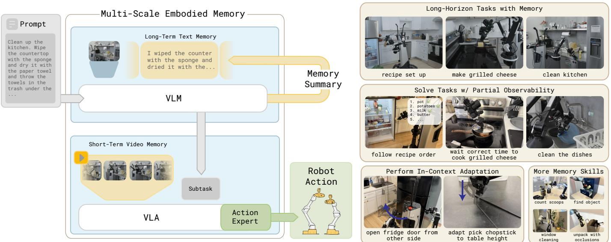

# Abstract

Marcel Torne∗ 1 2 † Karl Pertsch∗ 1 Homer Walke3 † Kyle Vedder1 Suraj Nair1 Brian Ichter1 Allen Z. Ren1 Haohuan Wang1 Jiaming Tang1 4 † Kyle Stachowicz1 3 † Karan Dhabalia1 Michael Equi1 Quan Vuong1 Jost Tobias Springenberg1 Sergey Levine1 Chelsea Finn1 Danny Driess1

https://pi.website/research/memory

*Fig. 1: Multi-Scale Embodied Memory (MEM) equips Vision Language Action Models (VLAs) with memory for solving long-horizon tasks at scale. It has two key components: an efficient video encoder for short-horizon image-based memory, and a language-based memory mechanism for capturing long-horizon memory. After training on a diverse corpus of robot and non-robot data, MEM VLAs can solve tasks that require up to fifteen minutes of memory, handle partial observability, and perform in-context adaptation of manipulation strategies.*

Abstract—Conventionally, memory in end-to-end robotic learning involves inputting a sequence of past observations into the learned policy. However, in complex multi-stage real-world tasks, the robot's memory must represent past events at multiple levels of granularity: from long-term memory that captures abstracted semantic concepts (e.g., a robot cooking dinner should remember which stages of the recipe are already done) to short-term memory that captures recent events and compensates for occlusions (e.g., a robot remembering the object it wants to pick up once its arm occludes it). In this work, our main insight is that an effective memory architecture for long-horizon robotic control should combine multiple modalities to capture these different levels of abstraction. We introduce Multi-Scale Embodied Memory (MEM), an approach for mixed-modal long-horizon memory in robot policies. MEM combines video-based short-horizon memory, compressed via a video encoder, with text-based long-horizon memory. Together, they enable robot policies to perform tasks that span up to fifteen minutes, like cleaning up a kitchen, or preparing a grilled cheese sandwich. Additionally, we find that memory enables MEM policies to intelligently adapt manipulation strategies in-context.

> 📝 **中文翻译**（"In this work..." 段）：
>
> 在这项工作中，我们的核心洞察是：一个有效的长时域机器人控制记忆架构，应当结合多种模态来捕捉这些不同层次的抽象信息。我们提出了多尺度具身记忆（MEM），这是一种用于机器人策略的混合模态长时域记忆方法。MEM 将基于视频的短时域记忆（通过视频编码器压缩）与基于文本的长时域记忆相结合。两者协同，使机器人策略能够完成跨越长达十五分钟的任务，例如整理厨房或制作烤奶酪三明治。此外，我们发现记忆机制还使 MEM 策略能够在执行过程中智能地进行操作策略的上下文自适应调整。

> 💡 **核心洞察**：这篇论文的关键 insight 是——机器人的记忆需要**多尺度、多模态**。短时记忆用视频（处理遮挡、动态），长时记忆用语言（语义压缩、追踪任务进度）。这比之前"一种模态打天下"的方案更合理。
>
> 💡 **来自 Physical Intelligence**：这是 π₀ / π₀.₅ 团队的后续工作。作者阵容豪华：Chelsea Finn, Sergey Levine, Danny Driess, Karl Pertsch 等都是 VLA 领域的核心人物。
>
> 💡 **实际能力**：15 分钟的任务记忆，这在 VLA 领域是非常长的 horizon。之前大多数 VLA 只能处理几十秒到几分钟的任务。
>
> 💡 **额外发现**：记忆不仅解决长 horizon 问题，还带来了 **in-context adaptation** 能力——机器人能从失败中学习调整策略（比如换抓取角度），这是一个很有意思的 emergent capability。
