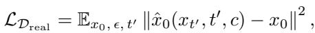
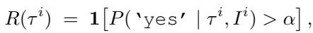
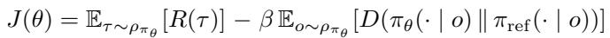
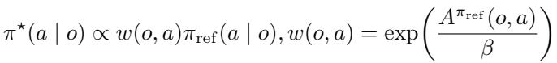
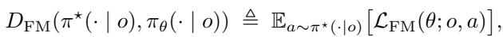
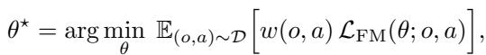

[← 返回 README](../README.md)

# 4. Co-Improvement of VLA and World Model

> 来源: VLAW: Iterative Co-Improvement of Vision-Language-Action Policy and World Model (arXiv 2602.12063)

---

## 📄 原文

> 💡 **Section 概览**: 方法核心章节，三个子节：① 4.1 用真实 rollout 修正世界模型（含奖励模型微调）；② 4.2 迭代提升 VLA 策略（合成数据生成 + 加权 flow-matching 损失）；③ 4.3 理论分析（AWR for flow-matching，证明等价于正则化 RL）。两个关键图（Fig 2 & 3）从 Related Work 页面移至此处。


*Figure 2. Policy online rollout data can help ground the pretrained world model in downstream tasks. Once the world model is grounded, we can generate massive data for policy learning.*

> 💡 **Figure 2 批读**: VLAW 的核心 insight 示意图。分两阶段：
> - 左：真实 rollout（含失败）→ 修正世界模型的物理保真度
> - 右：修正后的世界模型 → 大量合成数据 → 训练策略
> 注意这是双向互利的「闭环」：更好的策略 → 更多样的 rollout → 更好的世界模型 → 更高质量合成数据 → 更好的策略

In this section, we describe the details of our method. The overall pipeline consists of the following steps:

1. **World model post-training (Sec. 4.1)**: We finetune the world model $M$ using real-world rollout data $\mathcal{D}_{\mathrm{real}}$, jointly training it with the original DROID dataset $\mathcal{D}_{\mathrm{DROID}}$ to maintain broad coverage. In addition, we finetune the vision-language reward model $R$ on $\mathcal{D}_{\mathrm{real}}$ to improve reward accuracy.
2. **VLA policy post-training (Sec. 4.2)**: Using the updated world model, we generate a synthetic dataset $\mathcal{D}_{\mathrm{syn}}$ and apply the reward model $R$ to identify successful trajectories, yielding a filtered dataset $\mathcal{D}_{\mathrm{syn}}^+$. This dataset is then used to finetune the VLA policy.
3. We alternate between Steps 1 and 2, **iteratively** improving both the world model and the policy.

> 💡 **Pipeline 全局视图**:
> ```
> [迭代 i]
> Step 1: Real rollout (K=50 条/任务)
>         └── 包含成功+失败案例
>                 ↓
>         微调 Ctrl-World + 微调奖励模型 Qwen3-VL
>
> Step 2: World model 生成 (N=500 条/任务)
>         └── Policy-in-the-loop 想象轨迹
>                 ↓
>         奖励模型过滤 → D_syn+（成功轨迹）
>                 ↓
>         Flow-matching SFT 更新 π₀.₅
>
> [迭代 i+1] 重复，共 2 次迭代
> ```

The overall pipeline is summarized in Algorithm 1 and Figure 3.


*Figure 3. Detailed pipeline for VLAW: (1) We first roll out the policy in the real world to collect a small set of online trajectories. (2) We then fine-tune a pretrained action-conditioned world model on these policy rollout data, grounding the world model in the target tasks and improving its predictive fidelity. (3) Using the resulting world model, we generate large-scale synthetic trajectories through closed-loop interactions between the policy and the world model. (4) Finally, we optimize the VLA policy using both real-world and synthetic data, with reward automatically assessed by a vision–language reward model.*

> 💡 **Figure 3 批读**: 四步流程图，最重要的细节：
> - Step (2)：微调时同时使用 online rollout + DROID 数据集（co-training），防止过拟合
> - Step (3)：Policy-in-the-loop 生成 500 条想象轨迹（10x 真实 rollout 数量）
> - Step (4)：VLM 奖励模型自动标注，无需人工

---

### 4.1. World Model Learning with Real Roll-outs

**Real World Policy Roll-outs.** Previous work has identified two major challenges in learning effective world models: (1) over-optimism, as training data is dominated by successful demonstrations; and (2) limited physical fidelity, particularly when modeling complex dynamics involving frequent contacts or deformable objects.

To address these issues, we get $K$ trajectories by rolling out the policy in the real world, forming a dataset $\mathcal{D}_{\mathrm{real}} = \{\tau_{\mathrm{real}}^1, \dots, \tau_{\mathrm{real}}^K\}$, we also assign a sparse reward $r_\tau \in \{0, 1\}$ to each trajectory to indicate success or not every time we reset robot.

> 💡 **K=50 的设计选择**：每个任务类别 50 条 rollout，5 类任务共 250 条。这是成本和效果的 tradeoff——50 条足以覆盖典型的成功/失败模式，但远小于世界模型预训练数据量（DROID 数据集有数万条）。

**Training Objective.** $\mathcal{D}_{\mathrm{real}}$ captures diverse physical interactions encountered during execution, including both success and failure cases, and is used to finetune a pretrained world model. Specifically, we initialize from the pretrained Ctrl-World model (Guo et al., 2025a), a strong diffusion-based world model trained on the full DROID dataset $\mathcal{D}_{\mathrm{DROID}}$. Finetuning on the online rollout dataset $\mathcal{D}_{\mathrm{real}}$ follows the original diffusion objective (Blattmann et al., 2023):



> 💡 **公式 1 解读**：标准的扩散模型去噪损失。预测目标 $x_0 = o_{t+1:t+H}$ 是未来 H 帧观测序列。条件 $c$ 包括：当前观测 $o_t$ + 动作序列 $a_{t:t+H}$（action-conditioned）。这与 Ctrl-World 原始训练目标完全相同——VLAW 的创新不在损失函数，而在**训练数据的组成**（加入失败案例）。

**Progressively Growing Dataset and Co-training.** During successive iterations, we continuously append newly collected real-world trajectories into the dataset: $\mathcal{D}_{\mathrm{real}} = \mathcal{D}_{\mathrm{real}} \cup \tau_{\mathrm{real}}^i$. To prevent overfitting to the limited online rollout data, we also co-train with the original DROID dataset $\mathcal{D}_{\mathrm{DROID}}$ for regularization. The final training objective is:


> 💡 **Co-training 的必要性**：仅用 250 条 rollout 微调会严重过拟合，忘记 Ctrl-World 的通用知识。λ 控制正则化强度（论文未给出具体值）。渐进式数据集增长意味着第 2 次迭代的世界模型微调使用了 2×50=100 条 rollout/任务。

**Finetuning Reward Model.** To keep our pipeline simple and scalable, we leverage a general-purpose vision-language model, Qwen3-VL-4B-Instruct (Team, 2025a; Lee et al., 2026), to assess whether a trajectory succeeds or not. However, we find that the zero-shot VLM is not accurate enough, so in the first iteration, we fine-tune the VLM with the success labels $r_\tau$ in $\mathcal{D}_{\mathrm{real}}$.

In implementation, the reward model takes as input a trajectory video $\tau_{\mathrm{real}}^i$ together with a query asking whether the task instruction $I^i$ is successfully completed. We classify a trajectory as successful if the probability assigned to the 'yes' token exceeds a threshold $\alpha$. By adjusting $\alpha$, we can make the reward model more or less conservative.



> 💡 **阈值策略的设计权衡**：
> - 直接 yes/no → 假阳性多（世界模型想象轨迹中乐观预测也会骗过奖励模型）
> - 阈值 α=0.8 → 精度优先，召回率下降（宁可漏掉真正的成功，也不要假成功）
> - 实验（Appendix C）显示：假阳性从 8 降至 2（Table 3），代价是 10 条真成功只标出 10 条，误标 2 条为失败
> - 这是一个**精度 vs 召回的明确选择**，对最终策略质量至关重要

---

### 4.2. Iterative Improvement for VLA Policy

**Scalable Training Pipeline.** Once we have a good learned world model and reward model, then we can use it to cheaply generate a large amount of synthetic data. In principle, many different algorithms could be used to leverage this data, including a variety of sophisticated reinforcement learning methods. Because we want to easily scale to large, flow-matching based VLA policies, we choose to use the one of the simplest possible methods for incorporating this synthetic data.

Specifically, we generate $N$ trajectories by rolling out the policy in imagination: $\mathcal{D}_{\mathrm{syn}} = \{\tau_{syn}^1, \dots, \tau_{syn}^N\}$. We then apply the finetuned reward model to identify successful trajectories and construct a filtered dataset containing only success cases: $\mathcal{D}_{\mathrm{syn}}^+ = \{\tau_{syn}^{i_1}, \dots, \tau_{syn}^{i_n}\}$, where $i_1, \dots, i_n$ is the index of success trajectory.

> 💡 **N=500 条合成 vs K=50 条真实 = 10x 扩增比**：世界模型的核心价值在于「廉价扩增」。生成 500 条想象轨迹的计算成本远低于 50 条真实 rollout 的人工成本。过滤后成功率大约是 ？%（论文未明确报告合成数据的成功率，这是一个信息缺口）。

**Policy Learning Objective.** We update the $\pi_{0.5}$ policy using a weighted flow-matching objective over both real-world rollouts and world-model–generated data. After filtering for successful trajectories, we assign a binary weight $w(o, a) = 1$ to transitions from successful trajectories and $w(o, a) = 0$ to transitions from failed trajectories:


> 💡 **公式 4 本质**：等价于只在成功轨迹上做 SFT——binary weight（0/1）意味着失败轨迹被完全忽略，只用成功轨迹（真实 $\mathcal{D}_{\mathrm{real}}^+$ + 合成 $\mathcal{D}_{\mathrm{syn}}^+$）做 flow-matching 训练。这是 AWR (Advantage-Weighted Regression) 在 flow-matching 策略上的特例，Section 4.3 做了理论推导。

**Algorithm 1 VLAW**

```
Require: Pretrained VLA policy π_θ; pretrained world model M_φ; reward model R;
         real-world rollout budget K; synthetic rollout budget N; iterations K_iter;
         reward threshold α
Output: Post-trained policy π_θ and world model M_φ

1: Initialize real-world dataset D_real ← ∅
2: for i = 1 to K_iter do
3:   (1) Real-world rollouts
4:     Roll out π_θ in the real world to collect τ_real¹, ..., τ_real^K
5:     Append collected trajectories to D_real, success trajectories in D_real+
6:   (2) World model and reward model post-training
7:     Update M_φ using D_real and D_DROID according to Eq. (1) and Eq. (2)
8:   (3) Synthetic rollout generation with reward label
9:     Roll out π_θ in M_φ to generate D_syn = {τ_syn¹, ..., τ_syn^N}
10:    Apply reward model R with threshold α (Eq. 3) to obtain D_syn+
11:  (4) Policy post-training
12:    Update π_θ on D_real+ ∪ D_syn+ using the flow-matching objective in Eq. (4)
13: end for
14: return π_θ, M_φ
```

> 💡 **算法读后感**：极其简洁——4个步骤，核心逻辑清晰。注意 Step 6：世界模型和奖励模型都在用 D_real 更新，奖励模型**第一次迭代后就固定了**（原文说第一次迭代微调，后续迭代用原始 Qwen3-VL 的 zero-shot 能力？还是持续微调？原文表述有一定歧义）。

---

### 4.3. Relation to Regularized Reinforcement Learning

In this subsection, we show that the policy update in Eq. 4 can be viewed as policy optimization under a regularized reinforcement learning (RL) framework (Peng et al., 2019) with certain approximations.

Under the regularized RL setting, we constrain the learned policy to remain close to a reference policy $\pi_{\mathrm{ref}}$ while optimizing reward. This yields the following regularized objective:



> 💡 **公式 5 含义**：标准的 KL 正则化 RL 目标。第一项最大化期望奖励，第二项惩罚策略偏离参考策略 π_ref 太多（β 控制强度）。这与 RLHF 中的 KL 约束目标形式完全相同。

The optimal improved policy admits a closed-form solution given by:



> 💡 **公式 6 含义**：最优策略是参考策略 × exp(advantage/β) 的加权版本。当 γ→1、reward 为二值（成功/失败）时，advantage 退化为 0/1 权重，即公式 4 的 binary weight w(o,a)。这就是 VLAW 与 AWR (Advantage-Weighted Regression) 的理论联系。

We can define a surrogate divergence which measures how well $\pi_\theta$ matches samples drawn from $\pi^\star$ under the flow-matching loss:



Using this divergence, we can project policy to the optimal solution with:



> 💡 **公式 7-8 的意义**：
> - 问题：flow-matching 策略没有显式 action log-prob，无法用标准 KL 散度
> - 解决：定义「flow-matching 代理散度」$D_\mathrm{FM}$，用 flow-matching 损失代替 log-prob
> - 结果：投影步骤等价于公式 4 的加权 flow-matching 损失
> - **核心价值**：为 VLAW 提供了理论背书——不是拍脑袋的 SFT，而是有 RL 理论依据的策略改进。但这也是一个「近似」（approximations），严格性有限。

---

## 🔖 Section 总结

### 关键数字速查

| 超参数 | 数值 |
|--------|------|
| 真实 rollout 数 K | 50 条/任务 |
| 合成数据数 N | 500 条/任务 |
| 世界模型微调步数 | 50K steps |
| 策略微调步数 | 2K steps，batch size 256 |
| 迭代次数 | 2 次 |
| 奖励阈值 α | 0.8 |

### 核心洞察

1. **方案极简但有理论根基**：表面上只是「过滤成功轨迹做 SFT」，但 Section 4.3 证明这等价于 flow-matching 版本的 AWR——使得方法既简单可扩展，又有理论支撑
2. **Co-training 是关键工程细节**：世界模型微调时必须同时用 DROID 数据集，否则 250 条 rollout 会让模型严重遗忘通用知识
3. **奖励阈值 α=0.8 体现了精度优先原则**：宁可少用一些成功案例，也不要让假成功污染训练数据
4. **Figure 2 & 3 是本节的最重要图**（PDF 中出现在 Related Work 页面，但描述的是方法）
