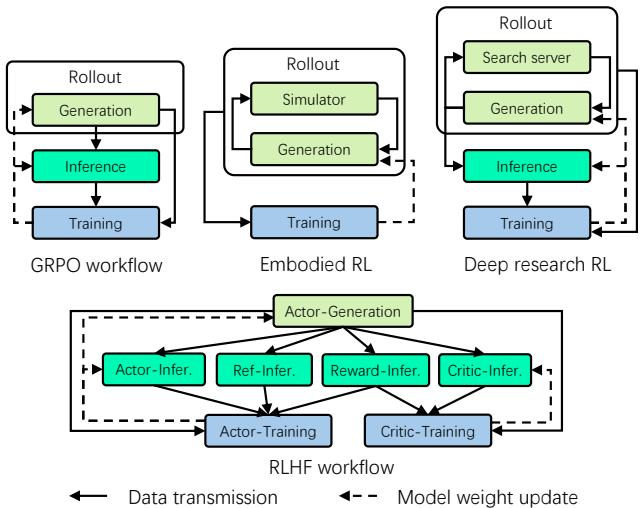

[← 返回 README](../README.md)

# 1. Introduction

## 📌 预览
Introduction 从 RL 的重要性出发，分析现有系统的两种执行模式（collocated vs disaggregated）各自的缺陷，提出 M2Flow 解耦逻辑编程与物理执行。

---

The rapid progress of large language models (LLMs) has reached a point where further scaling model alone yields diminishing returns. To push intelligence beyond pretraining, reinforcement learning (RL) has emerged as a crucial paradigm. Recent advances such as RLHF [6, 33], GRPO [42], and RL for embodied agents [19, 20] and Deep Research [30, 59] all rely on RL to align LLMs with human preferences, improve reasoning, and enable autonomous interaction with complex environments. OpenAI and others predict that RL workloads will soon consume more computational resources than LLM pretraining [32], making RL training efficiency the most critical system concern.

> 💡 **RL 的战略地位**:
> - LLM 单纯 scaling 已到收益递减点
> - RL 成为关键范式：RLHF、GRPO、embodied RL、Deep Research
> - OpenAI 预测：**RL 算力消耗将超过预训练** → RL 训练效率成为最关键的系统问题

---

However, efficient RL training for various scenarios such as reasoning, agentic and embodiment at the scale of modern large models is challenging, which combines highly heterogeneous components with diverse workload characteristics and resource demands, such as LLM generation, inference and training, reward models, critic models, agent tooling and embodied environment simulators. For instance, LLM training consumes more accelerator (e.g., GPU) memory than LLM generation and inference (prefill-only generation) to maintain gradients and optimizer states, while LLM generation shows high dynamicity in response lengths, leading to low accelerator utilization. Moreover, components like LLM training support diverse parallelization strategies (e.g., data, tensor, pipeline parallelism), whereas others scale only via instance replication and may yield computation workloads distinct from common tensor computation in LLM, e.g., embodied simulators [8,47] that require CPU for physics simulation and GPU graphics pipeline for 3D rendering.

> 💡 **RL 工作流的异构性挑战**:
> | 组件 | GPU 内存 | 计算特征 | 并行策略 |
> |------|---------|---------|---------|
> | LLM Training | 高（梯度+优化器） | 计算密集 | DP/TP/PP |
> | LLM Generation | 中（KV cache） | 内存带宽瓶颈 | 实例复制 |
> | LLM Inference | 中 | Prefill-only | DP/TP |
> | Simulator | 低~中 | CPU + GPU 渲染 | 实例复制 |
> | Reward/Critic | 中 | 前向推理 | DP/TP |

---

Single execution mode of existing RL training systems fails to capture this diversity, leading to suboptimal efficiency. Collocated execution, where components sequentially occupy accelerators [44], suffers from the long-tail problem due to varying generation lengths, leaving accelerators idle. Disaggregated pipelining, where components run concurrently on separate accelerators with pipelining [11], mitigates the long-tail issue but introduces memory and computation imbalance (§2.2). Neither mode is universally optimal. Many RL workloads demand hybrid scheduling of the components to maximize efficiency, i.e., mixing collocation and pipelining in a more flexible way. However, supporting such flexible execution modes for a single programmed workflow is a significant challenge, as they often require different program structures and communication patterns. Also, identifying the right scheduling for a given workflow usually requires considerable manual tunning.

> 💡 **两种执行模式的困境**:
> | 模式 | 做法 | 优点 | 缺点 |
> |------|------|------|------|
> | **Collocated** (veRL) | 所有组件共享 GPU，顺序执行 | 简单、内存共享 | 长尾问题：少数长 response 阻塞所有 GPU |
> | **Disaggregated** (AReal) | 组件分配到不同 GPU，流水线 | 减轻长尾 | 内存/计算不均衡，等待首批数据 |
> | **Hybrid** (RLinf) | 混合两种模式 | 最灵活 | 编程复杂、需自动调度 |

---

In this paper, we present RLinf, an RL training system that maximizes system flexibility to achieve efficient execution of a logically programmed RL workflow. At its core is a new paradigm called macro-to-micro flow transformation (M2Flow), i.e., macro logical flow with micro execution flow, which decouples the logical programming of RL workflows from their physical execution planning. With M2Flow, developers program RL workflows imperatively, using a natural programming interface to define how components communicate and synchronize at a coarse granularity. RLinf then automatically transforms this logical flow into a fine-grained execution plan tailored to the workload and hardware at both spatial and temporal dimensions.

> 💡 **M2Flow 核心思想**:
> ```
> 用户写的（Macro）:
>   for batch in data:
>     responses = rollout.generate(batch)
>     logprobs = inference.compute(responses)
>     training.update(logprobs)
>
> 系统执行的（Micro）:
>   自动决定每个 worker 放哪些 GPU、何时执行、
>   数据以多大粒度流水线传输
> ```
> 类似编译器优化：用户写高层代码，系统自动生成优化的执行计划。

---

RLinf achieves this through three key mechanisms. First, a worker abstraction that encapsulates each RL component for flexible placement, and built-in adaptive communication that allows direct and efficient communication between components regardless of worker and data placement. Second, elastic pipelining and automatic context switching that enable M2Flow transformation and expand the scheduling space, achieving pipeline granularity tunning and temporal accelerator multiplexing without modifying the logical workflow. Third, a profiling-guided scheduling policy that automatically selects efficient execution modes, balancing utilization across heterogeneous components.

> 💡 **三大机制**:
> 1. **Worker 抽象 + 自适应通信**: 封装组件，任意放置，自动选通信后端
> 2. **弹性流水线 + 上下文切换**: 空间调度（流水线粒度）+ 时间调度（GPU 时分复用）
> 3. **Profiling 引导调度**: 自动 profiling → 搜索最优执行模式

---


*Figure 1. Diverse RL workflows in various scenarios: GRPO, RLHF/PPO, Embodied RL, Deep Research。*

> 💡 **Figure 1 批读**:
> - **GRPO**: 最简单——单 LLM 的 Generation→Inference→Training 循环
> - **RLHF/PPO**: 最复杂——4 个 LLM（Actor, Reference, Reward, Critic）
> - **Embodied RL**: 加入 Simulator，有循环数据流（action→env→observation）
> - **Deep Research**: 加入 Search Server，也有循环数据流
> - 四种场景的共同特点：**组件异构 + 依赖关系复杂 + 数据流粒度不同**

---

## 🔖 Section 总结

### 核心洞察
1. RL 算力将超越预训练，系统效率是第一优先级
2. 现有系统要么 collocated（长尾问题）要么 disaggregated（不均衡），都不够灵活
3. M2Flow 的关键创新：解耦编程与执行，让系统自动找最优调度
