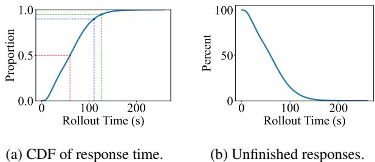
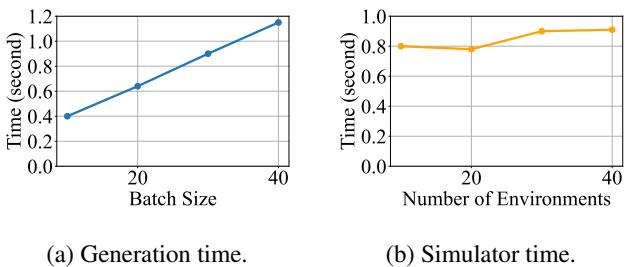

[← 返回 README](../README.md)

# 2. Background and Motivation

## 📌 预览
深入分析 RL 工作流特征（异构性 + 动态性 + 复杂依赖）和现有系统的三类效率问题，论证"灵活性是效率的关键"。

---

## 2.1 RL Workflows in LLM Era

**Various RL Algorithms and Scenarios.** With the slowdown of scaling gains in large language models, reinforcement learning has become increasingly important for advancing LLM intelligence. Unlike traditional RL, RL in the LLM era often involves multiple LLMs in the loop. Given the scale of modern models (tens to hundreds of billions of parameters), fitting RL training into available accelerators (e.g., GPUs) is already challenging. Figure 1 illustrates four representative RL workflows across different scenarios and algorithms.

The simplest is GRPO [42], an RL algorithm designed to reduce reliance on reward models. It involves a single LLM that generates multiple responses, e.g., 8, for a query (i.e., Generation), computes logarithmic probabilities for these responses (i.e., Inference), and uses the results as training data to update the same model (i.e., Training). The updated weights are then synchronized back for inference and generation, completing one training iteration.

In contrast, the RLHF [33] workflow adopts PPO [41], resulting in a more complex design involving four LLMs. The actor model serves as the core policy, generating responses to queries. The reference model remains fixed to constrain the actor from drifting too far from its initialization. The reward model assigns scalar rewards to generated responses, while the critic model estimates expected rewards to stabilize training. Actor and critic are trainable, whereas reference and reward models are frozen. These components interact closely, as shown in the figure.

Beyond algorithms, RL workflows also vary by application scenario. In embodied intelligence [19, 20], RL relies on simulators that simulates the physical world. An LLM interacts with the simulator by generating actions and receiving feedback, producing trajectories that serve as training data. Similarly, in Deep Research [30, 59], RL improves model performance through interaction with a search server that retrieves online information.

> 💡 **四种 RL 工作流对比**:
> | 工作流 | 组件数 | 可训练模型 | 数据流特征 |
> |--------|--------|-----------|-----------|
> | GRPO | 1 LLM (3 阶段) | 1 | 线性：Gen→Inf→Train |
> | PPO/RLHF | 4 LLM | 2 (Actor+Critic) | 星型：多组件交互 |
> | Embodied RL | LLM + Simulator | 1 | 循环：action↔env |
> | Deep Research | LLM + Search | 1 | 循环：query↔search |

---

**Characteristics of RL Workflows.** RL workflows consist of heterogeneous components with distinct demands on GPU memory, computation cores, accelerator types, and parallelization strategies. For example, training requires substantially more GPU memory than inference to maintain gradients and optimizer states. Unlike training, generation often underutilizes GPU cores, as its matrix and vector multiplications are bottlenecked by memory bandwidth. Some components (e.g., simulator) run on CPUs, or use GPUs for non-tensor computations (e.g., 3D rendering). Parallelization also differs significantly, e.g., LLM training exploits data, tensor, and pipeline parallelism, whereas simulators typically scale only through multiple instances. Maximizing overall utilization across such heterogeneous components is a great challenge.

Further, RL workflows exhibit complex dependencies, primarily through data flow and weight updates. Data flow can occur at different granularity, e.g., per response between generation and inference, or at least a micro-batch of responses between generation and training. Some workflows even introduce cyclic data flows, such as in embodied RL and Deep Research (Figure 1), which further complicates coordination. Weight updates, in contrast, act as barriers that synchronize generation and training.

> 💡 **RL 工作流的两大特征**:
> 1. **异构性**: 不同组件对 GPU 内存/计算/并行策略需求完全不同
> 2. **复杂依赖**: 数据流粒度不一（per-response vs micro-batch）+ 循环数据流 + 权重同步屏障

---

## 2.2 Inefficiencies in Diverse RL Workflows

**Dynamicity in Rollout Wastes Computation.** The rollout phase is inherently dynamic. Lengths fluctuate across responses of the same query, and even more so across different queries. Since rollouts are executed in batches, these variations create a long-tail problem where a few slow queries block the entire phase from proceeding to inference or training.

*Figure 2. Response 长度分布和未完成 response 数量随时间变化。*

> 💡 **Figure 2 批读 — 长尾问题的实证**:
> - 7B 模型在 64 GPU 上训练
> - 未完成 response 数量快速降到 <5%，但剩余的长尾 response 阻塞了整个 generation 阶段
> - **扩大 GPU 数量反而加剧问题**：空闲时间占比更大
> - 这是 collocated 模式（veRL）的核心痛点

---

**Simple Execution Modes Cannot Fit Diverse Components.** Collocated and pipelined modes are two extremes, i.e., all components on the same GPUs versus fully disaggregated GPUs. Some RL workloads, however, do not fit neatly into either mode.

*Figure 3. Generation 和 Simulator 在不同 batch size 下的执行时间。*

> 💡 **Figure 3 批读 — Embodied RL 的组件特征差异**:
> | 组件 | 执行时间 vs batch size | GPU 利用率 | 内存 vs batch size |
> |------|----------------------|-----------|-------------------|
> | Simulator | 几乎不变 | <24% | 线性增长 |
> | Generation | 线性增长 | >70% | 线性增长 |
> | Training | 是 Generation 的 1/3 | 高 | 最大（含梯度） |
>
> **结论**: Simulator 应该独占 GPU（扩环境数）→ 与 Generation 不能 collocate → 但 Training 可以与 Rollout 时分共享 → **需要 hybrid 模式**

---

**Identifying Suitable Orchestration is Challenging.** The orchestration of the hybrid mode depends on the analysis of the components. However, finding the most suitable orchestration for a given RL workflow is challenging, as the characteristics are diverse and the dependencies are complex. Manually enumerating options is tedious, time-consuming, and risks overlooking better choices.

> 💡 **这就是 RLinf 自动调度器的动机**: 手动找最优执行模式太难了，需要系统自动搜索。

---

## 2.3 Flexibility as a Key to Efficiency

Maximizing computation efficiency for an RL workload requires flexible orchestration that aligns with component and workflow characteristics. However, adjusting the execution mode without changing the programmed workflow is challenging. Collocated and disaggregated pipelining modes differ significantly. Collocated mode operates at coarse-grained, phase-level execution. Each phase starts after the previous phase is complete. However, disaggregated pipelining runs at fine-grained, batch-level with precise timing to minimize pipeline bubbles. Mixing these modes further increases complexity. We advocate a system design that bridges this gap, enabling RL developers to maintain an intuitive, logically organized workflow while achieving high execution efficiency with flexible execution modes.

> 💡 **核心论点: 灵活性 = 效率**:
> - Collocated = 粗粒度、phase-level → 简单但低效
> - Disaggregated = 细粒度、batch-level → 高效但编程复杂
> - **M2Flow 的目标**: 用户写 collocated 风格的简单代码 → 系统自动变换为最优的 hybrid 执行

---

## 🔖 Section 总结

### 核心洞察
1. RL 工作流的异构性和动态性是系统设计的根本挑战
2. 长尾问题是 collocated 模式的致命伤，pipelining 也非万能
3. 不同 RL 场景需要不同的执行模式 → 需要自动调度
