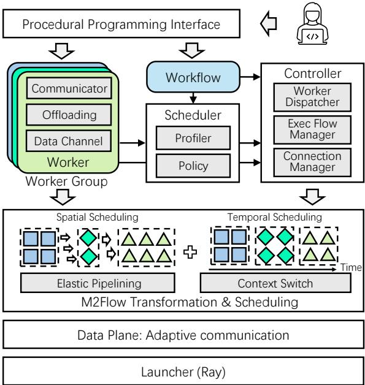
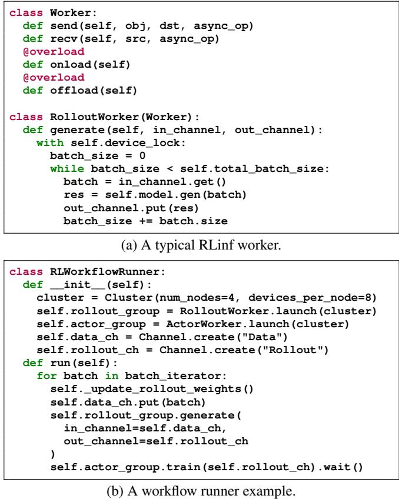
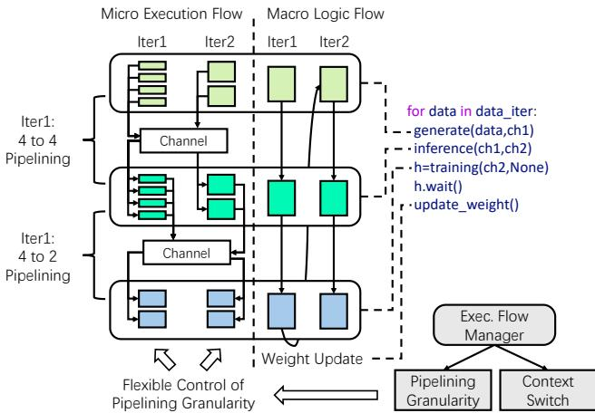
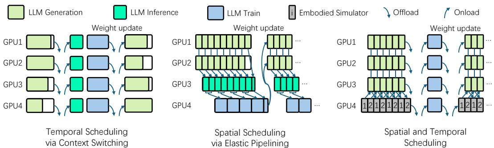
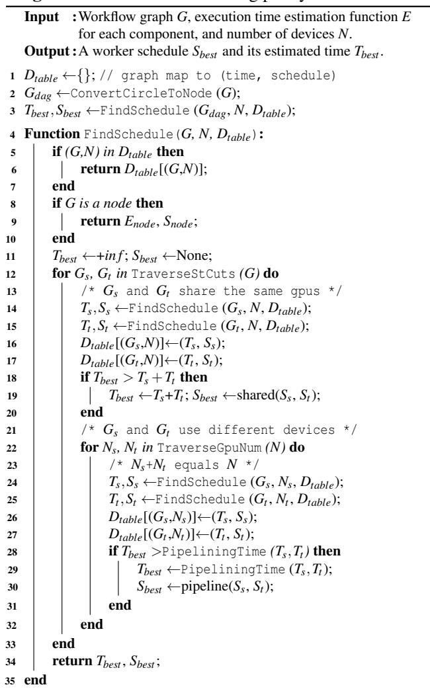

[← 返回 README](../README.md)

# 3. RLinf Design

## 📌 预览
系统设计的核心：M2Flow 范式 + Worker 抽象 + 弹性流水线 + 上下文切换 + 调度策略 + 自适应通信。这是全文最重要的 Section。

---

## 3.1 Overview

In pursuit of efficient, flexible, and intuitive RL systems, we propose a new design paradigm termed M2Flow, i.e., macro logical flow executed with micro execution flow. In this paradigm, developers program the complex RL workflow by imperatively specifying the logical communication flow among the RL components at a coarse granularity (macro logical flow), while the system automatically transforms the workflow into a fine-grained execution flow (micro execution flow). Essentially, M2Flow decouples programmable code logic from the physical execution and scheduling of the individual RL components, so as to maximize the efficiency while minimizing the programming complexity.

*Figure 4. The architecture of RLinf.*

> 💡 **Figure 4 批读 — RLinf 架构（五层）**:
> - **第一层（最上）**: Procedural Programming Interface — 用户编程层，用过程式 Python 定义 RL 工作流
> - **第二层（核心）**: Worker/WorkerGroup + Scheduler + Controller **三个并列模块**，协作关系：
>   - Worker 被 Profiler 采集运行数据 → 送给 Scheduler 的 Policy 做调度决策 → 决策交给 Controller 执行（分配 GPU、管理连接、调度执行流）
>   - Workflow 逻辑同时输入给 Scheduler 和 Controller
> - **第三层**: M2Flow Transformation & Scheduling — Elastic Pipelining（空间）+ Context Switch（时间）的实际执行
> - **第四层**: Data Plane: Adaptive Communication（P2P、Data Channel、自动选后端）
> - **第五层（最下）**: Launcher (Ray) — 集群管理和远程 worker 进程启动
> - **关键**: 用户只接触第一层，系统自动处理第二至五层

---

## 3.2 Workflow Construction Interface

The design philosophy of RLinf is to maximize system flexibility to achieve high efficiency. Unlike traditional graph-based declarative programming [1] that sacrifices control flow flexibility, debuggability and transparency for optimization opportunity, RLinf adopts a procedural programming paradigm that enables developers to flexibly express workflows imperatively.

*Figure 5. RLinf workflow programming interface: (a) Worker 实现, (b) Workflow Runner。*

> 💡 **Figure 5 批读 — 编程接口**:
> - **(a) Worker 类**: 继承 `Worker` 基类，实现核心逻辑 + `onload`/`offload`（GPU 资源管理）
> - **(b) Workflow Runner**: ~100 行代码即可定义完整的 RL 工作流
> - **关键设计**: `WorkerGroup` 抽象 + 异步函数返回 handle + `data_channel` 解耦控制流和数据流
> - 比 veRL 的 API 更简洁，且不需要修改代码就能切换执行模式

---

## 3.3 M2Flow Transformation

The key idea of M2Flow transformation is to control the spatial and temporal scheduling of workers by throttling their data processing granularity and concurrent resource accesses, respectively.

*Figure 6. M2Flow execution logic: 输入数据可被切分为不同粒度的 chunk，实现灵活流水线。*

> 💡 **Figure 6 批读**:
> - 用户写的是简单的 for 循环（macro）
> - 系统将输入数据切成 chunk → rollout 处理一个 chunk 后立即发送给 inference → 流水线
> - chunk 大小可调：小 chunk = 更早开始下游 = 更好的流水线；大 chunk = 更高吞吐
> - 设备锁（device_lock）自动管理 GPU 资源的加载/卸载

---

**Spatial Scheduling via Elastic Pipelining.** For spatial scheduling, workers can be executed in a pipelined manner with different number of accelerators/devices. To maximize pipeline flexibility, RLinf introduces elastic pipelining to enable workers to flexibly process data at different granularity with the given device resources. Elastic pipelining builds upon our insight that in RL training and agentic scenarios, most workers follow the SPMD pattern, allowing execution across varying batch sizes.

> 💡 **弹性流水线**:
> - 核心洞察：大多数 RL worker 支持 SPMD（可处理任意 batch size）
> - 因此可以动态调整数据粒度：output 一个 batch 就发给下游 → 实现灵活流水线
> - 调度空间进一步受 worker 内部语义影响：training 有 micro-batch 和 global-batch 概念

---

**Temporal Scheduling via Automatic Context Switching.** Beyond spatial scheduling, RLinf also supports natural temporal multiplexing of devices via automatic context switching. Context switching enables workers that cannot co-reside in the same accelerators with limited device resources (e.g., GPU memory) to share devices by executing sequentially. In RLinf, this is realized via a distributed device lock of the data channel facility.

> 💡 **自动上下文切换**:
> - 用分布式设备锁（device_lock）实现 GPU 时分复用
> - 工作流程：获取锁 → onload（加载到 GPU）→ 执行 → 释放锁 → offload（卸载到 CPU）
> - 锁的优先级由数据依赖决定：子 worker 只有在父 worker enqueue 数据后才能获取锁 → 避免死锁
> - 智能跳过：如果两个 worker 在不同 GPU 上，不需要 offload/onload

---

*Figure 7. 三种调度模式：Temporal（时间共享）、Spatial（空间流水线）、Hybrid（混合）。*

> 💡 **Figure 7 批读 — 三种执行模式**:
> | 模式 | 做法 | 适用场景 | 优缺点 |
> |------|------|---------|--------|
> | **Temporal** | 所有 worker 共享所有 GPU，顺序执行 | 大模型必须用所有 GPU | 简单但有长尾问题 |
> | **Spatial** | worker 分配到不同 GPU，流水线执行 | 组件计算量均衡 | 高效但资源分配难 |
> | **Hybrid** | 部分流水线 + 部分时分 | Embodied RL 等复杂场景 | 最灵活，需自动调度 |
>
> **关键**: M2Flow 让用户写同一份代码，系统自动选择最优模式

---

## 3.4 Scheduling Policy

RLinf introduces two modules: the profiler and the scheduler.

**Profiler.** The profiler measures each component's execution time and memory usage under different data parallel sizes. With the profiled data, the profiler extrapolates the execution time and memory usage for larger data parallel sizes using polynomial extrapolation, outputting an execution time estimation function $E$ for each component.

**Scheduler.** The scheduling policy recursively partitions the workflow graph into two subgraphs, $G_s$ and $G_t$, connected by directed edges known as the s-t cuts. For each partition, it evaluates the time cost of both the temporal and spatial scheduling policies.

*Algorithm 1. Worker scheduling policy: 递归分割工作流图，搜索最优时空调度。*

> 💡 **调度算法核心**:
> 1. 将工作流图的循环折叠为单节点
> 2. 递归地对图做 s-t cut 分割成 $G_s$ 和 $G_t$
> 3. 对每种分割，评估两种策略：
>    - **Temporal**: $T = T_s + T_t$（顺序执行，加上 offload/onload 开销）
>    - **Spatial**: $T = T_{critical} + (M/m - 1) \times T_{bottleneck}$（流水线）
> 4. 选最快的，递归直到单节点
> 5. 用动态规划缓存子问题结果，搜索时间 <6s（1024 GPU）

---

## 3.5 Adaptive Communication

RLinf's communication layer needs to realize two key design goals: (1) **Flexible** — any two workers should be able to communicate regardless of placement; (2) **Adaptive** — communication primitives should adapt to arbitrary data in different devices.

**Communication Protocol and Primitives.** RLinf features transparent connection lifecycle management. Upon launch, each worker's placement, IP and port information will be registered into a global worker manager. Connections are established lazily when workers invoke communication primitives.

RLinf's primitives automatically exploit worker and data placement information to select the most efficient communication backend:
- **NCCL** for GPU-GPU communication
- **Zero-copy cudaIPC** for intra-GPU communication
- **Gloo** for CPU communication

**Load-Balancing Data Channel.** A high-level FIFO queue-like communication facility for producer-consumer worker communication. Supports both CPU and GPU data, offloading GPU data to CPU to reduce memory consumption, and load-balancing across multiple consumers.

> 💡 **通信层设计亮点**:
> - **懒连接**: 不预先建立所有连接，按需建立 → 减少开销
> - **自动选后端**: 根据数据位置（GPU/CPU）和 worker 位置自动选 NCCL/cudaIPC/Gloo
> - **结构感知序列化**: 复杂 Python 对象直接通信，data buffer 零拷贝传输
> - **Data Channel**: 解耦生产者-消费者，支持负载均衡

---

## 🔖 Section 总结

### 整体架构流程表

| 层次 | 组件 | 功能 |
|------|------|------|
| 编程层 | Workflow Interface | 用户用 ~100 行 Python 定义 RL 工作流 |
| 抽象层 | Worker + WorkerGroup | 封装 RL 组件，支持 onload/offload |
| 调度层 | Profiler + Scheduler | 自动 profiling → s-t cut 递归搜索最优模式 |
| 执行层 | Controller + Elastic Pipeline + Context Switch | 分配 GPU、管理流水线粒度、时分复用 |
| 通信层 | Adaptive Communication + Data Channel | 自动选后端、负载均衡、解耦控制/数据流 |

### 关键设计选择

**设计 1: 过程式编程而非声明式图**
- 原因：声明式图（如 TensorFlow）牺牲灵活性和可调试性
- 好处：开发者保持直觉、可 debug、可用 Python 控制流

**设计 2: 弹性流水线（数据粒度可调）**
- 原因：固定粒度的流水线无法适应所有场景
- 好处：小 chunk = 低延迟启动，大 chunk = 高吞吐

**设计 3: 设备锁而非手动资源管理**
- 原因：手动管 onload/offload 太复杂
- 好处：自动根据数据依赖管理 GPU 内存
