[← 返回 README](../README.md)

# 5. Evaluation

## 📌 预览
在 Reasoning RL（Qwen2.5 GRPO/PPO, Qwen3 MoE）和 Embodied RL（ManiSkill, LIBERO）上全面评测，对比 veRL、Slime、SimpleVLA-RL。

---

## 5.1 End-to-End Experiments

**Hardware**: 32 nodes × 8 H100-80GB GPUs, NVLink + 400Gbps RoCEv2.

### 5.1.1 Reasoning RL Training

**Qwen2.5 with GRPO.** We evaluate the Qwen2.5 1.5B, 7B, and 32B dense models on 64, 128, and 256 GPUs, respectively, using a rollout batch size of 512 and maximum sequence length 28672.

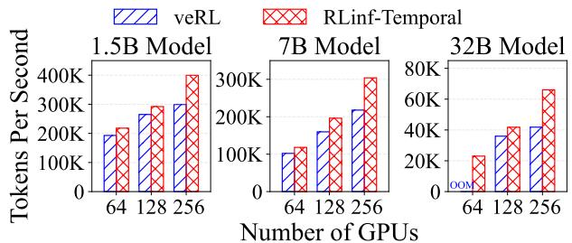
*Figure 8. GRPO training throughput of Qwen2.5 on RLinf vs veRL.*

> 💡 **Figure 8 批读 — GRPO 结果**:
>
> | 对比项 | 数据 | 说明 |
> |-------|------|------|
> | RLinf-Temporal vs veRL (1.5B) | 1.10x~1.58x | GPU 内存管理更优 → 更大 KV cache |
> | RLinf-Temporal vs veRL (7B) | 类似趋势 | inference 同步开销更小 |
> | veRL 扩展性差 | inference 从 15.2%→19.9% | GPU 越多，inference 瓶颈越大 |
> | RLinf-Spatial vs veRL (GRPO) | -44.3~-68.6% | **空间模式在 GRPO 上反而更差！** |
>
> **关键发现**: GRPO 场景下 Temporal 模式更优（因为长序列 28672，spatial 模式 training 等待首批 rollout 太久）

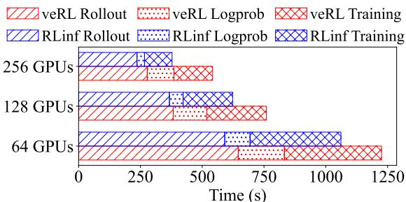
*Figure 9. Qwen2.5 7B 的延迟分解。*

> 💡 **Figure 9 批读**: RLinf-Temporal 在 "Others"（context switch、resharding、同步）上比 veRL 快很多，这是主要加速来源。

---

**Qwen2.5 with PPO.** We train PPO with Qwen2.5 as both the actor and critic, using model sizes of 1.5B, 7B, and 14B, scaling from 16 to 256 GPUs. RLinf-Spatial allocates GPUs in a 4:1:1:1:1 ratio for rollout, actor inference, actor training, critic inference, and critic training.

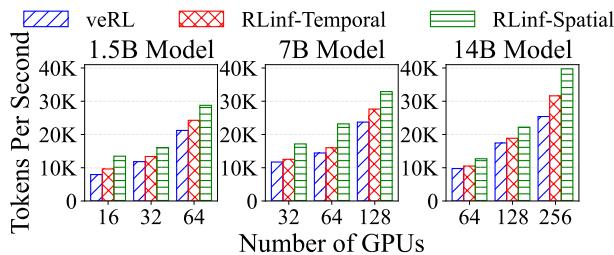
*Figure 10. PPO training throughput of Qwen2.5 on RLinf vs veRL.*

> 💡 **Figure 10 批读 — PPO 结果（与 GRPO 完全相反！）**:
>
> | 对比项 | 数据 | 说明 |
> |-------|------|------|
> | RLinf-Spatial vs veRL (1.5B, 16GPU) | +69.6% | 空间模式大幅优于 veRL |
> | RLinf-Spatial vs RLinf-Temporal (1.5B) | +19~40% | **PPO 下空间模式更优** |
> | RLinf-Spatial vs veRL (7B) | +38.7~60.7% | rollout 和 training 有效重叠 |
>
> **关键发现**: PPO 有 5 个组件（actor gen/inf/train + critic inf/train），空间流水线能有效重叠它们。与 GRPO（3 个组件，长序列）完全不同的最优模式！
>
> **这正是 M2Flow 自动调度的价值**: 同一个框架自动选出不同算法的最优模式。

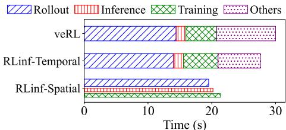
*Figure 11. Qwen2.5 7B PPO 在 32 GPU 上的延迟分解。*

> 💡 **Figure 11 批读**: Spatial 模式虽然 rollout 慢 39.3%（GPU 少了），但 inference+training 与 rollout 重叠执行，总时间反而更短。

---

**Qwen3-30B-A3B with GRPO.** We evaluate the MoE model on 32, 64, and 128 GPUs. We compare against Slime (spatial) and Slime-Colocate (temporal).

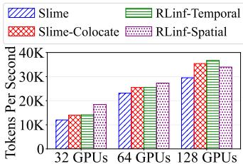
*Figure 12. Qwen3 MoE 的 RL 训练吞吐量。*

> 💡 **Figure 12 批读**:
> - Slime（纯空间，无流水线）最慢——没有重叠
> - 32/64 GPU: RLinf-Spatial 比 Slime-Colocate 快 31.2%/7.2%（KV cache 不受 training 内存挤压）
> - 128 GPU: RLinf-Temporal 反而更好（spatial 模式下 rollout-training 重叠不够）

---

### 5.1.2 Embodied RL Training

**ManiSkill environment.** We train OpenVLA on "PutCarrotOnPlateInScene-v2" using 256 parallel environments.

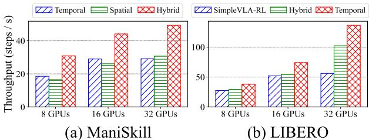
*Figure 14. Embodied RL 端到端吞吐量。*

> 💡 **Figure 14 批读**:
>
> | 环境 | 最优模式 | 加速比 | 原因 |
> |------|---------|--------|------|
> | **ManiSkill** | Hybrid | 1.52~1.87x vs Temporal | Simulator 独占 GPU + Training 时分共享 |
> | **LIBERO** | Temporal | 1.38~2.43x vs SimpleVLA-RL | LIBERO 是 CPU 密集型，独占 GPU 浪费 CPU |
>
> **关键发现**: 两个 embodied 环境的最优模式完全不同！
> - ManiSkill (GPU 渲染) → Hybrid 最优
> - LIBERO (CPU 物理模拟) → Temporal 最优
> - 再次验证了自动调度的必要性

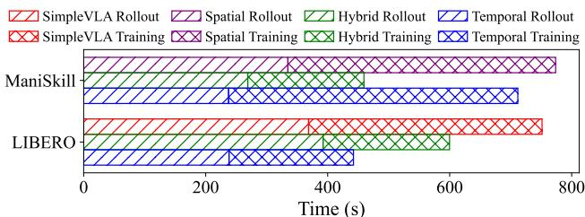
*Figure 15. ManiSkill 和 LIBERO 的延迟分解。*

---

## 5.2 Effectiveness of Search Policy

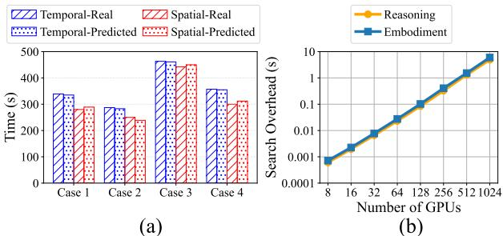
*Figure 16. (a) 预测延迟 vs 实际延迟。(b) 搜索开销 vs GPU 数量。*

> 💡 **Figure 16 批读**:
> - **预测精度**: Temporal 模式 <2% 误差，Spatial <5% 误差（流水线不均衡导致）
> - **搜索速度**: 8 GPU → 0.0007s, 1024 GPU → 5.98s（指数增长但仍可接受）
> - 误差足够小，不会改变模式排序 → 调度策略可靠

---

## 5.3 Model Performance

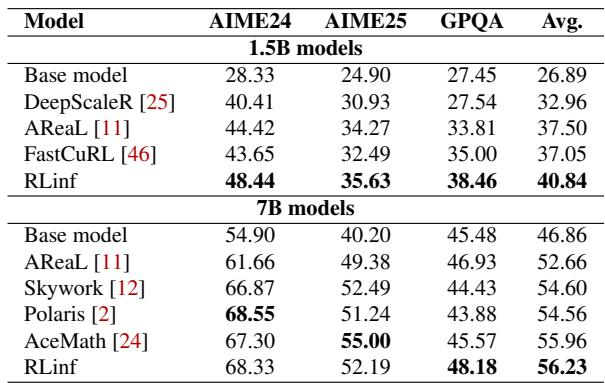
*Table 1. RLinf 训练的 1.5B/7B 模型在 AIME24/25 和 GPQA 上的评分。*

> 💡 **Table 1 批读**:
> | 对比项 | 数据 | 说明 |
> |-------|------|------|
> | RLinf 1.5B vs AReaL | 40.84 vs 37.50 (Avg) | +3.34，全面超越 |
> | RLinf 7B vs AceMath | 56.23 vs 55.96 (Avg) | 接近 SOTA，GPQA 最高 (48.18) |

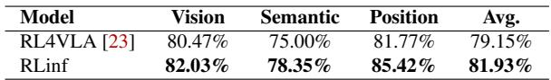
*Table 2. OpenVLA 在 ManiSkill3 上的成功率。*

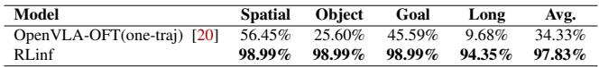
*Table 3. OpenVLA-OFT 在 LIBERO 上 RL 训练后的成功率。*

> 💡 **Table 2+3 批读 — Embodied RL 效果**:
> | 对比项 | 数据 | 说明 |
> |-------|------|------|
> | RLinf vs RL4VLA (ManiSkill) | 81.93% vs 79.15% | 略优 |
> | RLinf vs SimpleVLA-RL (LIBERO Avg) | **97.83% vs 34.33%** | 巨大提升！ |
> | RLinf LIBERO-Long | 94.35% vs 9.68% | Long horizon 任务提升 10x |
>
> **LIBERO 上 97.83% vs 34.33% 的差距**: 不仅是系统加速，RLinf 的更高效训练允许更多迭代 → 模型性能更好

---

## 🔖 Section 总结

### 关键数字速查
| 指标 | 数值 |
|------|------|
| GRPO 加速 (vs veRL) | 1.10x ~ 1.58x (Temporal) |
| PPO 加速 (vs veRL) | 1.27x ~ 1.70x (Spatial) |
| MoE GRPO 加速 (vs Slime) | 1.07x ~ 1.31x |
| ManiSkill Hybrid 加速 | 1.52x ~ 1.87x vs Temporal |
| LIBERO 加速 (vs SimpleVLA-RL) | 1.38x ~ 2.43x |
| 调度搜索时间 | 0.0007s ~ 5.98s |
| LIBERO 成功率 | 97.83% (RLinf) vs 34.33% (baseline) |

### 核心洞察
1. **不同 RL 算法/场景的最优执行模式完全不同**: GRPO→Temporal, PPO→Spatial, ManiSkill→Hybrid, LIBERO→Temporal
2. 这证明了 M2Flow 自动调度的核心价值——手动选模式根本不可行
3. 系统效率直接影响模型质量（LIBERO: 97.83% vs 34.33%）
