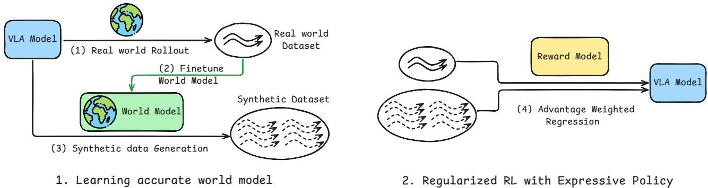

[← 返回 README](../README.md)

# 4. Co-Improvement of VLA and World Model

## 📌 预览

方法分三个子部分：4.1 用 real rollout fine-tune World Model（含 Reward Model fine-tune）；4.2 用 World Model 生成合成数据 fine-tune VLA Policy；4.3 把整个 pipeline 与正则化 RL 框架（AWR）联系起来给理论背书。最后是 Algorithm 1 伪代码。

---

In this section, we describe the details of our method. The overall pipeline consists of the following steps:

1. World model post-training (Sec. 4.1): We finetune the world model $M$ using real-world rollout data $\mathcal{D}_{\mathrm{real}}$, jointly training it with the original DROID dataset $\mathcal{D}_{\mathrm{DROID}}$ to maintain broad coverage. In addition, we finetune the vision-language reward model $R$ on $\mathcal{D}_{\mathrm{real}}$ to improve reward accuracy.
2. VLA policy post-training (Sec. 4.2): Using the updated world model, we generate a synthetic dataset $\mathcal{D}_{\mathrm{syn}}$ and apply the reward model $R$ to identify successful trajectories, yielding a filtered dataset $\mathcal{D}_{\mathrm{syn}}^+$. This dataset is then used to finetune the VLA policy.
3. We alternate between Steps 1 and 2, iteratively improving both the world model and the policy.

The overall pipeline is summarized in Algorithm 1 and Figure 3. In Sec. 4.3, we provide a detailed analysis showing that our update procedure can be interpreted as an approximation to policy optimization under a regularized reinforcement learning framework.

> 💡 **三个可学习组件**：World Model、Reward Model、VLA Policy——三者被同一批 real rollout 数据驱动，轮流更新，形成 EM 风格的迭代优化。注意：Reward Model 只在第一次迭代 fine-tune，之后固定。


*Figure 3: Detailed pipeline for VLAW: (1) Roll out policy in real world to collect online trajectories. (2) Fine-tune pretrained world model on policy rollout data. (3) Generate large-scale synthetic trajectories via closed-loop policy-world model interaction. (4) Optimize VLA policy using real-world and synthetic data, with reward assessed by vision–language reward model.*

> 💡 **Figure 3 批读**：四步 pipeline 的详细示意图。关键细节：
> - Step (2) 中 fine-tune 的是 pretrained Ctrl-World，而不是从头训练
> - Step (3) 中 policy 和 world model 的 closed-loop 是「policy 在 imagination 里跑步」
> - Step (4) 中 reward model 对合成轨迹打分，过滤出 success 轨迹才用于训练
> - 整个流程：50 real rollouts → grounded world model → 500 synthetic rollouts → filtered success set → policy update

---

### 4.1. World Model Learning with Real Roll-outs

**Real World Policy Roll-outs.** Previous work has identified two major challenges in learning effective world models: (1) over-optimism, as training data is dominated by successful demonstrations; and (2) limited physical fidelity, particularly when modeling complex dynamics involving frequent contacts or deformable objects.

To address these issues, we get $K$ trajectories by rolling out the policy in the real world, forming a dataset $\mathcal{D}_{\mathrm{real}} = \{\tau_{\mathrm{real}}^1, ..., \tau_{\mathrm{real}}^K\}$, we also assign a sparse reward $r_\tau \in \{0, 1\}$ to each trajectory to indicate success or not every time we reset robot.

> 💡 **$K = 50$ per task**（见 Sec. 5.1），5 类任务共 250 条真实 rollout。这个数字相对较少——能用这么少的 real rollout 撬动如此大的提升，是本文的核心卖点之一。同时，收集 250 条 rollout 仍然需要一定人力（每条都需要 reset 环境），后文没有报告这需要多少时间。

**Training Objective.** $\mathcal{D}_{\mathrm{real}}$ captures diverse physical interactions encountered during execution, including both success and failure cases, and is used to finetune a pretrained world model. Specifically, we initialize from the pretrained CtrlWorld model (Guo et al., 2025a), a strong diffusion-based world model trained on the full DROID dataset $\mathcal{D}_{\mathrm{DROID}}$. Finetuning on the online rollout dataset $\mathcal{D}_{\mathrm{real}}$ follows the original diffusion objective (Blattmann et al., 2023):

$$\mathcal{L}_{\mathcal{D}_{\mathrm{real}}} = \mathbb{E}_{x_0, \epsilon, t'} \left\| \hat{x}_0(x_{t'}, t', c) - x_0 \right\|^2$$

where the prediction target $x_0 = o_{t+1:t+H}$ is sampled from $\mathcal{D}_{\mathrm{real}}$, $x_{t'} = \sqrt{\bar{\alpha}_{t'}} x_0 + \sqrt{1-\bar{\alpha}_{t'}} \epsilon_{t'}$ denotes the noised future at diffusion step $t' \in [0, T']$ under the noise schedule $\bar{\alpha}_{t'}$, and $c$ represents all conditioning inputs, including the action chunk $a_{t:t+H}$ and the current observation $o_t$.

> 💡 **Loss 完全标准**：就是 Stable Video Diffusion（Blattmann et al. 2023）的标准 diffusion denoising loss，没有任何特殊设计。核心贡献**完全来自训练数据的改变**（加入 failure rollout），不是 loss function 或 model architecture 的创新。这是「数据为王」论点的一个典型案例。

**Progressively Growing Dataset and Co-training.** During successive iterations, we continuously append newly collected real-world trajectories into the dataset: $\mathcal{D}_{\mathrm{real}} = \mathcal{D}_{\mathrm{real}} \cup \tau_{\mathrm{real}}^i$. To prevent overfitting to the limited online rollout data, we also co-train with the original DROID dataset $\mathcal{D}_{\mathrm{DROID}}$ for regularization. The final training objective is:

$$\mathcal{L} = \mathcal{L}_{\mathcal{D}_{\mathrm{real}}} + \lambda \mathcal{L}_{\mathcal{D}_{\mathrm{DROID}}}$$

where $\lambda$ controls the strength of the regularization.

> 💡 **Co-training 的必要性**：直接只在 50 条 rollout 上 fine-tune 几乎必然 overfit（50 条数据对一个大型 diffusion model 来说极少）。加入 DROID 全量数据做 co-training 是合理的正则化手段。
>
> **遗漏的 ablation**：$\lambda$ 具体取值和对结果的敏感度，论文未报告——这是一个小遗漏。

**Finetuning Reward Model.** To keep our pipeline simple and scalable, we leverage a general-purpose vision-language model, Qwen3-VL-4B-Instruct (Team, 2025a; Lee et al., 2026), to assess whether a trajectory succeeds or not. However, we find that the zero-shot VLM is not accurate enough, so in the first iteration, we fine-tune the VLM with the success labels $r_\tau$ in $\mathcal{D}_{\mathrm{real}}$.

In implementation, the reward model takes as input a trajectory video $\tau_{\mathrm{real}}^i$ together with a query asking whether the task instruction $I^i$ is successfully completed. We classify a trajectory as successful if the probability assigned to the 'yes' token exceeds a threshold $\alpha$. By adjusting $\alpha$, we can make the reward model more or less conservative.

$$R(\tau^i) = \mathbf{1}\left[P(\textsf{yes} \mid \tau^i, I^i) > \alpha\right]$$

> 💡 **Threshold 的作用（关键细节）**：直接输出 yes/no 会 FP 过多（见 Appendix C：FP=8）；设 $\alpha=0.8$ 后 FP 降到 2。
> - **FP（把失败判成成功）的危害**：用错误标注的「成功」轨迹训练 policy，会污染学习信号
> - **FN（把成功判成失败）的代价**：损失部分有效训练数据，但不会引入错误的学习信号
>
> 所以宁可保守（高 threshold），牺牲 recall（FN 增加），换取 precision（FP 减少）。代价是约 55% 的真实成功轨迹被丢弃（Appendix C）。

---

### 4.2. Iterative Improvement for VLA Policy

**Scalable Training Pipeline.** Once we have a good learned world model and reward model, then we can use it to cheaply generate a large amount of synthetic data. In principle, many different algorithms could be used to leverage this data, including a variety of sophisticated reinforcement learning methods. Because we want to easily scale to large, flow-matching based VLA policies, we choose to use the one of the simplest possible methods for incorporating this synthetic data.

Specifically, we generate $N$ trajectories by rolling out the policy in imagination: $\mathcal{D}_{\mathrm{syn}} = \{\tau_{syn}^1, ..., \tau_{syn}^N\}$. We then apply the finetuned reward model to identify successful trajectories and construct a filtered dataset containing only success cases: $\mathcal{D}_{\mathrm{syn}}^+ = \{\tau_{syn}^{i_1}, ..., \tau_{syn}^{i_n}\}$, where $i_1, ..., i_n$ is the index of success trajectory.

> 💡 **$N = 500$ per task**（5 类任务共 2500 条合成轨迹）：是 real rollout（250 条）的 10 倍。这是数据放大的核心——World Model 生成的成本远低于真实 rollout，可以大量生成然后用 reward model 筛选。

**Policy Learning Objective.** We update the $\pi_{0.5}$ policy using a weighted flow-matching objective over both real-world rollouts and world-model–generated data. After filtering for successful trajectories, we assign a binary weight $w(o, a) = 1$ to transitions from successful trajectories and $w(o, a) = 0$ to transitions from failed trajectories:

$$\mathcal{L} = \mathbb{E}_{(o,a) \sim \mathcal{D}_{\mathrm{syn}} \cup \mathcal{D}_{\mathrm{real}}} w(o,a) \mathcal{L}_{\mathrm{FM}}(\theta; o, a) = \mathbb{E}_{(o,a) \sim \mathcal{D}_{\mathrm{syn}}^+ \cup \mathcal{D}_{\mathrm{real}}^+} \mathcal{L}_{\mathrm{FM}}(\theta; o, a)$$

where $\mathcal{L}_{\mathrm{FM}}(\theta; o, a)$ denotes the flow-matching loss for an observation–action pair $(o, a)$.

> 💡 **本质是「在成功轨迹上做 BC」**：binary weight（0/1），没有连续的 advantage 加权，没有 contrastive 负样本。理论上不如 AWR（advantage-weighted regression），但实践中稳定且有效。
>
> **与 Filtered BC baseline 的唯一差别**：baseline 只有 50 条 real success 轨迹，VLAW 额外有 500 条合成 success 轨迹（经 reward model 过滤）。11.6% 的性能差距完全来自这些合成数据的质量。

---

### 4.3. Relation to Regularized Reinforcement Learning

In this subsection, we show that the policy update in Eq. 4 can be view as policy optimization under a regularized reinforcement learning (RL) framework (Peng et al., 2019) with certain approximations.

Under the regularized RL setting, we constrains the learned policy to remain close to a reference policy $\pi_{\mathrm{ref}}$ while optimizing reward. This yields the following regularized objective:

$$J(\theta) = \mathbb{E}_{\tau \sim \rho_{\pi_\theta}}[R(\tau)] - \beta \mathbb{E}_{o \sim \rho_{\pi_\theta}}[D(\pi_\theta(\cdot \mid o) \| \pi_{\mathrm{ref}}(\cdot \mid o))]$$

where $D(\cdot \| \cdot)$ denotes a KL divergence measure and $\beta > 0$ controls the strength of the regularization. The optimal improved policy admits a closed-form solution given by:

$$\pi^*(a \mid o) \propto w(o,a) \pi_{\mathrm{ref}}(a \mid o), \quad w(o,a) = \exp\left(\frac{A^{\pi_{\mathrm{ref}}}(o,a)}{\beta}\right)$$

where $\pi_{\mathrm{ref}}$ denotes a reference policy, and $A^{\pi_{\mathrm{ref}}}(o,a)$ is the corresponding advantage function, and $\beta$ is a temperature parameter controlling the strength of the regularization. We can define a surrogate divergence which measures how well $\pi_\theta$ matches samples drawn from $\pi^*$ under the flow-matching loss:

$$D_{\mathrm{FM}}(\pi^*(\cdot \mid o), \pi_\theta(\cdot \mid o)) \triangleq \mathbb{E}_{a \sim \pi^*(\cdot \mid o)} \left[ \mathcal{L}_{\mathrm{FM}}(\theta; o, a) \right]$$

Using this divergence, we can project policy to the optimal solution with:

$$\theta^* = \arg\min_\theta \mathbb{E}_{(o,a) \sim \mathcal{D}} \left[ w(o,a) \mathcal{L}_{\mathrm{FM}}(\theta; o, a) \right]$$

which is the weighted regression objective used in our policy update equation 4. More detailed derivations are provided in Appendix A.

> 💡 **这一节的价值与局限**：
> - **价值**：把「在成功轨迹上做 BC」这一 heuristic 与 AWR（Peng et al. 2019）正式联系起来，增强理论背书
> - **三个近似叠加，保证较弱**：
>   1. binary weight（0/1）≈ $\exp(A/\beta)$：粗糙近似，连续加权理论上更优
>   2. $\gamma \to 1$（不 discount 未来奖励）：长视野任务可能不合适
>   3. offline 数据 ≈ on-policy 采样：标准 offline RL 近似
> - 这一节更像「事后理论解释」而非「从理论推导方法」，与其说是贡献，不如说是增强可读性

---

### Algorithm 1: VLAW

```
Require: Pretrained VLA policy π_θ; pretrained world model M_φ; reward model R;
         real-world rollout budget K; synthetic rollout budget N;
         iterations K_iter; reward threshold α
Output: Post-trained policy π_θ and world model M_φ

1:  Initialize real-world dataset D_real ← ∅
2:  for i = 1 to K_iter do
3:    (1) Real-world rollouts
4:    Roll out π_θ in the real world to collect τ¹_real, ..., τᴷ_real
5:    Append collected trajectories to D_real, success trajectories in D⁺_real
6:    (2) World model and reward model post-training
7:    Update M_φ using D_real and D_DROID according to Eq.(1) and Eq.(2)
8:    (3) Synthetic rollout generation with reward label
9:    Roll out π_θ in M_φ to generate D_syn = {τ¹_syn, ..., τᴺ_syn}
10:   Apply reward model R with threshold α (Eq.(3)) to obtain D⁺_syn
11:   (4) Policy post-training
12:   Update π_θ on D⁺_real ∪ D⁺_syn using the flow-matching objective in Eq.(4)
13: end for
14: return π_θ, M_φ
```

> 💡 **超参数一览（见 Section 5.1）**：
>
> | 超参数 | 值 |
> |--------|-----|
> | K（real rollout / task / iter） | 50 |
> | N（synthetic rollout / task / iter） | 500 |
> | K_iter（迭代次数） | 2 |
> | α（reward threshold） | 0.8 |
> | World model fine-tune steps | 50K |
> | Policy fine-tune steps | 2K（batch size 256） |
>
> **注意**：Reward model 只在第 1 次迭代时 fine-tune（Algorithm 第 7 行实际上包含了这步，但 policy 更新 Eq.4 每次迭代都做）。

---

## 🔖 Section 总结

### 关键数字速查

| 参数 | 值 |
|------|-----|
| Real rollout / task / iter | 50 条 |
| Synthetic rollout / task / iter | 500 条（10× 数据放大） |
| 迭代次数 | 2 轮 |
| Reward threshold | 0.8（保守型，减少 FP） |

### 核心洞察
1. 方法核心：**训练数据分布变化**（加 failure rollout）而非 model 改动
2. 三个近似让 weighted BC ≈ AWR，给方法理论背书但保证较弱
3. Closed-loop imagination 提供 10× 数据放大，是 policy 提升的主要来源
4. 最关键的缺失 ablation：没有测「直接用 pretrained Ctrl-World 生成数据（不 fine-tune）」的效果
