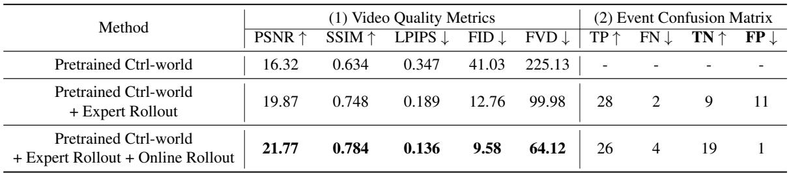
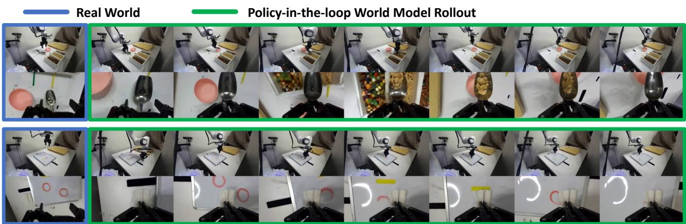
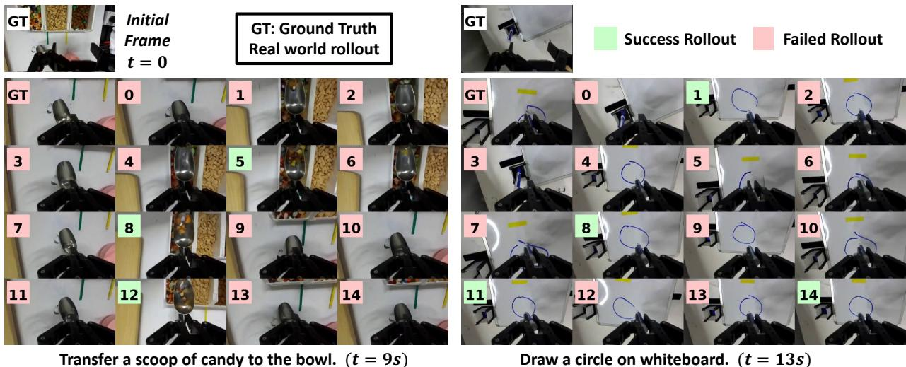
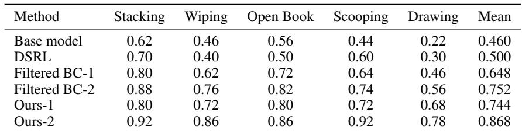
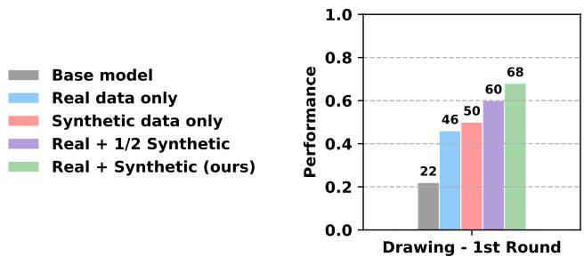

[← 返回 README](../README.md)

# 5. Experiments

## 📌 预览

实验分三个核心问题：① World model 质量（能否准确建模 contact-rich 任务的成功与失败）；② 合成数据有效性（能否真正提升 VLA policy 性能）；③ 迭代改进的持续性（两轮后效果如何）。用 DROID 平台 + Franka Panda，5 类 contact-rich 任务，每类 50 次评估。

---

In this section, we conduct extensive experiments on complex real-world tasks involving frequent collisions and deformable objects. Our experiments are designed to answer the following questions:

1. Can we learn a high-fidelity action-conditioned world model for contact-rich and deformable-object tasks that accurately models both successful and failed trajectories?
2. Can the synthetic data generated by the world model improve VLA policy performance?
3. Can the policy and world model be continuously improved through an iterative training process in a multi-task setting?

---

### 5.1. Experimental Settings

**Setups and Tasks.** We conduct experiments on the DROID platform (Khazatsky et al., 2024). In the DROID setup, a Franka Panda arm is equipped with a Robotiq gripper. Observations are captured using two third-person cameras and one wrist-mounted camera, as illustrated in Figure 4. We evaluate our method on five categories of contact-rich tasks, described below. More task details can be found in Appendix B.

- **Stacking**: Four colored blocks are randomly placed on the table at the beginning of each episode. The robot receives the instruction: "stack block A on block B," where $A, B \in$ {red, green, blue, yellow}.
- **Open Book**: A book is randomly placed on the table at the start of each episode. We evaluate performance across four different books. The robot is instructed to "open the book cover."
- **Erase Marks**: One to three marker drawings are randomly drawn on a whiteboard. The robot receives the instruction: "erase all marks using a tissue."
- **Scooping**: The robot uses a scoop to transfer snacks into a bowl. Both the scoop and the bowl are randomly placed within the workspace. The instruction is: "transfer some A to the bowl," where $A \in$ {peanuts, candies, almonds}.
- **Drawing**: The robot is instructed to draw a complete circle on a whiteboard using a marker.

*Figure 4: Our experiments are conducted on the DROID platform and cover five task categories. These tasks involve complex physical interactions, including frequent contact and deformable objects, which are challenging to model in traditional simulations.*

> 💡 **任务选择的用意**：这 5 个任务都有明确的物理接触要求——积木要稳定叠放、书皮要翻开、纸巾要真的擦掉笔迹、勺子要真的装进食物、笔要在白板上画出闭合圆。这类任务在传统仿真（MuJoCo 等）里极难建模（deformable objects、摩擦力高度依赖于接触细节），是 world model 最难处理的场景，也正是本文方法最能体现价值的地方。

**Base Models and Hyperparameters.** We use $\pi_{0.5}$ (Intelligence et al., 2025b) as the base vision–language–action (VLA) model and Ctrl-World (Guo et al., 2025a) as the base world model. For each task category, we collect 25 expert demonstrations and finetune $\pi_{0.5}$ on this data to warm-start the policy, which serves as our base policy. The reward model is initialized from Qwen3-VL-4B-Instruct (Team, 2025a).

> 💡 **Base policy 不是零起点**：先用 25 条 expert demo fine-tune π₀.₅ 作为 base policy，而不是直接用 pretrained π₀.₅。这意味着 base policy 已经对任务有基本理解，VLAW 是在此基础上的进一步提升。好处是能更清晰地衡量 VLAW 的边际贡献；但也意味着实验起点需要额外准备 25 条 demo（每类任务），这部分数据成本论文未单独讨论。

In each iteration, we roll out 50 trajectories per task category in the real world. We finetune the world model for 50K training steps using these rollout trajectories. We then generate 500 synthetic trajectories per task using the updated world model to form the synthetic dataset. The reward model is additionally finetuned using rollout data from the first iteration to improve reward accuracy. The policy is updated with 2k steps with batch size 256. We perform a total of two iterations of this procedure.

> 💡 **超参数小结**：每次迭代：50 real rollouts/task × 5 tasks = 250 条；world model fine-tune 50K steps；生成 500 synthetic/task × 5 = 2500 条合成轨迹；policy fine-tune 2K steps (bs=256)。两次迭代合计约 500 条 real rollout。计算时间未报告——这是论文的一个缺失信息，影响对方法实用性的判断。

---

### 5.2. Can we learn an accurate action-conditioned world model for contact-rich tasks?

**Action replay inside the world model.** We evaluate the fidelity of the learned world model and study the contribution of online rollout data by replaying real-world action sequences inside the world model. Specifically, we randomly select a starting frame from a real-world trajectory and auto-regressively feed a 5-second sequence of recorded action chunks to the world model, starting from the same frame. We compare our post-trained world model against two baselines: the original pretrained world model and a model finetuned only on expert demonstration data.

> 💡 **Replay（open-loop）vs. Policy-in-the-loop（closed-loop）**：这里先用 open-loop replay 评估 world model 质量（固定动作序列，只看视频预测精度），比 closed-loop 更容易、误差来源更单纯。后文 5.2 末尾再做 closed-loop 的定性评估（Figure 5）。

We use two categories of metrics to quantitatively evaluate video prediction quality:

- **(1) Video distance metrics**: These include pixel-level metrics (PSNR (Hore & Ziou, 2010) and SSIM (Wang et al., 2004)) as well as learned perceptual and distributional metrics (LPIPS (Zhang et al., 2018), FID (Heusel et al., 2017), and FVD (Unterthiner et al., 2018)).
- **(2) Interaction event confusion matrix**: Correctly predicting the outcome of object interactions is the most challenging aspect of action-conditioned world modeling. We filter replayed clips that involve object interactions and classify each interaction as success or failure. We then evaluate whether the predicted outcome aligns with the real-world result.

> 💡 **两类 metric 的价值对比**：
> - 视频质量指标（PSNR 等）反映整体预测精度，但高 PSNR 不等于物理交互结果正确（背景清晰但接触结果错误）
> - **Confusion matrix 是更面向任务的评估**：直接测 world model 能不能正确预测「积木叠上去了没有」这类关键事件。这是本文实验设计的亮点，比纯视频质量指标更有说服力。

Quantitative results are reported in Table 1. Finetuning with online rollout data is crucial for world model performance: all video quality metrics improve substantially compared to both baselines. Moreover, by training on mixed success and failure trajectories, the world model largely eliminates the over-optimistic bias observed when training only on expert demonstrations. In particular, false-positive interaction predictions are significantly reduced. We provide qualitative visualizations of interaction replay in Figure 6.

*Table 1: We replay recorded action sequences in the world model. (1) Video quality metrics on 256 replayed clips, each 5 seconds long (wrist-view camera). (2) Event-level confusion matrix on 50 clips involving physical interactions.*

> 💡 **Table 1 关键发现**：
> - **视频质量**：Online rollout fine-tune 后，FVD 从 225.13 降到 64.12（↓72%），LPIPS 从 0.347 降到 0.136（↓61%）——大幅提升
> - **Confusion matrix 的核心结论**：
>   - Expert-only fine-tune：FP = 11（把 11 个失败交互预测为成功）→ 过度乐观
>   - Expert + Online Rollout：FP = **1**（↓91%）→ 几乎消除过度乐观
>   - 代价：FN 从 2 升到 4（更保守），但对 policy 训练来说可接受（FP 有害，FN 只是浪费）
>
> **一句话总结**：Online rollout（含 failure）的加入，不是小幅改进，而是让 world model 从「严重过度乐观」变成「基本准确」。

*Figure 6: Conditioned on the same initial frame and identical action sequences (five chunks), trajectories are rolled out inside different world models. The pretrained Ctrl-World model is insufficiently accurate. World models fine-tuned only on expert trajectories tend to be overly optimistic. In contrast, the world model fine-tuned on policy online rollout data accurately captures the underlying physical dynamics. Only the wrist-view camera is shown.*

> 💡 **Figure 6 批读**：三列对比（pretrained / expert-only / expert+online rollout），每行一个动作序列。最直观的对比：在某些「实际失败」的交互里，pretrained 和 expert-only world model 都预测「成功了」（物体被正确放置），而 expert+online rollout 的 world model 正确预测「失败了」。这就是 over-optimism 的可视化呈现。

**Policy-in-the-loop rollout.** We further evaluate the world model by rolling out the policy directly inside the learned model. Although evaluated tasks involve complex, contact-rich interactions, and we find that the post-trained world model maintains high visual fidelity and physical plausibility even for long-horizon rollouts of up to 20 seconds. Example rollouts are shown in Figure 5. This long-horizon stability enables effective search for successful trajectories within the world model, which we subsequently leverage for policy improvement.

*Figure 5: Examples of long-horizon policy-in-the-loop rollouts within the world model starting from the initial observation. The policy π₀.₅ is rolled out for 20 iterations (20 seconds). The post-trained world model accurately captures contact-rich physical dynamics. Top: scooping peanuts into a new bowl. Bottom: erasing marker drawings with a tissue.*

> 💡 **Figure 5 批读**：两个任务的 closed-loop rollout 截图序列，共 20 帧（1 秒/帧）。视觉上连贯，机器人动作合理，接触细节（勺子进碗的动作、纸巾接触白板的动作）都有正确体现。
>
> **20 秒 closed-loop 稳定性**：diffusion world model 在 closed-loop 下存在误差累积问题，能稳定 20 秒说明误差控制尚可。但这只是定性展示，没有 quantitative 的 compounding error 测量（如 rollout 开始后多少步误差显著增大）——这是一个评估上的空白。

---

### 5.3. Can world model generated data improve VLA policy performance?

**Baselines.** Our goal is to leverage real-world online interaction data to improve the VLA policy while minimizing physical rollouts. Under this setting, we compare our method against two baselines that do not utilize a world model:

- **(1) Filtered BC**, which filters successful trajectories from real-world rollouts and performs supervised finetuning on these trajectories. We control the real world rollout number the same as our method for fair comparison (50 rollouts for each category of tasks).
- **(2) DSRL** (Wagenmaker et al., 2025), which improves the $\pi_{0.5}$ policy by optimizing its noise space through online exploration, we control the online rollout number the same as other methods.

> 💡 **DSRL 只评估 10 次的问题**：因为 DSRL 的 online update 过程耗时，只评 10 次（vs. 其他方法 50 次）。10 次评估的标准误差约 ±15%（vs. 50 次的 ±7%），结果基本不具备统计可靠性——这是实验设计的瑕疵，DSRL 的数字参考价值有限。

**Large-scale rollout visualizations.** We visualize parallel rollouts generated by the world model in Figure 8. Starting from an initial frame recorded in the real world (GT), we search for successful trajectories entirely within the world model. These successful imagined trajectories provide additional supervision for policy learning, enabling the policy to progressively overcome failure cases and improve task performance.

*Figure 8: GT denotes the real-world rollout, while 0∼14 denotes diverse trajectories imagined by the world model, all rollouts from the same GT initial frame with π₀.₅. In the real-world rollout, the robot fails to grasp the scoop (left, GT) and fails to draw a complete circle (right, GT). With the help of a world model, we can search successful trajectories for failure cases, which can be useful for policy learning.*

> 💡 **Figure 8 批读**：从同一真实初始帧出发，world model 并行生成 15 条不同轨迹（GT + 0~14）。GT 里 robot 失败了（没抓到勺子 / 圆没画完），但某些合成轨迹里 robot 成功了。这些成功的合成轨迹提供了「如果做对了应该是这样」的学习信号——类似 Hindsight Experience Replay（HER）的直觉，但通过生成模型而不是轨迹重标签实现。

**Reward model analysis.** We use a learned reward model to filter successful trajectories from world model–generated rollouts. As described in the method section, a trajectory is considered successful only if the probability assigned to the 'yes' token exceeds a predefined threshold. This thresholding strategy substantially reduces false-positive trajectories. Additional details and analyses of the reward model are provided in Appendix C.

**Results.** The success rate improvements are shown in Figure 7. DSRL achieves limited gains in our multi-task setting. We hypothesize that this is because reinforcement learning becomes significantly harder to optimize across diverse tasks, and because DSRL constrains optimization to the noise space of the $\pi_{0.5}$ policy rather than updating the model parameters directly, which limits the expressive capacity of the policy. Filtered BC improves performance over two iterations by leveraging successful real-world trajectories. In contrast, by generating large-scale synthetic rollouts and selectively filtering successful trajectories, VLAW achieves substantially larger performance gains across all tasks.

*Figure 7: Success Rate Improvement Comparison with Baselines. We perform two rounds of iterative training. "Ours-1" denotes the VLAW method after the first round of online rollouts. Overall, VLAW consistently outperforms both the filtered BC and DSRL baselines in the multi-task setting.*

*Table 2: Detailed Success rates across 5 manipulation tasks.*

> 💡 **Table 2 关键结论**：
>
> | Method | Mean |
> |--------|------|
> | Base model | 0.460 |
> | DSRL | 0.500 |
> | Filtered BC-1 | 0.648 |
> | Filtered BC-2 | 0.752 |
> | **Ours-1** | **0.744** |
> | **Ours-2** | **0.868** |
>
> - **Ours-1 ≈ Filtered BC-2（0.744 vs. 0.752）**：一轮 VLAW ≈ 两轮 Filtered BC，即合成数据可以替代一轮 real rollout，数据效率显著
> - **Ours-2 vs. Filtered BC-2：+11.6 pp**（0.868 vs. 0.752），完全来自 world model 合成数据的贡献
> - **Drawing 最戏剧性**：base 0.22 → Ours-2 0.78（+56 pp），精细运动控制从 world model 获益最大
> - **Scooping 也显著**：0.44 → 0.92（+48 pp），变形物体 + 接触的典型场景

**Ablations.** We conduct ablation studies on (1) the number of world model rollouts and (2) whether real-world rollout data is included during policy finetuning. We evaluate these ablations on the most challenging drawing task, with results shown in Figure 9.

*Figure 9: Ablation studies on (1) amount of synthetic data (reducing from 500 to 250 trajectories) and (2) whether real-world rollout data (50 trajectories) is included during fine-tuning.*

> 💡 **Figure 9 批读**：Drawing 任务的消融结果（bar chart）。两个消融结论：
> 1. **合成数据量越多越好**（500 > 250）：还有提升空间，为什么不生成 1000 条？可能受限于 world model 质量（更多生成数据的边际 quality 会下降）或计算成本
> 2. **Real rollout 数据不可替代**（去掉后性能下降）：合成数据与真实数据互补，不能完全替代真实 rollout
>
> **最重要的缺失消融**：没有「直接用 pretrained Ctrl-World 生成数据（不做 fine-tune）」的消融——这个对照实验能直接量化 world model fine-tune 这一步的单独贡献，是本文最大的实验遗漏。

---

## 🔖 Section 总结

### 关键数字速查

| 指标 | 数值 |
|------|------|
| Base policy 均值 | 0.460 |
| VLAW-2 均值 | 0.868 |
| 总提升 | +39.2 pp |
| 合成数据贡献（vs. Filtered BC-2） | +11.6 pp |
| Drawing 提升（最难任务） | +56 pp（0.22 → 0.78） |
| World model FP 减少 | 11 → 1（-91%，加入 online rollout 后） |

### 核心洞察
1. Online rollout fine-tune 让 world model 从「严重过度乐观」变为「基本准确」，FP 减少 91%
2. 一轮 VLAW ≈ 两轮 Filtered BC，数据效率优势显著
3. 合成数据与真实数据互补，两者缺一不可
4. DSRL 评估样本不足（10 次），结果参考价值有限
